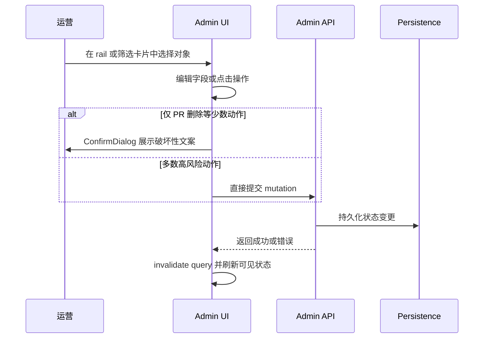
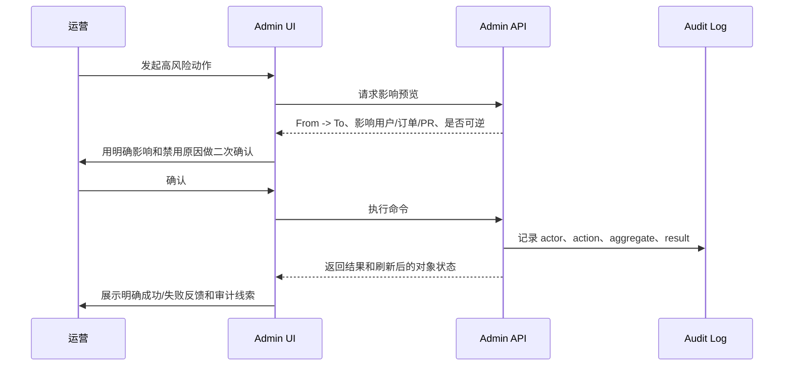

# Admin UI/UX Evaluation

## Objective & Hypothesis

评估当前 Admin UI/UX 是否像一个内部业务操作系统，而不是展示型网站。工作假设：Admin 的质量不应主要用视觉冲击衡量，而应看它是否让业务状态更可读、操作更安全、反馈更可追溯、重复工作更高效。

## Input Classification

- 类型：`Artifact`
- 当前模式：`Explore -> Solidify`
- Durable owner：暂不提升到 durable docs；本次结论保留在 task packet，除非后续进入实现或产品原则固化。
- 目标产物：按用户给出的后台评估方法，对当前 Admin UI/UX 做证据化评估。

## Guardrails Touched

- 根 `AGENTS.md`：非平凡工作必须建立 task packet，并记录 objective、guardrails、verification。
- 前端 `AGENTS.md`：Admin UI 属于 domain-owned frontend modules，应复用现有 layout 和 shared primitives。
- 本次只评估：未获得用户显式 `start` 前，不修改实现代码。

## Evaluation Lens

1. 业务对象的状态、操作、责任。
2. 信息架构是否按任务组织，而不是按表或模块堆叠。
3. 列表页是否是任务分发和决策工作台。
4. 表单和流程是否降低录入成本、防止错误入库。
5. 反馈机制是否覆盖 loading、empty、error、success、异步结果、日志和追溯。
6. 权限、安全、审计和高风险动作处理。
7. 数据密度和可扫描性。
8. Dashboard 是否导向行动，而不是只展示虚荣指标。
9. 平台型 / 电商后台复杂度：角色、租户、状态机、并发、审计、批量、异常、国际化。
10. 可访问性和长时间使用体验。

## Sub-Agent Decomposition

- Agent A：梳理 Admin 路由、导航、信息架构。
- Agent B：检查核心 Admin 工作台，包括列表、筛选、编辑、批量和高风险操作。
- Agent C：检查反馈、权限、安全、审计、可访问性和长期使用风险。

## Plan

1. 盘点当前 Admin 路由、组件、后端 Admin use cases。
2. 映射当前 Admin 中可见的业务对象、状态和操作面。
3. 按用户给出的十个维度评估。
4. 结合主线程与子代理证据，输出强项、缺口和优先级建议。
5. 记录 verification 和可能需要后续固化的原则。

## Findings

### Evidence Sources

- 本地代码：`apps/frontend/src/app/router.ts`、`apps/frontend/src/pages/Admin*.vue`、`apps/frontend/src/domains/admin/**`、`apps/frontend/src/domains/admin-commerce/**`、shared UI primitives。
- 本地契约文档：`docs/20-product-tdd/cross-unit-contracts.md`、`docs/20-product-tdd/ecommerce-contracts.md`、`docs/40-deployment/observability.md`。
- 子代理 A：Admin 路由、导航、信息架构。
- 子代理 B：核心工作台、列表、筛选、表单、高风险操作。
- 子代理 C：反馈、权限、审计、可访问性、长时间使用风险。

本次没有改实现文件。这个 packet 是本次评估唯一产物。

### Current Admin Topology

```text
Admin
|-- Login / BI seed entry
|-- Anchor Event Management
|   |-- basic info
|   |-- locations / route pools
|   |-- route applications
|   |-- time policy
|   |-- tags
|   `-- other settings
|-- PR Management
|   |-- PR basic / create / edit / delete
|   `-- PR messages
|-- BI Analytics
|   |-- overview
|   |-- PR funnels
|   |-- Anchor Event analytics
|   `-- official account analytics
|-- POI Management
|   |-- POI basic
|   `-- POI review
|-- Commerce
|   |-- Merchandising: products, SKU, cancellation policy, placement, offer
|   `-- Trade: orders, bills, fulfillments
`-- Feedback questionnaire templates
```

结论：当前拓扑按业务域组织，不是原始数据库表 CRUD。但多数入口仍更强地回答“对象在哪里管理”，而不是“运营今天该先处理什么”。

### Current Operation Sequence



面向业务操作系统，缺少的目标序列应是：



### Business Object Coverage

| Object | 当前 Admin 支持 | UX 判断 |
| --- | --- | --- |
| Admin session / roles | `service` / `analytics` 路由和导航过滤 | 粗粒度权限清楚，但动作级权限和禁用原因不清楚 |
| Anchor Event | ACTIVE / PAUSED / ARCHIVED，地点、路线、时间、标签、策略编辑 | 对象编辑较强，任务队列和影响预览较弱 |
| Route application | PENDING / ACCEPTED / REJECTED，地图预览、路线编辑、驳回原因 | 决策上下文较好，缺批量队列和统一确认 |
| PR | 按类型、地点、状态、时间筛选；编辑内容、状态、可见性、join gate、反馈、删除 | 当前最接近工作台，但列表卡片还不是任务分发界面 |
| PR messages | 查看、编辑、创建、删除留言 | 有用，但删除用原生 `window.confirm`，无审计入口 |
| POI | 基础编辑、图库、坐标、可用性、审核发布/驳回 | 对象维护可以，审核队列、确认和风险提示弱 |
| Feedback templates | JSON definition 编辑，有保存成功反馈 | 更像技术配置工具，非技术运营使用门槛高 |
| Commerce products | SPU / SKU / 取消策略 / pricing editor | 已从裸 JSON 进步，但缺影响预览和商品工作台能力 |
| Offer / Placement | 创建/更新 Offer 和 Placement | 原始输入偏多：CSV ids、文本日期、JSON matching rule |
| Order / Bill | 只读详情和 JSON snapshot | 可用于排障，但还不是异常/SLA 工作台 |
| Fulfillment | 确认/拒绝 booking，记录 entry guidance | 有真实运营动作，但需要确认、影响预览和优先级队列 |
| Operation logs | 后端和文档承认 `operation_logs` | Admin 无读取入口，审计对运营不可见 |

### Ten-Dimension Evaluation

| 维度 | 当前评分 | 证据化判断 |
| --- | --- | --- |
| 1. 状态、操作、责任 | 中 | PR、POI、路线申请、Anchor Event、commerce、fulfillment 都有状态。责任只到 `service` / `analytics`，动作责任、可逆性和风险等级没有显式表达。 |
| 2. 信息架构 | 中偏低 | 导航按 Activity、PR、POI、Commerce、BI、Feedback 组织。不是数据库表菜单，但还不是待审核、异常、SLA、缺配置这类任务入口。 |
| 3. 列表页工作台 | 中偏低 | PR 有筛选，Analytics 有表格。多数 rail 仍是选择列表，不支持排序、保存视图、风险标记、批量操作或结果反馈。 |
| 4. 表单和流程 | 中 | PR 和 Anchor Event 有较多校验。Commerce Placement/Offer 和 Feedback templates 仍暴露 CSV、文本时间、JSON textarea、schema-heavy 编辑。缺 dirty-state 保护。 |
| 5. 反馈机制 | 中偏低 | loading / error / empty 较普遍。success 反馈不统一，很多操作只靠缓存刷新暗示成功。异步进度和结果追溯弱。 |
| 6. 权限、安全、审计 | 中偏低 | 角色分离真实存在，并在前后端契约中一致。高风险确认不统一，登录 seed hint 存在安全风险，审计日志无 Admin UI。 |
| 7. 数据密度和可扫描性 | 中 | 两栏 shell 和紧凑卡片适合后台，但卡片缺 pending age、影响数量、最近更新时间、负责人、风险原因等运营字段。 |
| 8. Dashboard 行动入口 | 中偏低 | BI 看板信息丰富，但没有连到具体任务队列或对象。当前没有 Admin Home / task inbox。 |
| 9. 平台 / 电商复杂度 | 中偏低 | Ecommerce 分域符合契约，但状态机、批量操作、并发影响预览、异常处理还不足以支撑平台级运营。 |
| 10. 可访问性和长期可用性 | 中偏低 | Button/ChoiceCard 有 focus-visible，导航有 ARIA。Modal 语义/focus trap、toast/loading live region、禁用原因和 reduced-motion 覆盖不足。 |

### Strengths

1. 统一 Admin shell 是好的基础：左侧导航、上下文 rail、主工作区已经成型。
2. 粗粒度权限边界真实存在：`service` 和 `analytics` 体现在 route meta、导航过滤、后端 route guard。
3. PR Management 是当前最成熟页面：筛选、对象选择、校验、状态/可见性、反馈问卷、破坏性删除确认都有。
4. Anchor Event 路线申请比普通表格审批更好：地图、可编辑路线、校验、状态 chip、驳回原因组成了决策上下文。
5. Analytics 是当前最强诊断面：筛选、KPI、表格、刷新、test hooks 都比较完整。
6. Pricing Rules 已从纯 JSON 往结构化编辑器演进。

### Critical Gaps

#### P0

- Admin 登录页无条件渲染本地 seed 凭据提示。如果生产环境也出现同样构建文案，这是明确安全问题。证据：`apps/frontend/src/pages/AdminLoginPage.vue:49`、`apps/frontend/src/locales/zh-CN.jsonc:1034`。

#### P1

- 缺 Admin Home / task inbox。运营不能从“今天需要处理什么”开始，只能进入对象域后自行推断。
- 核心列表还不是任务队列。PR cards、event cards、POI select、product rail、order rail、fulfillment rail 缺优先级、风险、待处理时长、影响范围等字段。
- 高风险动作确认不统一。PR 删除用 `ConfirmDialog`，PR 留言删除用 `window.confirm`，很多审核、状态、履约动作直接提交。
- 审计不可见。`operation_logs` 存在，observability 文档也明确当前没有 dedicated management UI。
- disabled action 很少解释原因。运营无法判断是没选对象、校验失败、权限不足、正在保存，还是上游数据缺失。
- 成功反馈不统一。多数 mutation 靠刷新或选中项变化暗示成功。

#### P2

- 批量操作基本缺失：没有批量审核、批量发布/暂停/归档、批量履约 triage 或 saved view。
- 切换对象可能丢草稿：多个页面 watch selected item 后直接重置本地 draft。
- Commerce 编辑仍偏技术输入：SPU ids 用 CSV，日期用文本，matching rule 用 JSON textarea，pricing/cancellation 缺样例预览。
- Modal 和 feedback 的可访问性基线需要在 Admin 成为长期工作台前补齐。

### Recommended Improvement Order

1. 安全与高风险动作基线：
   - 本地 seed hint 仅在 local development 显示。
   - 所有高风险动作统一到 `ConfirmDialog` 模式，包含对象身份、`From -> To`、影响范围、是否可逆、后果文案。
   - 替换 `window.confirm`。

2. 运营任务入口：
   - 新增 Admin Home / Operations Inbox。
   - 第一批队列：待审核 POI、待审核路线、待审核偏好标签、待处理 fulfillment booking、风险 PR、commerce 配置缺口。

3. 工作台级 rails：
   - 将 rail 从对象选择器升级为任务/列表工作台：筛选、排序、数量、最后更新时间、状态年龄、风险标记、深链。
   - 优先级：PR、POI review、route applications、fulfillment。

4. 表单与流程硬化：
   - 给 Admin editor 加 dirty-state 标识和切换/离开确认。
   - POI availability、placement matching、offer dates、SPU/SKU refs、pricing rule targets 都要保存前校验。
   - 保存前提供 pricing 和 cancellation 样例预览。

5. 追溯与反馈：
   - 先做对象级 operation log 只读面板，再做全局审计检索。
   - 统一保存成功、异步结果、失败重试反馈。
   - 工作台增加数据更新时间。

6. 可访问性基线：
   - Modal 增加 `role="dialog"`、`aria-modal`、标题关联、focus trap、focus restore。
   - error/loading/success feedback 增加 live region。
   - disabled reason 用可见文本或 `aria-describedby` 暴露。

### Promotion Candidates

- 产品级 Admin 原则：Admin 应先按运营任务队列和风险组织，对象编辑器作为详情工作区。
- 技术级 Admin UI 契约：高风险 mutation 必须具备影响预览、确认、审计可见、明确成功/失败结果。
- Shared UI 契约：Modal 和 feedback primitives 需要可访问性保证，才能继续扩展到更多 Admin 流程。

## Verification

- 已创建 task packet：`tasks/admin-ui-ux-evaluation/00-task-packet.md`。
- 已读取根/前端操作约束和 task packet 约定。
- 已检查 Admin route、navigation、layout、PR、Anchor Event、POI、Analytics、Feedback Questionnaire、Commerce Product、Placement/Offer、Order/Bill、Fulfillment、shared UI、permission、operation-log surfaces。
- 已使用三个只读子代理：
  - A：信息架构和导航。
  - B：核心工作台、列表、表单、高风险动作。
  - C：反馈、权限、审计、可访问性。
- 未运行测试，因为本次是评估 artifact，不是实现 slice。
