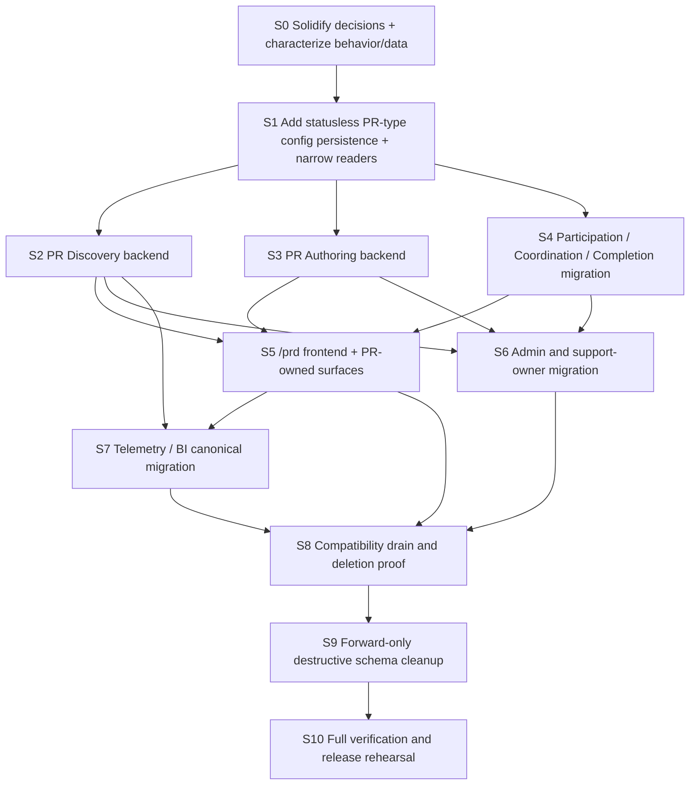

# Implementation DAG

This DAG records the implemented dependency order and the remaining release gates.

## Fixed Invariants

- `PR.type` remains the existing field and value.
- No scenario/config identity is added to PR.
- No configuration version, revision, effective interval, or revision-like replacement is introduced.
- `AnchorEvent`, including its `ACTIVE / PAUSED / ARCHIVED` lifecycle, is removed rather than renamed.
- Existing all-zero landing ratios resolve to `LIST`.
- Frontend canonical discovery entry is `/prd` and contains no Event business identity.

## Recommended Target Shape

### Persistence

Use one statusless, persistence-only PR-type configuration boundary keyed directly by the existing `type` value. The working table name is `pr_type_configs`.

- `PartnerRequest` has no FK to this table.
- The row is optional specialization for a type, not the identity or lifecycle of that type.
- Physical co-location is allowed to minimize migration risk; it does not authorize one domain service, DTO, or admin mutation to own every column.
- Each consumer reads and validates a narrow projection: Authoring, Discovery, Participation, Coordination, or Completion.
- Child data such as preference proposals or route applications receives a precise owner and table only if that capability survives.
- The table has no `status`, `revision`, `effectiveAt`, or historical selector.

The default migration copies only legacy `ACTIVE` rows. Non-ACTIVE rows never become implicitly enabled after status removal. If live data proves that an existing PR still relies on a non-ACTIVE row, resolve that row explicitly by materializing stable PR facts or migrating only the exact consumer-owned fallback required; do not recreate an Event/config lifecycle.

### Backend Contracts

Contract names are frozen in the first implementation package; the preferred shape is:

- `GET /api/pr/discovery`: directory/search by optional `type`, repeated local `date`, and bounded filters; returns canonical PR summaries and page/cursor metadata.
- `POST /api/pr/discovery/recommend`: optional retained guided matching flow; input is concrete `type`, time, place, and preferences; output contains existing PR candidates only.
- `GET /api/pr/authoring/options?type=...`: small authoring projections only when the editor needs configured suggestions.
- existing structured PR create command: retains `fields.type`, removes `anchorEventId` and Event-specific sources; returns ordinary `prId/status/canonicalPath`.
- join, waitlist, confirm, exit, check-in, feedback, and PR detail remain PR-id-owned commands/reads.

Do not replace `AnchorEventDetail` with one giant `PRTypeConfigDetail`. PR Discovery and PR Authoring receive separate DTOs even if their persistence columns share a table.

### Frontend Contracts

- `/prd` owns discovery route state and one directory query.
- `/pr/new` or the existing PR editor owns authoring.
- `/pr/:prId` owns participation and later lifecycle behavior.
- `PRDiscoveryCandidate` always has a persisted PR id.
- `PRCreationSuggestion` is transient input and is never called a PR until the create command returns a `prId`.

## Accepted Discovery View Model

- Rehome FORM / CARD / LIST under PR Discovery/Authoring.
- LIST and CARD consume the same directory query; they are presentations, not separate feeds.
- FORM owns criteria/recommendation and hands unmatched intent to ordinary PR Authoring.
- Current ratios may remain as `viewRatios` in the Discovery configuration slice.
- all-zero ratios resolve to LIST.
- Initial assignment may be stored by `PR.type`, but there is no assignment/config revision and no forced rebucketing mechanism.
- explicit `/prd?view=list|card|form` is route/UI state only.

## Dependency Graph

## Stage Details

### S0 - Solidify And Characterize

- promote LIST fallback, zero Event lifecycle, unchanged `PR.type`, and zero config version into durable truth;
- promote the accepted revisionless FORM/CARD/LIST view model;
- retain title/cover, community entry, time-editor profile, preference submissions, route applications, and live analytics under precise owners;
- choose legacy route/API compatibility owner and sunset;
- add/move characterization tests before behavior changes;
- run production/staging data and traffic audits.

GO: decisions and live data cannot change target schema or public contract.

### S1 - Additive Persistence And Readers

- allocate forward migration prefixes;
- add statusless PR-type configuration persistence and backfill selected legacy rows without dropping old tables;
- create CRUD-only repository and consumer-owned readers/resolvers;
- keep a temporary old-table adapter behind those readers if rollout requires it;
- preserve PR-owned materialized facts.

GO: consumer tests prove missing config and configured type behavior; old runtime remains deployable.

### S2 - PR Discovery Backend

- make one candidate visibility/qualification/ranking policy authoritative;
- replace eventId criteria with `PR.type` and dates;
- migrate catalog, directory, demand grouping, recommendation, and no-match read behavior;
- return canonical PR summaries without Event DTOs.

GO: typed API and backend scenarios pass; no canonical discovery DTO contains Event identity.

### S3 - PR Authoring Backend

- split create defaults, gates, suggestions, and questionnaire selection;
- route Event-assisted/dummy/auto-create interactions through ordinary PR create inputs while preserving their established user journey and explicit transient creation-suggestion presentation;
- remove `anchorEventId` from canonical create payload and logs;
- preserve materialized PR bounds, notes, offsets, join gates, questionnaire instance, time, and place.

GO: all retained authoring paths create the same ordinary `PartnerRequest` contract.

### S4 - Remaining PR Lifecycle Owners

- Participation: frequency, capacity, confirmation, waitlist, and expansion decision;
- Coordination: meeting-point fallback, notifications, and reminders;
- Completion: mounted questionnaire selection boundary and response ownership;
- remove `AnchorEventPRContextRepository` by replacing each query with a purpose-named reader/projection;
- retain PR lifecycle status semantics unchanged.

GO: create/join/waitlist/detail/meeting/check-in/feedback behavior tests pass without Event identity or status checks.

### S5 - `/prd` Frontend

- consume the typed PR Discovery/Authoring contracts;
- build one route-only `PRDiscoveryPage` and one directory query owner;
- migrate FORM/CARD/LIST into the accepted PR-owned view model;
- remove Event state from handoff, PR detail, join/waitlist, WeChat replay, Home/About, and application pages;
- delete Event pages/domain/query keys after consumers move.

GO: canonical journey `/prd → candidate or authoring → /pr/:id` passes system scenarios; no canonical frontend Event concept remains.

### S6 - Admin And Support Owners

- replace one giant admin Event workspace/update with consumer-qualified controls;
- move Route/Preference/Community capabilities to real owners or retire them;
- remove Event status controls entirely;
- migrate current view ratios without assignment revision only if Branch A survives.

GO: every control writes one owner slice; no UI or API offers ACTIVE/PAUSED/ARCHIVED.

### S7 - Telemetry And BI

- introduce canonical PR Discovery journey events with qualified `prType/view/origin/prId` fields;
- keep historical Event facts readable as history, not runtime authority;
- remove assignment revision from live filters and payloads;
- replace live dashboards/queries before deleting their dependencies.

GO: new journey telemetry and BI projections work; raw historical telemetry remains retained while Event-specific fact views are retired explicitly.

### S8 - Compatibility Drain

- redirect or retire old public URLs according to the chosen policy;
- measure old frontend/API traffic and client versions;
- structurally prove zero canonical Event imports/routes/DTOs/process state;
- classify legitimate historical/telemetry/DOM/provider Event residuals.

GO: all old callers are zero or inside an approved, time-bounded adapter.

### S9 - Destructive Cleanup

- migrate/retire child tables and config keys first;
- replace dependent live BI views;
- drop direct FKs/child tables, then `anchor_events` last;
- delete old entities/repositories/controllers/domain exports and adapters;
- never edit historical applied migrations.

GO: migration dry-run, backup/restore evidence, full scenario gates, and forward-repair path are approved.

### S10 - Release Rehearsal

- run full static/unit/scenario gates;
- run browser journey on portless local services;
- rehearse expand → backend → frontend → observe → contract sequence;
- verify rollback remains possible until S9 and forward repair is possible after S9.
