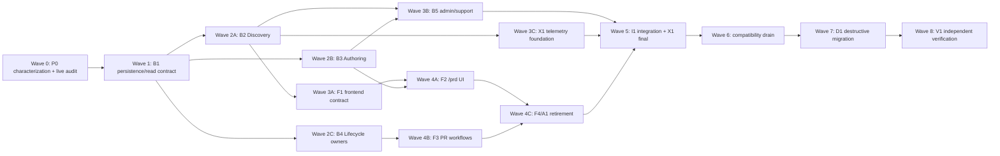

# Executor Work Packages

The root agent remains the macro owner: invariants, dependency order, decision log, shared-file policy, acceptance gates, and user communication. GPT-5.6-Luna High executors own bounded file clusters and noisy implementation/verification work after an explicit start.

Executors are not alone in the repository. Each assignment must tell them not to revert other changes and to accommodate already-landed work.

## Shared-file Policy

Only the nominated integration executor edits these high-conflict surfaces in a wave:

- backend: `apps/backend/src/index.ts`, `entities/index.ts`, controller mount/export surfaces, `domains/pr/index.ts`, shared test builders;
- frontend: `apps/web/src/app/router.ts`, `shared/api/query-keys.ts`, shared telemetry maps, locale schema/JSON, global style guidance;
- repository root: package scripts/config, durable docs, cross-unit scenario fixtures;
- migrations: one migration owner allocates prefixes and edits schema/data migration files.

Other executors report required integration deltas instead of editing these files concurrently.

## Packages

| ID | Executor ownership | Deliverable | Depends on | Focused verification |
|---|---|---|---|---|
| P0 | characterization tests and task evidence only | Current behavior tests: LIST fallback, discovery paths, create/materialize, join/frequency/expansion, meeting fallback, PR detail, status mismatch | product decisions | targeted backend/web/system scenarios |
| B1 | new PR-type config entity/repository/readers and their unit tests | Statusless type-keyed persistence boundary; narrow consumer reads; no version | P0 + live audit | backend unit, type, lint, DB checks |
| B2 | PR Discovery backend domain/read models/controller tests | type/date directory, candidate summaries, grouping/recommendation; no eventId | B1 | backend unit + discovery scenarios |
| B3 | PR Authoring services/use cases/controller tests | authoring options and ordinary create; no Event-assisted payload | B1 | backend create unit/scenarios |
| B4 | PR Participation/Coordination/Completion services/tests | frequency, expansion, meeting fallback, notification, questionnaire boundaries | B1 | PR lifecycle unit/scenarios |
| B5 | backend admin/support owner modules/tests | split config controls; Route/Preference/Community relocation/retirement | B1–B4 + retention decisions | admin backend scenarios + type/lint |
| F1 | PR Discovery frontend model/query/routing helpers | inferred Hono query, directory model, route builder; no Event adapter | B2 contract | web unit + type |
| F2 | `PRDiscoveryPage` and PR-owned Discovery/Authoring UI/tests | one query owner, chosen view branch, stable `prd.*` testids | F1 + B3 | web unit/type/build + system scenario |
| F3 | PR detail/handoff/WeChat/participation frontend files | remove fromEvent/eventId/Event replay/context; preserve PR id/type | B3–B4 | PR web unit + join/create scenarios |
| F4 | Event/Home/About/Location/Route frontend retirement | move/retire Event surfaces and external call sites | F2–F3 + support decisions | web type/build + AST import closure |
| A1 | frontend admin Event tree and admin analytics UI | replace with owner-qualified controls or delete | B5 + analytics decision | admin web unit/type/build |
| X1 | telemetry registry/client/BI live projections/tests | PR Discovery events and dashboards; historical read compatibility | B2 + F2 + decisions | telemetry/analytics unit + scenarios |
| I1 | shared integration surfaces | backend mounts/exports, frontend router/query keys/telemetry/locales, cross-unit fixtures | relevant packages in wave | type/build/static + focused scenarios |
| D1 | schema/data/config-key destructive migration only | child migration/drop, view replacement, old table drop, seed update | all packages + traffic/data GO | db lint/check, dry-run, full backend scenarios |
| V1 | independent verification/release rehearsal | full gates, browser journey, zero-Event proof, cutover evidence | I1 + D1 candidate | full static/unit/scenario/manual |

## Backend File Ownership Examples

### B1 - Persistence And Readers

- `apps/backend/src/entities/anchor-event.ts` replacement shape only when authorized;
- new PR-type config entity and Zod slices;
- `AnchorEventRepository.ts` adapter/replacement;
- purpose-named Authoring/Discovery/Participation/Coordination readers;
- no controller, frontend, telemetry, or destructive migration ownership.

### B2 - Discovery

- current `domains/anchor-event` list/detail/demand/form/recommendation read services that survive;
- `domains/pr/read-models/search-prs.ts` and PR read primitives;
- new PR Discovery controller file and tests;
- does not edit create/join/meeting modules.

### B3 - Authoring

- `event-default-materialization.service.ts` replacement;
- `event-pr-creation-policy.service.ts` replacement;
- `create-pr-structured.ts` and retained assisted-create paths;
- questionnaire template selection at creation;
- does not edit join/waitlist/meeting or shared controller mount.

### B4 - Lifecycle Owners

- frequency service and join/waitlist callers;
- full-capacity expansion and its join handoff;
- meeting-point resolver/notifier;
- PR detail projection sections coupled to Event context;
- join-gate materialized source naming and completion boundaries.

## Frontend File Ownership Examples

### F1 / F2

- new modules under `apps/web/src/domains/pr/{model,queries,routing,ui}`;
- new `apps/web/src/pages/PRDiscoveryPage.vue`;
- page-local tests/styles;
- the UI executor must load `@partner-up-dev/design-web#design-web` before package component selection or composition changes;
- shared router/query keys/locales remain I1-owned.

### F3

- `PRPage.vue`, PR join-entry context and participation components;
- matched-PR handoff process;
- pending WeChat action/replay;
- removal of `anchorEventContext` consumers and Event beta follow-up;
- no shared telemetry-map edits.

### F4 / A1

- Event pages and `domains/event/**` retirement/moves;
- Home/About/Location/Route Event call sites;
- admin Anchor Event page, UI, queries, and use cases;
- shared router/query-key/locale changes deferred to I1.

## Executor Waves

Within each wave, at most three executors run concurrently. The root agent reviews outputs against invariants and opens the next wave only when the current gate passes.

## Package Handoff Template

Every executor receives:

1. exact owner files and forbidden shared files;
2. protected invariants (`PR.type`, zero Event lifecycle, zero config version, LIST fallback);
3. input contract and already-landed prerequisites;
4. expected behavior/test changes;
5. focused commands and exit evidence;
6. instruction not to commit, revert, or modify out-of-scope user changes;
7. instruction to stop and report when reality contradicts the package contract.

Every executor returns:

- changed files grouped by behavior;
- test/check results and any baseline failures;
- required shared integration deltas;
- discovered branch or blocker;
- remaining Event compatibility references with classification.
