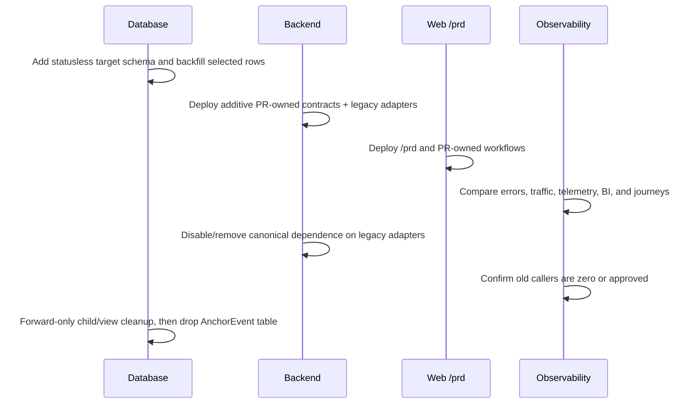

# Execution Rehearsal And Gates

## Simulated Main Sequence

```text
characterize + audit
  -> add statusless type config and adapters
  -> migrate backend consumers in parallel
  -> expose typed PR-owned contracts
  -> migrate /prd and PR workflows
  -> migrate/retire admin and support
  -> migrate live telemetry/BI
  -> observe old traffic and drain compatibility
  -> drop child dependencies
  -> drop AnchorEvent runtime last
```

The sequence is additive until the compatibility drain passes. This is what makes code rollback possible without inventing a configuration-version mechanism.

## Precomputed Branches

| Branch | Options | Recommended default | Information required before changing default |
|---|---|---|---|
| Discovery views | accepted: preserve FORM/CARD/LIST without revision | PR-owned views over one discovery/authoring contract; all-zero → LIST | no remaining branch in this task |
| Legacy public URLs | edge/server redirect; neutral redirect-only web adapter; direct 410 | edge/server redirect when traffic exists, otherwise direct retirement | `/e/*` and `/events*` traffic, QR/ads/share inventory, owner and sunset date |
| Old API compatibility | controller adapter; immediate removal | time-bounded controller adapter for deployed clients only | old client versions and `/api/events*` traffic |
| Physical config storage | one shallow table; multiple consumer tables | one statusless persistence table with narrow consumer readers | non-ACTIVE live dependency or child capability requiring independent persistence |
| Non-ACTIVE data | discard/export; materialize affected PR facts; migrate narrow consumer fallback | copy no non-ACTIVE row by default | production PR/participant/future-window/meeting/frequency dependency audit |
| Directory card data | summary response; per-card detail query | summary response | payload size and freshness constraints |
| Route applications / preference submissions | retain under precise owner | migrate by `PR.type`; block only records that cannot be mapped safely | pending rows, operator workflow, product owner |
| Historical telemetry/BI | retain raw telemetry history; retire Event fact views/dashboard | preserve raw rows, replace live projections with PR Discovery analytics | retention obligations and dashboard consumers |

## Expected Resistance And Planned Response

### PR.type Is A Loose String

Risk: exact and normalized duplicates, admin type rename, PR types with no configuration.

Response: preserve raw `PR.type`; audit normalized conflicts; never add FK or new identity; make missing-config fallback explicit per consumer.

### Non-ACTIVE Rows Still Affect Existing PR Reads

Risk: current PR detail/frequency/meeting-point resolution ignores Event status even though catalog/create paths require ACTIVE.

Response: do not copy status. Audit affected live/future PRs; either materialize stable facts or migrate only a narrow Coordination/Participation fallback. If neither is justified, retire the behavior explicitly.

### AnchorEventPRContextRepository Is Not A Repository

Risk: renaming it preserves cross-domain filtering, synthetic ownership, and hidden Event identity.

Response: replace callers one purpose at a time with persistence CRUD plus PR Discovery readers, PR detail projections, and qualified policy resolvers.

### Full Expansion Is Called From Join

Risk: deleting Anchor Event discovery code breaks a Participation command.

Response: move the capacity decision and Authoring/Discovery handoff before deleting `expand-full-pr.ts` or its exports.

### Meeting Point Is A Live Fallback

Risk: deleting config changes existing PR detail and notifications when no PR override exists.

Response: inventory live PRs without overrides; preserve the exact Coordination slice or materialize a PR-level value before cutover.

### Frontend Has Multiple Owners

Risk: the 1,343-line Landing page and Card/List/Form surfaces each own queries or mutations; a route rename leaves Event coupling intact.

Response: backend typed contract first, one directory query owner, one authoring command owner, thin route page, then delete the old tree.

### Hono RPC Types Amplify Contract Changes

Risk: backend controller composition changes invalidate many frontend inferred types at once.

Response: freeze additive typed contracts, land backend first, then F1 adapts frontend; shared AppType/mount files have one integration owner.

### WeChat Replay And Legacy Local Storage

Risk: pending `EVENT_ASSISTED_PR_CREATE`, `fromEvent`, and revision-keyed landing mode survive route migration.

Response: define a one-time reader policy: discard obsolete pending Event actions safely or map only complete ordinary PR create input; never retain eventId. Stop reading old landing storage and allow it to expire locally.

### Admin, Child FKs, And BI Depend On Event Identity

Risk: dropping the parent cascades preference/route data and breaks live BI views.

Response: decide child capability disposition, migrate children first, replace live views, drop direct constraints/tables, and drop parent last.

## Data GO Gate

Before any production backfill or destructive migration, collect:

- exact and normalized `anchor_events.type` duplicates;
- rows by ACTIVE/PAUSED/ARCHIVED;
- PRs per type, PR status, future time windows, active participants, and PR meeting-point override presence;
- participation-frequency and meeting fallback dependencies;
- preference tags and route applications by status, plus orphan/FK checks;
- landing config keys and ratio/assignment fields;
- old URL/API traffic and deployed client versions;
- BI/telemetry row counts, retention requirements, and live dashboard consumers;
- backup, restore SLA/drill, deploy owner, canary thresholds, and compatibility sunset.

STOP immediately on duplicate/unmapped type, unknown live dependency, pending child data without an owner, or an old caller outside the compatibility plan.

## Cutover Without Config Version



- Deployment/commit/migration identifiers are release evidence, not business configuration versions.
- Before destructive cleanup, backend/frontend may roll back to an earlier deploy because old schema and adapters still exist.
- After destructive cleanup, recovery is forward repair or an explicitly approved database restore; do not ship unsafe down migrations or production reset logic.
- A migration failure stops backend deploy. A runtime failure after migration is repaired against the forward database state.

## Verification Matrix

| Layer | Focused during package | Full gate before destructive cleanup/release |
|---|---|---|
| Backend unit | `pnpm test:unit:backend -- <paths>` | `pnpm test:unit:backend` |
| Web unit | `pnpm test:unit:web -- <paths>` | `pnpm test:unit:web` |
| Backend scenarios | `pnpm test:scenario:backend -- <paths>` | `pnpm test:scenario:backend` |
| System scenarios | `pnpm test:scenario:system -- <paths>` | `pnpm test:scenario:system` / `pnpm test:scenario:all` |
| Backend static | `pnpm check:lint:backend`, `pnpm check:type:backend` | `pnpm check:build:backend` plus full static gate |
| Web static | `pnpm check:lint:web`, `pnpm check:type:web` | `pnpm check:build:web` plus full static gate |
| DB | `pnpm db:lint`, `pnpm db:check` | migration dry-run/reset in isolated development/scenario DB |
| Whole repo | relevant narrow gates | `pnpm check:static` |
| Manual | focused route/API smoke | `pnpm dev:ensure`, then `/prd → /pr/:id` matched/no-match/create/join journeys |

Targeted test arguments must be verified when each package opens; directory names change during migration.

## Structural Zero-Event Gate

Primary proof uses AST/import/router/type scans:

1. no canonical frontend import from `@/domains/event` or admin Event UI;
2. no canonical `client.api.events`, Event DTO, route param/property `eventId`, `fromEvent`, `assignmentRevision`, or `EVENT_ASSISTED`;
3. no Event-owned router component/query key/process state/testid/locale/CSS class;
4. no runtime backend resolver/controller/domain export depends on AnchorEvent identity/status;
5. no new config identity/version/revision/effective-time field;
6. `PR.type` remains positively present in PR create/read/discovery regression tests.

Residual text search is secondary and every match is classified as:

- applied historical migration;
- historical telemetry/BI fact;
- DOM or telemetry event;
- external provider callback/protocol;
- approved time-bounded compatibility adapter.

## Stop / Go Gates

| Gate | GO | STOP |
|---|---|---|
| Contract | typed PR-owned DTOs, view branch, support disposition, compatibility owner agreed | any canonical Event identity or unresolved owner |
| Data | unique type, selected rows mapped, live PR dependencies resolved, child data owned | duplicate/unmapped type, non-ACTIVE live dependency unexplained, orphan/pending child rows |
| Package | focused tests/static pass and integration deltas explicit | hidden shared-file edits, unclassified behavior change, new version/status mechanism |
| Frontend | `/prd` journeys pass and Event import closure is zero | renamed wrapper still calls `/api/events` or carries Event state |
| Telemetry/BI | new live facts work and historical retention is safe | rejected telemetry rises, dashboards empty, history rewrite required |
| Compatibility | traffic is zero/within approved adapter and sunset is recorded | unknown client/URL traffic remains |
| Destructive DB | backup/restore evidence, dry-run, old callers zero, forward repair rehearsed | any rollback depends on removed schema or production reset |
| Release | full static/unit/scenario/manual evidence accepted | baseline regression or unexplained residual |
