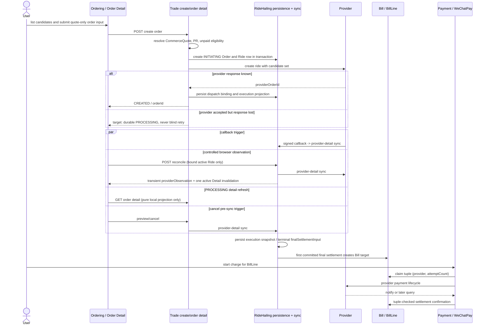

# Current RideHailing Sequence

## Evidence Anchors

- Create/listing: `apps/backend/src/controllers/commerce.controller.ts`,
  `domains/trade/use-cases/offer-listing.ts`, `domains/trade/use-cases/create-order.ts`, and
  `tests/scenario/commerce/ride-hailing-ordering.scenario.test.ts`.
- Detail/reconcile: `apps/web/src/domains/commerce/queries/useCommerce.ts`,
  `domains/commerce/queries/ride-hailing-reconciliation.ts`,
  `domains/trade/use-cases/ride-hailing-ordering-flow.ts`, and
  `domains/ride-hailing/use-cases/sync-ride-hailing-order-with-provider.ts`.
- Callback: `controllers/ride-hailing-provider.controller.ts`,
  `handle-caocao-order-status-callback.ts`, and
  `apps/backend/tests/ride-hailing/caocao-callback-route.scenario.test.ts`.
- Payment: `PaymentCheckoutFlow.vue`, `payment-contract.ts`, `payment-execution.ts`,
  `payment-notifications.ts`, and `payment-provider-ssot.scenario.test.ts`.

The sequence is current-source evidence. The provider response-loss branch is a durable `PROCESSING` posture; it
never triggers blind browser create retry and waits for callback/reconciliation or operator handling.
