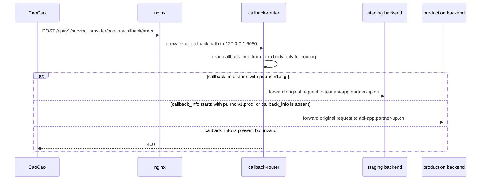

# CaoCao Callback Router

## Objective & Hypothesis

- Objective: implement a repo-owned callback router so one CaoCao-registered callback URL can dispatch callbacks to staging or production while CaoCao callback address changes are delayed.
- Hypothesis: a narrow local-only router is safer than changing the system nginx runtime on `ec1.sz.partner-up.host`, because the current nginx has no Lua/njs body-inspection module and the router can constrain blast radius to one exact callback path.

## Guardrails Touched

- CaoCao callback signature preservation.
- Staging / production data isolation.
- Production edge routing and rollback.
- Deployment ownership: router code must live in this repository, not as an ad hoc server-side script.

## Current Understanding

- Input type: Constraint. Product behavior stays unchanged, but the external callback address cannot be updated quickly.
- Active mode: Execute.
- Existing backend changes send `callback_info` as:
  `pu.rhc.v1.<routing-token>.<providerInstanceId>`.
- Routing tokens:
  - `stg`: staging backend
  - `prod`: production backend
  - `dev`: local or non-shared development callbacks
- Confirmed staging backend origin: `https://test.api-app.partner-up.cn`.
- Confirmed production backend origin: `https://api-app.partner-up.cn`.
- CaoCao public callback path remains:
  `/api/v1/service_provider/caocao/callback/order`.
- The router must preserve the original request body byte-for-byte for upstream forwarding. `callback_info` participates in CaoCao signature calculation, so the router must not rewrite, remove, append, or re-encode form fields.

## Remote Edge Facts

- Host checked: `ec1.sz.partner-up.host`.
- Public `80/443` are served by system nginx `1.20.1`.
- Current system nginx has no enabled Lua/njs modules and no module files under `/usr/lib64/nginx/modules`.
- Supabase Kong/OpenResty runs separately on container ports `8000/8443`; ride-hailing traffic does not currently pass through Kong.
- Current ride-hailing nginx routes:
  - `ride-hailing1.sz.partner-up.ltd /api/v1 -> http://127.0.0.1:6070/v1`
  - `ride-hailing1.test.sz.partner-up.ltd /api/v1 -> http://127.0.0.1:6070/v1`
- Current backend service on `127.0.0.1:6070` exposes:
  `/v1/service_provider/caocao/callback/order`.
- Runtime preparation:
  - installed nvm `0.40.3` for root on ec1
  - installed Node `v22.23.1` through nvm

## Proposed Topology



## Router Contract

- Bind only to localhost, proposed port `127.0.0.1:6080`.
- Accept only `POST /api/v1/service_provider/caocao/callback/order`.
- Read request body with a small maximum size, proposed `16 KiB`.
- Parse `application/x-www-form-urlencoded` enough to read `callback_info`.
- Route:
  - missing `callback_info` -> production for compatibility with already-created orders
  - `pu.rhc.v1.stg.*` -> staging origin
  - `pu.rhc.v1.prod.*` -> production origin
  - any other present `callback_info` -> `400 Bad Request`
- Forward method, path, query, content type, and raw body to the selected backend.
- Do not connect to the database.
- Do not verify CaoCao signature.
- Do not know provider instance semantics beyond token prefix routing.
- Emit concise structured logs with route decision, target environment, status, latency, and request id when available. Do not log full request bodies.

## Nginx Shape

```nginx
location = /api/v1/service_provider/caocao/callback/order {
    client_max_body_size 16k;
    proxy_pass http://127.0.0.1:6080;
    proxy_set_header Host $host;
    include nginxconfig.io/proxy.conf;
}
```

The existing catch-all `/api/v1` proxy remains unchanged.

## Implementation Decisions

- Package location: backend-owned utility under `apps/backend`.
- Core module: `apps/backend/src/infra/edge/caocao-callback-router.ts`.
- Runtime entry:
  `apps/backend/src/scripts/ride-hailing/caocao-callback-router.ts`.
- Build output: `apps/backend/dist/caocao-callback-router.js` through the
  backend `tsup` build.
- Runtime language: Node/TypeScript, using Node HTTP server and native `fetch`.
- Service manager template:
  `apps/backend/deploy/systemd/caocao-callback-router.service.example`.
- Nginx location template:
  `apps/backend/deploy/nginx/caocao-callback-router.location.conf`.
- Observability: structured JSON logs to stdout/stderr, suitable for journald.

## Verification Plan

- Unit tests:
  - routes `stg` token to staging origin: covered
  - routes `prod` token to production origin: covered
  - missing token routes to production: covered
  - malformed present token returns `400`: covered
  - upstream receives the original raw body: covered
- Local integration test with fake upstreams and real HTTP requests: covered in
  `apps/backend/src/infra/edge/caocao-callback-router.test.ts`.
- Build/typecheck/lint through root scripts or package-local scripts.
- Remote dry-run:
  - deploy router binary/package without nginx cutover
  - curl router directly on localhost using dummy signed-like form bodies
  - `nginx -t` after adding exact location
  - reload nginx only after explicit confirmation
- Rollback:
  - remove exact nginx location and reload nginx
  - stop/disable callback-router service

## Next Step

- Local verification completed:
  - `pnpm exec vitest run apps/backend/src/infra/edge/caocao-callback-router.test.ts --config vitest.backend.config.ts --project backend-unit` passed.
  - `pnpm check:type:backend` passed.
  - `pnpm exec biome lint <callback-router files>` passed.
  - `pnpm check:lint:backend` passed.
  - `pnpm build:backend` passed and produced
    `apps/backend/dist/caocao-callback-router.js`.
  - compiled router short-start check passed with SIGTERM shutdown.
- Remote dry-run on ec1 without nginx cutover:
  - uploaded repo-built router bundle from commit `5e457335` to
    `/opt/partner-up/caocao-callback-router`
  - started router on `127.0.0.1:6080`
  - `pu.rhc.v1.stg.*` routed to staging with
    `targetEnvironment:"staging"`
  - `pu.rhc.v1.prod.*` routed to production with
    `targetEnvironment:"production"`
  - invalid present `callback_info` returned `400` and did not reach upstream
- Dry-run exposed a deployment-template gap: backend CI computed
  `PARTNERUP_ENVIRONMENT`, but `apps/backend/s.yaml` did not pass it into the
  backend runtime. Staging runtime therefore treated itself as `dev`, which
  would make real staging order callbacks incompatible with the router. Fix the
  runtime env injection before nginx cutover.
