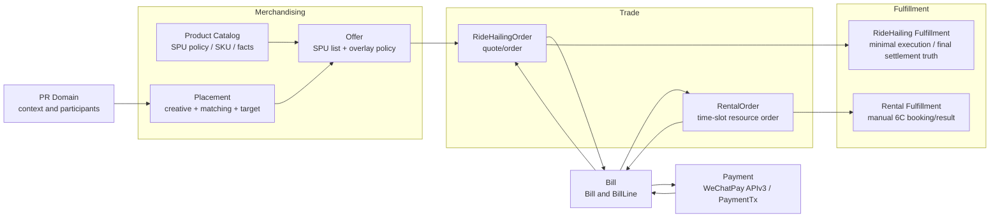
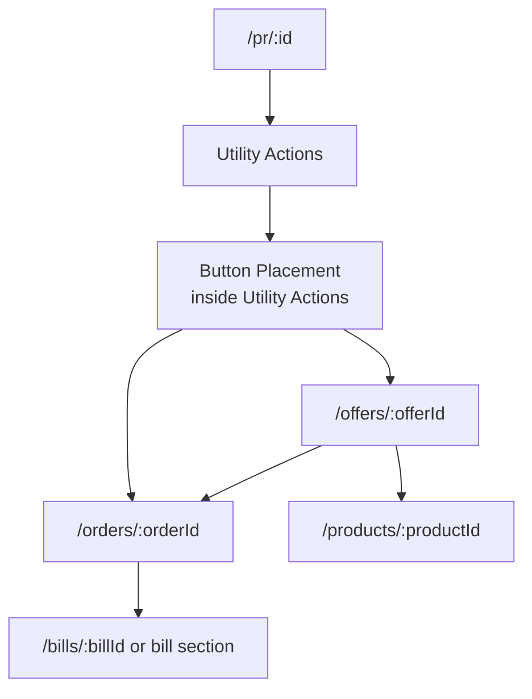

# Domain Topology

## Top-Level Shape

`ecommerce` is the product-area umbrella. Implementation ownership should use
five domain groups, not one bucket and not a domain per noun:

- Merchandising: Product Catalog, Offer, Placement
- Trade: RentalOrder and RideHailingOrder
- Fulfillment: Rental Fulfillment and RideHailing Fulfillment
- Bill
- Payment

Routes remain independent even when implementation ownership is grouped.

## Ownership Rules

### PR Domain

Owns:

- PR context, route/location/time/type facts
- active participants and participant status
- PR-context access gate: non-active participants should not receive PR
  placements or PR-attached order access
- PR order-attachment invariant: commerce orders may attach only when PR is
  READY
- PR -> Order attachment relation
- PR detail page composition

Does not own:

- placement matching truth
- offer pricing
- order state
- bill split obligations
- rental/ride-hailing fulfillment state

### Merchandising

Owns:

- Product Catalog: SPU, SKU, catalog facts, integer SPU/SKU ids, SPU sales
  policy, SPU pricing policy, and SKU-type homogeneity inside each SPU
- SKU base cancellation/refund policy definitions
- Offer: SPU list, optional ordered commercial overlay rules, target-level
  conditions and actions, user-facing price explanations, and term snapshot
- Placement: type-specific creative, PR-context matching rule,
  backend-authored target union, placement type, and placement instance
  configuration
- Admin CRUD for SPU/SKU, Offer, Placement Instance, and SKU
  cancellation policy

Does not own:

- participant consensus
- order lifecycle
- bill-share settlement
- payment gateway transport
- rental/ride-hailing fulfillment state

### Trade

Owns:

- per-order participant snapshot and split-rule snapshot
- split rule before bill creation
- RentalOrder and RideHailingOrder lifecycle
- order attributes, order timeout, and frozen offer/SKU/policy snapshots
- runtime pricing orchestration for order drafts, including SKU base pricing,
  SPU pricing policy application, Offer pricing policy application, and final
  price-breakdown assembly

Does not own:

- bill-share payment status
- external money movement
- final fulfillment result

User-facing surfaces should use "订单" language where possible. Current
issue-231 scope does not require a persisted `TradeProposal` or draft-order
aggregate because the first Rental and RideHailing loops do not require
asynchronous multi-user selection or consensus before order creation.

PR-context order creation is gated by PR domain attachment authority. Trade may
create an order for a PR only inside a transaction that also asks PR domain to
attach the order. If PR domain sees that the PR is not READY, attachment is
rejected and order creation rolls back atomically. Different SKU/product types
select different ordering components and order families:

- Rental SKU -> Rental Ordering -> RentalOrder -> Rental Fulfillment. Current
  Rental Fulfillment is manually operated: staff contact 6C and record
  booking/cancellation/result facts.
- Ride Hailing SKU -> Ride Hailing Ordering -> RideHailingOrder -> RideHailing
  Fulfillment. Current scope no longer treats it as a pure placeholder
  boundary; it should own the minimum execution truth required for usage-based
  final settlement. Full dispatch/monitoring UX and provider settlement accounting
  remain out of scope unless separately confirmed.

This task does not change PR lifecycle states or visible status copy. READY is
only consumed as the existing PR-domain prerequisite for order attachment.

The PR attachment relation remains PR-owned. Current issue-231 scope does not
duplicate that relation as an attachment snapshot inside the Order aggregate.

Voucher Entitlement, entitlement redemption, QR redemption, GoodsOrder, and
entitlement route surfaces are out of scope because group-buy coupon
functionality has been removed from this task.

### Bill

Owns:

- Bill
- BillLine
- participant split obligations
- derived bill settlement status
- refund obligation records derived from SKU base cancellation policy snapshot
  and order state

Does not own:

- WeChat gateway callbacks
- payment transaction verification
- rental/ride-hailing fulfillment

### Payment

Owns:

- PaymentTx
- WeChatPay APIv3 gateway port/adapter
- payment callback signature verification and idempotency
- gateway order query for payment status
- state transitions from either callback or query result

Does not own:

- BillLine obligation calculation
- Order pricing
- Fulfillment result

Frontend polling and backend WeChat callback jointly drive payment state.
Callback transitions are first-class state transitions with the same authority
as query-observed transitions. Both paths must be idempotent and converge on one
PaymentTx/Bill state.

### Fulfillment

Owns:

- Rental Fulfillment success/failure, entry information, and cancellation
  handling status after staff contact 6C
- RideHailing Fulfillment execution truth needed for usage-based final
  settlement,
  including minimum trip-completion / cancellation billability boundary
- provider-normalized execution/result facts inside the ride-hailing
  fulfillment slice when provider-backed execution is used

Does not own:

- offer selection
- bill split
- payment gateway transport
- merchant deposit, supplier pricing, supplier refund accounting
- inventory or capacity management
- merchandising-style admin configuration

Voucher Entitlement, entitlement redemption, QR redemption, and GoodsOrder are
intentionally not part of this issue.

Ride-hailing full provider dispatch/monitoring UX is still out of scope for
this task. However, minimal provider-backed execution truth may now be in scope
when needed to support usage-based final settlement after trip finish.

## Route Family Topology

Product, Placement, Offer, Order, and Bill route families should stay
independent instead of `/pr/:id/offers/*` or `/pr/:id/orders/*`.
`/entitlements/*` and voucher-specific route families are out of scope for
issue 231.

For Button Placement, Placement is a read/API/admin family rather than a
required user-facing detail page. The user click target is backend-authored and
routes to Offer or existing Order.

The PR detail page consumes a Placement-owned projection. It may render a
Button Placement inside Utility Actions, but it should not own placement
selection or use
`/pr/*` as the canonical route namespace for placement objects. The earlier
below-Utility-Actions placement card is not implemented in this task.

Do not introduce a user-facing `/proposals/*` route in this task. If a future
commercial loop needs a proposal/coordination object, it must be scoped as a
new Trade slice rather than implied by current Order routes. User-facing
coordination should prefer `/orders/:orderId` with an order phase such as
pending payment, paid, fulfilled, or cancelled.
