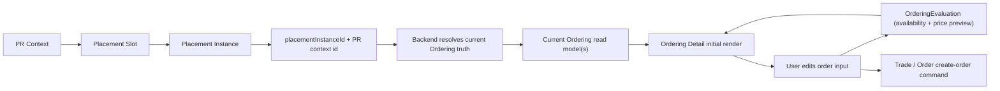

# Merchandising: Placement And Offer

## Scope

This document narrows the internal technical design for Merchandising in issue
231. Merchandising owns Product Catalog, Offer, and Placement, but this page
focuses on Placement and Offer because they form the PR-page commercial entry.

In scope:

- Placement Instance selection from PR data / PR Context DTO.
- Button-type Placement creative rendered in the PR Page Button Placement slot.
- Ordering Detail as the independent pre-order user route.
- Admin CRUD for Offer and Button Placement Instance.
- Backend-authored placement matching, creative payload, and target resolution.
- SPU type selection of ordering, order, and fulfillment families.

Out of scope:

- Below-Utility-Actions placement card.
- User-facing TradeProposal route.
- Voucher Entitlement, GoodsOrder, and redemption flows.
- Real ride-hailing provider dispatch.

## Design Thesis

Placement answers: "Given PR data, which Placement Instance, if any, should be
shown, what marketing creative should be shown, and what does clicking it
target?"

Offer answers: "What sellable SPU set is being offered, what commercial
terms affect pricing, and which Ordering surface(s) should be assembled next?"

Placement owns marketing content because different Placement types need
different creative payloads. Button Placement and Banner Placement are different
rendering types and should not share a forced generic copy/media model.

Offer must not own marketing copy, media, PR visibility rules, or existing-order
target selection. Placement must not own order lifecycle or fulfillment.

Current frontend/application direction:

- `Ordering` is a first-class concept distinct from `Offer`
- backend should finish `Offer + Placement binding -> Ordering page payload`
  before the frontend enters Ordering Detail
- do not introduce a separate standalone Ordering owner, persisted Ordering
  entity, or persisted Offer-owned ordering-schema object in the current scope
- do not treat a phrase like `Derived ordering definition` as a new model
  layer; at most it is shorthand for the query-time field-definition fragment
  already embedded in the Ordering page payload

## Product Type Contract

SPU is the source of the ordering/order/fulfillment contract, SKU selection
policy, quantity policy, and product-native pricing policy used by Offer. The
stored source key should be `productType`, with the rest derived from it:

```ts
type ProductType = "RENTAL" | "RIDE_HAILING";

type PricingModel =
  | { type: "FIXED_TOTAL"; amountFen: number }
  | { type: "DYNAMIC_QUOTE"; calculatorSpec: unknown };

type SpuSkuSelectionPolicy = {
  type: "EXACTLY_ONE";
};

type SpuQuantityPolicy =
  | { type: "FIXED"; quantity: number }
  | { type: "PER_PARTICIPANT" }
  | { type: "USER_SELECTED"; min: number; max: number };

type PricingPolicy = {
  rules: PricingRule[];
};

type SpuCommerceContract = {
  spuId: number;
  productType: ProductType;
  orderingKind: "RENTAL" | "RIDE_HAILING";
  orderFamily: "RentalOrder" | "RideHailingOrder";
  fulfillmentFamily: "RentalFulfillment" | "RideHailingFulfillment";
  skuSelectionPolicy: SpuSkuSelectionPolicy;
  quantityPolicy: SpuQuantityPolicy;
  pricingPolicy: PricingPolicy;
};
```

Offer can contain multiple SPUs, but all SPUs inside one Offer must share the
same `productType` and therefore the same ordering family. Each SPU's selected
SKU derives the concrete variant facts and base pricing model, while the SPU
derives the `orderingKind`, order family, fulfillment family, SKU selection
policy, and quantity policy. The frontend maps `orderingKind` to concrete Vue
ordering components. Backend contracts should not expose frontend component
names.

Pricing is affected by SKU, SPU, and Offer:

- SKU declares the variant facts and base pricing model.
- SPU declares product-native sales policy and pricing policy. SPU pricing
  rules may target only SKU-level data because SPU policy should only affect
  internal product content.
- Offer supplies an ordered pricing-rule array for campaign/commercial overlay.
- Offer pricing conditions are evaluated against target data, not PR Context.
  Target data is scoped to the rule target level: SKU, SPU, or Order. Examples
  include selected ride-hailing SKU, vehicle class, route being inside
  Guangzhou, and service/quote time within a campaign window such as June 2026
  to August 2026.
- Trade snapshots the resolved SKU + Offer terms when creating an order.

Cancellation policy is SKU base only for the current task. Offer cancellation
overlay is a future extension and should not be implemented in issue 231.

## Offer Model

Recommended source model:

```ts
type OfferStatus = "DRAFT" | "ACTIVE" | "PAUSED" | "ARCHIVED";

type Offer = {
  id: number;
  status: OfferStatus;
  productType: ProductType;
  spuIds: number[]; // ordered display/composition list
  pricingPolicy: OfferPricingPolicy;
  termsVersion: number;
  startsAt?: Date | null;
  endsAt?: Date | null;
};

type CommonPricingRuleDsl = {
  id: number;
  conditionRule: OfferPricingConditionRuleJson;
  action: PricingRuleAction;
  label: string;
  description: string;
  continue: boolean;
};

type OfferPricingRule = CommonPricingRuleDsl & {
  target: PricingRuleTarget;
};

type OfferPricingPolicy = {
  rules: OfferPricingRule[];
};

type OfferPricingConditionRuleJson = unknown; // validated JsonLogic-compatible JSON

type PricingRuleTarget =
  | { level: "SKU"; skuId: number }
  | { level: "SPU"; spuId: number }
  | { level: "ORDER" };

type PricingRuleAction =
  | {
      type: "RESET";
      payload: {
        pricingModel: PricingModel;
      };
    }
  | {
      type: "MINUS";
      payload: {
        amountFen: number;
      };
    }
  | {
      type: "RATIO";
      payload: {
        ratioBps: number;
      };
    };

type PricingRuleTargetData = {
  // Data passed to json-logic-js for one target. Shape depends on target level.
  target: PricingRuleTarget;
  pricingModel: PricingModel;
  amountFen: number | null;
  sku?: {
    id: number;
    facts: unknown;
  };
  spu?: {
    id: number;
    facts: unknown;
    skuSelectionPolicy: SpuSkuSelectionPolicy;
    quantityPolicy: SpuQuantityPolicy;
  };
  order?: {
    selectedSkuIds?: number[];
    route?: unknown;
    serviceTime?: string | null;
    quoteTotalFen?: number | null;
  };
};
```

Offer does not model a separate line abstraction in MVP. Offer's SPU list
controls which sellable product bodies are included in the Offer. SKU selection
and quantity limits belong to SPU. This avoids duplicating catalog sales policy
in every Offer.

Offer must validate:

- every referenced SPU is active
- every referenced SPU belongs to the Offer's `productType`
- the resulting Offer still maps to one ordering family

Pricing rules target SKU, SPU, or Order data. The same SPU can appear in
multiple Offers, and each Offer can carry its own ordered commercial overlay
rules.

Pricing rule behavior:

1. Evaluate rules in the order they appear in `pricingPolicy.rules`.
2. A rule only evaluates against the data for its declared target.
3. `conditionRule` is evaluated with json-logic-js against that target data.
4. If the rule does not match, move to the next rule.
5. If it matches, apply `action` to the current pricing state for that target:
   - `RESET`: replace the target's current pricing model with
     `payload.pricingModel`.
   - `MINUS`: subtract positive `payload.amountFen` from the resolved amount.
   - `RATIO`: multiply by `payload.ratioBps / 10000` and round to integer fen.
6. Record `label` and `description` as user-facing price explanation.
7. If `continue` is true, continue evaluating later rules for the same target
   against the updated pricing state. If false, stop evaluating later rules for
   that same target.

All monetary values are stored as integer fen. No decimal currency values should
be persisted.

Pricing state semantics:

- Each SKU pricing target starts from the SKU base pricing model.
- SPU pricing policy is then applied as product-native pricing behavior.
- Offer pricing rules are applied after SPU pricing policy as
  campaign/commercial overlay.
- Order pricing target starts from the aggregate Order pricing model derived
  from selected SKUs.
- `amountFen` is the current resolved total amount for that pricing target, not
  a unit price. It may be `null` before a dynamic quote model is resolved.
- For a 6C SKU such as "2 seats + baking zone", the SKU base pricing model can
  be `FIXED_TOTAL` with `amountFen = 6000`. If UI needs "30 yuan/person", it
  derives that display from SKU facts such as participant count.
- For ride hailing, the SKU base pricing model can be `DYNAMIC_QUOTE`. An
  `ORDER` target can resolve the quote into `amountFen`, then apply a `RATIO`
  rule such as `8000` basis points for an 80% final price.
- A `RESET` rule replaces the current pricing model. For ride hailing this does
  not mean "overwrite quote with one amount"; it means "use another pricing
  model for this target".
- If a target's pricing model cannot resolve an amount with the available
  order data, that target has no payable customer price yet.

Offer deliberately has no title, subtitle, description, or media fields.
Marketing copy and media belong to Placement creative payloads. Product Catalog
may still own product-level media and parameters, but those are product facts,
not Offer marketing creative.

## Ordering Field Definition At Query Time

`Derived ordering definition` is only a discussion shorthand introduced in this
packet. It should not survive as a named middle object in the topology.

The simpler read is:

- Product Catalog owns the stable sales/service/product truth
- Offer selects the sellable SPU set and pricing overlay
- Placement resolves bound values from context for known field keys
- backend returns one Ordering page payload, and that payload already contains
  the field-definition fragment needed by the page

So the field definition below is not a new durable object. It is just one
derived fragment inside the query-time Ordering page payload.

Recommended model:

```ts
type OrderingFieldValueKind =
  | "ENUM_SINGLE"
  | "POSITIVE_INT"
  | "PHONE"
  | "PLAIN_STRING"
  | "DATETIME"
  | "TIME_WINDOW"
  | "DURATION"
  | "ROUTE";

type OrderingFieldDefinition = {
  key: string;
  label: string;
  valueKind: OrderingFieldValueKind;
  required: boolean;
};
```

Boundary:

- The field definition is derived from Offer-selected catalog truth; it is not
  a new persisted object under Offer
- Offer still remains the commercial source that decides which catalog content
  participates in this ordering flow
- The field definition does not own page layout or widget choice
- Placement may reference only `field.key` values that exist in this query-time
  field definition
- Whether a field is externally bindable should be derived by an
  Offer/catalog-owned predicate rather than persisted as one more field flag

Examples:

- Rental field definition fragment:
  - `zone`
  - `timeSlot`
  - `participantCount`
  - `contactPhone`
  - `realName`
- RideHailing field definition fragment:
  - `route`
  - `vehicleClass`
  - `departureTime`
  - `contactPhone`

The backend Ordering query should return:

- SPU list resolved to SPU/SKU projections
- one Offer `productType` / `orderingKind`
- resolved amount and pricing-rule explanations after applying SKU base pricing
  model, SPU pricing policy, and Offer overlay rules
- SKU base cancellation policy where applicable
- context echo, such as `prId`, when opened from a PR placement

Offer pricing conditions must not be modeled as PR matching rules. A PR may
provide default route/time values into Ordering, but Offer pricing evaluates
target data from the selected SKU/SPU/order context, not whether the PR itself
matched a Placement. Offer top-level availability is limited to status and
active window unless a later design adds an explicit Offer applicability rule.

Ordering Detail should resolve one ordering root per Offer because an Offer is
now restricted to one `productType` / ordering family. The page may still show
multiple SPUs or SKU groups inside that one ordering flow. A single SPU must
never contain mixed SKU product types, and one Offer must never mix SPUs from
different product types.

## Placement Instance Model

This task implements only Button-type Placement Instance:

```ts
type PlacementType = "BUTTON" | "BANNER";
type PlacementSlotKey = "PR_UTILITY_ACTIONS_BUTTON";
type PlacementStatus = "DRAFT" | "ACTIVE" | "PAUSED" | "ARCHIVED";

type PlacementInstance = {
  id: string;
  status: PlacementStatus;
  type: PlacementType;
  slotKey: PlacementSlotKey;
  offerId: number;
  creative: PlacementCreative;
  matchingRule: PlacementMatchingRuleJson;
  startsAt?: Date | null;
  endsAt?: Date | null;
};

type PlacementCreative =
  | ButtonPlacementCreative
  | BannerPlacementCreative; // future type, not implemented in this task

type ButtonPlacementCreative = {
  type: "BUTTON";
  label: string;
  title?: string | null;
  iconKey?: string | null;
};
```

Placement also owns context-to-ordering field binding policy.

Recommended model:

```ts
type PlacementContext = {
  kind: "PR";
  data: unknown;
};

type PlacementBindingRule = {
  fieldKey: string;
  contextPath: string;
  lock: true;
};
```

Boundary:

- Placement Slot touches `PlacementContext` in order to select which
  PlacementInstance should be rendered in that slot
- Placement Instance owns `bindingRules` and resolves bound Ordering values
  from that already-selected `PlacementContext`
- Placement must know which Ordering field keys are bindable for the target
  selling flow
- Placement does not own the full ordering schema or page layout
- current invariant: if a field is bound from PR context by Placement, that
  field is locked
- Placement save/resolve validation must reject binding rules that reference
  unknown field keys or fields that fail the Offer/catalog-owned bindability
  predicate over the derived ordering definition

The frontend renders the returned projection. It must not infer matching rules,
or whether to route to Offer or Order.

`PlacementSlot` and `PlacementInstance` are distinct concepts:

- `slotKey` identifies the UI slot or placement container
- `PlacementInstance` is one configured merchandising record competing for that
  slot

Button Placement is a UI rendering type, not a separate matching-rule model.
The selection flow is still: query suitable Placement Instances by slot and
requested `placementType`, evaluate their `matchingRule` against the read
path's normalized context, then render the selected instance using its
placement-type-specific projection.

## Placement Matching Rule

Placement Matching Rule is a persisted JSON rule evaluated by a rule engine on
every placement read path that uses PlacementInstance selection. It is not tied
to `placementType` and not tied to PR context. Its only output is display or
do-not-display for one Placement Instance and one normalized context input.

```ts
type PlacementMatchingRuleJson = RulesLogic; // validated JsonLogic-compatible JSON

type PlacementRuleContextData = unknown;

type PrPlacementRuleContextData = {
  // Plain PR-derived data for the rule engine. This is a context adapter DTO,
  // not a rich domain model and not part of the generic rule engine.
  // It should use existing PR fields such as type, time, location, route,
  // minPartners, maxPartners, and active participant count.
};
```

Examples:

- 6C Rental Placement: PR type matches food/cooking text, active participants
  2-5, concrete
  time, one-day advance, service window 10:00-22:30.
- Ride Hailing Placement: PR type matches ride-hailing text; other PR types
  can match a ride-hailing placement when concrete time and route/meeting
  context exist.

Placement matching may show the button before PR is READY. Order creation is
still gated by the PR-domain order-attachment invariant.

PR Context means the PR data object passed into the rule engine. It is a DTO /
data alias, not a domain model. It should not add ecommerce-purpose fields such
as `marketingCategory`; Placement rules should be authored against existing PR
data.

The frontend should not construct or evaluate PR Context. PRPage asks the
Placement read endpoint for the currently matching Placement Instance and only
renders the returned projection.

Viewer authorization is not part of PR-context placement matching. For example,
"only the PR creator may create an order" belongs to Ordering/Trade validation.
Viewer-awareness is still required later when resolving an existing-order
target, so the system does not leak inaccessible orders.

PR active participant access is a precondition before placement matching for a
PR context. Active participants can see placements and PR-attached orders. Users
who are not active participants of that PR should receive no placement
projection for that PR. This access gate is not a Placement Matching Rule.

PR `type` is currently a free-text product-facing field, and that is the field
Placement matching should use for activity-type matching in this task. If a
future product decision introduces structured PR types, that should be a PR
model change, not a hidden ecommerce field inside PR Context.

## Rule Engine Recommendation

Use an existing JSON rule engine instead of implementing custom filter and rule
composition logic.

MVP decision: use `json-logic-js`.

Reasons:

- Rules are pure JSON and can be stored with Placement Instance records.
- Evaluation is direct: `apply(rule, prContextData)` returns a boolean-like
  value for display or do-not-display.
- It is small and sufficient for this task's synchronous PR-data matching.
- It keeps rule execution deterministic and avoids serialized JavaScript code.

`json-rules-engine` is not selected for MVP because its fact/event model is
heavier than the current display/hide need. Keep it as a future migration option
only if Placement Matching later requires async facts such as LBS/geocoding
lookup during rule evaluation.

The implementation should hide the concrete library behind a small
`PlacementRuleEngine` port so the persisted rule format and test fixtures are
controlled by Merchandising rather than by PRPage.

Current implementation:

- `Placement.matchingRule` is persisted as JSONLogic-compatible JSON and
  validated on create/update.
- The rule engine is generic: `doesPlacementRuleMatch(rule, context)` does not
  know PR, Button, or any placement type.
- PR context construction is a separate adapter:
  `buildPrPlacementRuleContextData`.
- PR Button Placement resolution is Merchandising-owned. It loads active
  instances for `PR_UTILITY_ACTIONS_BUTTON` and requested placement type
  `BUTTON`, builds a narrow PR context DTO, filters candidates through the
  generic rule engine, then resolves the selected placement's Offer target into
  either an Ordering target or an existing Order target.
- The Trade / Rental ordering flow no longer owns placement matching. Trade
  still owns ordering evaluation, order creation, order detail, and PR attach
  transactional effects.

SPU pricing policy and Offer pricing policy may reuse the same rule DSL style,
but each owner must validate a different legal target set. The shared DSL does
not imply shared authority.

## Target Resolution

Placement read returns a backend-authored target:

```ts
type PlacementTarget =
  | { kind: "ORDER"; orderId: string; href: string }
  | {
      kind: "ORDERING";
      placementInstanceId: string;
      context: { kind: "PR"; prId: number };
      href: string;
    };
```

Resolution order:

1. Check whether the viewer is an active participant of the PR context. If not,
   return no placement.
2. Load active Placement Instance candidates by slot plus requested
   `placementType`. Placement matching itself is not surface-based, but
   placement type affects the candidate query because the caller is asking for
   one renderable projection family.
3. Evaluate each candidate's matching rule through the generic rule engine with
   the PR context adapter data.
4. Discard candidates whose target cannot be resolved for this read path.
5. Resolve the target Offer internally from the selected Placement Instance,
   then ask Trade whether an active order already exists for that
   `(offerId, prId)` pair.
6. Return `ORDER` target when an existing order exists. PR active participants
   have access to PR-attached orders. Otherwise return `ORDERING` target.
7. Return zero or one Placement projection for the Button Placement slot. If
   configuration creates multiple matches, the backend resolves that ambiguity
   deterministically before responding.

Merchandising may query Trade through a read port for target resolution, but it
must not own order state.

## Ordering Resolution

There may still be thin endpoint/query use cases that serve Ordering Detail,
but they must not become new owners. Internal responsibility split should stay:

1. Placement resolves external-context bindings
2. backend traverses `Placement -> Offer -> Product`
3. current Ordering read truth is returned to the page

Ordering page entry should contain only backend-authoritative refs/ids from
existing owners. It must not introduce a generic `resolveRef`, `orderingRef`,
`orderingId`, or any other Ordering identity.

There is no canonical `OrderingPageInput` domain model. Entry parameters are
route/use-case-specific:

- current MVP Placement entry may use `placementInstanceId + PR context id`
- a future direct Offer entry may use `offerId`
- a future direct Product entry may use `spuId` / `skuId`

Those are transport/application parameters, not Ordering-owned identity. The
Ordering model itself starts only after the backend has resolved current
authoritative read truth from existing owners.

Ordering must be read from the Order creation boundary backward.

First question:

> What does Trade need to create a valid Order?

The answer is defined by Trade's `CreateOrderCommand`, not by an
Ordering-owned schema. Ordering is the pre-create interaction surface that helps
the user supply the variable parts of that command while the backend supplies
all authoritative product, offer, pricing, policy, and context truth.

So there are two different kinds of data:

- authoritative read truth: current SPU/SKU, service policy, cancellation
  policy, pricing policy, placement-bound values, and any locked context values
- current order input: user intent and editable values that will be submitted
  toward `CreateOrderCommand`

The frontend may own current order input while the user is editing. It must not
be the authority for anything the page displays as contract truth, and it must
not be the authority for locked/bound fields at create time.

Current Ordering read data can be composed from one API or several fine-grained
atomic APIs. The design focus is authority and ownership, not whether transport
is monolithic.

Recommended current read model:

```ts
type OrderingReadModel = {
  productType: ProductType;
  spus: OrderingSpuProjection[];
  input: OrderingInputState;
};

type OrderingEvaluation = {
  availability: {
    createOrderEnabled: boolean;
    disabledReason?: string | null;
  };
  pricePreview: {
    amountFen: number | null;
    explanations: unknown[];
  };
};

type OrderingSpuProjection = {
  spuId: number;
  name: string;
  salesPolicy: SpuSalesPolicy;
  servicePolicy: SpuServicePolicy;
  sellingPoints: string[];
  skuOptions: OrderingSkuProjection[];
};

type OrderingSkuProjection = {
  skuId: number;
  name: string;
  facts: unknown;
  selected: boolean;
  selectable: boolean;
};

type OrderingInputState = {
  /**
   * Fields needed to complete Trade's CreateOrderCommand.
   * Values for locked/bound fields are backend-authored display values and
   * must be re-derived or revalidated by backend on evaluate/create.
   */
  fields: OrderingInputField[];
};

type OrderingInputField = {
  key: string;
  label: string;
  valueKind: OrderingFieldValueKind;
  required: boolean;
  value: unknown | null;
  editable: boolean;
};

```

Important direction:

- Ordering Detail should not receive frozen pre-order snapshots
- frontend should not directly depend on `Offer` as its public contract
- backend should resolve current Ordering read truth on every read/evaluate/create
  from existing owner refs, currently often by traversing `Placement -> Offer
  -> Product`
- frontend should not run `Offer -> Ordering` adaptation logic
- route/page-entry parameters should contain only existing owner refs/ids used
  to obtain authoritative backend truth
- current order input is derived from Trade's `CreateOrderCommand`: selected
  item ids, quantities, and editable request fields
- current order input may carry user-provided values, but it is not authority
  for product, pricing, policy, cancellation, or locked context truth
- locked/bound fields shown by Ordering Detail must be re-derived or revalidated
  by backend during evaluation and order creation
- Ordering must not be persisted and therefore must not grow an `orderingId`
- do not introduce generic locator fields such as `resolveRef` or `orderingRef`
  to stand in for multiple upstream owners
- if an outer query/use case exists, it is only a coordinator; the real owner
  logic remains split between Placement binding resolution and
  Offer-selected-catalog ordering derivation
- `OrderingEvaluation` is still Ordering-owned state. It should not be treated
  as a sibling owner next to Ordering.
- backend may expose one composed Ordering read API or multiple fine-grained
  atomic read APIs; that is an implementation choice, not a new model owner
- Ordering-side read/write should reuse existing domain names and ids:
  - current SPU / SKU read projections for ordering truth
  - `input` inside current Ordering read truth for fields required by
    `CreateOrderCommand`, including backend-authored locked display values
  - `OrderingEvaluation` for current computed state
- Service explanation belongs to current SPU read truth and service policy.
- Cancellation explanation belongs to the current cancellation-policy read
  result.
- Do not invent a generic `sellable` layer when SPU is already the sellable
  product body in the catalog model.
- Order creation command belongs to Trade / Order, not to Ordering.
- Ordering only owns the latest pre-order read model plus current input and
  evaluation state. Trade / Order owns the authoritative create-order command
  shape and the eventual snapshot freezing.

## Ordering Page Data Topology

The current preferred page-data topology is:



Interpretation:

- Ordering page entry carries only existing owner refs/ids
- Ordering has no canonical entry object; each entry route/use case uses its own
  existing owner refs
- Ordering model must not hard-code a specific predecessor such as Placement or
  Offer
- Ordering page consumes backend-resolved current read truth
- user edits produce current `order input`, which is the editable/user-intent
  subset of Trade's eventual `CreateOrderCommand`
- `OrderingInputState` describes the fields needed for that command and may
  display backend-authored locked values; those values are re-derived or
  revalidated by backend during evaluate/create
- `OrderingEvaluation` is the internal computed state for that current input
- price preview and create-order availability are derived from `order input`
  through the existing pricing / validation pipeline rather than from field
  schema flags
- How the user entered Ordering, including whether Placement was the entry, is a
  route/use-case concern outside the Ordering model itself
- create-order command shape is Order-owned and should be defined in the Trade
  document, not here

## Read And Route Contract

Canonical read API:

```http
GET /api/placements?context=pr&contextId=:prId&type=BUTTON
```

Response shape:

```ts
type PlacementSelectionProjection = {
  placement: PlacementProjection | null;
};

type PlacementProjection = {
  id: string;
  slotKey: "PR_UTILITY_ACTIONS_BUTTON";
  type: "BUTTON";
  creative: ButtonPlacementCreative;
  target: PlacementTarget;
};
```

`href` is backend-authored so the frontend does not need to reconstruct route
semantics from target internals.

PR detail may embed this projection for page-load composition later, but the
selection authority and tests should still exercise the Placement-owned
application service.

Initial frontend composition should use an independent placement query from
PRPage rather than embedding Placement inside `GET /api/pr/:id`. Empty,
loading, or failed placement queries should not break the PR page; they should
only omit the optional Button Placement surface.

The user flow is:

1. PR Page renders the Utility Actions section.
2. PRPage requests the matching `BUTTON` Placement for the current PR data.
3. If a matching Button Placement Instance exists, the Button Placement row is
   shown; otherwise it is hidden.
4. Clicking the button follows the backend-authored target to Ordering Detail or
   Order Detail.
5. Ordering Detail consumes backend-resolved current Ordering truth.

Current MVP user route:

- `/ordering/from-placement?placementInstanceId=:placementInstanceId&context=pr&contextId=:prId`
- `/orders/:orderId`

There is no required user-facing `/placements/:placementId` page for Button
Placement. Admin placement management can live under admin routes.

## Admin CRUD

Admin CRUD should support:

- SPU selection for an Offer.
- Offer status, product type, active window, SPU list, pricing policy, and
  ordered pricing rule array.
- Button Placement status, type, slot key, creative payload, target offer,
  active window,
  and matching rule JSON.
- Validation that active Button Placement points to an active Offer.
- Validation that an active Offer points to active SKU(s).
- Preview against a PR id for operators to debug why a placement appears or is
  hidden.

Backend admin implementation should use a dedicated Merchandising admin
controller or route module mounted under `/api/admin`, rather than extending the
existing anchor-event admin controller.

## Utility Actions Composition

Button Placement is rendered as its own row inside the existing PR Page Utility
Actions area. MVP returns at most one Button Placement for that slot. If
configuration accidentally produces multiple matching Button Placement
Instances, the backend must resolve that conflict before returning the
projection; the frontend still renders zero or one placement.

## Test Plan

Backend unit tests:

- Offer validation and active-window behavior.
- Offer validation for same-product-type SPU membership.
- Offer snapshot stability for order creation.
- Resolved pricing through SKU base pricing model, SPU pricing policy, and
  Offer pricing rules; cancellation behavior from SKU base terms.
- Placement matching rule behavior.
- Placement target resolution to existing Order over Offer.
- Placement slotKey / instance distinction and zero-or-one slot projection.
- Button Placement projection shape.
- Admin CRUD validation for Offer and Placement.

Frontend unit tests:

- PR Utility Actions renders backend-authored Button Placement.
- Empty placement list renders nothing.
- Button click routes to Offer or Order according to target kind.
- PRPage does not compute placement matching locally.

System scenario:

- Admin creates SKU, Offer, and Button Placement.
- Matching PR page shows the configured Button Placement inside Utility
  Actions.

## Decisions To Confirm

1. Button Placement should not require a user-facing `/placements/:placementId`
   route; placement is a projection and admin-managed object.
2. Placement target uniqueness should be `(offerId, prId)`.
3. Placement matching rules should be stored as typed JSON and evaluated by
   Merchandising, not hard-coded in PR or frontend.
4. PR active participants can see PR-attached orders; non-active participants
   receive no PR-context placement projection.
5. Initial PRPage integration should use a separate Placement query, with
   optional-failure behavior.
6. Offer applicability beyond `status` and active window currently comes from
   pricing-rule conditions plus ordering validation. Confirm whether Offer
   needs a separate top-level applicability rule.
