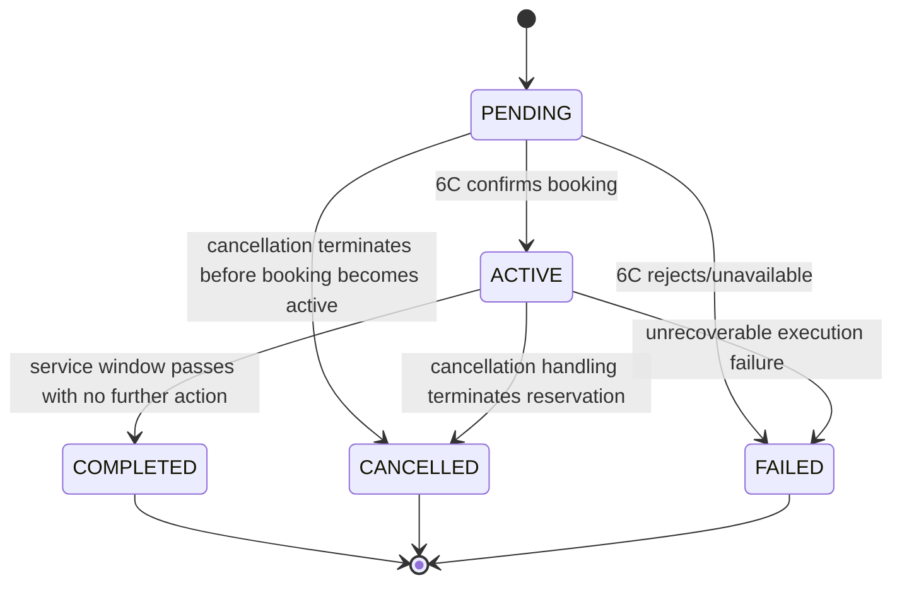
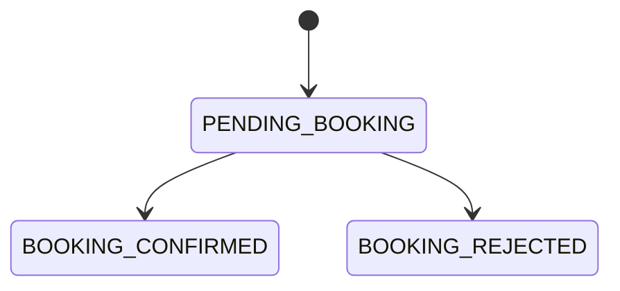
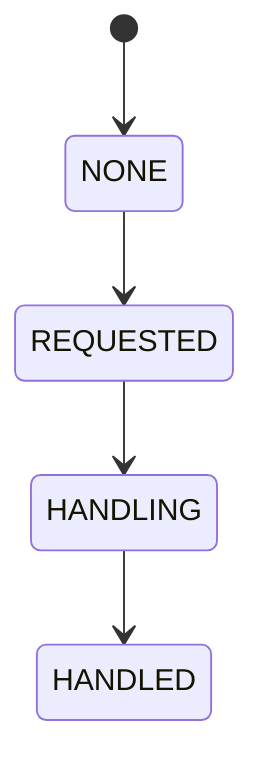
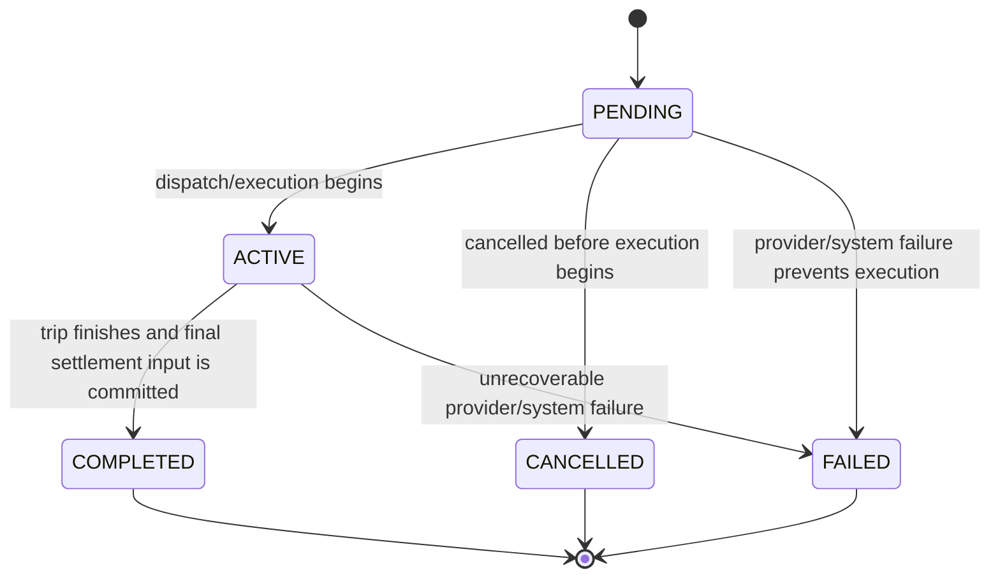
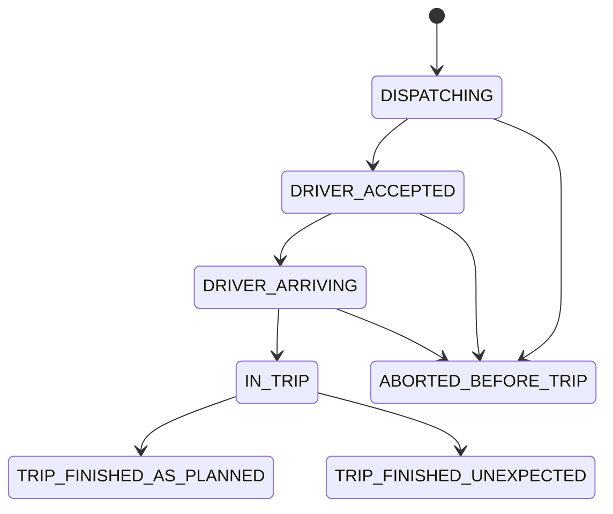

# Fulfillment Model

## Why Fulfillment Exists

Fulfillment should not exist just because there is manual operator work.
Manual work is an implementation mode, not a domain boundary.

Fulfillment is needed only when the product has service-execution truth that
cannot be reduced to:

- Order contract truth
- Bill obligation truth
- Payment money-movement truth

In practice, that means Fulfillment is justified when at least one of the
following is true:

- after order creation, the promised service still needs execution against an
  external real-world counterpart
- the execution may later succeed, fail, or be cancelled independently of
  payment success
- execution produces user-visible result facts or entry/use instructions
- execution-side irreversible actions gate cancellation, refund, or final
  billing

If none of those are true, Fulfillment should collapse away.

## What Fulfillment Owns

Fulfillment owns service-execution truth and execution-side result facts.

It should answer questions such as:

- has the promised service been accepted for execution
- has the service execution succeeded, failed, or been cancelled
- has an irreversible execution-side action already happened
- what user-visible execution result or entry guidance exists
- has usage-based service become finally billable

In the contract-unwind framing, Fulfillment is the owner of service-side
performance frontier and reversibility truth.

That means Fulfillment should answer:

- how far real-world service execution has already progressed
- whether future service performance can still be cleanly stopped
- whether the supplier/provider allows that stop
- what irreversible execution facts remain even if contract termination is later
  approved

Fulfillment should not own:

- Offer selection
- price preview or pricing-rule evaluation
- order-attachment authority
- bill splitting
- payment gateway callbacks
- supplier settlement or deposit accounting
- inventory or capacity management

## Why Rental Definitely Needs Fulfillment

Rental already has a real execution gap after order creation and payment:

1. Order is created and paid.
2. Platform staff contacts 6C.
3. 6C may confirm or reject the booking.
4. If confirmed, the platform must store entry guidance for the users.
5. If cancellation is requested later, the platform must contact 6C before the
   cancellation/refund chain can be finalized.

Those truths do not belong in Order, Bill, or Payment:

- Order should not own supplier booking success/failure.
- Bill should not decide whether supplier-side cancellation handling finished.
- Payment success does not imply booking success.

Therefore Rental Fulfillment is not optional in issue 231. It is the owner of:

- booking pending / confirmed / failed truth
- entry guidance facts
- cancellation-handling progress after staff contacts 6C
- execution-side irreversible-action truth needed by cancellation/refund logic

## Why Ride Hailing Is the Real Scope Decision

RideHailing Fulfillment becomes necessary only if issue 231 truly includes real
final settlement rather than quote-time order preparation.

If the scope is only:

- quote
- create order from quote snapshot
- show order basis

then RideHailing Fulfillment can stay a thin boundary or even collapse into
Order for this issue.

But if the scope is:

- trip is actually executed in some form
- final amount is known only after execution
- Bill is created only after trip-finish settlement input and final billable
  amount are committed

then a real RideHailing Fulfillment owner becomes necessary, because someone
must own:

- whether the trip actually started
- whether the trip actually finished, aborted before start, or failed
- whether the trip has crossed the irreversible billing boundary
- what final billable facts were committed upstream of Bill creation

That owner should be Fulfillment, not Order and not Bill.

## Minimal RideHailing Fulfillment If Final Settlement Stays In Scope

Issue 231 does not need full ride-hailing provider operations unless the user
later explicitly asks for them. Full provider operations would include:

- dispatch
- driver acceptance
- driver/vehicle live updates
- passenger boarding tracking
- actual route/mileage/time callback transport

However, real final settlement still requires at least a minimal fulfillment
truth boundary. The smallest useful cut would be:

- order prepared
- trip billable execution started or accepted
- trip finished with final settlement input committed
- trip aborted before actual trip start

This is much smaller than a full provider-integration domain, but it is still
real Fulfillment rather than a placeholder boundary.

## Does RideHailing Fulfillment Include The Aggregated Ride Service Integration

Yes, if issue 231 keeps real usage-based final settlement in scope, then the
provider-facing ride-execution integration belongs inside the RideHailing
Fulfillment boundary.

That does not mean the domain model should directly contain raw HTTP calls or
SDK logic. The cleaner topology is:

- RideHailing Fulfillment owns trip-execution truth and provider-normalized
  events
- a provider port / anti-corruption adapter sits under that fulfillment slice
- provider-specific request/response payloads stay in infrastructure

So the ownership answer is:

- yes, provider-backed aggregated ride execution is a Fulfillment concern
- no, it does not need to become a separate top-level domain in issue 231

Splitting a separate `ride-aggregation` domain would make sense only if the
provider-selection, failover, or multi-provider orchestration becomes
independently complex enough to deserve its own bounded context.

For the current MVP, keeping it inside RideHailing Fulfillment is the simpler
and more readable topology.

## Fulfillment Operations Surfaces

Rental Fulfillment should have a dedicated operator-facing operations surface.

The reason is topological, not naming-driven:

- Merchandising Admin configures catalog, offers, placements, and policies
- Fulfillment Operations executes live service work against real orders

Those are different responsibilities, different permissions, and different
mental models. Mixing them into one "Admin" area would reduce readability.

Therefore the recommended split is:

- Admin pages for Merchandising configuration
- Operations pages for Fulfillment execution

For issue 231, the immediate need is a dedicated Rental Fulfillment operations
page or queue where staff can:

- see pending 6C booking/cancellation work
- record 6C confirmation or rejection
- record entry guidance
- record cancellation-handling completion

This does not need a separate top-level domain. It is simply the operator UI
surface of the Fulfillment domain.

## Design Consequence

The right first principle is:

- Order owns the commercial contract.
- Bill owns monetary obligations.
- Payment owns money movement.
- Fulfillment owns service execution and execution-side result truth.

For Rental, this scope is already clearly justified.

For RideHailing, the open decision is not "what fields should Fulfillment
have"; the open decision is whether issue 231 keeps ride hailing at
quote/order-foundation scope or pulls in the minimum execution truth required
for usage-based final settlement after trip finish.

## Aggregate Boundary

For issue 231, the cleanest topology is:

- `1 Order -> at most 1 Fulfillment`
- `Fulfillment` owns execution truth only
- `Order` holds only a foreign reference such as `fulfillment_ref`

There is no need for a generic one-order-many-fulfillments model in the MVP,
because:

- one Rental order maps to one 6C reservation execution chain
- one RideHailing order maps to one trip execution chain

If a future issue introduces split shipments, multi-stop sub-trips, or staged
service delivery, that is the time to reconsider the cardinality.

## Foundation-Creation Timing

The two current families intentionally differ:

- `RentalFulfillment` starts only after the prepaid Bill is fully settled,
  because service execution should not begin before payment success. This is
  an explicit Trade/application-service command after Bill settlement is
  confirmed, not a generic Fulfillment listener.
- `RideHailingFulfillment` starts when the order is created, because service
  execution begins before the final bill is resolved

This asymmetry is correct and should stay visible. Trying to unify both
families into one creation timing would hide real business differences.

## Minimal Write Model

```ts
type FulfillmentFamily = "RENTAL" | "RIDE_HAILING";

type FulfillmentLifecycleStatus =
  | "PENDING"
  | "ACTIVE"
  | "COMPLETED"
  | "CANCELLED"
  | "FAILED";

type FulfillmentActor = {
  actor_type: "SYSTEM" | "OPERATOR" | "PROVIDER";
  actor_id?: string | null;
};

type FulfillmentBase = {
  id: string;
  order_id: string;
  family: FulfillmentFamily;
  lifecycle_status: FulfillmentLifecycleStatus;
  created_at: string;
  updated_at: string;
  started_at?: string | null;
  completed_at?: string | null;
  cancelled_at?: string | null;
  failed_at?: string | null;
};
```

The important design choice is:

- `FulfillmentBase.lifecycle_status` is the shared coarse lifecycle
- each typed fulfillment keeps its own family-specific authoritative phase or
  status
- optional side-flow objects such as cancellation handling or final billing
  commit remain explicit sub-objects

Do not try to force every subflow into one giant enum.

The recommended maintainability rule is:

- `lifecycle_status` is not a second independent business state machine
- it is a mechanically derived coarse lifecycle classification from the
  family-specific authoritative state

That means:

- family-specific transitions remain the source of truth
- cross-family orchestration, filtering, and monitoring can still rely on one
  shared lifecycle axis

## RentalFulfillment

### What It Must Own

- whether booking work is still pending
- whether 6C confirmed or rejected the reservation
- entry guidance shown to users after confirmation
- supplier-contact cancellation handling progress
- execution-side irreversible truth needed by cancellation/refund handling

### Minimal Write Model

```ts
type RentalBookingStatus =
  | "PENDING_BOOKING"
  | "BOOKING_CONFIRMED"
  | "BOOKING_REJECTED";

type RentalEntryGuidance = {
  entry_mode: "PHONE" | "REAL_NAME" | "BOTH";
  phone?: string | null;
  registrant_names?: string[] | null;
  note?: string | null;
};

type RentalBookingResult =
  | {
      status: "PENDING";
      supplier_booking_ref?: string | null;
    }
  | {
      status: "CONFIRMED";
      supplier_booking_ref?: string | null;
      confirmed_at: string;
      operator_note?: string | null;
    }
  | {
      status: "REJECTED";
      rejected_at: string;
      reason_code: string;
      operator_note?: string | null;
    };

type RentalCancellationHandling =
  | {
      status: "NONE";
    }
  | {
      status: "REQUESTED";
      requested_at: string;
    }
  | {
      status: "HANDLING";
      requested_at: string;
      handling_started_at: string;
      operator_id: string;
    }
  | {
      status: "HANDLED";
      requested_at: string;
      handled_at: string;
      supplier_outcome: "BOOKING_CANCELLED" | "BOOKING_REMAINS";
      operator_note?: string | null;
    };

type RentalFulfillment = FulfillmentBase & {
  family: "RENTAL";
  booking_status: RentalBookingStatus;
  booking: RentalBookingResult;
  entry_guidance?: RentalEntryGuidance | null;
  cancellation_handling: RentalCancellationHandling;
  irreversible_boundary: {
    reached: boolean;
    reason?: "SERVICE_STARTED" | "MANUAL_LOCK" | null;
    reached_at?: string | null;
  };
};
```

### Why Cancellation Handling Is Not The Main Status

`RentalFulfillment` has two truths that move somewhat independently:

- booking execution truth
- cancellation-handling truth

If both are stuffed into one enum, the model quickly becomes unreadable, for
example:

- `BOOKING_CONFIRMED`
- `CANCELLATION_REQUESTED_AFTER_CONFIRMATION`
- `CANCELLATION_HANDLING_AFTER_CONFIRMATION`

That is worse than simply keeping:

- `lifecycle_status`
- `booking_status`
- `cancellation_handling`

So the recommended model is a main execution status plus one explicit
sub-process object.

### Why Base Lifecycle And Booking Status Should Both Exist

For Rental, the split is useful for the same reason as RideHailing, but the
semantics are simpler:

- `booking_status` answers "did 6C accept the reservation work"
- `lifecycle_status` answers "is this fulfillment still live overall"

That gives a cleaner topology than one overloaded enum:

- `lifecycle_status = PENDING`
  while booking work is unresolved
- `lifecycle_status = ACTIVE`
  after booking is confirmed and before the reserved service is over or
  cancelled
- `lifecycle_status = FAILED`
  if booking is rejected/unavailable
- `lifecycle_status = CANCELLED`
  if cancellation handling actually terminates the reservation execution
- `lifecycle_status = COMPLETED`
  if the reserved service window has passed and no further execution work
  remains

As with RideHailing, the maintainability rule is:

- `booking_status` is the authoritative booking-execution truth
- `lifecycle_status` is the coarse shared lifecycle classification derived from
  family truth plus time/terminal handling

### Key Invariants

- `booking_status = PENDING_BOOKING` implies `lifecycle_status = PENDING`
- `booking_status = BOOKING_CONFIRMED` implies
  `lifecycle_status = ACTIVE | COMPLETED | CANCELLED`
- `booking_status = BOOKING_REJECTED` implies `lifecycle_status = FAILED`
- `lifecycle_status = CANCELLED` requires
  `cancellation_handling.status = HANDLED` and
  `cancellation_handling.supplier_outcome = BOOKING_CANCELLED`
- `lifecycle_status = COMPLETED` requires
  `booking_status = BOOKING_CONFIRMED`
- `irreversible_boundary.reached = true` means cancellation can no longer be
  treated as side-effect-free execution termination

### Concrete Lifecycle Flow

Recommended coarse flow:



This means:

- `PENDING`
  - prepaid order exists
  - fulfillment exists
  - booking work is waiting for operator / supplier resolution
- `ACTIVE`
  - booking is secured
  - entry guidance may already exist
  - service has not yet been fully consumed/closed in platform truth
- `FAILED`
  - the reservation could not be secured
- `CANCELLED`
  - reservation execution has been terminated by cancellation handling
- `COMPLETED`
  - reservation was secured and the service window has passed with no remaining
    fulfillment work

### Booking And Cancellation Subflow

Recommended family-specific flow:



Cancellation handling remains separate:



And the important mapping rule is:

- `HANDLED + BOOKING_CANCELLED` may transition lifecycle to `CANCELLED`
- `HANDLED + BOOKING_REMAINS` does not itself terminate the fulfillment
- after `irreversible_boundary.reached = true`, cancellation handling may still
  exist as an operational fact, but should not pretend the execution was cleanly
  cancelled

### Aggregate Methods

Recommended aggregate methods:

- `confirmBooking(actor, result)`
- `rejectBooking(actor, result)`
- `recordEntryGuidance(actor, guidance)`
- `requestCancellationHandling(requestedAt)`
- `startCancellationHandling(actor, at)`
- `completeCancellationHandling(actor, result)`
- `markIrreversible(reason, at)`
- `markCompleted(at)`

These methods are intentionally about execution truth only. They should not:

- compute refund amounts
- send refund money
- decide payment success

Trade should decide whether Rental cancellation handling is required from the
frozen order cancellation-policy snapshot. Fulfillment then owns only the live
supplier-handling and execution truth.

When Trade asks whether a termination attempt can succeed, Fulfillment should
return a normalized termination decision rather than directly mutating Bill or
Order. Order/Trade remains the translator from that decision into contract
state and Bill adjustment.

## RideHailingFulfillment

### What It Must Own

- whether the trip has moved from prepared to executing
- whether the trip finished, aborted before start, or failed
- the minimum provider-normalized trip reference needed by the system
- the live trip progress facts needed by Order Detail
- the final settlement input committed upstream of Bill creation

### Minimal Write Model

```ts
type RideTripPhase =
  | "DISPATCHING"
  | "DRIVER_ACCEPTED"
  | "DRIVER_ARRIVING"
  | "IN_TRIP"
  | "TRIP_FINISHED_AS_PLANNED"
  | "TRIP_FINISHED_UNEXPECTED"
  | "ABORTED_BEFORE_TRIP";

type RideProviderExecutionRef = {
  provider_key: string;
  provider_trip_ref: string;
};

type RideDriverSnapshot = {
  display_name?: string | null;
  phone_masked?: string | null;
};

type RideVehicleSnapshot = {
  plate_masked?: string | null;
  model_name?: string | null;
  color?: string | null;
};

type RideLocationSnapshot = {
  lat: number;
  lng: number;
  captured_at: string;
};

type RideDriverAssignmentSnapshot = {
  driver?: RideDriverSnapshot | null;
  vehicle?: RideVehicleSnapshot | null;
  assigned_at?: string | null;
  updated_at: string;
};

type RideLiveTrackingReadModel = {
  fulfillment_id: string;
  order_id: string;
  phase: RideTripPhase;
  latest_location?: RideLocationSnapshot | null;
  eta_to_pickup_seconds?: number | null;
  updated_at: string;
};

type RideFinalSettlementInputCommit = {
  committed_at: string;
  pricing_input_snapshot: {
    route: {
      distance_meters: number;
      duration_seconds: number;
    };
    toll_fee_fen?: number | null;
    parking_fee_fen?: number | null;
    waiting_fee_fen?: number | null;
  };
  pricing_explanation_seed?: unknown[] | null;
  provider_note?: string | null;
};

type RideFinalPricingResolutionSnapshot = {
  resolved_at: string;
  currency: "CNY";
  final_amount_fen: number;
  distance_meters?: number | null;
  duration_seconds?: number | null;
};

type RideHailingCancellationResult = {
  ended_at: string;
  reason_code: string;
  provider_outcome?: "ABORT_APPROVED_NO_FEE" | "ABORT_APPROVED_WITH_FEE" | null;
  provider_fee_fen?: number | null;
  provider_note?: string | null;
};

type RideHailingFulfillment = FulfillmentBase & {
  family: "RIDE_HAILING";
  provider_execution_ref?: RideProviderExecutionRef | null;
  ride_phase?: RideTripPhase | null;
  driver_assignment_snapshot?: RideDriverAssignmentSnapshot | null;
  final_settlement_input_commit?: RideFinalSettlementInputCommit | null;
  final_pricing_resolution_snapshot?: RideFinalPricingResolutionSnapshot | null;
  cancellation_result?: RideHailingCancellationResult | null;
};
```

### Key Invariants

- `ride_phase = DISPATCHING | DRIVER_ACCEPTED | DRIVER_ARRIVING`
  implies `lifecycle_status = PENDING`
- `ride_phase = IN_TRIP`
  implies `lifecycle_status = ACTIVE`
- pre-trip abort allowance and abort fee must come from provider outcome, not
  from local `ride_phase` alone
- `lifecycle_status = COMPLETED` requires
  (`ride_phase = TRIP_FINISHED_AS_PLANNED` or
  `ride_phase = TRIP_FINISHED_UNEXPECTED`) and
  `final_settlement_input_commit != null`
- `lifecycle_status = CANCELLED` requires
  `ride_phase = ABORTED_BEFORE_TRIP` and `cancellation_result != null`
- after `final_settlement_input_commit` exists, the fulfillment has crossed the
  irreversible billing boundary
- `final_pricing_resolution_snapshot` may be written only after
  `final_settlement_input_commit`
- Bill creation for ride hailing must happen only after
  `final_pricing_resolution_snapshot`

### Why Base Lifecycle And Ride Phase Should Both Exist

The benefit is topological clarity, not just type reuse.

- `lifecycle_status` is shared by every fulfillment family
- `ride_phase` exists only for ride-hailing execution semantics
- live tracking is a separate read concern

This allows:

- cross-family queries such as "all active fulfillments"
- ride-specific logic such as "can still show driver-arriving UI"
- high-frequency tracking updates without forcing the whole order-detail
  projection to refresh with every location change

The tradeoff is obvious:

- if `lifecycle_status` and `ride_phase` are both treated as independent
  mutable truths, maintainability gets worse immediately

So the only acceptable version of this split is:

- `ride_phase` is authoritative for ride execution semantics
- `lifecycle_status` is derived or mechanically synchronized from it

### Concrete Execution-Status Flow

The coarse `lifecycle_status` should flow like this:



This means:

- `PENDING`
  - order exists
  - ride-hailing fulfillment exists
  - execution has not yet entered actual trip usage
  - provider dispatch / assignment / arrival may already be happening
- `ACTIVE`
  - execution has entered actual trip usage
  - "边用边计费" begins here
- `COMPLETED`
  - trip execution is finished
  - final settlement input has been committed
  - final pricing and Bill creation may still happen after this
- `CANCELLED`
  - trip never actually started
  - no usage-based trip settlement should be produced from this fulfillment
- `FAILED`
  - technical/provider failure prevented a normal business completion/cancel

The most important non-obvious rule is:

- `COMPLETED` is an execution truth, not a billing truth

So:

- `COMPLETED` does not mean "bill already created"
- `COMPLETED` does not mean "user already paid"

Those later truths belong to Trade/Bill/Payment.

### Ride-Phase Flow

The ride-specific execution phase should be carried by `ride_phase`, not by the
base `lifecycle_status`.

Recommended phase flow:



For current MVP, these are best understood as the normalized visible phases,
not a promise that every provider callback maps one-to-one to one phase event.

Recommended mapping rule:

- when first live dispatch progress exists, the fulfillment still remains in
  `lifecycle_status = PENDING`
- while `ride_phase` is one of:
  - `DISPATCHING`
  - `DRIVER_ACCEPTED`
  - `DRIVER_ARRIVING`
  lifecycle remains `PENDING`
- when `ride_phase` becomes `IN_TRIP`, fulfillment transitions to
  `lifecycle_status = ACTIVE`
- when `ride_phase` becomes `TRIP_FINISHED_AS_PLANNED` or
  `TRIP_FINISHED_UNEXPECTED`, fulfillment may transition to
  `lifecycle_status = COMPLETED` only if final settlement input is committed
- when `ride_phase` becomes `ABORTED_BEFORE_TRIP`, fulfillment transitions to
  `lifecycle_status = CANCELLED`

### Suggested Order-Detail Projection

If the product later wants one visible ride status on Order Detail, that should
be a projection over multiple owners, not a new Order-owned state:

- `PENDING + DISPATCHING` -> "派单中"
- `PENDING + DRIVER_ACCEPTED` -> "司机已接单"
- `PENDING + DRIVER_ARRIVING` -> "司机前往上车点"
- `ACTIVE + IN_TRIP` -> "行程中"
- `COMPLETED + no final Bill yet` -> "行程结束，待出账"
- `COMPLETED + Bill created but unpaid` -> "已出账，待支付"
- `COMPLETED + Bill paid` -> "已完成"
- `CANCELLED + ABORTED_BEFORE_TRIP` -> "行程未开始，已终止"

That visible sequence is exactly why `Order` itself should not own one
monolithic ride-execution status.

### UI Read Model Guidance

Order Detail should not read raw append-only provider events directly.

Instead:

- provider or operator events with durable business meaning are applied into
  Fulfillment current truth
- UI reads:
  - a stable order-detail projection built from Order + Fulfillment + Bill +
    Payment
  - a dedicated live-tracking API response such as
    `GET /orders/:orderId/ride-live-tracking`, backed by provider passthrough
    or short-lived cache, only while tracking is needed
- append-only event records remain for audit, troubleshooting, and replay

This avoids refreshing low-frequency fields such as driver identity, vehicle
assignment, quote basis, and payment summary every time the location updates.

So the event record is evidence, and the dedicated live-tracking read contract
is the high-frequency page model.

### Aggregate Methods

Recommended aggregate methods:

- `attachProviderExecutionRef(ref, at)`
- `assignDriverAndVehicle(actor, snapshot)`
- `advanceRidePhase(actor, phase)`
- `commitFinalSettlementInput(actor, commit)`
- `recordFinalPricingResolution(snapshot)`
- `abortBeforeTrip(actor, result)`
- `markFailed(actor, reason, at)`

The important change here is that Fulfillment should not directly own the
pricing-calculator decision.

It should own `commitFinalSettlementInput(...)`, meaning:

- the trip-execution truth is now complete enough to support final pricing
- the committed metrics become the authoritative execution-side billing input

Then an upstream application service can:

1. load the frozen order pricing contract
2. load the fulfillment-committed final settlement input
3. run the pricing calculator / policy pipeline
4. write `final_pricing_resolution_snapshot`
5. create the final usage-based Bill seed

That keeps responsibilities cleaner:

- Fulfillment owns execution truth
- Trade owns pricing execution against the frozen contract
- Bill owns obligations after final pricing resolves

For pre-trip cancellation, the same split applies:

- Fulfillment/provider integration owns the provider-authoritative abort outcome
- Trade owns order-level approved/denied cancellation consequence
- Bill owns only any resulting abort-fee charge materialization

So RideHailing Fulfillment should also expose a normalized termination decision
back to Order/Trade instead of trying to settle Bill-side equivalence directly.

## Provider Events Versus Aggregate State

Do not store raw provider callback payloads directly as the aggregate model.

The cleaner split is:

- `RideHailingFulfillment` stores current normalized truth
- optional `FulfillmentEventRecord` / `ProviderEventRecord` stores append-only
  raw or semi-normalized timeline evidence

That keeps the write model readable while preserving auditability.

## Aggregate Methods At The Family Boundary

Recommended family-neutral methods:

- `assertBelongsToOrder(orderId)`
- `assertNotTerminal()`
- `markCompleted(at)`
- `markCancelled(at)`
- `markFailed(reason, at)`

But the real business methods should stay family-specific. A single generic
`advanceStatus()` API would make the model weaker, not stronger.

## Application Services

Recommended Fulfillment-side application services:

- `StartRentalFulfillmentAfterPrepaidBillSettledService`
  - create fulfillment when prepaid rental becomes executable
  - invoked explicitly by the payment-settlement / Trade orchestration path
- `HandleRentalFulfillmentOperatorActionService`
  - confirm / reject booking
  - record entry guidance
  - record cancellation handling
- `CreateRideHailingFulfillmentOnOrderCreatedService`
  - create minimal execution-truth foundation at order creation time
- `ApplyRideProviderExecutionEventService`
  - normalize provider-side execution events
  - update fulfillment current truth and ride phase
  - serve dedicated live-tracking reads through provider passthrough or
    short-lived cache
- `FinalizeRideTripPricingService`
  - read fulfillment-committed final settlement input
  - run the frozen pricing contract from Order
  - write final pricing resolution snapshot
  - emit/create the final usage-based Bill seed

## Interface To Other Domains

Fulfillment consumes:

- `order_id`
- family-specific execution request facts already frozen in Order
- for Rental, an explicit command from Trade/application service after prepaid
  Bill settlement is complete
- for RideHailing, provider-normalized execution events or operator/system
  execution signals

Fulfillment emits or enables:

- user-visible execution result
- cancellation-handling completion truth
- for RideHailing, final settlement input commitment and final pricing
  resolution snapshot
- a signal/seed that lets Bill create a final usage-based charge basis

It does not mutate:

- merchandising policy truth
- bill split rules
- payment transaction state
