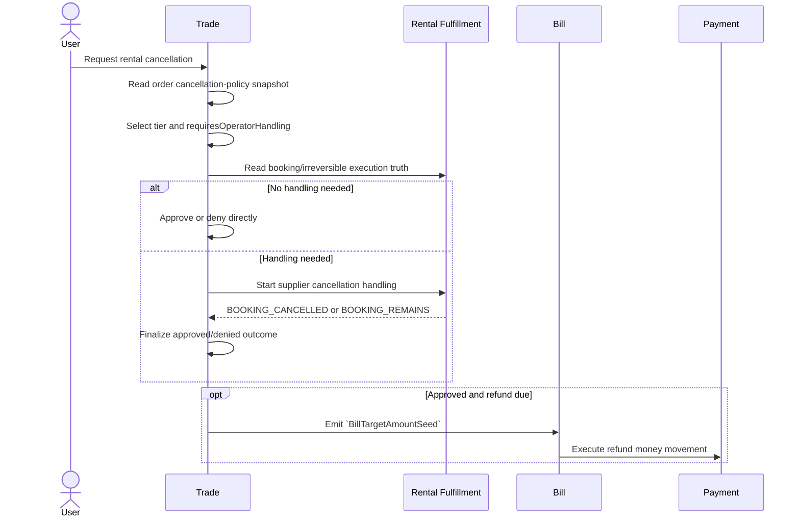
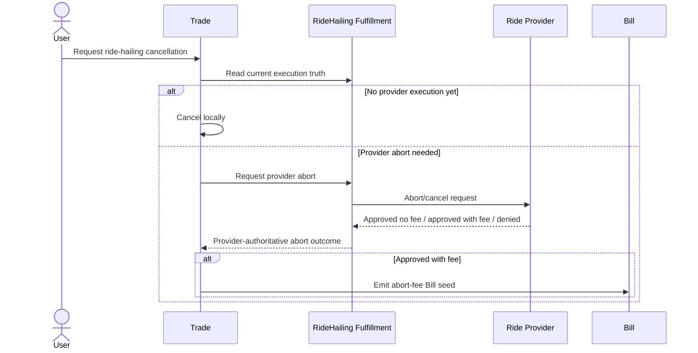

# Order Cancellation Sequences

## Purpose

Clarify cancellation topology across Trade, Fulfillment, Bill, and Payment.

The previous generic model was too eager to unify `Rental` and
`RideHailing`. That is the wrong starting point.

The correct first principle is:

- there is no single cross-family cancellation regime
- cancellation must be classified per order family first
- each family has its own authoritative truth source for "can cancel",
  "how much to charge/refund", and "whether execution-side handling is needed"

## Core Correction

Do not ask one generic question such as:

- "is this order cancellable"
- "does cancellation require manual handling"
- "what is the cancellation fee/refund"

Those questions decompose differently by family.

An even better framing is:

- cancellation is contract termination
- the real complexity is side-effect management
- side effects must be layered by owner rather than collapsed into one cancel
  state machine

Recommended side-effect layers:

1. contract layer
   - owned by Trade / Order
   - "is the termination request admitted, pending, approved, denied"
2. execution layer
   - owned by Fulfillment
   - "can the real-world service still be cleanly terminated"
3. financial-obligation layer
   - owned by Bill
   - "what charge/refund consequence now exists"
4. money-movement layer
   - owned by Payment
   - "has the resulting charge/refund actually moved money"

This is the cleanest way to encapsulate cancellation complexity while still
keeping the real authority boundaries visible.

Another useful reading is:

- forward direction = perform the contract
- reverse direction = try to unwind the contract

This gives a better mental model than a flat "cancel workflow":

- Bill charge lines belong to forward-direction performance
- Bill refund lines or abort-fee lines belong to reverse-direction
  consequences
- Fulfillment is the judge of service-side progress and reversibility
- Trade is the place where the contract is finally kept alive or terminated

So the true generic shape is not "everyone implements cancel".
It is:

1. termination request enters Trade
2. service-side reversibility is resolved by Fulfillment/provider/supplier truth
3. financial consequence is materialized in Bill
4. Payment moves money if needed

### Rental

Rental cancellation is primarily policy-driven, then execution-gated.

Authoritative sources:

- Trade / Order snapshot:
  - selected SKU cancellation-policy snapshot
  - selected tier
  - refund percent
  - `requiresOperatorHandling`
- Fulfillment:
  - whether booking is still pending or already confirmed
  - whether cancellation handling against 6C has completed
  - whether execution already crossed an irreversible boundary
- Bill:
  - only after Trade has already produced an approved refund consequence

So for `Rental`, "whether manual handling is required" comes from the
frozen order cancellation-policy snapshot, not from current catalog truth.

More precisely:

- `requiresOperatorHandling` is tier truth from the order snapshot
- Trade still checks current execution truth to decide whether that handling
  path is relevant
- if the order was never paid or no live fulfillment execution exists yet,
  the request may bypass operator handling even if the SKU family usually uses
  operator handling

### RideHailing

Ride-hailing cancellation is provider-authoritative before actual trip usage,
and no longer a normal cancellation problem after trip usage starts.

Authoritative sources:

- Trade / Order:
  - the frozen ride pricing contract
  - the fact that the user requested to abort/cancel
- Fulfillment:
  - current normalized ride execution truth
  - provider trip reference
  - provider abort/cancel outcome
  - final settlement input after trip finish
- Provider:
  - whether abort is allowed
  - whether abort fee applies
  - how much abort fee applies
- Bill:
  - only after Trade has materialized a provider-authoritative charge/refund
    consequence

So for `RideHailing`, cancellability and cancellation fee must not be inferred
from local `ride_phase` alone.

`ride_phase` is still useful, but only as local path classification:

- no provider execution yet
- pre-trip provider abort path
- usage already started, therefore no longer normal cancellation

It is not the authority for fee/no-fee.

## Why `Order.status` Alone Is Still Not Enough

The current `Order.status` set remains intentionally narrow:

- `OPEN`
- `CANCEL_REQUESTED`
- `CANCELLED`
- `FAILED`
- `EXPIRED`
- `COMPLETED`

That is still the right coarse contract truth, but it does not carry the full
cancellation workflow by itself.

The key counterexamples are:

- Rental:
  - user requests cancellation
  - Trade accepts the request
  - 6C later says "booking remains"
- RideHailing:
  - user requests pre-trip abort
  - provider later returns "abort denied" or "abort approved with fee"

So the recommended shape remains:

- `Order.status` stays coarse
- `Order` keeps `termination_attempts[]` as child records
- Fulfillment returns a normalized termination decision to Order
- Order translates that decision into Bill-side equivalence

But the field set should be family-first rather than pretending Rental and
RideHailing share one identical decision source.

## Recommended Workflow Shape

Recommended direction:

```ts
type OrderTerminationAttempt = {
  attempt_id: string;
  requested_at: string;
  requested_by: string;
  status: "PENDING" | "APPROVED" | "DENIED";
  resolution_path?: "TRADE_LOCAL" | "RENTAL_FULFILLMENT" | "RIDE_HAILING_FULFILLMENT" | null;
  reason?: string | null;
  effect_kind?: "NONE" | "POLICY_REFUND" | "ABORT_FEE" | null;
  effect_amount_fen?: number | null;
  decided_at?: string | null;
};

type FulfillmentTerminationDecision =
  {
    outcome: "APPROVED" | "DENIED";
    reason?: string | null;
    fee_fen?: number | null;
  };

type BillTargetAmountSeed = {
  source_order_id: string;
  source_attempt_id: string;
  currency: "CNY";
  target_charge_total_fen: number;
};
```

This is still only a direction, not a final coding contract.

The important correction is the reduction:

- Order stores only attempt history and compact approved/denied deltas
- Fulfillment owns the service-side decision
- frozen policy snapshots stay on Order
- exact Bill lines stay on Bill
- for Rental, exact tier/refund-percent details do not belong on the attempt
  record, and do not need to be copied into Bill handoff either; Order uses
  them only to derive the final target total amount

## Rental Cancellation Situations

Rental needs at least these distinct situations.

### 1. Unpaid Or No Settled Customer Charge

When:

- no successful charge settlement exists
- no live prepaid execution should proceed

Then:

1. User requests cancellation.
2. Trade accepts immediately.
3. `Order.status -> CANCELLED`.
4. Bill is voided if it exists but has no successful customer-paid settlement.
5. No refund lines are created.

This branch is not about supplier handling at all.

### 2. Paid, Booking Pending, Tier Selected

When:

- customer already paid
- rental fulfillment exists
- booking is still unresolved

Then:

1. User requests cancellation.
2. Trade reads the order's frozen cancellation-policy snapshot.
3. Trade selects tier from the snapshot:
   - `selected_tier_code`
   - `refund_percent`
   - `requiresOperatorHandling`
4. Trade also reads fulfillment truth:
   - booking pending
   - irreversible boundary not reached
5. If `requiresOperatorHandling = true`, the request enters
   `RentalFulfillment.cancellation_handling`.
6. If `requiresOperatorHandling = false` and no execution-side gate remains,
   Trade may approve directly.

This is the direct answer to your first question:

- for `Rental`, "needs manual handling" comes from the frozen order
  cancellation-policy snapshot
- but only after Trade confirms there is still live execution to handle

### 3. Paid, Booking Confirmed, Before Irreversible Boundary

When:

- booking is already confirmed
- service has not crossed the irreversible boundary

Then:

1. User requests cancellation.
2. Trade selects the tier from the frozen order snapshot.
3. If the selected tier requires operator handling, Trade sets
   `Order.status -> CANCEL_REQUESTED` and asks Fulfillment to start supplier
   cancellation handling.
4. Fulfillment contacts 6C and returns one of:
   - `BOOKING_CANCELLED`
   - `BOOKING_REMAINS`
5. Trade finalizes:
   - `BOOKING_CANCELLED` -> request approved, `Order.status -> CANCELLED`
   - `BOOKING_REMAINS` -> request denied, order returns to non-terminal state
6. Only after approved cancellation does Bill create refund lines from the
   customer-paid basis.

### 4. After Irreversible Boundary

When:

- service already started, or another irreversible execution boundary was
  crossed

Then this is no longer a normal clean-cancellation path.

Trade should not pretend the request is just another tiered cancellation.

Recommended direction:

- either deny normal cancellation
- or route to a separately scoped after-sales/manual adjustment path

Issue 231 should not over-model this path as ordinary cancellation.

### 5. Booking Rejected / Unavailable

This is not user cancellation.

If 6C rejects the booking or the booking becomes unavailable, that is
fulfillment failure, not a customer cancellation branch.

The resulting refund/void consequence may still look similar financially, but
the semantic owner is different.

## Rental Sequence



## RideHailing Cancellation Situations

Ride-hailing needs a different classification.

### 1. Local Void Before Provider Execution Exists

When:

- order exists
- provider execution was not yet created or persisted

Then:

1. User requests cancellation.
2. Trade accepts locally.
3. `Order.status -> CANCELLED`.
4. No provider abort fee exists because the provider execution path never
   actually started.

This is the only truly local ride-hailing cancellation branch.

### 2. Pre-Trip Provider Abort

When:

- provider execution exists
- actual trip usage has not started yet

Then the system must ask the provider.

Sequence:

1. User requests cancellation.
2. Trade appends a pending termination attempt.
3. RideHailing Fulfillment decides whether to resolve locally or through the
   provider, then attempts abort if needed.
4. Provider returns one of:
   - `ABORT_APPROVED_NO_FEE`
   - `ABORT_APPROVED_WITH_FEE`
   - `ABORT_DENIED`
5. Trade finalizes:
   - `ABORT_APPROVED_NO_FEE` -> `Order.status -> CANCELLED`
   - `ABORT_APPROVED_WITH_FEE` -> `Order.status -> CANCELLED`, and emit an
     abort-fee Bill seed
   - `ABORT_DENIED` -> request denied, order remains non-terminal

Important:

- the provider decides both cancellability and fee
- local phase alone does not

### 3. Actual Trip Usage Already Started

Once actual trip usage starts, this is no longer a normal "cancel order"
problem.

From that point:

- the ride is already in usage-based settlement territory
- the system should move toward trip finish and final settlement
- any later financial adjustment belongs to after-sales / compensation, not to
  ordinary cancellation

So the local phase is only a topology boundary:

- it tells Trade not to use the normal cancellation regime anymore
- it still does not decide the financial consequence by itself

### 4. Trip Finished Unexpectedly

This is also not ordinary cancellation.

`TRIP_FINISHED_UNEXPECTED` should still flow through:

1. Fulfillment commits final settlement input
2. Trade runs final pricing on the frozen pricing contract
3. Bill is created from that final resolution
4. any goodwill refund / compensation is handled later as after-sales

## RideHailing Sequence



## Financial Consequence Rule

Bill still acts only after Trade has a valid financial consequence.

But "valid financial consequence" now differs by family:

- Rental:
  - a `BillTargetAmountSeed` derived by Order from:
    - the approved fulfillment-side termination decision
    - the frozen order cancellation policy snapshot
- RideHailing:
  - a `BillTargetAmountSeed` whose target total reflects
    provider-authoritative abort fee
  - or later, normal final trip settlement after ride finish

So Bill still does not decide:

- which rental tier applies
- whether ride abort is allowed
- whether ride abort fee should apply

Bill only materializes approved charge/refund consequences.

## Recommended Application-Service Split

- `CancelRentalOrderService` in Trade
  - append termination attempt
  - ask Rental Fulfillment for termination decision
  - translate approved decision plus frozen order snapshot into
    `BillTargetAmountSeed` when needed
- `HandleRentalCancellationService` in Fulfillment
  - decide and return normalized rental termination decision
- `CancelRideHailingBeforeTripService` in Trade
  - append termination attempt
  - ask RideHailing Fulfillment for termination decision
  - translate approved decision into `BillTargetAmountSeed`
- `FinalizeRideTripPricingService` in Trade
  - handle the non-cancellation path after actual trip usage begins
- `MaterializeBillConsequenceService` in Bill
  - create charge/refund lines only after Order/Trade has already produced a
    valid `BillTargetAmountSeed`

## Current Design Consequences

This corrected analysis implies:

1. Cancellation must be modeled family-first, not by one generic regime.
2. For `Rental`, `requiresOperatorHandling` comes from the frozen order
   cancellation-policy snapshot, then is gated by live fulfillment truth.
3. For `RideHailing`, cancellability and abort fee are provider-authoritative.
   Local execution state only chooses the path; it does not decide fee/no-fee.
4. `Order.status` should stay coarse, while `termination_attempts[]` carry
   approved/denied attempt history and Order remains the translator from
   fulfillment decision to bill adjustment.
