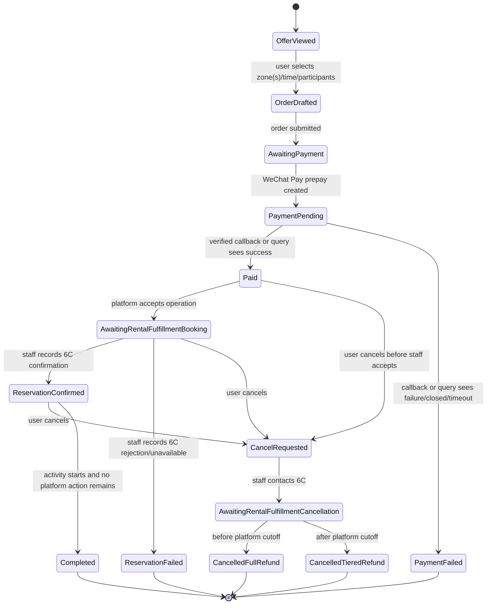

# 6C Time Slot Reservation Loop

## Business Facts Provided

Rental SPU/SKU and Placement creative facts:

- 3-hour reservation.
- Available Monday through Sunday, 10:00 to 22:30.
- Baking area and Chinese-cooking area are charged independently. Model this as
  selected charge zones, even if the MVP later restricts a single order to one
  zone.
- Activity room is an additional included benefit.
- Condiments are provided. Frying is not allowed unless users bring their own
  oil. Ingredients are user-provided.
- Food refrigeration is available for 3 days.
- Air conditioning is available.
- Other rules follow "食千代6C厨艺学堂活动场地细则".
- Reservation is not exclusive. Multiple groups may reserve the same time range
  in real operations, but this task does not implement inventory or capacity
  management.

Requirements:

- Real-name registration.
- Latest booking time is at least 1 day before activity.

Platform flow:

1. User creates or joins a "烹饪搭子" PR.
2. PR reaches READY participant-stable state, either manually or after
   join-lock.
3. User starts reservation order and pays.
4. Platform accepts the order, contacts 6C, and provides selected
   zone/time/participant count/contact/real-name info.
5. Users arrive at the reserved time and enter by phone or real-name info.
6. Overtime is paid onsite to 6C and does not pass through the platform.

Cancellation:

- A user cancellation creates a platform cancellation request; it does not
  automatically complete the reservation cancellation.
- Platform operators contact 6C before finalizing cancellation and refund.
- Before the full-refund cancellation cutoff, platform cancellation should end
  in full customer refund after 6C cancellation handling is recorded.
- After the full-refund cancellation cutoff, platform contacts 6C and refunds
  according to the SKU base cancellation policy snapshot.
- The user-visible cancellation cutoff is 1 hour earlier than the merchant
  cutoff, so operators have a manual handling buffer.

## Pricing Matrix

| Participants | Baking user price | Chinese-cooking user price |
| --- | --- | --- |
| 2 | 30/person | 25/person |
| 3 | 25/person | 20/person |
| 4 | 22/person | 18/person |
| 5 | 20/person | 16/person |

Pricing notes:

- If one order can include both baking and Chinese-cooking zones, pricing should
  be line-item based by zone. If product later decides one order can select only
  one zone, keep the pricing model capable of independent zone charges.
- Merchant quotes, merchant minimum prices, platform-to-merchant deposits, and
  supplier settlement are out of scope for this task.

Overtime:

- 3/person/hour.
- No overtime charge if the overrun is 20 minutes or less.
- Overtime is paid onsite directly to 6C and is outside platform billing.

## PR Context Matching

Initial matching proposal for showing the 6C placement:

- PR `type` equals or matches "烹饪搭子" or another configured food/cooking
  text.
- Placement may be visible before `READY` when the marketing, time, and
  participant-count rules match. Order creation before READY is disabled.
- Active participant count is at least 2.
- Active participant count is at most 5 for the first 6C pricing matrix.
- PR has a concrete start and end time.
- PR start time is at least 1 day away plus any platform booking buffer.
- Requested reservation can fit a 3-hour slot inside 10:00 to 22:30.
- No inventory/capacity check is performed in this task. A used time slot is not
  automatically unavailable.

Placement matching is backend-owned. The frontend should render the backend
projection and should not reimplement these rules.

## State Model Draft



## Sequence Diagram

```mermaid
sequenceDiagram
  actor U as User
  participant PR as PR Page
  participant PL as Placement
  participant OF as Offer Route
  participant RO as RentalOrder
  participant BI as Bill
  participant PY as Payment
  participant WX as WeChat Pay APIv3
  participant OP as Platform Operator
  participant S6 as 6C Supplier
  participant RF as Rental Fulfillment

  U->>PR: Open matching food/cooking PR
  PR->>PL: Read backend placement projection
  PL-->>PR: 6C reservation Button Placement inside Utility Actions
  U->>OF: Open /offers/:offerId
  OF-->>U: Render Rental Ordering component from Rental SKU
  U->>RO: Select zone(s), 3-hour slot, participant count, contact, real-name info
  RO->>PR: Attach order to PR in same transaction
  PR-->>RO: Accept only if PR is READY; otherwise reject and roll back
  RO->>BI: If accepted, create bill and bill shares
  BI->>PY: Request payment for payable shares
  PY->>WX: Create WeChat Pay APIv3 payment
  WX-->>U: Payment invocation payload
  U->>WX: Pay in WeChat
  par WeChat callback path
    WX-->>PY: Verified payment callback can mark PaymentTx paid
  and Browser polling path
    U->>PY: Browser polls payment/order state
    PY->>WX: Query payment order if local state is pending
  end
  PY-->>BI: PaymentTx settled payable shares
  BI-->>RO: Mark bill settled
  RO-->>RF: Create manual 6C booking task
  OP->>S6: Contact 6C with zone/time/count/contact/real-name info
  S6-->>OP: Reservation confirmed
  OP->>RF: Record reservation success and entry instructions
  RF-->>U: Order route displays phone/real-name entry guidance
```

## Black-Box System Scenario

File:

- `tests/scenario/time-slot-reservation/6c-time-slot-resource-reservation.scenario.test.ts`

Scenario:

- `time_slot_resource_reservation_loop`

Browser-only assertions:

- Matching READY PR page shows 6C Button Placement inside Utility Actions.
- The same placement can be visible before READY, but create-order remains
  disabled.
- Offer route shows Rental SPU/SKU facts, resolved pricing, and resolved
  cancellation policy from SKU base terms.
- Order route requires selected zone, contact, and real-name fields.
- Order create action is disabled before READY and enabled only for the PR
  creator after READY.
- Backend supporting tests prove non-READY PR attachment rejection rolls back
  the order creation transaction.
- Payment page enters WeChat Pay pending state.
- Browser-visible payment state eventually reaches paid through either
  frontend polling or backend callback from a fake WeChat Pay adapter.
- Operator-facing browser route can record 6C confirmation or rejection.
- User-facing order route shows confirmed reservation and entry guidance.

No assertions should inspect API response bodies, database rows, repositories,
or backend probes.
