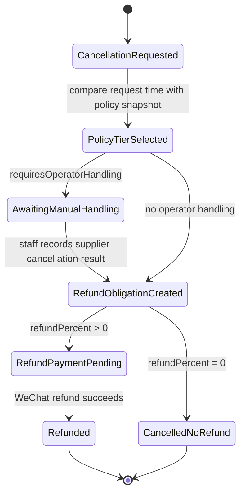

# SKU Cancellation Policy

## Purpose

Cancellation and refund behavior is SKU base policy only for issue 231. Offer
cancellation overlay is a future extension and should not be implemented in
this task.

The order must snapshot the SKU cancellation policy so later catalog, SKU, or
future Offer edits cannot rewrite a user's existing refund terms.

This model is needed for the 6C reservation loop now, and should also support
future rental-style SKUs without creating one-off cancellation logic.

This policy model is not the authority for RideHailing abort/cancel behavior.
RideHailing cancellability and abort fee are provider-authoritative in issue
231.

Restaurant group-buy coupon demand and its supporting features are out of scope
for this issue, including Voucher Entitlement, redemption, and GoodsOrder.

## Ownership

- Merchandising owns SKU base cancellation policies.
- Offer references SKU lines but does not override cancellation terms in issue
  231.
- Trade snapshots the SKU cancellation policy onto the order at order
  creation/freeze time.
- Bill computes customer refund obligations from the order's policy snapshot.
- Payment records refund money movement through WeChatPay APIv3 when a refund
  is executed.
- Rental Fulfillment records cancellation handling where manual supplier
  contact is required.

RideHailing provider-abort allowance and fee are intentionally outside this
policy model.

Supplier settlement, merchant deposit, merchant quote floors, and inventory are
out of scope for this policy.

## Policy Shape

```ts
type SkuCancellationPolicy = {
  policyId: string;
  policyVersion: number;
  skuId: number;
  basis: "CUSTOMER_PAID_AMOUNT";
  operatorBufferMinutes: number;
  tiers: CancellationTier[];
};

type CancellationPolicySnapshot = {
  source: {
    skuPolicyId: string;
    skuPolicyVersion: number;
    skuId: number;
  };
  basis: "CUSTOMER_PAID_AMOUNT";
  operatorBufferMinutes: number;
  tiers: CancellationTierSnapshot[];
};

type CancellationTier = {
  code: string;
  fromMinutesBeforeStart: number | null;
  untilMinutesBeforeStart: number | null;
  refundPercent: number;
  requiresOperatorHandling: boolean;
  visibleLabel: string;
};

type CancellationTierSnapshot = CancellationTier;
```

Selection rule:

- Use the order's service start time as the anchor.
- Compute `minutesBeforeStart = serviceStartAt - cancellationRequestedAt`.
- Pick the first tier whose `[from, until)` window contains that value.
- Store the chosen tier code and refund percent on the cancellation/refund
  record.
- If `requiresOperatorHandling` is true, the user cancellation request enters an
  operator-handling state before the refund is finalized.

## Future Extension

If a later issue needs Offer-level cancellation adjustment, add an explicit
Offer cancellation overlay and resolve SKU base policy plus Offer overlay before
order snapshot. That overlay is intentionally out of scope now.

## 6C Default Policy

Assumption for the first 6C Rental SKU:

- Merchant full-refund cutoff: 24 hours before activity start.
- Platform user-visible full-refund cutoff: 25 hours before activity start,
  because the platform needs 1 hour of manual operator buffer.

Default tier proposal:

| Tier | Time window | Customer refund | Operator handling |
| --- | --- | --- | --- |
| `FULL_BEFORE_PLATFORM_CUTOFF` | `>= 25h` before start | 100% | Yes |
| `HALF_AFTER_FULL_REFUND_CUTOFF` | `< 25h` and `>= 6h` before start | 50% | Yes |
| `NO_REFUND_NEAR_START` | `< 6h` before start or after start | 0% | Yes |

This is a default SKU base policy, not hard-coded RentalOrder behavior. A later
SKU can use different windows and percentages.

## State Implication



## Test Implications

- Merchandising unit tests should prove SKU policy validation and snapshot
  stability.
- Trade tests should prove orders preserve the policy snapshot.
- Bill tests should prove refund obligation calculation for 100%, partial, and
  0% tiers.
- Payment tests should prove WeChat refund transactions are idempotent.
- The 6C system scenario should assert the visible branch through browser state,
  not by reading the policy or database directly.
