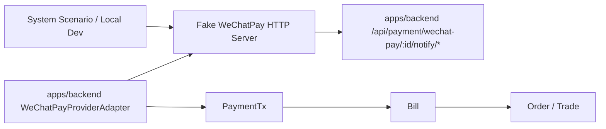

# Fake WeChatPay HTTP Server Subtask

## Objective & Hypothesis

Build a minimal HTTP-boundary fake WeChatPay APIv3 server for CI and local
development, and remove the in-backend `FakeWeChatPayProviderAdapter`.

Hypothesis: Payment system scenarios should exercise the real
`WeChatPayProviderAdapter` through HTTP, APIv3-style signing, platform
certificate handling, encrypted notifications, and provider callback routes.
The fake should replace only the external WeChatPay gateway, not Bill, Order,
PaymentTx, settlement consequence, or backend provider adapter code.

## Input Classification

- Type: Constraint.
- Active mode: Execute.
- Source: user confirmed `packages/fake-wechatpay-server` and required deletion
  of `FakeWeChatPayProviderAdapter` after the HTTP fake is implemented.
- Implementation status: implemented and verified.

## Placement

Package:

```text
packages/fake-wechatpay-server/
```

This package is intentionally outside `apps/backend`:

- it must not enter backend runtime/domain code
- it must be reusable from system scenarios
- it must have a local-development CLI
- it can be tested independently as a workspace package
- it should remain replaceable by real WeChatPay without changing Payment
  domain abstractions

Implemented package layout:

```text
packages/fake-wechatpay-server/
  package.json
  src/
    index.ts
    server.ts
    routes.ts
    crypto.ts
    state.ts
    fixtures.ts
  bin/
    fake-wechatpay-server.ts
```

## Boundary

The fake server owns only the provider HTTP boundary:



Non-negotiable boundaries:

- Do not import or call backend repositories, services, entities, or DB code.
- Do not know Order, Bill, BillLine, PaymentTx, Fulfillment, or user identity.
- Do not bypass the backend `WeChatPayProviderAdapter`.
- Do not add fake-specific branches to normal Payment domain behavior except
  provider instance endpoint configuration and environment guardrails.
- Do not expose the fake control API outside localhost in local/CI use.

## Backend Integration Contract

The real WeChatPay adapter has a provider-instance config field:

```ts
endpointBaseUrl?: string;
```

Rules:

- absent in production config by default
- when absent, SDK uses the real WeChatPay API base URL
- when present, SDK points to the fake server or a controlled test endpoint
- non-test/non-development environments must reject non-WeChatPay official hosts
  to prevent production traffic from using the fake endpoint

Completed integration changes:

- removed `FakeWeChatPayProviderAdapter`
- removed `adapterMode: "FAKE_WECHAT_PAY"` from provider config
- scenarios register `WECHAT_PAY_API_V3` providers pointing at the fake HTTP
  server through `endpointBaseUrl`
- removed the frontend fake-provider action; browser scenarios now simulate the
  WeChat JSAPI bridge and drive the fake HTTP provider boundary

## Fake API Surface

Minimum WeChatPay APIv3-compatible endpoints:

```text
GET  /v3/certificates
POST /v3/pay/transactions/jsapi
POST /v3/pay/transactions/h5
GET  /v3/pay/transactions/out-trade-no/:outTradeNo
POST /v3/refund/domestic/refunds
GET  /v3/refund/domestic/refunds/:outRefundNo
```

Local/CI control endpoints:

```text
POST /__fake_wechatpay/transactions/:outTradeNo/succeed
POST /__fake_wechatpay/transactions/:outTradeNo/fail
POST /__fake_wechatpay/prepays/:prepayId/succeed
POST /__fake_wechatpay/refunds/:outRefundNo/succeed
POST /__fake_wechatpay/refunds/:outRefundNo/fail
GET  /__fake_wechatpay/state
POST /__fake_wechatpay/reset
```

Control endpoints are not WeChatPay API compatibility endpoints. They exist
only to drive deterministic tests and local demos.

## Crypto Requirements

The fake should simulate the security envelope enough to test our adapter:

- publish fake WeChatPay platform certificates through `/v3/certificates`
- sign HTTP responses with the fake platform private key
- support APIv3 notification resource encryption with the configured fake
  APIv3 key
- send charge/refund notifications to backend notify URLs
- generate fake merchant/platform key fixtures at server startup
- never use real merchant credentials or real WeChatPay endpoints

The fake does not need to implement WeChatPay's full risk, reconciliation, or
merchant settlement behavior.

## Scenario Integration

System scenario global setup should start the fake server:

```text
tests/scenario/_infra/vitest/global-setup.ts
  -> startFakeWeChatPayServer()
  -> expose origin in provided scenario environment
  -> close server in teardown
```

Rental scenario setup should register a real-shaped provider instance:

```ts
{
  providerType: "WECHAT_PAY",
  instanceKey: "system-fake-wechatpay-web",
  clientId: "web",
  config: {
    adapterMode: "WECHAT_PAY_API_V3",
    appId: fake.appId,
    mchId: fake.mchId,
    chargeMode: "JSAPI",
    endpointBaseUrl: fake.origin,
    apiV3Key: fake.apiV3Key,
    merchantCertificate: fake.merchantCertificate,
    platformCertificates: null
  }
}
```

This forces backend runtime to download fake platform certificates through the
real certificate path and then use the real adapter for prepay, query, refund,
and notification parsing.

Current implementation note: the fake certificate download endpoint encrypts a
fake platform public key PEM rather than a full X.509 certificate. This matches
the current SDK integration path, which accepts the PEM material for signature
verification, and keeps the fake package smaller without weakening the tested
Payment-domain boundary.

## Local Development

Add a CLI entry point:

```bash
pnpm --filter @partner-up-dev/fake-wechatpay-server dev
```

Expected behavior:

- binds to `127.0.0.1`
- chooses configured port or an available port
- prints origin and fake config JSON snippet
- supports reset/state inspection for manual checkout debugging

This is useful for local backend/frontend testing without real WeChatPay access.

## Implementation Slices

1. Done: create `packages/fake-wechatpay-server` with exported server lifecycle API
   and CLI.
2. Done: implement in-memory transaction/refund state and fake fixtures.
3. Done: implement APIv3-like response signing and encrypted certificate download.
4. Done: implement prepay/query/refund endpoints.
5. Done: implement notification sender for charge/refund state transitions.
6. Done: add backend `endpointBaseUrl` support and production guardrail.
7. Done: wire system scenario global setup to start/stop the fake server.
8. Done: convert Rental payment scenarios from `FAKE_WECHAT_PAY` adapter to real
   `WECHAT_PAY_API_V3` adapter pointed at the fake server.
9. Done: remove `FakeWeChatPayProviderAdapter` and `FAKE_WECHAT_PAY` config mode.
10. Done: update task packet and Phase 4 plan with the final topology.

## Verification

Verification completed on 2026-05-30:

- `pnpm --filter @partner-up-dev/fake-wechatpay-server test`
- `pnpm --filter @partner-up-dev/fake-wechatpay-server typecheck`
- `pnpm --filter @partner-up-dev/backend typecheck`
- `pnpm --filter @partner-up-dev/frontend exec vue-tsc --noEmit`
- `pnpm --filter @partner-up-dev/backend db:lint`
- `pnpm test:unit:backend`
- `pnpm test:unit:frontend`
- `pnpm lint`
- `pnpm lint:payment-supply-chain`
- `pnpm exec vitest run --project system-scenario tests/scenario/commerce/rental-ordering.scenario.test.ts`
- `git diff --check`

Verification note:

- An initial parallel `backend-unit` run timed out in three existing dynamic
  import tests while frontend tests and lint were also running. A standalone
  rerun of `pnpm test:unit:backend` passed completely.
- `git diff --check` passed after the final packet update.

Remaining optional follow-up:

- narrower adapter contract test using real `WeChatPayProviderAdapter` against
  fake HTTP server outside the browser scenario

## Deferred

- Full WeChatPay API compatibility.
- Provider dispute, close-order, and reconciliation download APIs.
- Network chaos simulation.
- Multi-merchant concurrent state beyond what the Phase 4 scenarios need.
- Public Docker image for the fake server.
