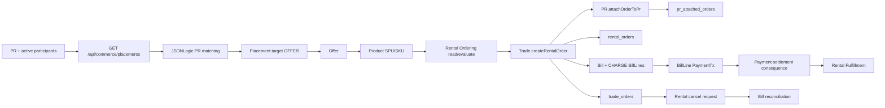

# Module Topology

## Current Implemented Topology

Current shortcuts:

- pricing path is effectively `SKU FIXED_TOTAL -> preview/snapshot`;
- locked PR fields are hard-coded in Rental Ordering;
- cancellation can finalize without Fulfillment decision;
- settlement can start Fulfillment without checking terminal Order status.

## Target P1 Topology

```mermaid
flowchart LR
  PR["PR + active participants"] --> PlacementRead["Placement read/access gate"]
  PlacementRead --> Rule["JSONLogic matching"]
  Rule --> Placement["PlacementInstance"]
  Placement --> Binding["Placement bindingRules"]
  Placement --> Offer["Offer"]
  Offer --> Product["Product SPU/SKU"]

  Product --> Pricing["Trade pricing pipeline"]
  Offer --> Pricing
  Binding --> Ordering["Ordering read/evaluate"]
  Pricing --> Ordering

  Ordering --> CreateOrder["Trade.createRentalOrder"]
  CreateOrder --> TradeOrder["trade_orders"]
  CreateOrder --> RentalOrder["rental_orders"]
  CreateOrder --> PrAttach["PR.attachOrderToPr"]
  CreateOrder --> Bill["Bill + CHARGE BillLines"]

  Bill --> Payment["BillLine PaymentTx"]
  Payment --> PaidBasis["Successful charge basis"]
  PaidBasis --> Settlement["Payment settlement consequence"]
  Settlement --> Eligibility{"Order OPEN?"}
  Eligibility -->|yes| Fulfillment["Rental Fulfillment"]
  Eligibility -->|no| Noop["No forward fulfillment"]

  TradeOrder --> Termination["Termination attempt"]
  Termination --> NeedFulfillment{"Fulfillment gate required?"}
  NeedFulfillment -->|no| LocalDecision["Trade-local approval"]
  NeedFulfillment -->|yes| FulfillmentDecision["FulfillmentTerminationDecision"]
  LocalDecision --> TargetAmount["BillTargetAmountSeed"]
  FulfillmentDecision --> TargetAmount
  TargetAmount --> PaidBasis
  PaidBasis --> Reconcile["Bill reconciliation bounded by paid basis"]
```

## Repair Ordering Recommendation

1. Fix payment-after-cancel settlement guard first. It has the smallest surface
   and blocks an invalid side effect.
2. Fix unpaid cancellation refund basis next. It corrects financial semantics.
3. Implement fulfillment-gated Rental cancellation. It depends on cancellation
   and Bill semantics being clear.
4. Implement Trade pricing pipeline. It touches Product, Offer, Ordering, and
   Order snapshots.
5. Implement Placement binding rules. It touches schema, admin, and ordering
   resolution; it can be done before pricing if the next target is
   RideHailing.
