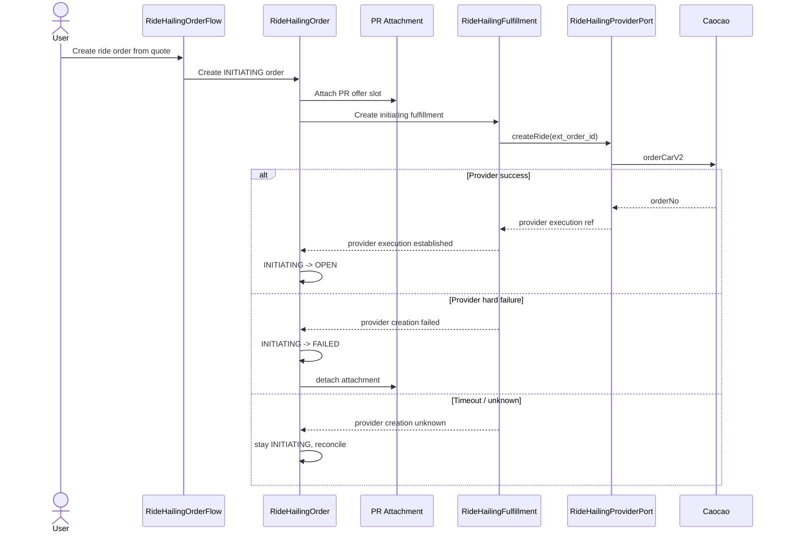

# Ordering And Order Topology

Date: 2026-05-31

## Purpose

Clarify the local topology from RideHailing Ordering input to RideHailingOrder
creation, provider call, and PR attachment behavior.

## Baseline

Parent issue 231 route/contract direction:

- Placement is backend-authored and may target Ordering or an existing Order.
- Ordering is a pre-order assembly/evaluation contract, not persisted.
- Order creation belongs to Trade/Order, not Ordering.
- RideHailingOrder is created from a quote snapshot.
- Ride Hailing is postpaid; no Bill is created at order creation.

## Confirmed Decisions

- Add generic `OrderStatus.INITIATING`.
- Use base order + family typed order topology.
- Do not add RideHailing-specific facts directly to base `TradeOrder`.
- Migrate current Rental-specific fields into typed `rental_orders` first.
- `OPEN` begins only after the provider execution boundary is established.
- Specialized RideHailingOrder creation creates the initiating
  RideHailingFulfillment.
- This is not base Order behavior.
- PR attachment may exist while the order is `INITIATING` to prevent duplicate
  ordering for the same `(pr_id, offer_id)`.
- If provider creation hard-fails before provider order exists, mark the order
  `FAILED` and detach the PR attachment so the user can retry.

## Order Persistence Shape

Base `trade_orders` should contain only cross-family contract state:

- id, family, createdBy, status;
- participants;
- split rule;
- offer and item snapshots;
- pricing snapshot;
- timeout;
- termination attempts.

RideHailing-specific state belongs in a typed child order record, for example
`ride_hailing_orders`, keyed by the base order id:

- route snapshot;
- departure time;
- rider/contact facts;
- selected vehicle SKU;
- quote snapshot;
- order-facing ride execution state;
- final settlement input;
- final pricing resolution reference.

Current Rental-specific fields on `trade_orders` are existing shape debt. They
must be migrated into typed `rental_orders` before adding RideHailing
persistence. This prevents the RideHailing implementation from accepting the
current widened base order as precedent.

## Provider-Call Topology

Design pressure:

- Local order creation and Caocao `orderCarV2` cannot be perfectly atomic
  because the provider call is an external side effect.
- The system must not leave a user-visible `OPEN` ride order when Caocao order
  creation failed.
- The solution should be explicit topology, not hidden ride-specific
  exception handling inside a generic create-order path.

## Failure Paths

Provider hard failure before provider order exists:

- fulfillment provider dispatch state -> `FAILED`;
- order -> `FAILED`;
- PR attachment detached;
- no Bill is created.

Provider timeout or ambiguous result:

- fulfillment provider dispatch state -> `UNKNOWN`;
- order remains non-open `INITIATING` for reconciliation;
- recovery queries provider or waits for callback by provider-specific external
  id;
- only after bounded failure should the order fail and detach.

Provider success followed by local write failure:

- callback/reconciliation can recover through the adapter-owned external id or
  provider order no;
- the fulfillment dispatch state is the durable bridge back to local order
  progression.

## Explicit Non-Choice

Do not introduce separate provider-order-attempt or provider-event-inbox tables
in the first cut if their largest value is audit. Add them only if idempotent
recovery, dispute handling, or provider replay proves they need independent
durability.
