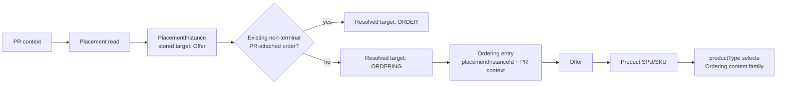
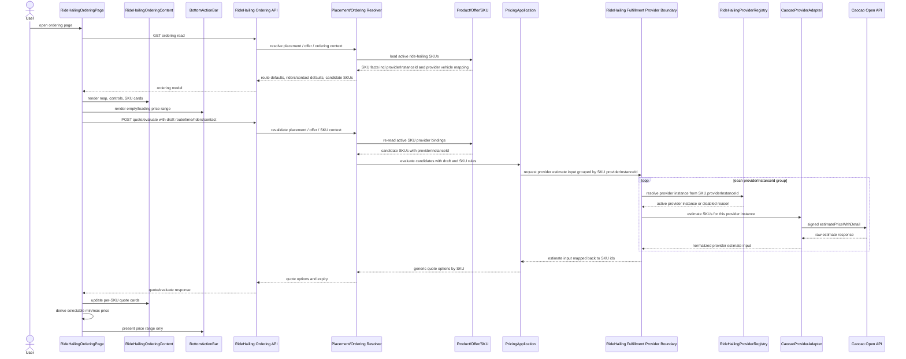
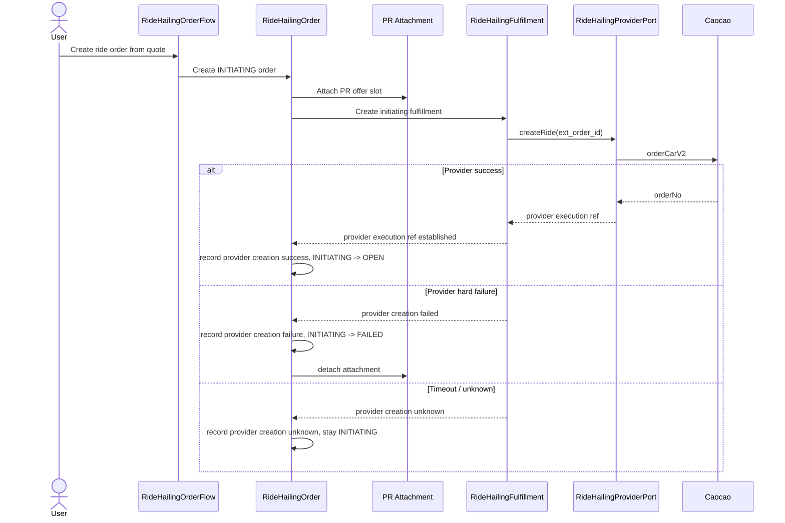

# Ordering And Order Topology

Date: 2026-05-31

## Purpose

Clarify the local topology from RideHailing Ordering input to RideHailingOrder
creation, provider call, and PR attachment behavior.

## Baseline

Parent issue 231 route/contract direction:

- Placement is backend-authored and stores an Offer target. At read time that
  stored target is resolved into a navigation target: Ordering when no current
  PR-attached non-terminal order exists, or Order when one exists.
- Placement does not know the concrete product or ordering family.
- The concrete Ordering family is derived after traversing
  `Placement -> Offer -> Product/SPU`, using the Offer/SPU `productType`.
- Ordering is a pre-order assembly/evaluation contract, not persisted.
- Order creation belongs to Trade/Order, not Ordering.
- Product/PricingApplication evaluates the selected RideHailing option from
  Product/SKU rules plus live provider estimate input.
- Base TradeOrder freezes only the generic item/pricing contract snapshot
  produced by PricingApplication.
- RideHailingOrder is created alongside the base order for ride-specific
  operational facts.
- Ride Hailing is postpaid; no Bill is created at order creation.

## Confirmed Decisions

- Add generic `OrderStatus.INITIATING`.
- Use base order + family typed order topology.
- Do not add RideHailing-specific facts directly to base `TradeOrder`.
- Migrate current Rental-specific fields into typed `rental_orders` first.
- `OPEN` begins only after the provider execution boundary is established.
- Specialized RideHailingOrder creation creates the initiating
  RideHailingFulfillment.
- This is not base Order behavior.
- PR attachment may exist while the order is `INITIATING` to prevent duplicate
  ordering for the same `(pr_id, offer_id)`.
- If provider creation hard-fails before provider order exists, mark the order
  `FAILED` and detach the PR attachment so the user can retry.

## Placement / Offer / Ordering Topology Correction

Do not model "RideHailing placement routes to RideHailing Ordering" as if
Placement knew the 상품 family.

Correct topology:



Implication for Slice 4:

- Placement target resolution should remain generic: stored Offer target ->
  resolved `ORDERING | ORDER` navigation target.
- RideHailing work should remove the current Rental-only assumption in
  placement target resolution, not add RideHailing-specific Placement routing.
- RideHailing Ordering read/evaluate starts after the generic Ordering entry
  resolves the Offer and sees `productType = RIDE_HAILING`.
- Existing-order resolution remains keyed by `(pr_id, offer_id)`, independent
  of product family.

## Order Persistence Shape

Base `trade_orders` should contain only cross-family contract state:

- id, family, createdBy, status;
- participants;
- split rule;
- offer and item snapshots;
- pricing snapshot;
- timeout;
- termination attempts.

RideHailing-specific state belongs in a typed child order record, for example
`ride_hailing_orders`, keyed by the base order id:

- route snapshot;
- departure time;
- rider/contact facts;
- provider creation status for the local order creation boundary.

Future order-facing execution, cancellation, final settlement, and final
pricing facts may be added to the typed RideHailing order only when the slice
that writes those facts is implemented and verified. They should not be
pre-created in the foundation schema.

Selected SKU/item and pricing contract snapshots stay on the base order as
generic commercial contract truth. `ride_hailing_orders` may read those base
snapshots to construct provider calls, but must not duplicate them as its own
SSoT.

## Quote / PricingApplication Topology

RideHailing provider estimates are an input to product/pricing evaluation, not
an order persistence owner.

RideHailing SKU facts should carry the provider binding. SKU facts do not own
the product type; the schema is selected by the surrounding SPU/Offer
`productType`. The current codebase still has a historical `facts.type`
discriminator, so Phase 5 must remove that duplication instead of extending it.
The first-cut RideHailing SKU facts shape is:

```ts
type RideHailingSkuFacts = {
  rideHailingProviderInstanceId: string;
  providerVehicleTypeCode: string;
};
```

Field intent:

- `rideHailingProviderInstanceId`: the concrete provider instance used for
  estimate and order creation.
- `providerVehicleTypeCode`: provider-specific vehicle code, such as Caocao
  `car_type`.

Vehicle display label:

- Ordering displays the vehicle option as `<providerName><carType>`.
- `providerName` comes from the provider instance display/config.
- `carType` comes from the provider vehicle type code mapping; for Caocao this
  is the `car_type` represented by `providerVehicleTypeCode`.
- Do not introduce a generic `vehicleClass` only for display.

Authority:

- Product/SKU defines the sellable ride-hailing options and commercial rules.
- PricingApplication owns quote interpretation and converts provider-backed
  estimate input into generic pricing application output.
- Each RideHailing SKU carries `rideHailingProviderInstanceId` and provider
  vehicle mapping facts. RideHailing Fulfillment/provider collaboration must use
  the provider instance declared by the SKU when obtaining live provider
  estimate input.
- RideHailingProviderRegistry validates and resolves the SKU-declared provider
  instance. It does not pick a default provider instance for pricing.
- Base TradeOrder freezes the generic item/pricing contract snapshots returned
  by PricingApplication.

Implementation implication:

- Existing `SkuFacts` currently duplicates product type inside `facts.type` and
  `catalog-contract` checks it against SPU `productType`. That should be
  refactored so `ProductSku.facts` is interpreted through its parent
  `ProductSpu.productType`; do not carry this duplication into RideHailing.

Non-goals:

- Do not persist raw Caocao estimate response as a RideHailingOrder fact.
- Do not make base TradeOrder understand Caocao estimate semantics.
- Do not make RideHailingFulfillment own commercial pricing truth.
- Do not silently re-route a SKU estimate to another provider instance when its
  declared provider instance is inactive or incompatible; return a disabled quote
  reason for that SKU.

## Ordering Quote Sequence



Current Rental-specific fields on `trade_orders` are existing shape debt. They
must be migrated into typed `rental_orders` before adding RideHailing
persistence. This prevents the RideHailing implementation from accepting the
current widened base order as precedent.

## Provider-Call Topology

Design pressure:

- Local order creation and Caocao `orderCarV2` cannot be perfectly atomic
  because the provider call is an external side effect.
- The system must not leave a user-visible `OPEN` ride order when Caocao order
  creation failed.
- The solution should be explicit topology, not hidden ride-specific
  exception handling inside a generic create-order path.



## Failure Paths

Provider hard failure before provider order exists:

- RideHailingOrder provider creation status -> `FAILED`;
- base order -> `FAILED`;
- PR attachment detached;
- no Bill is created.

Provider timeout or ambiguous result:

- RideHailingOrder provider creation status -> `UNKNOWN`;
- base order remains non-open `INITIATING` for reconciliation;
- recovery queries provider or waits for callback by provider-specific external
  id;
- only after bounded failure should the order fail and detach.

Provider success followed by local write failure:

- callback/reconciliation can recover through the adapter-owned external id or
  provider order no;
- RideHailingFulfillment must not be used as a durable dispatch-state bridge;
  recovered provider facts are applied back to RideHailingOrder as the
  authoritative owner.

## Explicit Non-Choice

Do not introduce separate provider-order-attempt or provider-event-inbox tables
in the first cut if their largest value is audit. Add them only if idempotent
recovery, dispute handling, or provider replay proves they need independent
durability.
