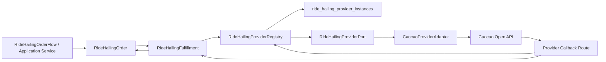

# Fulfillment Provider Topology

Date: 2026-05-31

## Purpose

Clarify RideHailingFulfillment's provider collaboration topology without
duplicating order-facing execution truth.

## SSoT Correction

RideHailingOrder owns order-facing execution projection.

RideHailingFulfillment should not persist long-lived duplicates of:

- driver assignment projection;
- user-facing ride execution projection;
- final pricing projection.

Those would create state drift if the Order Detail projection reads one source
while provider orchestration writes another.

## Fulfillment Responsibility

RideHailingFulfillment owns provider side-effect orchestration and durable
provider binding state:

- provider instance id;
- adapter/provider key;
- adapter-owned external order id;
- provider order no / execution ref;
- provider dispatch/binding state;
- cancellation side-effect result;
- fee-confirm side-effect result.

RideHailingOrder owns:

- quote snapshot;
- route/rider/contact order facts;
- order-facing ride phase or execution projection;
- final settlement input as order-facing execution fact once accepted from
  provider detail;
- final pricing resolution request to Bill.

## Provider Collaboration Topology

## Provider Roles

`ride_hailing_provider_instances`:

- stores active provider config, credentials, base URL, callback identity, and
  provider instance status.

`RideHailingProviderRegistry`:

- resolves the configured provider instance;
- constructs the concrete provider adapter;
- prevents generic Order code from knowing Caocao config shape.

`RideHailingProviderPort`:

- estimates;
- creates provider ride;
- queries provider detail;
- cancels or queries cancel fee;
- queries tracking;
- confirms fee;
- verifies/parses callback.

`CaocaoProviderAdapter`:

- owns Caocao signing;
- owns request/response shape;
- owns Caocao external id conversion;
- owns Caocao status/event mapping;
- owns callback verification.

`RideHailingFulfillment`:

- owns provider side-effect orchestration;
- records enough provider binding state to reconcile provider execution;
- does not become a second order-facing execution store.
