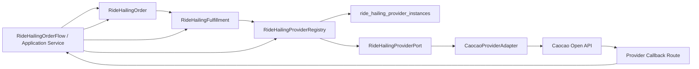

# Fulfillment Provider Topology

Date: 2026-05-31

## Purpose

Clarify RideHailingFulfillment's provider collaboration topology without
duplicating order-facing execution truth.

## SSoT Correction

RideHailingOrder owns order-facing execution projection.

RideHailingFulfillment should not persist long-lived duplicates of:

- driver assignment projection;
- user-facing ride execution projection;
- final pricing projection.
- dispatch state;
- cancellation side-effect result;
- fee-confirm side-effect result.

Those would create state drift if the Order Detail projection reads one source
while provider orchestration writes another.

## Fulfillment Responsibility

RideHailingFulfillment owns provider side-effect orchestration and durable
provider binding identity/reference:

- provider instance id;
- adapter/provider key;
- adapter-owned external order id;
- provider order no / execution ref when established.

RideHailingFulfillment does not own the result of provider side effects. It may
execute or help invoke the provider call, but the durable outcome is written to
RideHailingOrder.

RideHailingOrder owns:

- route/rider/contact order facts;
- order-facing ride phase or execution projection;
- dispatch state;
- provider creation failure/unknown/success outcome;
- cancellation side-effect result;
- fee-confirm side-effect result;
- final settlement input as order-facing execution fact once accepted from
  provider detail;
- final pricing resolution request to Bill.

Product/PricingApplication owns RideHailing quote interpretation, using
RideHailing Fulfillment/provider collaboration only to obtain live provider
estimate input. Base TradeOrder owns the resulting generic item/pricing
contract snapshots.

## Provider Collaboration Topology

## Provider Roles

`ride_hailing_provider_instances`:

- stores active provider config, credentials, base URL, callback identity, and
  provider instance status.

`RideHailingProviderRegistry`:

- resolves the provider instance declared by SKU facts, such as
  `rideHailingProviderInstanceId`;
- constructs the concrete provider adapter;
- prevents generic Order code from knowing Caocao config shape.

`RideHailingProviderPort`:

- estimates as provider input to Product/PricingApplication;
- creates provider ride;
- queries provider detail;
- cancels or queries cancel fee;
- queries tracking;
- confirms fee;
- verifies/parses callback.

`CaocaoProviderAdapter`:

- owns Caocao signing;
- owns request/response shape;
- owns Caocao external id conversion;
- owns Caocao status/event mapping;
- owns callback verification.

`RideHailingFulfillment`:

- owns provider side-effect orchestration;
- records only provider binding identity/reference needed to invoke, query, or
  reconcile provider execution;
- does not persist dispatch state, cancellation side-effect results,
  fee-confirm side-effect results, or any order-facing execution projection.
- for estimate/evaluate, uses the provider instance specified by the SKU; it
  must not select a default provider instance on its own.

`RideHailingOrder`:

- owns all durable order-facing execution and provider side-effect outcomes;
- is the SSoT read by Order Detail, cancellation, settlement, and billing
  workflows.
