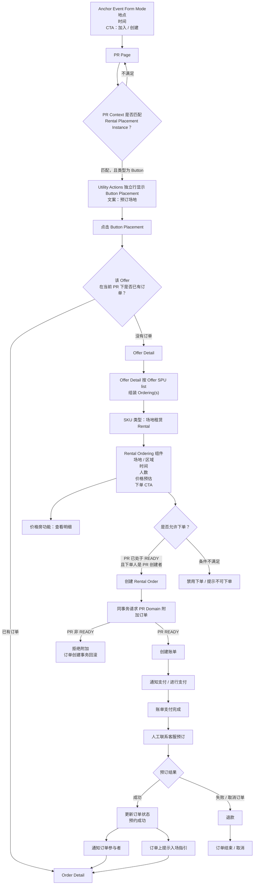

Scope note: this diagram is the reference rental flow for the current issue.
The Placement Instance in this slice has Button type and is rendered in the PR
Page Utility Actions Button Placement row.

