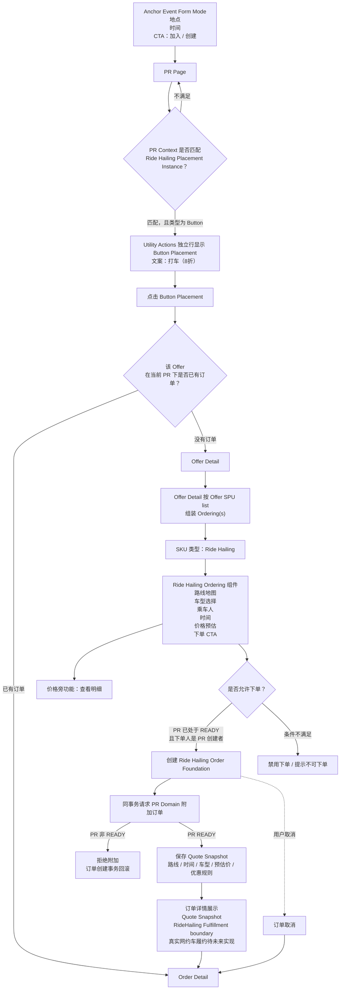

Scope note: this diagram captures the ride-hailing subset that is in scope for
the current issue. Real provider dispatch, driver monitoring, actual-cost
callback, final payment after trip, and provider settlement are future
RideHailing provider fulfillment work and are intentionally not part of this
diagram.

## Future RideHailing Provider Fulfillment Reference

The previous target flow included provider dispatch, waiting for driver
acceptance, driver/vehicle/location updates, passenger boarding, trip start/end,
actual route/mileage/time callback, discount application, final bill, payment,
and provider-side cancellations.

Those steps are useful product context, but they are out of scope for issue 231
unless a later issue explicitly pulls real ride-hailing fulfillment back in.
