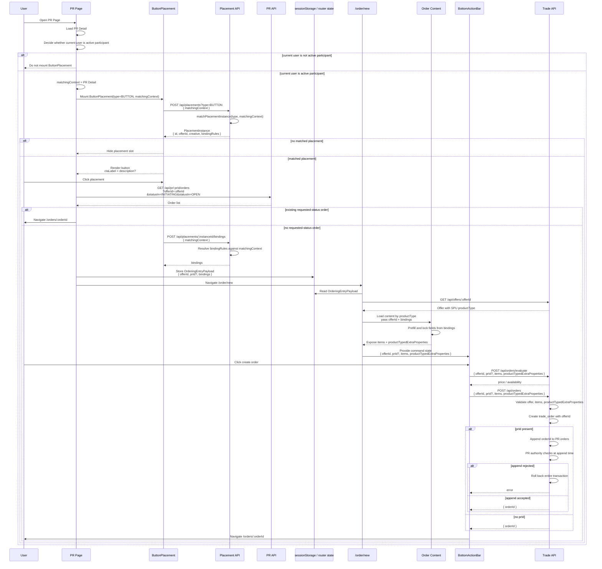

# Target Sequence

## Notes

- `statusIn` is an explicit order-status enum array. Do not introduce a
  `nonTerminal` alias.
- `ButtonPlacement` does not know `prId`.
- PR Page decides whether to mount `ButtonPlacement` by checking whether the
  current user is an active participant.
- PR Page supplies `matchingContext = PR Detail`; PartnerRoster is not included.
- Placement matching does not receive `userId`.
- `prId` is not passed to Order Content.
- Order Content exposes `items` and `productTypedExtraProperties`; it does not
  submit the command.
- The page-level BottomActionBar owns create-order submission.
