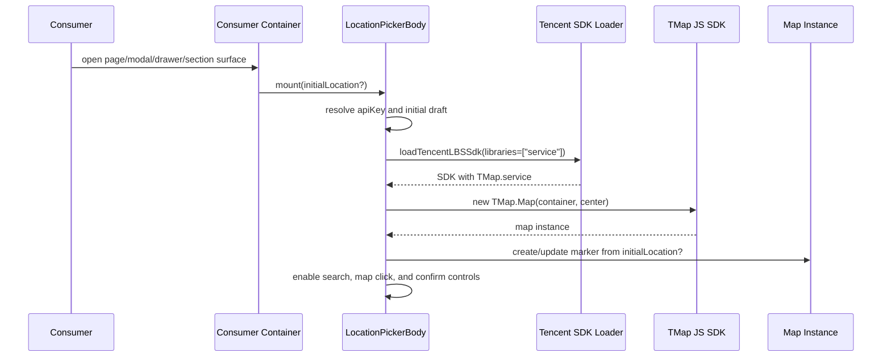
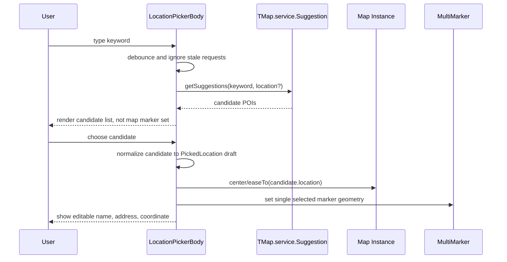
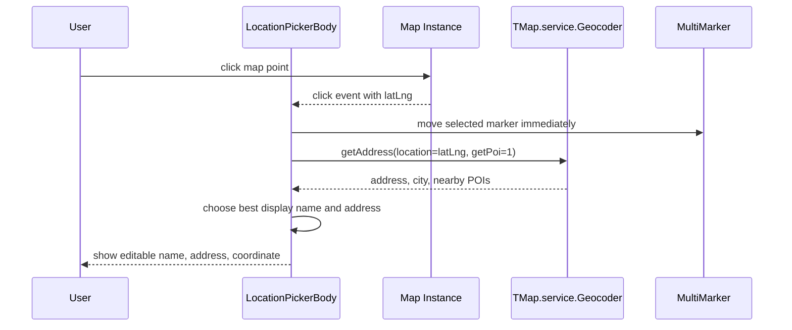
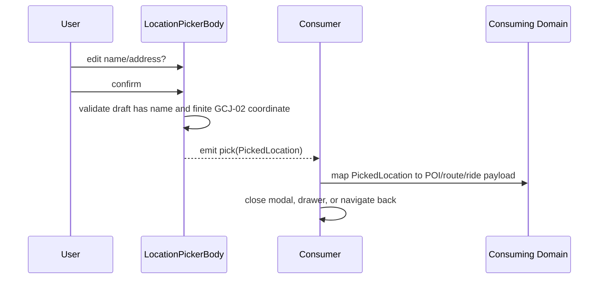

# Location Picker JS SDK Replacement

## Objective & Hypothesis

Replace the current Tencent official `locpicker` iframe integration with an
in-app location picker built on Tencent Map JavaScript GL SDK.

Hypothesis: keeping the existing `PickedLocation` component contract stable lets
POI editing, route editing, ride-hailing route picking, and the standalone
location picker page migrate without backend or consuming-domain payload
changes.

## Guardrails Touched

- Generic location picker ownership stays in `apps/frontend/src/domains/location`.
- Provider-specific Tencent SDK loading and low-level map interaction stay under
  `apps/frontend/src/shared/map/tencent`.
- Container and feature content must stay separated: location picking feature
  components expose content/behavior, while page, modal, drawer, or admin
  consumers assemble that content into their own container surface.
- Consumers continue to receive `PickedLocation` with GCJ-02 coordinates:
  `name`, `address`, `cityName`, and `gcj02`.
- Consuming domains remain responsible for mapping picked locations into POI,
  route point, or ride-hailing payload shapes.
- Do not change backend coordinate persistence or introduce WGS-84 / BD-09
  conversion in this slice.
- Tencent JS SDK must be loaded with the `service` library when using
  `TMap.service.Suggestion`, `Search`, or `Geocoder`.
- Existing map SDK loader behavior must not accidentally return a previously
  loaded SDK instance that lacks the required `service` library capability.

## Current Baseline

- `LocationPickerPanel.vue` embeds
  `https://apis.map.qq.com/tools/locpicker` in an iframe.
- The iframe result is received through `window.postMessage` and normalized by
  `mapTencentLocationPickerPayload`.
- `LocationPickerModal.vue`, `LocationPickerPage.vue`, `RouteEditor.vue`,
  Admin POI editing, and ride-hailing ordering already consume the generic
  `PickedLocation` contract.
- `shared/map` already contains a Tencent GL SDK loader/provider used by
  `RouteMap.vue`.

## Target Shape

- Replace the current all-in-one `LocationPickerPanel.vue` with a native Vue
  picker content component:
  search input, result list, map canvas, selected marker/current center,
  editable
  name/address fields, coordinate preview, cancel/confirm actions.
- Container wrappers remain thin:
  standalone page uses a page scaffold, modal usage uses `PuModal`, ride-hailing
  usage uses `PuDrawer`, and admin usage owns its section-local trigger and
  container.
- User search flows through `TMap.service.Suggestion` or `Search`.
- Map click or map-center confirmation flows through `TMap.service.Geocoder`
  reverse geocoding.
- Initial location should seed the map center and draft marker when available.
- Manual edits to name/address remain supported before confirmation.
- Search candidates should not be rendered as a dense marker set on mobile.
  Candidate comparison belongs in the result list; the map should show only the
  current selected point or center pin.

## Interaction Sequences

### Panel Initialization

### Keyword Search Pick

### Map Click Pick

### Confirm And Return

## Component Boundary

- `LocationPickerBody.vue` owns provider integration, search state, map
  interaction, draft validation, and emits `pick` / `cancel`.
- `LocationPickerModal.vue` may remain as a thin compatibility wrapper over
  `PuModal + LocationPickerBody`, but it must not own picker business logic.
- `LocationPickerPage.vue` owns page scaffold/header/back navigation and renders
  the content inside that route container.
- Ride-hailing ordering owns its `PuDrawer` and renders picker content inside
  the drawer.
- Admin POI section owns its trigger/control placement and renders picker
  content inside the selected admin surface.

### Failure And Stale-State Handling

- Missing key: show unavailable state and keep confirm disabled until a draft
  exists.
- SDK load failure: show load-failed state; do not emit partial location.
- Search request race: only the latest keyword response may update candidates.
- Reverse-geocode failure after map click: keep the coordinate draft and let the
  user manually fill name/address before confirm.
- Consumer close/cancel: destroy map instance, marker layer, and pending request
  state without emitting `pick`.
- Mobile density: do not use multiple search-result markers as the primary
  selection UI; keep POI ranking, names, and addresses in a scrollable list.

## Verification

- Unit tests for location picker normalization and Tencent service payload
  mapping.
- Unit tests for SDK loader/provider capability changes when `service` is
  requested.
- `pnpm check:type:frontend`.
- Focused frontend unit tests for changed location/map modules.
- Manual smoke path with local services when implementation starts:
  Admin POI coordinate picking, route editor point picking, ride-hailing
  origin/destination picking, and standalone `/location-picker`.

## Verification Log

- 2026-07-03: `pnpm check:type:frontend` passed.
- 2026-07-03: `pnpm check:lint:frontend` passed. Naming audit still reports
  the pre-existing `RideHailingOrderContent.vue` and
  `RideHailingOrderingContent.vue` weak-name findings.
- 2026-07-03: `pnpm exec vitest run --project frontend-unit
  apps/frontend/src/shared/map/tencent/tencent-location-picker-provider.test.ts
  apps/frontend/src/domains/location/model/location-picker.test.ts
  apps/frontend/src/shared/map/tencent/tencent-lbs-provider.test.ts` passed.
- 2026-07-03: targeted `pnpm exec biome check --write ...` formatted the
  touched frontend files.
- 2026-07-03: `pnpm dev:ensure` timed out waiting for frontend and backend
  portless routes; the spawned command exited and left no matching dev-server
  process.
- Browser smoke with a real Tencent LBS key has not been run in this slice.

## Promotion Candidates

- If verified, update local location UI rule from iframe-backed picker to
  JS-SDK-backed picker.
- If loader capability semantics become stable, document the Tencent SDK
  library-loading rule near `shared/map/tencent`.
