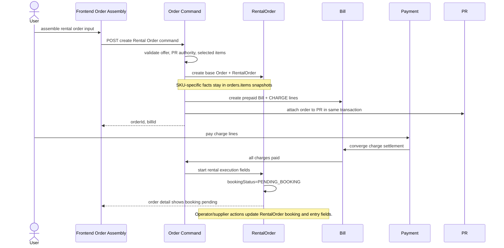
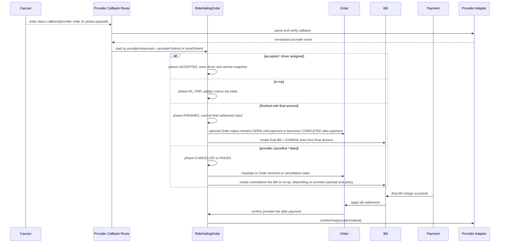
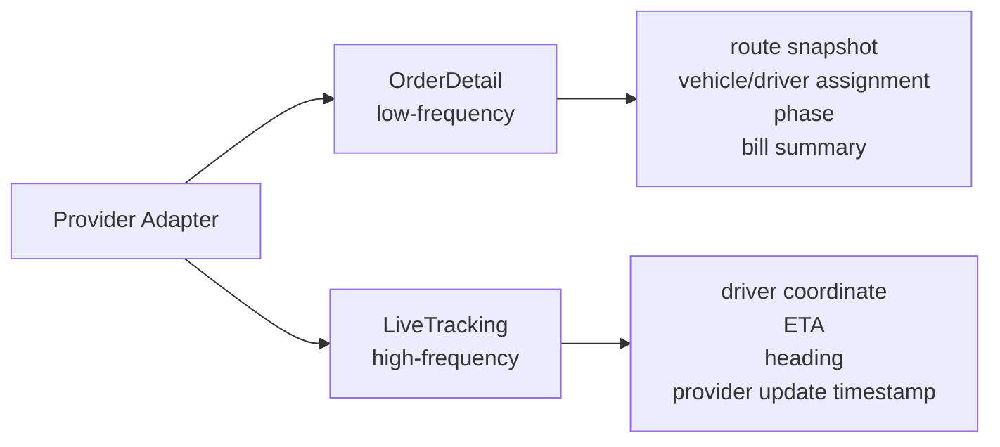

# Target Sequence Drafts

These diagrams are working hypotheses for discussion. They intentionally avoid
using backend "Ordering API" as a durable domain name.

## Rental, If Fulfillment Fields Merge Into RentalOrder



Target note:

- There is no separate `RentalFulfillment` row. Rental execution fields live on
  `RentalOrder`.
- No `lifecycleStatus` is written. Booking and cancellation handling states are
  the explicit family execution state.

## RideHailing, Provider Create Owned By RideHailing Execution

```mermaid
sequenceDiagram
  actor U as User
  participant FE as Frontend Order Assembly
  participant Order as Order Command
  participant RH as RideHailingOrder
  participant PR as PR
  participant Provider as Provider Adapter
  participant Caocao as Caocao

  U->>FE: assemble ride order input
  FE->>Order: POST create RideHailing Order command
  Order->>Order: validate offer, PR authority, selected item, quote basis
  Order->>RH: create base Order(INITIATING) + RideHailingOrder
  Order->>PR: attach order to PR in same transaction
  Order->>RH: request provider dispatch creation
  RH->>Provider: createRide(localOrderId, providerInstanceId, route)
  Note over Provider: Provider computes its external order id
  Provider->>Caocao: orderCarV2

  alt provider create accepted
    Caocao-->>Provider: providerOrderId
    Provider-->>RH: provider order reference
    RH->>RH: phase=DISPATCHING, providerOrderId set
    RH->>Order: Order INITIATING -> OPEN
    Order-->>FE: orderId
  else provider create hard failure
    Provider-->>RH: failure
    RH->>RH: phase=FAILED
    RH->>Order: Order INITIATING -> FAILED
    RH->>PR: release PR order attachment if retry should be allowed
    Order-->>FE: creation failed
  else provider create response is indeterminate
    Provider-->>RH: timeout / unknown
    RH->>Provider: cancel or prove no provider-side ride remains
    alt provider-side ride is gone or absent
      Provider-->>RH: safe to fail locally
      RH->>RH: phase=FAILED
      RH->>Order: Order INITIATING -> FAILED
      RH->>PR: release PR order attachment if retry should be allowed
      Order-->>FE: creation failed
    else provider-side state still cannot be proven safe
      Provider-->>RH: still indeterminate
      RH->>Order: keep Order INITIATING for internal recovery only
      Order-->>FE: creation not confirmed; do not expose as created order
    end
  end
```

Important target direction:

- The provider side effect is a RideHailing execution action.
- The backend endpoint can still be an HTTP Order command, but the application
  service should not be named or shaped as "RideHailing Ordering".
- There is no `providerCreationStatus`; `Order.status`, RideHailing phase, and
  provider order reference bound the creation outcome.
- There is no `CREATE_UNKNOWN` business phase. Indeterminate create responses
  must be recovered through provider-side cancellation or proof that no
  provider-side ride remains.
- `INITIATING` is only an internal protection state around the provider
  boundary, not a successful user-visible order state.

## RideHailing Provider Callback Included



Open point:

- Whether `Order.status` should become `COMPLETED` immediately when trip is
  finished, or only after final Bill is fully settled.
- Whether provider callback should be the only final Bill creation trigger, or
  order detail query may still reconcile missing provider state as a recovery
  path.

## Read Model Split


