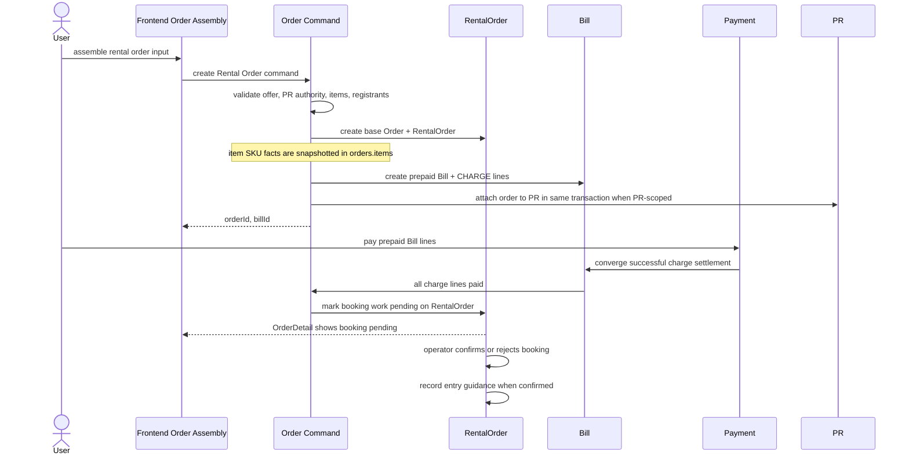

# Target Contract

This is the current target contract after the 2026-05-31 correction round. It
is still a design contract, not an implementation log.

## Boundary Contract

Ordering:

- Ordering is a frontend assembly concept.
- Backend should expose Order-owned commands and read/evaluation endpoints, not
  a durable backend "Ordering" domain.
- Placement may route the user to order assembly, but Order creation must not
  depend on Placement identity.

Order:

- Base Order owns cross-family commercial contract state.
- Base Order owns `items`; each item stores a SKU snapshot plus quantity.
- Base Order owns `participants`; participants are submitted in the create
  command as an Order property, not rebuilt from PR during creation.
- Product-specific facts, such as Rental zone facts, remain in
  `orders.items[*].skuFactsSnapshot` unless they are family execution state.

Bill:

- Bill owns payable and refundable lines.
- Bill does not own service execution state.
- Rental Bill is prepaid and exists before service execution begins.
- RideHailing final Bill is created after RideHailing commits final settlement
  input from provider execution.

Family typed orders:

- `RentalOrder` owns Rental execution state.
- `RideHailingOrder` owns RideHailing execution and provider binding state.
- Current `RentalFulfillment` and `RideHailingFulfillment` persistence roots are
  removed for this scope.

## Target Base Order Model

Keep:

- `id`
- `family`
- `offerId`
- `createdBy`
- `status`
- `participants`
- `splitRuleSnapshot`
- `items`
- `timeout`
- `terminationAttempts`
- `closedAt`
- timestamps

Important invariant:

- `orders.items` is the authority for item-level SKU facts in an order. Do not
  mirror SKU facts into family typed order columns only because one current
  product type needs them.
- Remove top-level `order.pricingSnapshot`. Pricing model snapshots live inside
  item SKU snapshots; payable amounts are materialized into Bill.
- SPU is listing / metadata and does not carry target PricingPolicy authority.
- `participants` is an Order command input. If a PR entry pre-fills it, that
  happens in Ordering Content through bindings; Order creation persists the
  command participants and relies on PR attach for PR-scoped admissibility.

Target item shape:

```ts
type OrderItemSnapshot = {
  itemId: string;
  sku: {
    id: number;
    version: number;
    name: string;
    factsSnapshot: SkuFacts;
    pricingModelSnapshot: PricingModel;
    cancellationPolicySnapshot?: CancellationPolicySnapshot | null;
  };
  quantity: number;
};
```

## Target RentalOrder Model

Keep or add:

- `orderId`
- `serviceStartAt`
- `serviceEndAt`
- `contactPhone`
- `registrants`
- `bookingStatus`: `PENDING_BOOKING | BOOKING_CONFIRMED | BOOKING_REJECTED`
- `cancellationHandlingStatus`: `NONE | REQUESTED | HANDLING | HANDLED`
- `supplierCancellationOutcome`: `BOOKING_CANCELLED | BOOKING_REMAINS | null`
- `entryGuidance`
- `bookingNote`
- `cancellationNote`
- `serviceEndedAt`
- timestamps

Remove:

- `selectedZoneCodes`
- `participantCount`
- merged `RentalFulfillment.lifecycleStatus`
- merged `RentalFulfillment.irreversibleBoundaryAt`

Rationale:

- Zone selection is not a core RentalOrder fact. It belongs to SKU facts
  snapshotted in `orders.items`.
- Participant count duplicates base Order participants and command-time
  validation.
- `lifecycleStatus` is a derived coarse classification and should not survive
  the merge as an independent stored state.
- `irreversibleBoundaryAt` belongs to cancellation policy authority, not the
  execution row.

## Target RideHailingOrder Model

Keep or add:

- `orderId`
- `routeSnapshot`
- `departureAt`
- `riders`
- `contactPhone`
- `providerInstanceId`
- `providerOrderId` if the provider returns a stable provider-side order id
- `executionPhase`
- driver assignment snapshot for OrderDetail
- vehicle assignment snapshot for OrderDetail
- final settlement input, such as final amount and provider settlement payload
  reference, once provider reports it
- timestamps

Remove:

- `providerCreationStatus`
- merged `RideHailingFulfillment.lifecycleStatus`
- `providerExecutionRef`
- `providerType`
- persisted `externalOrderId`

Rationale:

- `providerCreationStatus` duplicates base `Order.status`, provider order
  reference presence, and RideHailing execution phase.
- `providerExecutionRef` currently repeats `providerOrderId` and has no clear
  extra semantics.
- `providerType` is derivable from `providerInstanceId`.
- `externalOrderId` is provider-owned formatting of the local order reference.
  It should be computed by the provider adapter at provider-call time, not
  persisted as another identifier.

Candidate execution phase:

```ts
type RideHailingExecutionPhase =
  | "CREATING_PROVIDER_ORDER"
  | "DISPATCHING"
  | "ACCEPTED"
  | "IN_TRIP"
  | "FINISHED"
  | "CANCELLED"
  | "FAILED";
```

Open naming note:

- The exact enum names can still change. A single RideHailing execution phase
  replaces `providerCreationStatus` and old Fulfillment lifecycle status.
- There is no `CREATE_UNKNOWN` business phase. Indeterminate provider create
  responses are handled through provider-side cancellation / verification and
  should converge to failure when safe.
- `Order.status = INITIATING` may still be necessary as an internal protection
  state between local order materialization and external provider creation. It
  is not a successful created-order state and should not be presented to users
  as a usable ride.

## Rental Target Sequence



## RideHailing Target Sequence

```mermaid
sequenceDiagram
  actor U as User
  participant FE as Frontend Order Assembly
  participant Order as Order Command
  participant RH as RideHailingOrder
  participant PR as PR
  participant Provider as Provider Adapter
  participant Caocao as Caocao
  participant Bill as Bill

  U->>FE: assemble ride order input
  FE->>Order: create RideHailing Order command
  Order->>Order: validate offer, PR authority, selected item, quote basis
  Order->>RH: create base Order(INITIATING) + RideHailingOrder
  Order->>PR: attach order to PR in same transaction when PR-scoped
  Order->>RH: start provider order creation
  RH->>Provider: createRide(localOrderId, providerInstanceId, route)
  Note over Provider: Provider computes its external order id
  Provider->>Caocao: orderCarV2

  alt provider create accepted
    Caocao-->>Provider: providerOrderId
    Provider-->>RH: providerOrderId
    RH->>RH: phase=DISPATCHING
    RH->>Order: Order INITIATING -> OPEN
    Order-->>FE: orderId
  else provider create hard failure
    Provider-->>RH: failure
    RH->>RH: phase=FAILED
    RH->>Order: Order INITIATING -> FAILED
    RH->>PR: release PR attachment if retry is allowed
    Order-->>FE: creation failed
  else provider create response is indeterminate
    Provider-->>RH: unknown result
    RH->>Provider: cancel or verify provider-side ride
    alt no provider-side ride remains
      Provider-->>RH: cancellation or absence confirmed
      RH->>RH: phase=FAILED
      RH->>Order: Order INITIATING -> FAILED
      RH->>PR: release PR attachment if retry is allowed
      Order-->>FE: creation failed
    else provider-side state still cannot be proven safe
      Provider-->>RH: still indeterminate
      RH->>Order: keep Order INITIATING for internal recovery only
      Order-->>FE: creation not confirmed; do not expose as created order
    end
  end

  Caocao-->>RH: callback via provider callback route
  RH->>RH: update phase, driver, vehicle, and final settlement input
  alt final amount committed
    RH->>Bill: create final Bill + CHARGE lines
  end
```

## Provider Callback Contract

Provider callback should:

- parse and verify provider payload through the provider adapter
- resolve the local RideHailing order by local order id or provider order id
- update `RideHailingOrder.executionPhase`
- store OrderDetail-level driver / vehicle assignment snapshots when provided
- commit final settlement input when provider reports completion
- create final Bill when final settlement input is complete
- translate provider cancellation / failure into Order and Bill consequences

Provider callback should not:

- depend on backend Ordering concepts
- write a separate `RideHailingFulfillment`
- persist `externalOrderId`
- persist vague duplicated `providerExecutionRef`
- create or persist a `CREATE_UNKNOWN` phase

## Provider External Order ID Contract

Provider external order id is an outbound provider reference, not a
RideHailingOrder-owned persisted identifier.

- RideHailing execution passes the local order id and provider instance to the
  provider adapter.
- The provider adapter computes the provider-specific external order id.
- Caocao can use one external id format, while a future provider can use
  another.
- Local lookup should rely on stable local order id where available and on
  provider-returned references after create succeeds.

## Indeterminate Create Policy

Provider create can return an inconclusive result because external calls cross
process and network boundaries. The target contract does not allow this to
become a durable user-facing phase.

When provider create is indeterminate:

1. The system tries to cancel the provider-side ride or prove that no
   provider-side ride exists.
2. If provider-side cancellation or absence is confirmed, local creation fails
   and the local order transitions from `INITIATING` to `FAILED`.
3. If provider-side state still cannot be proven safe, local state may remain
   `INITIATING` only for internal recovery; frontend should not treat that as
   a successful order.

`INITIATING` remains useful only as an internal guard around the local
transaction plus external provider side effect. Removing it safely would
require another reservation mechanism, or delaying local order materialization
until provider creation is proven, which creates a different orphan-provider-
order risk if the later local write fails.

## RideHailing Read Contract

OrderDetail is low-frequency:

- base order status
- selected item / vehicle snapshot
- route snapshot
- rider and contact facts
- execution phase
- provider order reference if available
- driver and vehicle assignment snapshots
- final Bill summary when available

LiveTracking is high-frequency:

- driver coordinate
- heading / speed when available
- ETA / distance when available
- provider update timestamp

OrderDetail must not become a high-frequency tracking payload.
