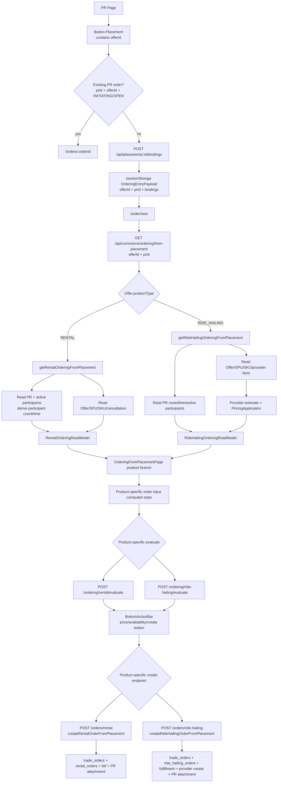

# Current Contract

## Scope

This file records the current implemented contract before the realignment. It is
descriptive, not normative.

## Entry Contract

Current frontend entry already uses transient state:

```ts
type OrderingEntryPayload = {
  offerId: number;
  prId?: number;
  bindings: Record<string, unknown>;
};
```

Current flow:

1. PR Page receives a Button Placement with `offerId`.
2. PR Page checks existing PR-attached orders by `prId + offerId + statusIn`.
3. If an `INITIATING` or `OPEN` order exists, it routes to `/orders/:orderId`.
4. Otherwise PR Page resolves Placement bindings.
5. PR Page writes `OrderingEntryPayload` to `sessionStorage`.
6. PR Page routes to `/order/new`.

Important current mismatch:

- `bindings` are stored in frontend entry state, but current backend Ordering
  read flows do not treat them as the source of participant, time, or route
  truth.

## Current Topology



Current topology summary:

- The page has a transient `bindings` entry, but the backend read topology
  mostly ignores it and re-enters PR.
- Product family is selected by the backend `from-placement` read use case.
- Evaluation and creation are product-specific at the public API boundary.
- Product-specific "from placement" use cases coordinate too much: catalog
  reads, PR facts, evaluation, base order creation, typed order creation, and PR
  attachment.

## Backend Ordering Read Contract

Current public read endpoint:

```http
GET /api/commerce/ordering/from-placement?offerId=:offerId&prId=:prId
```

Current dispatch:

1. Backend reads `Offer`.
2. Backend dispatches by `offer.productType`.
3. `RIDE_HAILING` calls `getRideHailingOrderingFromPlacement`.
4. All other supported product types currently fall through to
   `getRentalOrderingFromPlacement`.

Current response is a discriminated union:

```ts
type OrderingFromPlacementResponse =
  | RentalOrderingReadModel
  | RideHailingOrderingReadModel;
```

## Current Rental Read Contract

Current input:

```ts
type GetRentalOrderingFromPlacementInput = {
  offerId: number;
  prId: number;
};
```

Current backend-owned derivation:

- Offer is re-read and must be active `RENTAL`.
- PR is re-read.
- active participants are loaded from PR participants.
- participant count is derived from active participants.
- service start/end are derived from PR time or placement binding rules.
- Rental SPU/SKU options are loaded from Offer `spuIds`.
- selectable SKU is determined by SKU `participantCount` matching PR-derived
  participant count.
- cancellation policy summaries are attached to SKU options.

Current output shape:

```ts
type RentalOrderingReadModel = {
  productType: "RENTAL";
  source: {
    placementInstanceId: number;
    offerId: number;
    context: { kind: "PR"; prId: number };
  };
  spus: RentalOrderingSpuProjection[];
  input: {
    fields: RentalOrderingInputField[];
  };
};
```

Current ownership issue:

- Rental Ordering read owns PR-context derivation and product projection in one
  backend use case.
- Content/page receives a backend-assembled read model rather than composing
  from `offerId + bindings`.

## Current RideHailing Read Contract

Current input:

```ts
type GetRideHailingOrderingFromPlacementInput = {
  offerId: number;
  prId: number;
};
```

Current backend-owned derivation:

- Offer is re-read and must be active `RIDE_HAILING`.
- PR is re-read.
- route is derived from PR route.
- departure time is derived from PR time.
- riders are derived from active PR participants.
- contact phone is derived from the first active participant.
- RideHailing SPU/SKU options are loaded from Offer `spuIds`.
- each active SKU with `rideHailingProviderInstanceId` and
  `providerVehicleTypeCode` is quoted through provider estimate and
  PricingApplication.

Current output shape:

```ts
type RideHailingOrderingReadModel = {
  productType: "RIDE_HAILING";
  source: {
    placementInstanceId: number;
    offerId: number;
    context: { kind: "PR"; prId: number };
  };
  route: RideHailingRouteSnapshot;
  departureAt: string | null;
  riders: Array<{
    userId: string;
    displayName: string;
    phoneMasked: string | null;
  }>;
  contactPhone: string | null;
  spus: Array<{
    spuId: number;
    name: string;
    salesPolicy: SpuSalesPolicy;
    sellingPoints: string[];
    skuOptions: RideQuoteOption[];
  }>;
};
```

Current ownership issue:

- RideHailing Ordering read owns PR route/rider derivation and live quote
  projection.
- Content/page receives already-assembled route/rider/quote data instead of
  assembling from `bindings + offerId`.

## Current Evaluation Contract

Current public endpoints:

```http
POST /api/commerce/ordering/rental/evaluate
POST /api/commerce/ordering/ride-hailing/evaluate
```

Current Rental evaluation input:

```ts
type RentalOrderingEvaluationInput = {
  offerId: number;
  prId?: number | null;
  items: RentalOrderingItemInput[];
  productTypedExtraProperties: {
    serviceStartAt: string;
    serviceEndAt: string;
    contactPhone: string;
    registrants: Array<{ fullName: string; nationalId?: string | null }>;
  };
};
```

Current Rental evaluation behavior:

- re-resolves Offer, PR, SPU, SKU;
- validates PR status and creator;
- validates contact, registrant count, and service window against PR-derived
  values;
- runs PricingApplication;
- returns availability and price preview.

Current RideHailing evaluation input:

```ts
type RideHailingOrderingEvaluationInput = {
  offerId: number;
  prId?: number | null;
  items: RideHailingOrderingItemInput[];
  productTypedExtraProperties: {
    route: RideHailingRouteSnapshot;
    departureAt?: string | null;
    riders: string[];
    contactPhone: string;
  };
};
```

Current RideHailing evaluation behavior:

- re-resolves Offer and PR;
- re-quotes all candidate RideHailing SKU options;
- validates PR status and creator;
- validates riders/contact and selected quote;
- returns quote expiry, options, price range, and availability.

Current ownership issue:

- Evaluation is product-specific at the public API boundary.
- Evaluation remains coupled to PR-derived authority and family-specific
  Ordering use cases.

## Current Create Contract

Current public endpoints:

```http
POST /api/commerce/orders/rental
POST /api/commerce/orders/ride-hailing
```

Current creation ownership:

- `createRentalOrderFromPlacement` coordinates Rental selection, base
  `trade_orders`, typed `rental_orders`, Bill creation, and PR attachment.
- `createRideHailingOrderFromPlacement` coordinates RideHailing selection, base
  `trade_orders`, typed `ride_hailing_orders`, RideHailing fulfillment,
  provider create, status promotion/failure, and PR attachment.

Current ownership issue:

- Product-typed creation use cases coordinate generic Order and PR attachment.
- Generic CreateOrder does not currently own orchestration.

## Current Frontend Page Contract

Current `/order/new` page:

- reads `OrderingEntryPayload` from `sessionStorage`;
- calls `useOrderingFromPlacement(offerId, prId)`;
- branches on `ordering.productType`;
- renders Rental or RideHailing content inline in the same page component;
- builds product-specific order input computed state;
- watches the input and calls product-specific evaluation mutation;
- renders BottomActionBar using product-specific evaluation state;
- submits to product-specific create endpoint.

Current ownership issue:

- Content rendering and page-level command/evaluation/create logic are mixed in
  one page file.
- The BottomActionBar effectively owns submit UI, but the state is still shaped
  by product-specific backend read/evaluation contracts.
