# Target Contract

## Ordering Entry

Ordering starts from a transient entry:

```ts
type OrderingEntryPayload = {
  source: {
    offerId: number;
  };
  offerDetail: OrderingOfferDetail;
  prId?: number;
  bindings: Record<string, unknown>;
};

type OrderingOfferDetail = {
  offerId: number;
  productType: "RENTAL" | "RIDE_HAILING";
  spuIds: number[];
  skuIds: number[];
  pricingPolicy: unknown;
  termsVersion: number;
  // plus display/policy fields needed by Ordering Content.
};
```

Target correction:

- `offerId` is only a commercial source reference.
- OrderingEntryPayload is an expanded Offer Detail projection plus `bindings`,
  optional `prId`, and `offerId` as source reference.
- Placement is responsible for assembling this payload: it resolves bindings
  and calls the Offer domain service to fetch the Offer Detail projection.
- `bindings` are predecessor-resolved facts. They can prefill and lock content
  state, but they are not submitted as raw command input.
- Offer Detail gives Content its product/catalog context without making
  Ordering become Offer Detail.

## Target Topology

```mermaid
flowchart TD
  Source["Entry surface\nPR Page / future surfaces"] --> Placement["Placement entry resolver"]
  Placement --> Bindings["Resolve bindings"]
  Placement --> OfferService["Call Offer domain\nget Ordering Offer Detail"]
  Bindings --> Entry["OrderingEntryPayload\nOffer Detail projection + bindings + prId? + source.offerId"]
  OfferService --> Entry
  Entry --> OrderingPage["OrderingPage /order/new"]
  OrderingPage --> ProductType{"entry.offerDetail.productType"}
  ProductType -->|"RENTAL"| RentalContent["Rental Ordering Content"]
  ProductType -->|"RIDE_HAILING"| RideContent["RideHailing Ordering Content"]

  OrderingPage --> ContentInput["Content input\nOffer Detail projection + bindings + source.offerId"]
  ContentInput --> RentalContent
  ContentInput --> RideContent

  RentalContent --> RentalAssembly["Display/modify\norder participants + items + Rental extras"]
  RideContent --> RideAssembly["Display/modify\norder participants + items + RideHailing extras"]
  RentalAssembly --> ContentOutput["Content output\norder participants + items + productTypedExtraProperties"]
  RideAssembly --> ContentOutput

  ContentOutput --> CommandBuilder["OrderingPage command builder"]
  Entry --> CommandBuilder
  CommandBuilder --> Command["CreateOrderCommand\nsource.offerId + prId? + order participants + items + productTypedExtraProperties"]

  Command --> Evaluate["POST /api/commerce/ordering/evaluate"]
  Evaluate --> Preflight["Action-preflight decision\nactions.create_order"]
  Evaluate --> Price["Price / range / explanations"]
  Preflight --> BottomBar["BottomActionBar"]
  Price --> BottomBar

  BottomBar --> Create["POST /api/commerce/orders"]
  Create --> TradeBase["TradeOrderBase.create(command)\ncreate-order transaction boundary"]
  TradeBase --> CommonContext["Re-read Offer/SPU/SKU truth by source.offerId\nvalidate common order invariants\nbuild command context"]
  CommonContext --> BaseOrder["Create base trade_order\nfamily/status/participants/items/pricing"]
  BaseOrder --> BaseAttachment{"prId present?"}
  BaseAttachment -->|"yes"| AttachOrder["Attach order to PR\nbase trade order behavior\nuses PR authority"]
  BaseAttachment -->|"no"| Dispatch["Dispatch by Offer.productType"]
  AttachOrder --> Dispatch

  Dispatch -->|"RENTAL"| RentalCreate["RentalOrder.create\ncreate typed rental order facts"]
  RentalCreate --> RentalInit["RentalOrder.init\ninitial rental management\ncreate prepaid bill"]
  RentalInit --> RentalDone["Rental branch complete"]

  Dispatch -->|"RIDE_HAILING"| RideCreate["RideHailingOrder.create\ncreate typed ride order facts"]
  RideCreate --> RideInit["RideHailingOrder.init\nride provider initiation\ninitial ride management"]
  RideInit --> RideDone["RideHailing branch complete"]

  RentalDone --> Commit["Commit create-order transaction"]
  RideDone --> Commit
  Commit --> Result["return order result"]
```



Target topology summary:

- Placement and PR are predecessors, not Ordering Content dependencies.
- `offerId` is only a commercial source reference. Content receives an expanded
  Offer Detail projection instead of using bare `offerId` as its product data
  contract.
- Placement assembles `OrderingEntryPayload` by resolving bindings and calling
  the Offer domain service for the Offer Detail projection.
- `bindings` are the input material that carries predecessor-resolved facts and
  defaults.
- Ordering Content is product-specific UI/data composition for displaying and
  modifying order participants, order items, and product-typed extra
  properties. It exposes the same outer output contract.
- OrderingPage owns command construction, evaluation, BottomActionBar state, and
  submission.
- Backend public evaluation/create boundaries are generic and dispatch
  internally by re-read Offer product type.
- `TradeOrderBase.create` owns the public create-order transaction boundary,
  common context resolution, base trade order creation, PR attachment behavior,
  and product-type dispatch.
- `RentalOrder.create` / `RentalOrder.init` and
  `RideHailingOrder.create` / `RideHailingOrder.init` are product-typed steps
  orchestrated by Trade Order Base. Within each family branch, `create` runs
  before `init`.
- PR attachment uses PR authority, but the behavior belongs to the base trade
  order creation flow, not to product-typed order creation.

## Ordering Content Contract

Every product-specific Ordering Content component has the same outer contract:

```ts
type OrderingContentInput = {
  source: {
    offerId: number;
  };
  offerDetail: OrderingOfferDetail;
  bindings: Record<string, unknown>;
};

type OrderingContentOutput = {
  participants: OrderParticipantInput[];
  items: OrderItemInput[];
  productTypedExtraProperties: ProductTypedExtraProperties;
};
```

Rules:

- Content does not receive `prId`.
- Content does not know Placement.
- Content does not read PR directly.
- Content does not submit CreateOrder.
- Content does not own evaluation state or the BottomActionBar.
- Content emits order participants. OrderingPage does not derive order
  participants by itself from `bindings`.
- PR participants and order participants are distinct. PR participants may be
  one source for order participants, but they are not equivalent.
- Frontend order participants are command-authoritative user intent at the
  Ordering boundary.
- Content may fetch product-family-specific data needed to display or modify
  order items, product-typed extra properties, and participants, such as
  provider quote inputs or pricing-supporting data. Offer/SPU/SKU baseline
  context should come from the expanded Offer Detail projection on input.

## OrderingPage Contract

OrderingPage owns:

- reading `OrderingEntryPayload`;
- using the expanded Offer Detail projection to select the concrete Content
  family;
- rendering the selected Content;
- reading the Content output;
- building the command;
- calling evaluation;
- rendering BottomActionBar price details and disabled reasons;
- submitting CreateOrder.

## Command Shape

Evaluation and creation use the same command shape:

```ts
type CreateOrderCommand = {
  source: {
    offerId: number;
  };
  prId?: number;
  participants: OrderParticipantInput[];
  items: OrderItemInput[];
  productTypedExtraProperties: ProductTypedExtraProperties;
};
```

Open point:

- `participants` are order participants, not PR participants.
- Order participants are part of Content output and therefore part of the
  command.
- PR participants can initialize order participants through bindings, but
  OrderingPage should treat Content-emitted order participants as the command's
  participant set.

## Evaluation Contract

Ordering evaluation should reuse the existing action-preflight substrate from
`docs/20-product-tdd/cross-unit-contracts.md`:

```ts
type LocalizedOrderingProblem = {
  type: string;
  code: string;
  title: string;
  detail: string;
};

type OrderingActionDecision =
  | {
      allowed: true;
      problem: null;
      nextRelevantAt: string | null;
    }
  | {
      allowed: false;
      problem: LocalizedOrderingProblem;
      nextRelevantAt: string | null;
    };
```

For create-order evaluation, the action name is owned by Commerce/Trade. Draft:

```ts
type OrderingActionName = "create_order";
```

```ts
type OrderingEvaluation = {
  evaluatedAt: string;
  actions: {
    create_order: OrderingActionDecision;
  };
  price: {
    currency: "CNY";
    totalFen: number | null;
    range?: {
      minFen: number | null;
      maxFen: number | null;
    } | null;
    explanations: PriceExplanation[];
  };
};
```

Rules:

- `evaluateOrdering(command)` is page-level Ordering behavior.
- It should not be implemented as separate public
  `evaluateRentalOrdering` / `evaluateRideHailingOrdering` endpoints.
- Family-specific pricing/evaluation can exist behind the generic use case, but
  the public command boundary should stay unified.
- The frontend BottomActionBar reads
  `actions.create_order.allowed/problem/nextRelevantAt` instead of a bespoke
  `canCreate` or `disabledReason`.
- Backend create-order command rejection should use the same stable
  `problem.type` / `problem.code` vocabulary where possible, but create is not
  modeled as an authoritative preflight step.
- Evaluation remains advisory. The create-order transaction is authoritative.

## CreateOrder Contract

`CreateOrder` enters the Trade Order Base creation flow. The whole create-order
operation is treated as one transaction boundary.

Trade Order Base responsibilities:

1. Accept the public `CreateOrderCommand`.
2. Re-read Offer/SPU/SKU truth from `source.offerId` and build common command
   context.
3. Validate common order invariants as part of the transaction.
4. Create the base `trade_orders` record.
5. If `prId` is present, attach the order to PR using PR authority as a base
   trade order behavior.
6. Dispatch product-type-specific transactional steps by `Offer.productType`.
7. Commit only when the base order, optional PR attachment, and selected
   product-typed create/init steps all succeed.

Product-typed steps:

- Rental:
  - `RentalOrder.create`: create typed rental order facts.
  - `RentalOrder.init`: initialize rental order management, including prepaid
    Bill creation.
- RideHailing:
  - `RideHailingOrder.create`: create typed ride-hailing order facts.
  - `RideHailingOrder.init`: initialize ride-hailing order management,
    including ride provider initiation.

Product-typed `create` and `init` are not parallel inside a family branch:
`create` materializes the typed order facts first, then `init` starts the
family's initial order-management consequences. Both are orchestrated by Trade
Order Base. They are not owners of base trade order creation or PR attachment.

## Rental Content Shape

Rental Content should assemble:

- selected order participants, initialized from `bindings` when applicable;
- selected Rental SKU item(s);
- `productTypedExtraProperties` such as service window, contact phone, and
  registrants.

It should not read PR to compute participant count or service time.

## RideHailing Content Shape

RideHailing Content should assemble:

- selected order participants/riders, initialized from `bindings` when
  applicable;
- selected RideHailing SKU item;
- route/departure/rider/contact properties from `bindings` and local edits;
- product/provider quote choices needed to form the item selection.

It should not read PR route, active participants, or creator status directly.
