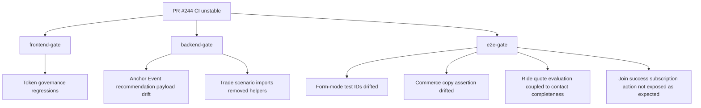

# CI Check Summary

## Failing Checks

| Check | Workflow | Run | Job | Command/phase | Result |
| --- | --- | --- | --- | --- | --- |
| `frontend-gate` | Frontend Gate | `26821981930` | `79078801440` | `pnpm --filter @partner-up-dev/frontend lint:tokens:strict` | failed |
| `backend-gate` | Backend Gate | `26821981937` | `79078801582` | `pnpm test:scenario:backend` | failed |
| `e2e-gate` | E2E Gate | `26821982536` | `79078803583` | `pnpm test:scenario:system` | failed |

## Passed Before Failure

- Backend typecheck passed.
- Backend unit tests passed: 55 files / 199 tests.
- Backend DB lint passed.
- The backend gate failed only after entering backend scenario tests.

## Root Cause Topology

## Tooling Notes

- `gh pr checks` hit a GitHub GraphQL timeout during one read, but the bundled CI script and `gh run view --job` provided the failing check details.
- The GitHub MCP connector did not start cleanly in this environment, so diagnosis used authenticated `gh` CLI logs plus local source reads.
