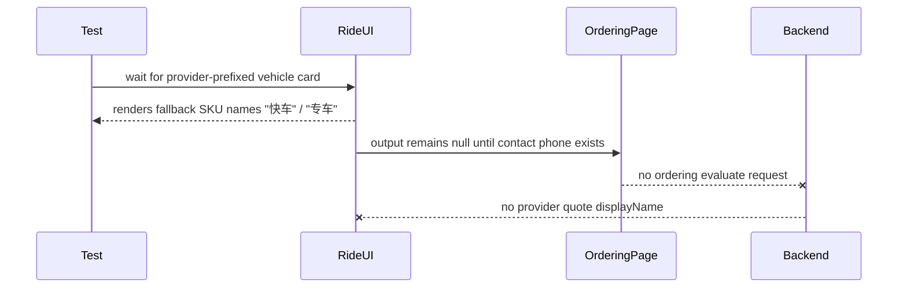

# E2E Gate - System Scenario Tests

## Failing Command

`pnpm test:scenario:system`

CI reports 4 failed files / 5 failed tests.

## Failure 1 - Anchor Event Form Mode Time Control Test IDs

Failing test:

- `tests/scenario/anchor-event/anchor-event-form-mode-participation.scenario.test.ts`

Observed error:

- Timeout clicking `getByTestId("anchor-event-form-mode.time-mode-toggle")`.

Current component path:

- `apps/frontend/src/domains/event/ui/controls/form-mode/FormModeTimeControl.vue`
- `apps/frontend/src/domains/event/ui/controls/PRTimeWindowEditor.vue`

Diagnosis: the semantic test IDs changed during the PR time-window editor extraction. The scenario still targets old IDs such as:

- `anchor-event-form-mode.time-mode-toggle`
- `anchor-event-form-mode.time-date-wheel`
- `anchor-event-form-mode.time-time-wheel`

The current generic prefix produces IDs like:

- `anchor-event-form-mode.time.mode-toggle`
- `anchor-event-form-mode.time.date`
- `anchor-event-form-mode.time.time`

Because route workflow scenario tests depend on stable `data-testid` affordances, this should be treated as a testability contract drift unless the ID rename was intentional and documented.

## Failure 2 - Rental Ordering Non-Creator Copy Drift

Failing test:

- `tests/scenario/commerce/rental-ordering.scenario.test.ts`

Observed error:

- Timeout waiting for text `仅 PR 创建者可以创建订单`.

Current backend problem detail in `apps/backend/src/domains/trade/use-cases/create-order.ts` is:

- `仅 PR 创建者可以为该 PR 创建订单。`

`OrderingFromPlacementPage.vue` displays the backend availability problem detail. Diagnosis: capability behavior appears to exist, but the scenario asserts an older copy string. This is a copy contract drift, not evidence that the non-creator guard disappeared.

Repair should either align the user-facing copy contract or assert a more stable notice/test ID plus problem code.

## Failures 3 and 4 - Ride-Hailing Provider Quote Cards Never Reach Provider-Backed Names

Failing tests:

- `commerce_ride_hailing_ordering_completes_provider_backed_trip`
- `commerce_ride_hailing_provider_create_failure_allows_retry_without_open_order`

Observed error:

- Test sees 2 vehicle cards but times out waiting for `系统曹操快车` / `系统曹操专车`.

Current flow:

Diagnosis: provider-backed vehicle display names are produced by backend evaluation, but evaluation is gated behind a complete `createOrderInput`. `RideHailingOrderingContent.vue` requires a non-empty contact phone before emitting a non-null output. The scenario opens the contact drawer but does not fill contact phone before expecting provider quote names. Therefore it remains on fallback card labels.

Product/UX decision: quotes probably should not require final contact phone; final order creation should. If that is the intended UX, the app should decouple quote evaluation from final order completeness. If the new requirement is "fill contact before quote", the scenario is stale.

## Failure 5 - PR Detail Join Success Subscription Action

Failing test:

- `tests/scenario/pr-core/pr-detail-join.scenario.test.ts`

Observed error:

- `pr-detail.join-success.confirmation-followup` becomes visible.
- The nested button with accessible name `订阅 1 次` never becomes visible within 10 seconds.

Confirmed surrounding facts:

- The join success follow-up panel renders `APRNotificationSubscriptions` with visible kind `REMINDER_CONFIRMATION`.
- The locale value for `subscribeOnceAction` is exactly `订阅 1 次`.
- The scenario writes a confirmation reminder template config and binds the joiner user to an openId.
- Local scenario env has frontend and backend WeChat ability mocking enabled, but CI `e2e-gate.yml` only sets `SCENARIO_DATABASE_ADMIN_URL`.
- `WeChatSubscriptionMessageService.isConfigured()` requires `WECHAT_OFFICIAL_ACCOUNT_APP_ID`, `WECHAT_OFFICIAL_ACCOUNT_APP_SECRET`, and a template id.
- The frontend subscription panel only renders the `订阅 1 次` action after the state reaches configured/authenticated/bound/kind-configured conditions.

Diagnosis: the failure is inside the subscription action contract, not the join flow itself. The strongest current cause is CI environment drift: ignored local `.env` files enable WeChat mocking and provide dummy/configured values, while the E2E workflow does not. In CI, `/wechat/notifications/subscriptions` can therefore remain unconfigured for `REMINDER_CONFIRMATION`, so the panel never exposes the `订阅 1 次` button even though the follow-up section is visible.

Most likely repair areas:

- Set deterministic WeChat mock env in `e2e-gate.yml` or scenario global setup, including frontend mock switch, backend mock switch, and dummy official-account app id/secret.
- Alternatively, change backend mock mode so subscription configured checks do not require real official-account credentials.
- Add a stable `data-testid` for the follow-up subscription action if the scenario should assert this affordance directly.

## Verification Boundary

- Re-run focused files first:
  - `pnpm test:scenario:system -- tests/scenario/anchor-event/anchor-event-form-mode-participation.scenario.test.ts`
  - `pnpm test:scenario:system -- tests/scenario/commerce/rental-ordering.scenario.test.ts`
  - `pnpm test:scenario:system -- tests/scenario/commerce/ride-hailing-ordering.scenario.test.ts`
  - `pnpm test:scenario:system -- tests/scenario/pr-core/pr-detail-join.scenario.test.ts`
- Then re-run full `pnpm test:scenario:system`.
