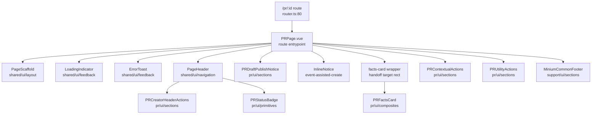

# Current UI Topology

Status: current code snapshot from 2026-05-16.

## Route Entry

- Route: `apps/frontend/src/app/router.ts:80` maps `/pr/:id` to `PRPage`.
- Entrypoint: `apps/frontend/src/pages/PRPage.vue`.
- Current entrypoint size: 288 lines.
- Direct template regions:
  - loading / error state
  - page header
  - draft publish notice
  - event-assisted-create handoff notice
  - facts card handoff target
  - contextual action area
  - utility / reliability / share area
  - common support footer

## Direct UI Graph

## Expanded Component Graph

```mermaid
flowchart TD
  FactsCard["PRFactsCard"] --> SurfaceCard["SurfaceCard"]
  FactsCard --> InfoRows["InfoRow / InfoRowAction"]
  FactsCard --> Chips["Chip / ChipGroup"]
  FactsCard --> RosterModal["PRRosterModal"]
  FactsCard --> GalleryModal["PRLocationGalleryModal"]

  Contextual["PRContextualActions"] --> JoinFlow["PRJoinFlow"]
  Contextual --> WaitlistFlow["PRWaitlistFlow"]
  Contextual --> ExitConfirm["ConfirmDialog: exit"]
  Contextual --> CancelWaitlistConfirm["ConfirmDialog: cancel waitlist"]
  Contextual --> FeedbackModal["PRFeedbackQuestionnaireModal"]
  Contextual --> ContextNotices["InlineNotice"]

  JoinFlow --> JoinGatesA["PRJoinGates"]
  JoinFlow --> JoinFallback["PRJoinFallbackConfirmGate"]
  JoinFlow --> JoinSuccess["APRNotificationSubscriptions"]
  JoinFlow --> OfficialAccountA["OfficialAccountFollowPanel"]

  WaitlistFlow --> JoinGatesB["PRJoinGates"]
  WaitlistFlow --> WaitlistFallback["PRWaitlistFallbackConfirmGate"]
  WaitlistFlow --> WaitlistSuccess["APRNotificationSubscriptions"]
  WaitlistFlow --> OfficialAccountB["OfficialAccountFollowPanel"]

  CreatorHeader["PRCreatorHeaderActions"] --> EditModal["EditPRContentModal"]
  CreatorHeader --> StatusModal["UpdatePRStatusModal"]

  Utility["PRUtilityActions"] --> BookingEntry["Booking support button"]
  Utility --> MessageEntry["Message thread button"]
  Utility --> ShareDrawer["BottomDrawer"]
  ShareDrawer --> ShareSection["PRShareSection"]
  Utility --> InlineSubscriptions["APRNotificationSubscriptions"]
```

## Direct Component Contracts

| Component | Owner | UI responsibility | Key input | Output / expose |
| --- | --- | --- | --- | --- |
| `PRPage.vue` | route entrypoint | Route context, page assembly, loading/error state, handoff geometry, pending WeChat replay | route `id`, `fromEvent`, `handoff` | calls child exposes; passes `action-success` into `refetch` + polling reset |
| `PageHeader.vue` | `shared/ui` | Header title, back behavior, top/meta slots | `title`, `backFallbackTo` | `back` |
| `PRCreatorHeaderActions.vue` | `domains/pr` | Creator edit/status actions and modals | `prId`, `pr`, `supportsEventContextFeatures` | local modal state |
| `PRDraftPublishNotice.vue` | `domains/pr` | Draft publish notice and command | `prId`, `pr` | `published`; exposes `replayPublishDraft` |
| `PRFactsCard.vue` | `domains/pr` | Canonical facts, participant preview, location/roster modals | `prId`, `interactive` | `ready` |
| `PRContextualActions.vue` | `domains/pr` | Primary PR actions, notices, confirmation dialogs, feedback modal, action telemetry | `prId`, `pr`, `routeEventId`, `joinEntrySurface`, `confirmationDeadlineAt`, `supportsEventContextFeatures` | `action-success`; exposes `replayPendingAction` |
| `PRUtilityActions.vue` | `domains/pr` | Booking support entry, messages entry, share drawer, inline reminder subscriptions, event plaza link | `prId`, `pr`, `supportsEventContextFeatures` | local drawer state |
| `PRJoinFlow.vue` | `domains/pr` | Join modal, join gates, success subscription prompt, official-account prompt | `prId`, flow context props | `joined`, `success-closed`, `error`; exposes `open` |
| `PRWaitlistFlow.vue` | `domains/pr` | Waitlist modal, join gates, success subscription prompt, official-account prompt | `prId`, flow context props | `joined`, `success-closed`, `error`; exposes `open` |
| `PRJoinGates.vue` | `domains/pr` | Gate projection UI and resolve actions | `prId`, `enabled`, `pending`, `fallbackConfirmGate` | `cancel`, `completed`, `error`, `resolved` |

## Current Page-Owned State And Coordination

- `PRPage.vue:119` reads the route PR id through `usePRRouteId`.
- `PRPage.vue:120` owns the page-level `usePRDetail(id)` query observer.
- `PRPage.vue:128` computes display-title fallback from detail data.
- `PRPage.vue:143` parses `fromEvent` from route query.
- `PRPage.vue:162` parses `handoff` from route query.
- `PRPage.vue:177` starts PR live polling and passes `refetch`.
- `PRPage.vue:181` creates share context for head / route-share registration.
- `PRPage.vue:202` measures the facts-card DOM rect for matched-PR handoff.
- `PRPage.vue:241` matches pending WeChat actions against the current PR.
- `PRPage.vue:259` replays pending WeChat actions through child refs.

## Initial UI Reading

- The route page is already slimmer than the historical `issue-182-pr-page-ux` topology: contextual actions, utility actions, creator actions, and draft publish are extracted into PR-domain sections.
- The page still coordinates multiple owners: route query parsing, head/share registration, handoff geometry, live polling, pending WeChat replay, and child action success refresh.
- `PRFactsCard` owns its own `usePRDetail(prId)` observer even though `PRPage` passes a fully loaded `prDetail` to other PR sections.
- `PRContextualActions` is the largest behavior surface in the PR detail UI. It owns action projection, action execution adapters, modal state, feedback submission, blocked-reason copy, and telemetry.
