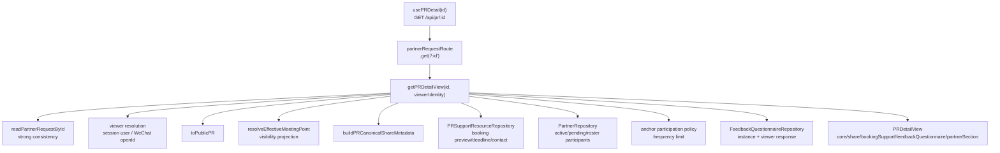
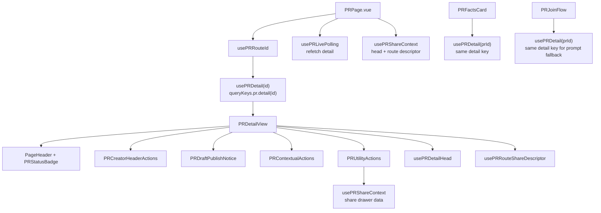
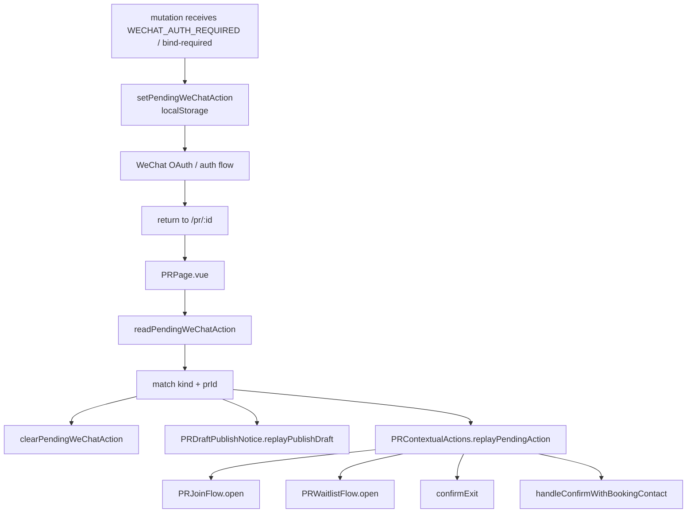

# Current Data Topology

Status: current code snapshot from 2026-05-16.

## Backend Detail Projection

Backend anchors:

- `apps/backend/src/controllers/partner-request.controller.ts:525` handles `GET /:id`.
- `apps/backend/src/domains/pr/read-models/get-pr-detail.ts:129` builds the PR detail read model.
- `apps/backend/src/domains/pr/read-models/get-pr-detail.ts:193` returns the `PRDetail` projection.

## Frontend Read Graph

Read observations:

- `PRPage.vue:120` creates the route-level detail observer.
- `PRFactsCard.vue:224` creates a second detail observer for the same PR id.
- `PRJoinFlow.vue:186` creates a third detail observer for the same PR id when join flow is mounted.
- `PRUtilityActions.vue:104` creates a separate share-context computed from the same `pr` payload while `PRPage.vue:181` already creates a share context for head / route-share registration.
- TanStack Query keeps these observers on the same `queryKeys.pr.detail(id)` key, so this is primarily read-ownership duplication and local state duplication.

## Mutation And Invalidation Graph

```mermaid
flowchart TD
  Draft["PRDraftPublishNotice"] --> Publish["usePublishPR"]
  Creator["PRCreatorHeaderActions"] --> Edit["EditPRContentModal\nuseUpdatePRContent"]
  Creator --> Status["UpdatePRStatusModal\nuseUpdatePRStatus"]

  Contextual["PRContextualActions"] --> SharedActions["useSharedPRActions"]
  SharedActions --> JoinMutation["useJoinPR"]
  SharedActions --> ExitMutation["useExitPR"]
  Contextual --> Attendance["usePRAttendanceActions"]
  Attendance --> ConfirmMutation["useConfirmPRSlot"]
  Attendance --> CheckInMutation["useCheckInPRSlot"]
  Contextual --> CancelWaitlist["useCancelWaitlistPR"]
  Contextual --> FeedbackSubmit["useSubmitFeedbackQuestionnaire"]

  Contextual --> JoinFlow["PRJoinFlow"]
  JoinFlow --> JoinMutation2["useJoinPR"]
  JoinFlow --> JoinGatesA["PRJoinGates\nusePRJoinGates"]
  Contextual --> WaitlistFlow["PRWaitlistFlow"]
  WaitlistFlow --> WaitlistMutation["useWaitlistPR"]
  WaitlistFlow --> JoinGatesB["PRJoinGates\nusePRJoinGates"]

  JoinMutation --> DetailInvalidation["invalidate detail"]
  JoinMutation2 --> DetailInvalidation
  WaitlistMutation --> DetailInvalidation
  CancelWaitlist --> DetailInvalidation
  ExitMutation --> DetailInvalidation
  ConfirmMutation --> DetailInvalidation
  CheckInMutation --> DetailInvalidation
  Publish --> DetailInvalidation
  Edit --> DetailInvalidation
  Status --> DetailInvalidation
  FeedbackSubmit --> DetailInvalidation
```

## PR Query / Mutation Table

| Hook | Endpoint | Query key / invalidation | Current PR-page path |
| --- | --- | --- | --- |
| `usePRDetail` | `GET /api/pr/:id` | reads `queryKeys.pr.detail(id)` | `PRPage`, `PRFactsCard`, `PRJoinFlow` |
| `usePublishPR` | `POST /api/pr/:id/publish` | invalidates `detail`, `mineCreated`, `mineJoined` | `PRDraftPublishNotice` |
| `useJoinPR` | `POST /api/pr/:id/join` | invalidates `detail`, `bookingSupport`, `joinGates`, `mineJoined` | `PRJoinFlow`; also present in `useSharedPRActions` |
| `useWaitlistPR` | `POST /api/pr/:id/waitlist` | invalidates `detail`, `bookingSupport`, `joinGates`, `mineJoined`, `wechat.notificationSubscriptions` | `PRWaitlistFlow` |
| `useCancelWaitlistPR` | `POST /api/pr/:id/waitlist/cancel` | invalidates `detail`, `bookingSupport`, `joinGates`, `mineJoined` | `PRContextualActions` |
| `useExitPR` | `POST /api/pr/:id/exit` | invalidates `detail`, `mineJoined` | `useSharedPRActions` inside `PRContextualActions` |
| `useConfirmPRSlot` | `POST /api/pr/:id/confirm` | invalidates `detail` | `usePRAttendanceActions` inside `PRContextualActions` |
| `useCheckInPRSlot` | `POST /api/pr/:id/check-in` | invalidates `detail` | `usePRAttendanceActions` inside `PRContextualActions` |
| `useUpdatePRContent` | `PATCH /api/pr/:id/content` | invalidates `detail` | `EditPRContentModal` |
| `useUpdatePRStatus` | `PATCH /api/pr/:id/status` | invalidates `detail` | `UpdatePRStatusModal` |
| `usePRJoinGates` | `GET /api/pr/:id/join-gates` | reads `queryKeys.pr.joinGates(id)` | `PRJoinGates` inside join / waitlist flows |
| `resolveGate` | `POST /api/pr/:id/join-gates/:gateKey/resolve` | `setQueryData(joinGates)` then invalidates `joinGates` | `PRJoinGates` |
| `useSubmitFeedbackQuestionnaire` | `POST /api/feedback/:instanceId` | invalidates `detail` when `prId` exists | `PRContextualActions` feedback modal |
| `APRNotificationSubscriptions` data panel | `GET/POST /api/wechat/notifications/subscriptions` | reads / invalidates `queryKeys.wechat.notificationSubscriptions()` | utility section, join success, waitlist success |

## WeChat Pending Action Data Flow

Anchors:

- Pending action storage shape: `apps/frontend/src/processes/wechat/pending-wechat-action.ts:49`.
- Pending action writes: `apps/frontend/src/domains/pr/queries/usePRActions.ts:125`, `:190`, `:292`, `:338`; `apps/frontend/src/domains/pr/queries/usePRPublish.ts:33`.
- Replay coordinator: `apps/frontend/src/pages/PRPage.vue:259`.
- Child replay endpoints: `apps/frontend/src/domains/pr/ui/sections/PRContextualActions.vue:650`, `apps/frontend/src/domains/pr/ui/sections/PRDraftPublishNotice.vue:67`.

## Refresh Paths

- Query-hook invalidation updates the cache after mutations.
- `PRPage.vue:193` also calls `resetLivePolling()` and `refetch()` after child `action-success`.
- `usePRLivePolling` starts interval refetching when an id exists, with default `2_000ms` interval and `10` attempts.
- Some child success flows update route query with `router.replace`, such as publish `entry=publish`, join `entry=join`, and waitlist `entry=waitlist`.
