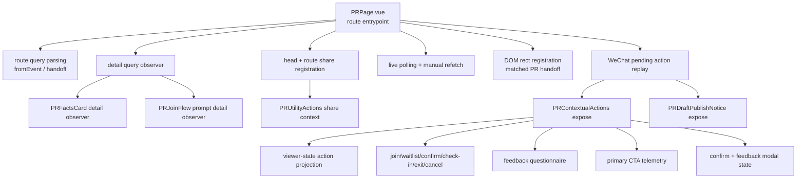

# Boundary Pressure Map

Status: initial reading from current topology.

Update: user feedback prioritized action component boundary erosion over route entrypoint size. The current target discussion should focus first on `PRContextualActions`, `PRUtilityActions`, and `PRCreatorHeaderActions`.

## Pressure Summary

## Pressure Points

| Area | Current shape | Maintenance pressure |
| --- | --- | --- |
| Detail read ownership | `PRPage`, `PRFactsCard`, and `PRJoinFlow` each call `usePRDetail` for the same key. | Multiple observers and local loading/error surfaces make ownership harder to reason about. |
| Route entrypoint coordination | `PRPage` owns route params, route query semantics, detail fetch, share registration, live polling, handoff geometry, and pending replay. | The route page remains a cross-owner coordinator after several UI extractions. |
| Contextual action section | `PRContextualActions` owns action projection, command execution adapters, modal state, feedback submission, blocked-reason copy, and telemetry. | One component carries the highest behavioral density on the page. |
| Utility action section | `PRUtilityActions` renders secondary buttons while also owning router navigation, share drawer state, share derivation, beta group modal state, telemetry, and reminder subscription placement. | A section that reads as a button group also acts as a route-level command and modal coordinator. |
| Creator header actions | `PRCreatorHeaderActions` wraps two creator-only route actions, derives creator authority, opens edit/status modals, owns scroll lock, and tracks telemetry. | The abstraction hides route-scoped assembly behind a thin wrapper with behavior-heavy internals. |
| WeChat pending replay | Mutations write pending action records; `PRPage` reads them; child components expose replay methods. | The process crosses query hooks, localStorage, route return, page refs, and child internals. |
| Refresh authority | Mutation hooks invalidate caches; child sections emit `action-success`; page performs `refetch` and restarts live polling. | Refresh has multiple triggers, so future mutation paths need careful success-event wiring. |
| Share context | `PRPage` and `PRUtilityActions` both call `usePRShareContext` from the same detail payload. | Share derivation is repeated across head/route registration and drawer presentation. |
| Creator authority | `PRCreatorHeaderActions` calculates creator status from `createdBy` + session store while detail also contains `partnerSection.viewer.isCreator`. | Creator UI can drift from backend-projected viewer capabilities if identity assumptions change. |
| Modal scroll locking | Contextual actions, creator actions, join flow, waitlist flow, and utility share drawer each call `useBodyScrollLock`. | Cross-modal overlaps depend on shared lock behavior and local component cleanup. |
| Backend detail projection | `getPRDetailView` gathers PR root, viewer, share metadata, support resources, booking contact, roster, policy, feedback, and frequency limit. | Backend read model is powerful and central; frontend component boundaries should avoid rebuilding derived authority. |

## High-Value Discussion Questions

1. Should `PRFactsCard` accept `PRDetailView` as canonical input on the detail route while keeping id-owned querying for preview/standalone contexts?
2. Should pending WeChat replay move into a PR-domain process composable with explicit command adapters, leaving `PRPage` with route-level invocation only?
3. Should `PRContextualActions` split into projection (`usePRPrimaryActionProjection`), command orchestration (`usePRContextualCommands`), and presentation (`PRContextualActionPanel`)?
4. Should `action-success` become a typed action result contract so page refresh policy can be centralized?
5. Should creator action visibility rely on `partnerSection.viewer.isCreator` as the backend-projected authority?
6. Should `PRContextualActions` and `PRUtilityActions` converge on descriptor-driven button group contracts with route-owned command orchestration?
7. Should `PRCreatorHeaderActions` be removed in favor of direct `PRPage` assembly?
8. Should edit/status modal components become direct route assembly, or stay as thin shells around explicit forms?

## Candidate Next Slices

### Slice A: Solidify Target Topology

Create `50-target-topology.md` with proposed owners, public component contracts, and migration order.

Verification:

- topology file review
- no product-code mutation

### Slice B: Detail Read Ownership Pilot

Refactor `PRFactsCard` to support canonical `pr` input on the route detail page while preserving id-based standalone mode only where a caller needs it.

Verification:

- `pnpm --filter @partner-up-dev/frontend build`
- targeted PR detail browser check
- inspect TanStack query observer count if needed

### Slice C: Pending Replay Boundary

Extract pending WeChat replay into a composable that receives explicit replay adapters.

Verification:

- unit tests around pending action matching / replay dispatch
- `pnpm --filter @partner-up-dev/frontend build`

### Slice D: Contextual Actions Decomposition

Split action projection from command execution and UI presentation.

Verification:

- focused unit tests for projection matrix
- `pnpm --filter @partner-up-dev/frontend build`
- PR detail interaction smoke check for join / waitlist / confirm / exit
