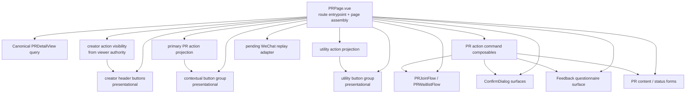

# Target Topology Draft

Status: discussion draft after user feedback on PR action components.

Update: user chose `PRCreatorHeaderActions` and creator edit/status modals as the first candidate slice. `PRContextualActions` and `PRUtilityActions` remain discussion topics because pushing many feature-specific details into `PRPage` would create a route-level logic sink.

## User Position Captured

User identified the largest frontend component boundary erosion in:

- `PRContextualActions`
- `PRUtilityActions`
- `PRCreatorHeaderActions`
- `EditPRContentModal`
- `UpdatePRStatusModal`

The desired direction:

- Contextual and utility action components should behave as simple button groups.
- Creator edit and status actions can be assembled directly by `PRPage`.
- Modal shells should carry modal structure while forms carry form UI.
- `PRPage` can directly assemble `Modal + PRContentForm / UpdatePRStatusForm` for route-scoped creator actions.
- Current execution priority starts with the creator header actions and creator edit/status modal chain.
- Contextual and utility action decomposition needs a stronger target owner model before execution.

## Current Assessment

I agree with the direction for the component boundary model.

The current `PRContextualActions` name reads like a presentational action area, while the implementation owns:

- viewer-state primary action projection
- join / waitlist / confirm / check-in / exit / cancel-waitlist command dispatch
- confirmation modal state
- feedback questionnaire modal state and submission
- blocked reason copy mapping
- primary CTA impression and click telemetry
- pending WeChat replay expose

This is a page controller role hidden inside a section component.

`PRUtilityActions` has the same shape at a smaller scale. It renders a visible utility button area while also owning:

- booking support and message navigation
- share drawer state and share context derivation
- beta group modal state and telemetry
- reminder subscription section placement

`PRCreatorHeaderActions` has low abstraction yield. It wraps two route-scoped creator actions, calculates creator authority separately from the backend-projected viewer model, opens two modals, owns scroll lock, and tracks clicks. Direct assembly in `PRPage` would make the ownership more explicit.

`EditPRContentModal` and `UpdatePRStatusModal` currently combine modal shell, form/control UI, mutation calls, error surfaces, and success/close behavior. If the target model treats the route page as the composition owner, these can be decomposed into route assembly plus form-level components or command composables.

## Target Ownership Shape

Important constraint: this graph should not mean every action detail moves into `PRPage`. The route page should assemble feature modules and own page-level state wiring, while feature-specific command logic should live in named PR-domain composables or focused feature components.

## Proposed Public Contracts

### `PRContextualActions` Replacement

Target role under discussion: presentational action panel plus explicit feature-module boundaries.

Inputs:

- notice descriptors
- primary action descriptor
- secondary action descriptors
- pending / disabled / error state

Outputs:

- `action-click(actionKey)`
- `secondary-click(actionKey)`

Owned elsewhere:

- action projection
- mutation dispatch
- modal state
- telemetry
- pending replay
- blocked reason mapping

Current concern: if all owned-elsewhere items land directly in `PRPage`, the page becomes harder to maintain. A better candidate is a small PR-domain feature layer, for example `usePRParticipantActions` / `usePRActionProjection`, with `PRPage` consuming a compact contract.

Candidate names:

- `PRContextualActionPanel`
- `PRPrimaryActionGroup`
- `PRParticipantActionPanel`

### `PRUtilityActions` Replacement

Target role under discussion: utility action group with route-owned shell decisions and feature-owned command details.

Inputs:

- utility action descriptors
- event plaza link visibility
- reminder subscription slot visibility if the section stays adjacent

Outputs:

- `utility-click(actionKey)`

Owned elsewhere:

- router navigation
- share drawer state
- beta group modal state
- telemetry
- share context derivation
- reminder subscription placement decision if it becomes page-level layout

Current concern: utility actions combine several unrelated features. A button-only component is only useful if navigation, share, beta group, and reminder logic each have clear owners outside the route template.

Candidate names:

- `PRUtilityActionGroup`
- `PRSecondaryActionGroup`

### Creator Header Actions

Target role: inline assembly in `PRPage`.

Recommended route-level state:

- `showEditModal`
- `showModifyStatusModal`
- `editableFields`
- `showBudgetField`
- `showTimeField`
- creator action visibility from `pr.partnerSection.viewer.isCreator`

The current wrapper can be removed after equivalent route-level assembly exists.

### Creator Modals

Target role: either direct route assembly or thin shell.

Two acceptable end states:

1. `PRPage` assembles `Modal + form + footer buttons` directly for these two route-scoped creator actions.
2. Modal components remain as pure shells with explicit `pending`, `error`, and `submit` props.

The first path fits the user's proposed boundary model for this page because the actions are route-scoped and few.

## Migration Order Candidate

1. Inline `PRCreatorHeaderActions` into `PRPage`, using backend-projected viewer authority.
2. Decompose creator modal behavior into route assembly or thin shell contracts.
3. Solidify a target owner model for `PRContextualActions` that keeps feature-specific logic in PR-domain modules.
4. Solidify a target owner model for `PRUtilityActions` that separates utility features by owner.
5. Extract contextual / utility presentation only after the target owner model is explicit.

## Open Decisions

- Should PR action command orchestration live directly in `PRPage`, or in `usePRDetailActionCommands` consumed by `PRPage`?
- Should utility reminder subscriptions remain visually near utility buttons, or become a separate route section?
- Should creator content/status forms expose submit methods to the route page, or own submission through explicit command props?
- Should telemetry live beside action dispatch, or in a small route-owned instrumentation adapter?
- What is the right middle layer for contextual and utility actions so `PRPage` stays an assembly surface instead of a feature logic sink?
