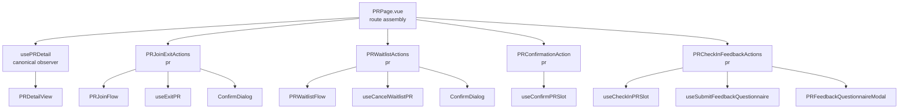

# Contextual / Utility Action Design

Status: discussion proposal after the creator action slice landed.

## Objective & Hypothesis

Design the next boundary model for `PRContextualActions` and `PRUtilityActions`.

Hypothesis:

- The route page needs a compact feature contract for participation and utility regions.
- Button group components should become presentational surfaces with descriptor inputs and click outputs.
- Feature-specific projection, commands, modal state, replay, and telemetry should stay in PR-domain use-case modules or explicitly named feature-region components.
- The useful abstraction is a feature region or coordinator, plus a simple action group inside it.

## Boundary Claims

### Route Owner

`PRPage.vue` should own:

- detail query result placement
- route-level context such as `routeEventId`, handoff entry, share context, and pending WeChat replay routing
- region placement in the page

The page should consume compact feature-region contracts for participation and utility actions.

### Feature Region Owner

Feature regions should own the workflow-level assembly:

- `PRParticipationActionRegion` for join, waitlist, confirm, check-in, exit, feedback retry, released-slot notice, blocked notice, waitlist notice, and pending action replay
- `PRUtilityActionRegion` for booking support, message thread entry, beta group entry, share drawer, event plaza link, and notification subscription placement

These names make the components read as workflow coordinators rather than simple visual button groups.

### Presentation Owner

Action groups should own only rendering:

- `PRContextualActionGroup`
- `PRUtilityActionGroup`

Inputs:

- action descriptors
- notice descriptors
- inline error / tip text
- layout variant and `data-testid` values

Outputs:

- semantic action events such as `primary-click`, `secondary-click`, and `utility-click`

They should have no router usage, mutation hooks, modal state, share derivation, telemetry, or replay exposure.

### Use-Case Owner

Use-case modules should carry the logic that is currently buried in section components:

- `usePRParticipationActionProjection`
- `usePRParticipationActionCommands`
- `usePRParticipationActionTelemetry`
- `usePRUtilityActionProjection`
- `usePRUtilityActionCommands`

Projection composables should produce typed descriptors. Command composables should expose named user intents and local command state. Telemetry composables should subscribe to descriptor changes and record impressions / clicks at the same action boundary as execution.

## Proposed Target Graph

```mermaid
flowchart TD
  PRPage["PRPage.vue\nroute assembly"]

  PRPage --> ParticipationRegion["PRParticipationActionRegion\nworkflow coordinator"]
  PRPage --> UtilityRegion["PRUtilityActionRegion\nworkflow coordinator"]

  ParticipationRegion --> ParticipationProjection["usePRParticipationActionProjection"]
  ParticipationRegion --> ParticipationCommands["usePRParticipationActionCommands"]
  ParticipationRegion --> ParticipationTelemetry["usePRParticipationActionTelemetry"]
  ParticipationRegion --> ContextGroup["PRContextualActionGroup\npresentational"]
  ParticipationRegion --> JoinFlow["PRJoinFlow"]
  ParticipationRegion --> WaitlistFlow["PRWaitlistFlow"]
  ParticipationRegion --> ConfirmDialogs["exit / cancel waitlist dialogs"]
  ParticipationRegion --> FeedbackModal["PRFeedbackQuestionnaireModal"]

  UtilityRegion --> UtilityProjection["usePRUtilityActionProjection"]
  UtilityRegion --> UtilityCommands["usePRUtilityActionCommands"]
  UtilityRegion --> UtilityGroup["PRUtilityActionGroup\npresentational"]
  UtilityRegion --> ShareDrawer["BottomDrawer + PRShareSection"]
  UtilityRegion --> BetaModal["Modal + AnchorEventBetaGroupQrPanel"]
  UtilityRegion --> ReminderSection["APRNotificationSubscriptions section"]
```



## Contextual Action Design

### Current Payload Hidden In `PRContextualActions`

- viewer-state classification
- primary CTA descriptor projection
- blocked reason and timeline copy
- released-slot and waitlist notices
- join / waitlist modal bridge
- confirm and check-in mutations
- exit and cancel-waitlist confirmation dialogs
- feedback questionnaire retry and submission
- primary CTA impression / click telemetry
- pending WeChat replay API

### Target Contract

`PRParticipationActionRegion.vue`

Props:

- `prId`
- `pr`
- `routeEventId`
- `joinEntrySurface`
- `confirmationDeadlineAt`
- `supportsEventContextFeatures`

Emits:

- `action-success`

Expose:

- `replayPendingAction(kind)`

Internal collaborators:

- `usePRParticipationActionProjection` computes:
  - `showRegion`
  - notice descriptors
  - primary action descriptor
  - secondary action descriptors for exit and cancel waitlist
  - feedback retry descriptor
  - blocked / tip copy
  - viewer telemetry state
- `usePRParticipationActionCommands` handles:
  - confirm
  - check-in
  - exit
  - cancel waitlist
  - feedback submit
  - modal open / close state
  - domain errors
- `PRContextualActionGroup` renders:
  - `InlineNotice`
  - primary action button
  - secondary action buttons
  - tips and errors

Join and waitlist remain special because `PRJoinFlow` and `PRWaitlistFlow` are already workflow components with modal and success-prompt state. The region should bridge those flows into the same descriptor shape supplied to `PRContextualActionGroup`.

### Descriptor Sketch

```ts
type PRContextualActionKey =
  | "JOIN"
  | "WAITLIST"
  | "CONFIRM"
  | "CHECKIN_ATTENDED"
  | "FEEDBACK_RETRY"
  | "EXIT"
  | "CANCEL_WAITLIST";

type PRActionTone =
  | "primary"
  | "primary-outline"
  | "secondary"
  | "surface"
  | "danger";

type PRContextualActionDescriptor = {
  key: PRContextualActionKey;
  label: string;
  pendingLabel?: string;
  tone: PRActionTone;
  disabled: boolean;
  pending: boolean;
  tip: string | null;
  error: string | null;
  testId?: string;
};
```

## Utility Action Design

### Current Payload Hidden In `PRUtilityActions`

- booking support navigation
- message thread navigation
- share drawer state
- share context derivation duplicated with `PRPage`
- beta group modal state and telemetry
- event plaza link visibility
- inline reminder subscription placement

### Target Contract

`PRUtilityActionRegion.vue`

Props:

- `prId`
- `pr`
- `supportsEventContextFeatures`
- `shareUrl`
- `spmRouteKey`
- `prShareData`

Internal collaborators:

- `usePRUtilityActionProjection` computes:
  - utility action descriptors
  - beta group panel payload
  - event plaza link descriptor
  - reminder subscription visibility
- `usePRUtilityActionCommands` handles:
  - booking support navigation
  - message thread navigation
  - share drawer open / close
  - beta group modal open / close
  - beta group telemetry
- `PRUtilityActionGroup` renders:
  - booking support button
  - beta group button
  - message thread button
  - share button
  - event plaza link
- `PRUtilityReliabilitySection` renders:
  - `APRNotificationSubscriptions` when projection says the section is visible

Share context should be passed from `PRPage`, because the page already needs the same values for head metadata and route-share registration.

### Descriptor Sketch

```ts
type PRUtilityActionKey =
  | "BOOKING_SUPPORT"
  | "BETA_GROUP"
  | "MESSAGE_THREAD"
  | "SHARE";

type PRUtilityActionDescriptor = {
  key: PRUtilityActionKey;
  label: string;
  tone: "outline";
  disabled: boolean;
  testId?: string;
};

type PREventPlazaLinkDescriptor = {
  label: string;
  to: { name: "event-plaza" };
};
```

## Migration Slices

### Slice 1: Projection Extraction

- Add `usePRParticipationActionProjection` with focused unit tests for viewer states and blocked reason copy.
- Add `usePRUtilityActionProjection` with focused unit tests for event-context features, participant-only message entry, beta QR visibility, and reminder visibility.
- Keep current section components as consumers during this slice.

### Slice 2: Presentational Action Groups

- Add `PRContextualActionGroup`.
- Add `PRUtilityActionGroup`.
- Move button markup and `data-testid` placement into these presentational components.
- Keep existing command behavior in the current sections while the visual contract stabilizes.

### Slice 3: Feature Regions

- Rename or replace `PRContextualActions` with `PRParticipationActionRegion`.
- Rename or replace `PRUtilityActions` with `PRUtilityActionRegion`.
- Move modal / drawer / command wiring into command composables plus the feature regions.
- `PRPage.vue` imports regions and passes route-owned context.

### Slice 4: Replay And Share Cleanup

- Keep pending WeChat replay entry in `PRPage`, with participation replay delegated through the region expose.
- Pass canonical share context from `PRPage` into `PRUtilityActionRegion`.
- Remove duplicate `usePRShareContext` usage from the utility region.

## Discussion Decision Points

1. Should the region names be `PRParticipationActionRegion` / `PRUtilityActionRegion`, or should we use a more page-specific prefix such as `PRDetailParticipationRegion`?
2. Should the first slice extract projection only, or extract projection plus presentational action groups together?
3. Should reminder subscriptions stay inside `PRUtilityActionRegion` as a reliability subsection, or should `PRPage` place a separate `PRReminderSubscriptionSection` beside the utility region?
4. Should action telemetry live in dedicated telemetry composables, or inside command composables at the action execution boundary?

## Revised Direction From User Discussion

User proposed deleting `PRContextualActions` and replacing the umbrella controller with peer feature components:

- join / exit component
- waitlist component
- confirmation component
- check-in / feedback component

Each component should:

- be placed directly by `PRPage`
- accept the canonical `pr: PRDetailView` read model from `PRPage`
- derive mutation ids from `pr.id`
- own its mutation hooks
- own its button, explanatory copy, `InlineNotice`, `ConfirmDialog`, and modal surfaces
- internally decide whether it renders for the current PR/viewer state

This changes the topology more substantially than the earlier region-plus-action-group proposal. The route page becomes a simple list of PR participation capabilities, and each capability owns its complete vertical slice.

Candidate target graph:



Data-update fit:

- `useJoinPR`, `useWaitlistPR`, `useCancelWaitlistPR`, `useExitPR`, `useConfirmPRSlot`, `useCheckInPRSlot`, and `useSubmitFeedbackQuestionnaire` already invalidate `queryKeys.pr.detail(id)`.
- `PRPage` can keep the canonical detail observer and pass `PRDetailView` into peer components.
- Mutations invalidate the same detail key, causing the page-owned read model to refresh and flow back down.
- This allows `PRPage` to drop contextual action success refetch wiring for these actions after migration.
- Live polling should be removed. It did not prove useful after real usage, and the action flow already has query invalidation as the bounded refresh mechanism.

Read-model prop refinement:

```ts
type PRDetailActionProps = {
  pr: PRDetailView;
};
```

The component derives `const prId = computed(() => props.pr.id)` for mutations. This avoids duplicating `usePRDetail` in every peer action component and keeps the route detail query canonical.

Join and waitlist still need route/process attribution for `PRJoinFlow` and `PRWaitlistFlow`. Prefer one small context prop for those two components:

```ts
type PRJoinEntryContext = {
  routeEventId: number | null;
  joinEntrySurface: "form_mode_matched" | "pr_detail";
};
```

`confirmationDeadlineAt`, `confirmationReminderSupported`, scenario type, and participant state can all derive from `pr`.

Context erosion note:

- `PRJoinEntryContext` is accepted as a temporary bridge for event attribution and entry-surface reporting.
- It leaks route/process context into action components because the current user-event collection system does not provide a cleaner ambient journey context for these flows.
- The implementation slice should leave a durable note in the telemetry / cross-unit contract docs, marking this as an intentional temporary boundary compromise.
- Candidate durable doc: `docs/20-product-tdd/cross-unit-contracts.md`, near the Anchor Event -> PR funnel telemetry contract.

Open split points:

- released-slot notice likely belongs with join / exit because it describes the viewer's slot lifecycle.
- waitlist rank notice belongs with waitlist.
- primary blocked copy should split by capability: join-blocked copy in join / exit, waitlist-blocked copy in waitlist, confirm-blocked copy in confirmation, check-in copy in check-in / feedback.
- pending WeChat replay still enters through `PRPage`; it can route by action kind to refs on these peer components.
- `PRJoinFlow` still has an internal `usePRDetail` observer for success-prompt fallback data. This is a known residual read-owner duplication and should be handled in a later slice.

Implementation impact:

- Remove `usePRLivePolling`.
- Remove `resetLivePolling` and `handlePRActionSuccess` from `PRPage`.
- Remove `@action-success` from the contextual action replacement path.
- Remove `@published="handlePRActionSuccess"` from `PRDraftPublishNotice`; `usePublishPR` already invalidates `queryKeys.pr.detail(id)`, `mineCreated`, and `mineJoined`.
- Update tests that currently mock `usePRLivePolling`.
- Keep `PRJoinFlow`'s internal detail observer for this slice and record it as future work.
