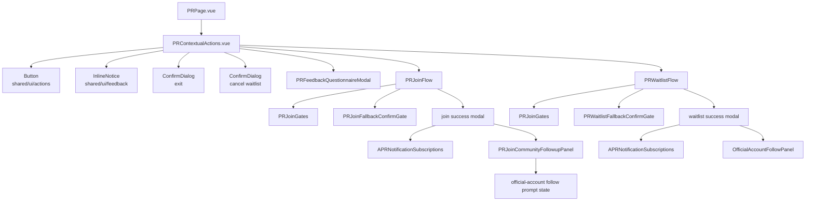
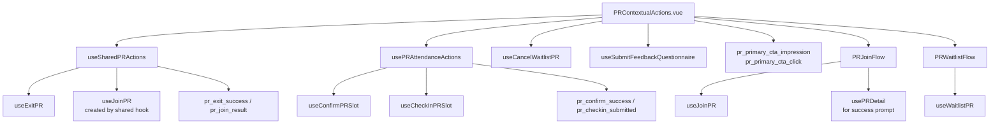
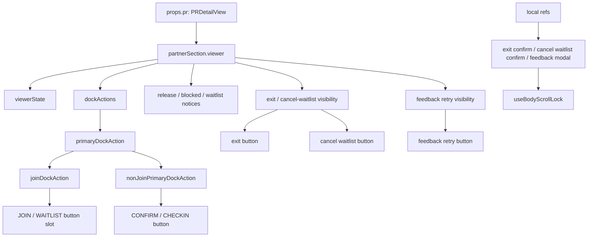
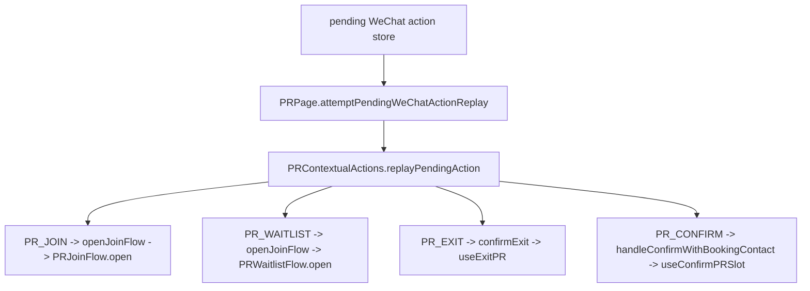

# Current PRContextualActions Topology

Status: current-code reading for the next design discussion.

## Capability Inventory

`PRContextualActions.vue` currently carries seven capability groups:

1. Contextual visibility and notice projection
   - section visibility
   - released-slot notice
   - primary blocked message
   - waitlist rank / waitlisted notice
   - exit blocked tip
   - confirm and check-in time-window tips

2. Primary participation action projection
   - viewer state classification
   - `JOIN`
   - `WAITLIST`
   - `CONFIRM`
   - `CHECKIN_ATTENDED`
   - button labels, pending labels, tone, disabled, pending, tips, test ids

3. Join and waitlist flow hosting
   - mounts `PRJoinFlow`
   - mounts `PRWaitlistFlow`
   - bridges their scoped-slot `open`, `pending`, `disabled`, `joined`, and `errorMessage` into the contextual action area
   - passes route context into the flows

4. Participant secondary commands
   - exit request and confirmation dialog
   - cancel waitlist request and confirmation dialog
   - domain errors for both commands

5. Attendance and feedback commands
   - confirm slot
   - check in
   - open feedback questionnaire after check-in when pending
   - retry pending feedback questionnaire
   - submit feedback questionnaire

6. Telemetry
   - primary CTA impression tracking
   - primary CTA click tracking
   - viewer-state payload derivation
   - action-key to telemetry-type mapping

7. Pending WeChat replay endpoint
   - exposes `replayPendingAction(kind)`
   - replays `PR_JOIN`
   - replays `PR_WAITLIST`
   - replays `PR_EXIT`
   - replays `PR_CONFIRM`

## Inputs And Outputs

Inputs from `PRPage.vue`:

- `prId`
- `pr`
- `routeEventId`
- `joinEntrySurface`
- `confirmationDeadlineAt`
- `supportsEventContextFeatures`

Output to `PRPage.vue`:

- `action-success`

Exposed method consumed by `PRPage.vue`:

- `replayPendingAction(kind)`

## Direct Child Topology

## Use-Case And Query Topology

## State Topology

## Replay Topology

## Observed Boundary Shape

The component is a workflow controller embedded in a section component. It owns:

- presentational rendering
- projection from `PRDetailView` to actions and notices
- action command dispatch
- local modal state
- telemetry side effects
- pending replay entrypoint
- child workflow hosting for join and waitlist

`PRJoinFlow` and `PRWaitlistFlow` already act as deeper workflow controllers. `PRContextualActions` sits above them as an umbrella controller for the full participation area.
