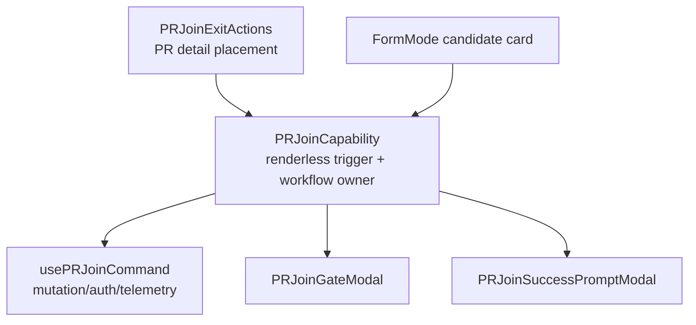

# Join / Waitlist Flow Follow-Up

Status: design note after contextual and utility action splits.

## Objective & Hypothesis

Reduce the remaining maintainability pressure around `PRJoinFlow`, `PRWaitlistFlow`, and page-level pending WeChat replay.

Hypothesis:

- `PRJoinFlow` and `PRWaitlistFlow` still hide large workflow controllers behind slot-based components.
- Removing those abstractions should preserve cross-surface reuse for Form Mode recommendation cards.
- The right target is not to move all flow code directly into route pages; it is to expose explicit join / waitlist vertical capability units with small command composables and modal subcomponents.

## Guardrails Touched

- PR detail actions:
  - `PRJoinExitActions.vue`
  - `PRWaitlistActions.vue`
- Existing flow components:
  - `PRJoinFlow.vue`
  - `PRWaitlistFlow.vue`
- Form Mode candidates:
  - `FormModeNoMatchResult.vue`
  - matched / candidate recommendation join entry surfaces
- Route/process handoff:
  - `PRPage.vue`
  - `pending-wechat-action`

## Current Facts

- `PRJoinFlow` is a component, not a composable.
- It still has more than one production usage:
  - PR detail join action through `PRJoinExitActions`
  - Form Mode candidate join buttons through `FormModeNoMatchResult`
- Form Mode uses the slot contract to render its own candidate-card button and emit candidate-specific telemetry before opening the join workflow.
- Form Mode candidates do not naturally have the full canonical `PRDetailView`; they have candidate summary data plus event / rank attribution.
- `PRJoinFlow` still owns a duplicate `usePRDetail` observer for success-prompt fallback data.
- `PRWaitlistFlow` is only used by `PRWaitlistActions` today, but it has the same slot-wrapper shape and owns a similarly heavy workflow.

## Join Flow Direction

User raised the key constraint: if `PRJoinFlow` is removed, the replacement must still allow Form Mode recommendation surfaces to customize their join button.

Accepted design implication:

- The replacement should expose a slot or renderless API for the trigger surface.
- It must not require full `PRDetailView` for Form Mode candidate usage.
- `PRJoinExitActions` can own PR-detail join / exit placement, but the reusable unit should be narrower than `PRJoinExitActions` if Form Mode needs only the join workflow.

Candidate target:



Contract sketch:

```ts
type PRJoinCapabilityProps = {
  prId: number | null;
  scenarioType?: string | null;
  eventId?: number | null;
  entrySurface?: "pr_detail" | "form_mode_matched" | "form_mode_candidate";
  candidateRank?: number | null;
  confirmationWindow?: {
    startAt: string | null;
    endAt: string | null;
    reminderSupported: boolean;
  } | null;
  successPromptContext?: {
    eventTitle: string | null;
    betaGroupQrCode: string | null;
  } | null;
  disabled?: boolean;
};
```

The slot should expose:

- `open`
- `pending`
- `disabled`
- `joined`
- `errorMessage`

This keeps Form Mode button customization without preserving `PRJoinFlow` as the opaque owner of all join workflow concerns.

## Waitlist Flow Direction

`PRWaitlistFlow` should be handled with the same principle, but the reuse pressure is currently lower.

Target:

- Move waitlist mutation, auth handoff, telemetry, gate modal state, alternative reminder opt-in, and success prompt state into a `usePRWaitlistCommand` plus small modal components.
- Let `PRWaitlistActions` own the PR-detail waitlist button, notice, cancellation dialog, and visibility rules.
- If Form Mode later needs candidate waitlist, add a renderless `PRWaitlistCapability` with the same trigger-slot contract rather than re-growing `PRWaitlistFlow`.

This avoids leaving a large slot wrapper in place just because future surfaces might need custom buttons.

## Pending WeChat Replay Follow-Up

Known issue:

- `PRPage` still hand-dispatches pending WeChat replay:
  - `PR_PUBLISH`
  - `PR_JOIN`
  - `PR_EXIT`
  - `PR_WAITLIST`
  - `PR_CONFIRM`

Target:

- Extract `usePRPendingWeChatReplay`.
- `PRPage` should provide a small action registry and route-owned readiness state.
- The replay composable should own:
  - reading / clearing pending action
  - `PR id` matching
  - replay running guard
  - watcher dependencies for viewer/action readiness
  - mapping pending action kind to registered handler

This keeps route/process handoff out of the page template assembly and makes new replayable actions additive.

## Verification For Future Slice

- Keep existing Form Mode candidate join behavior and `data-testid="anchor-event-form-mode.candidate.join"`.
- Keep PR detail join behavior and `data-testid="pr-detail.join.open"`.
- Add focused tests for:
  - custom trigger slot opens the join modal
  - Form Mode candidate trigger receives pending/disabled/joined/error state
  - PR detail join action still renders through the same reusable capability
  - pending WeChat replay dispatch maps through the extracted registry
