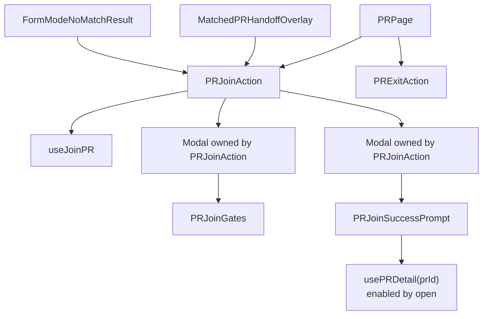
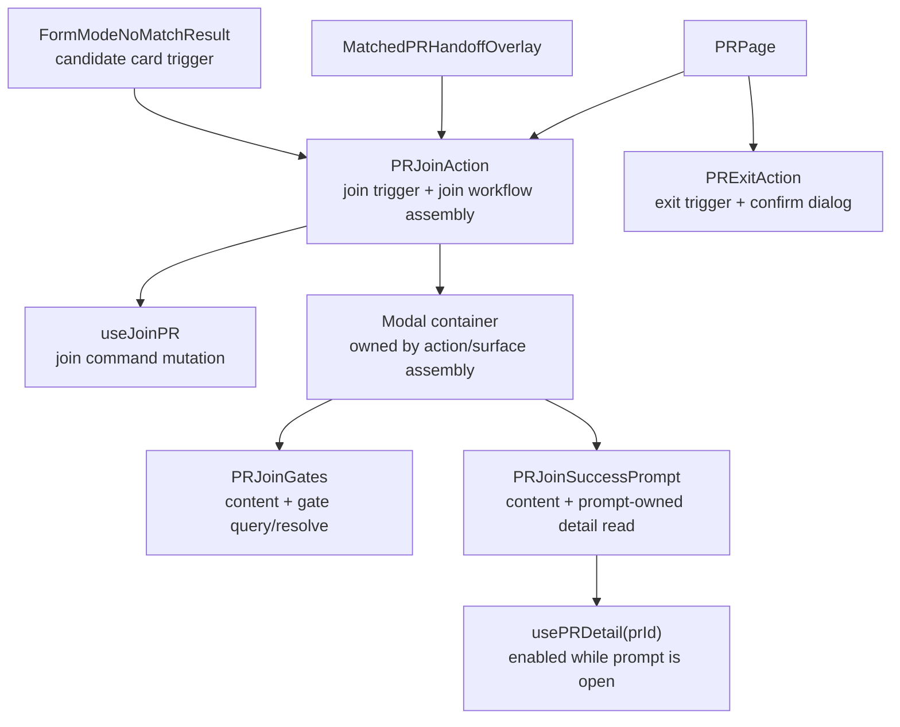
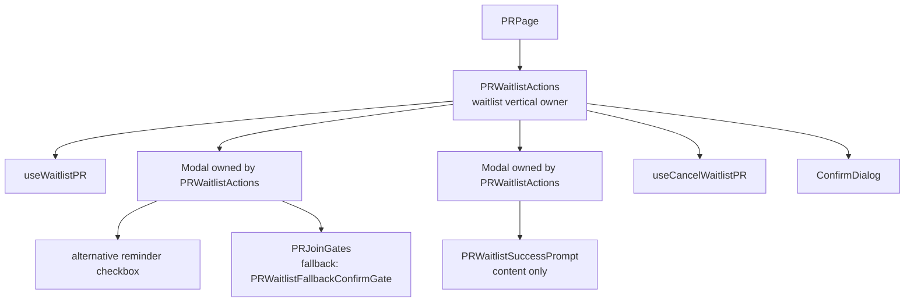
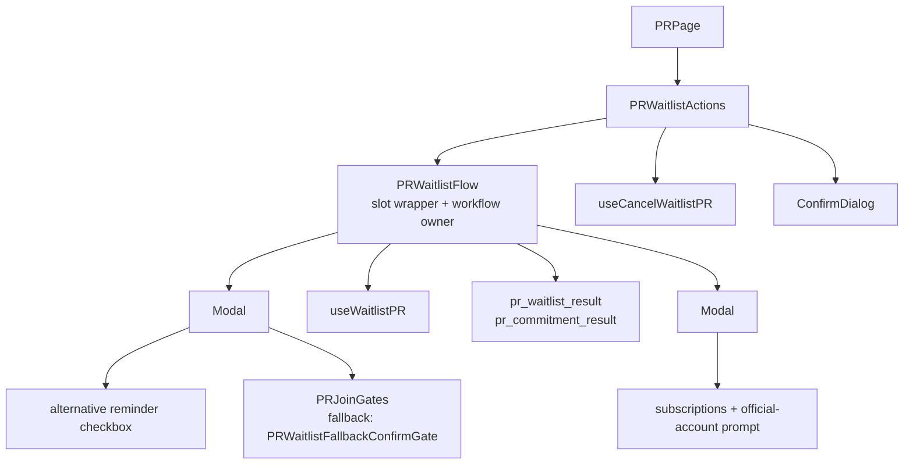
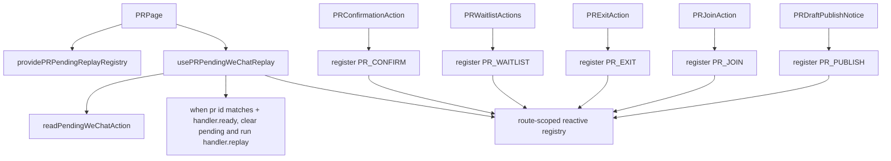
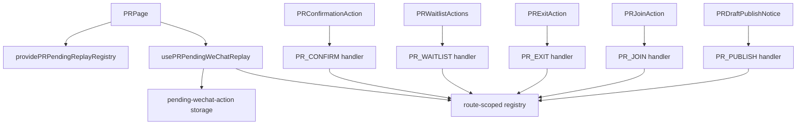

# Join / Waitlist Flow Follow-Up

Status: join / exit and waitlist slices committed; pending replay registry slice implemented in working tree.

## Objective & Hypothesis

Reduce the remaining maintainability pressure around `PRJoinFlow`, `PRWaitlistFlow`, and page-level pending WeChat replay.

Hypothesis:

- `PRJoinFlow` and `PRWaitlistFlow` still hide large workflow controllers behind slot-based components.
- Removing those abstractions should preserve cross-surface reuse for Form Mode recommendation cards.
- The right target is not to move all flow code directly into route pages; it is to expose explicit join / waitlist vertical action units with small command composables and content primitives.

## Guardrails Touched

- PR detail actions:
  - `PRJoinExitActions.vue`
  - `PRWaitlistActions.vue`
- Existing flow components:
  - `PRJoinFlow.vue`
  - `PRWaitlistFlow.vue`
- Form Mode candidates:
  - `FormModeNoMatchResult.vue`
  - matched / candidate recommendation join entry surfaces
- Route/process handoff:
  - `PRPage.vue`
  - `pending-wechat-action`

## Current Facts

- `PRJoinFlow` was removed in this slice.
- `PRJoinExitActions` was split into `PRJoinAction` and `PRExitAction`.
- PR detail, Form Mode matched handoff, and Form Mode no-match candidate join buttons now compose `PRJoinAction`.
- Form Mode uses the `PRJoinAction` trigger slot to render its own matched / candidate buttons and emit surface-specific telemetry before opening the join workflow.
- Form Mode candidates do not naturally have the full canonical `PRDetailView`; they have candidate summary data plus event / rank attribution.
- `PRJoinSuccessPrompt` owns the prompt-specific `usePRDetail(prId)` read, enabled only while the prompt is open.
- `PRWaitlistFlow` was removed in the waitlist slice.
- `PRWaitlistActions` now directly owns waitlist trigger visibility, gate modal assembly, waitlist command execution, result telemetry, success modal assembly, and cancel-waitlist confirmation.
- `PRWaitlistSuccessPrompt` is content-only and owns the waitlist success prompt step state.
- `entry=join` is Form Mode route behavior, not reusable join behavior. It must stay with Form Mode / route handoff surfaces and should not enter `useJoinPR`.
- `api/pr/:id/publish`, `/status`, `/content`, `/join`, `/waitlist`, and `/join-gates/:gateKey/resolve` no longer return an `auth` object in JSON body. Session refresh stays in auth transport/session infrastructure.

## Implemented Join / Exit Slice

Changed topology:



Removed:

- `PRJoinFlow.vue`
- `PRJoinExitActions.vue`
- PR UI-layer `applyAuthSession(result.auth)` reads for publish / join / waitlist

Kept intentionally:

- `PRJoinAction` owns join gate modal state, join mutation execution, success prompt modal assembly, and a narrow `trigger` slot for Form Mode.
- `PRExitAction` owns exit visibility, blocked copy, confirmation dialog state, and exit mutation.
- Form Mode owns `entry=join` route behavior after matched / candidate join success.
- `PRWaitlistActions` remains the PR-detail waitlist vertical owner.

## Join Flow Direction

User raised the key constraint: if `PRJoinFlow` is removed, the replacement must still allow Form Mode recommendation surfaces to customize their join button.

Revised decision:

- Do not replace `PRJoinFlow` with another broad slot/renderless component such as `PRJoinCapability`.
- A broad capability component would preserve the same abstraction problem under a new name.
- The reusable units should be smaller and aligned to real change axes:
  - join mutation command
  - join gate content (`PRJoinGates`), not a `PRJoinGateModal`
  - join success follow-up content (`PRJoinSuccessPrompt`), not a `PRJoinSuccessPromptModal`
  - surface-specific trigger button and surrounding copy
- Modal / card containers remain assembly details owned by the action or surface that needs them.
- Split `PRJoinExitActions` into `PRJoinAction` and `PRExitAction` so join and exit stop sharing one action boundary.
- `PRJoinAction` may expose a narrow trigger slot for custom button rendering, but it must not become a broad workflow slot component again.
- Form Mode matched and candidate surfaces should use `PRJoinAction` directly with a custom trigger slot and attribution context, instead of introducing a separate `FormModeCandidateJoinAction` wrapper.
- `PRJoinSuccessPrompt` should own its PR-detail read by `prId`, enabled only while the success prompt is open. The success prompt's copy, confirmation window, event title, and beta-group QR code are prompt content dependencies, not action assembly dependencies.
- `PRJoinAction` should not fetch or reshape PR detail for `PRJoinSuccessPrompt`; otherwise prompt content changes would keep widening the action boundary.

Candidate target:



Join command input sketch:

```ts
type PRJoinInput = {
  id: number;
  correlationId?: string;
};
```

Layering note:

- Do not introduce `usePRJoinCommand` if `useJoinPR` can own the join command boundary directly.
- `useJoinPR` should remain narrow: issue the join request, invalidate related queries, expose mutation state, and preserve correlation-id propagation.
- It should not own button rendering, modal state, success prompt state, route navigation, or surface attribution.
- The current `entry=join` URL query write is Form Mode / route handoff behavior, not command logic.
- Do not preserve the current body-level auth payload pattern. Backend PR command responses should stop returning `auth`; frontend session sync should happen from auth response infrastructure, such as `x-access-token` handling plus a central session-store sync path.
- Gate resolution also returns `auth` today; remove that response-body auth shape in the same session-boundary cleanup.

Current auth body shape:

```ts
type AuthBodyPayload = {
  role: "anonymous" | "authenticated" | "service" | "analytics";
  roles: Array<"anonymous" | "authenticated" | "service" | "analytics">;
  userId: string;
  accessToken: string;
};
```

Current purpose:

- update backend request auth through `c.set("auth", auth)` so the auth middleware emits `x-access-token`
- duplicate the token and session metadata in response JSON body
- let frontend action components call `applyAuthSession` to sync Pinia and localStorage

Target:

- PR command JSON bodies contain PR/domain results only.
- Access-token issuance and rotation flow through `x-access-token`.
- Frontend session metadata synchronization is centralized in auth/session infrastructure, not repeated in PR publish/join/waitlist/gate UI code.

Surface-owned state:

- trigger rendering
- gate modal open / close
- success prompt open / close
- local error placement
- joined state display

This keeps Form Mode button customization without preserving `PRJoinFlow` as the opaque owner of all join workflow concerns.

Important distinction:

- `PRJoinFlow` owning `usePRDetail` is boundary erosion because it is a broad workflow controller with trigger, modal state, command execution, telemetry, and success-prompt content mixed together.
- `PRJoinSuccessPrompt` owning `usePRDetail` is acceptable because the detail read is scoped to the prompt content itself and enabled only when that content is shown.

## Waitlist Flow Direction

`PRWaitlistFlow` should be handled with the same principle, but the reuse pressure is currently lower.

Target:

- Delete `PRWaitlistFlow`.
- Let `PRWaitlistActions` own the PR-detail waitlist vertical:
  - waitlist visible / blocked / already-waitlisted notices
  - waitlist trigger button
  - waitlist gate modal assembly
  - `useWaitlistPR` command execution
  - alternative PR reminder opt-in state
  - waitlist result telemetry
  - waitlist success modal assembly
  - cancel-waitlist button, confirmation dialog, command, and local error state
- Extract success prompt content into `PRWaitlistSuccessPrompt`, not `PRWaitlistSuccessPromptModal`.
- Keep modal containers in `PRWaitlistActions`.
- Keep gate content as existing `PRJoinGates` plus `PRWaitlistFallbackConfirmGate`.
- If Form Mode later needs candidate waitlist, introduce a narrow custom trigger slot on the waitlist action only when there is a real second surface. Do not preserve `PRWaitlistFlow` preemptively for hypothetical reuse.

This avoids leaving a large slot wrapper in place just because future surfaces might need custom buttons.

Implemented waitlist topology:



Removed:

- `PRWaitlistFlow.vue`

Added:

- `PRWaitlistSuccessPrompt.vue`

Previous waitlist topology:



Target waitlist topology, now implemented:


Boundary notes:

- `PRWaitlistActions` remains a single PR-detail action component for now because waitlist and cancel-waitlist are the same vertical state machine from the user's point of view.
- Splitting `PRCancelWaitlistAction` is possible later if cancellation gains independent surfaces, copy, telemetry, or command policy. It is not required for deleting `PRWaitlistFlow`.
- `PRWaitlistSuccessPrompt` may own the success-prompt step state and official-account prompt state, but it must not own a `Modal`.
- `PRWaitlistSuccessPrompt` should receive `alternativePrReminderOptIn` or resolved visible notification kinds as input rather than owning the waitlist command state.
- `PRWaitlistActions` should continue exposing `replayWaitlist()` for the existing pending WeChat replay path until the replay registry follow-up is extracted.

Waitlist slice verification:

- `PRParticipationActions.test.ts` no longer mocks `PRWaitlistFlow`; it mocks lower content primitives where necessary.
- Added / kept coverage for:
  - waitlistable visitor shows `data-testid="pr-detail.waitlist.open"`
  - waitlisted viewer shows `data-testid="pr-detail.waitlist.notice"` and cancel affordance
  - participant / non-waitlistable viewer does not show the waitlist trigger
- Run so far:
  - `pnpm exec vitest run --project frontend-unit apps/frontend/src/domains/pr/ui/sections/PRParticipationActions.test.ts`
  - `pnpm test:unit:frontend`
  - `pnpm --filter @partner-up-dev/frontend exec vite build`
  - `pnpm --filter @partner-up-dev/frontend lint:tokens`
  - `rg -n "PRWaitlistFlow" apps/frontend/src -g "*.vue" -g "*.ts"`
  - `git diff --check`
- `pnpm --filter @partner-up-dev/frontend build` is currently blocked by unrelated Form Mode fuzzy-time type errors in the working tree:
  - `apps/backend/src/domains/anchor-event/use-cases/recommend-form-mode-prs.ts`
  - `apps/frontend/src/domains/event/model/form-mode.ts`
  - `apps/frontend/src/domains/event/queries/useAnchorEventFormModeRecommendation.ts`

## Pending WeChat Replay Follow-Up

Previous issue:

- `PRPage` still hand-dispatches pending WeChat replay:
  - `PR_PUBLISH`
  - `PR_JOIN`
  - `PR_EXIT`
  - `PR_WAITLIST`
  - `PR_CONFIRM`

Target:

- Extract `usePRPendingWeChatReplay`.
- Add a route-scoped replay registry using Vue `provide` / `inject`.
- `PRPage` should provide the registry and replay observer, but individual action owners should register their own replay handlers.
- The replay composable should own:
  - reading / clearing pending action
  - `PR id` matching
  - replay running guard
  - watcher dependencies for handler readiness
  - reactive handler lookup by pending action kind

This keeps route/process handoff out of the page template assembly and makes new replayable actions additive.

Target replay topology:



Vue implementation notes:

- Use `provide` / `inject` instead of Pinia or a global event bus because the replay scope is one PR detail route instance.
- Store handlers in a `shallowReactive` registry keyed by replayable pending action kind.
- Each handler should expose:

```ts
type PRPendingReplayHandler = {
  ready: Readonly<Ref<boolean>>;
  replay: () => Promise<void> | void;
};
```

- `useRegisterPRPendingReplayHandler(kind, handler)` should register during component setup and unregister with `onScopeDispose`.
- Action owners should compute readiness locally:
  - join action: can join and not pending
  - waitlist action: can waitlist and not pending
  - exit action: can exit and not pending
  - confirmation action: can confirm and not pending
  - draft publish notice: can publish and not pending
- `usePRPendingWeChatReplay` should `watch` `prId`, a route-owned readiness source, the pending action snapshot, and matching handler readiness with `flush: "post"` so child registration can settle before replay is attempted.
- Clear pending action only after a matching handler exists and is ready. If no handler is registered yet, leave the pending action available for the next watcher pass.
- Do not let `PRPage` keep replay-only component refs or an if-chain of pending action kinds.

Testing direction:

- Prefer a system scenario test if the existing harness can drive the WeChat pending-action storage and route reload without expensive auth/OAuth setup.
- At minimum add a frontend unit/integration test for the replay registry that proves:
  - a matching pending action runs only after its registered handler is ready
  - pending action is not cleared before a handler is registered and ready
  - the handler is unregistered on scope disposal
  - unrelated PR ids / action kinds do not run
- Keep existing PR action component tests focused on visible affordances; replay orchestration belongs to the registry/composable tests.

Implemented replay topology:



Implemented files:

- `apps/frontend/src/domains/pr/use-cases/usePRPendingWeChatReplay.ts`
- `apps/frontend/src/domains/pr/use-cases/usePRPendingWeChatReplay.test.ts`
- `tests/scenario/pr-core/pr-detail-join.scenario.test.ts`

Page impact:

- `PRPage` no longer keeps replay-only refs for publish, join, exit, waitlist, or confirmation.
- `PRPage` no longer owns the pending action kind if-chain.
- Action owners compute their own replay readiness and register handlers in their own setup scope.

Replay verification:

- `pnpm exec vitest run --project frontend-unit apps/frontend/src/domains/pr/use-cases/usePRPendingWeChatReplay.test.ts`
- `pnpm exec vitest run --project system-scenario tests/scenario/pr-core/pr-detail-join.scenario.test.ts -t pending_wechat_join_replay`
- `pnpm test:unit:frontend`
- `pnpm exec vitest run --project frontend-unit apps/frontend/src/pages/PRPage.creator-actions.test.ts apps/frontend/src/domains/pr/ui/sections/PRParticipationActions.test.ts`
- `pnpm --filter @partner-up-dev/frontend build`
- `git diff --check`

Notes:

- `pnpm --filter @partner-up-dev/frontend lint:tokens` currently reports unrelated `MultiStopToggle.vue` hardcoded padding findings.

## Verification For Future Slice

- Keep existing Form Mode candidate join behavior and `data-testid="anchor-event-form-mode.candidate.join"`.
- Keep PR detail join behavior and `data-testid="pr-detail.join.open"`.
- Completed in this slice:
  - `pnpm exec vitest run --project frontend-unit apps/frontend/src/domains/pr/ui/sections/PRParticipationActions.test.ts apps/frontend/src/pages/PRPage.creator-actions.test.ts`
  - `pnpm exec vitest run --project backend-scenario apps/backend/tests/pr-core/pr-draft.scenario.test.ts`
  - `pnpm test:unit:frontend`
  - `pnpm test:unit:backend`
  - `pnpm test:scenario:backend`
  - `pnpm --filter @partner-up-dev/frontend build`
  - `pnpm lint:backend`
  - `pnpm --filter @partner-up-dev/frontend lint:tokens`
  - `git diff --check`
- Still needed for future slices:
  - pending WeChat replay registry coverage
