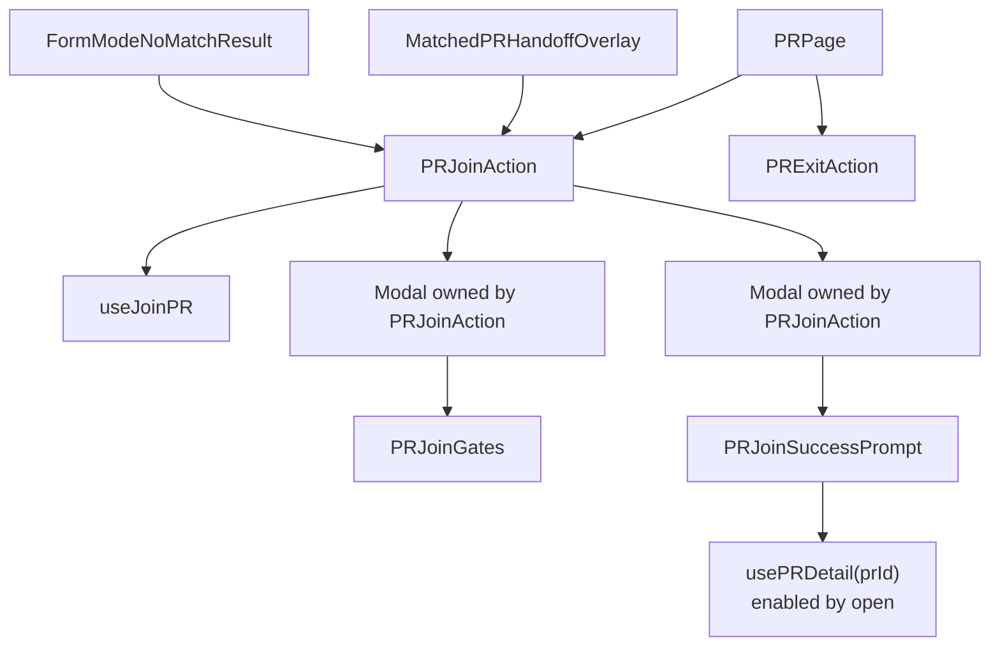
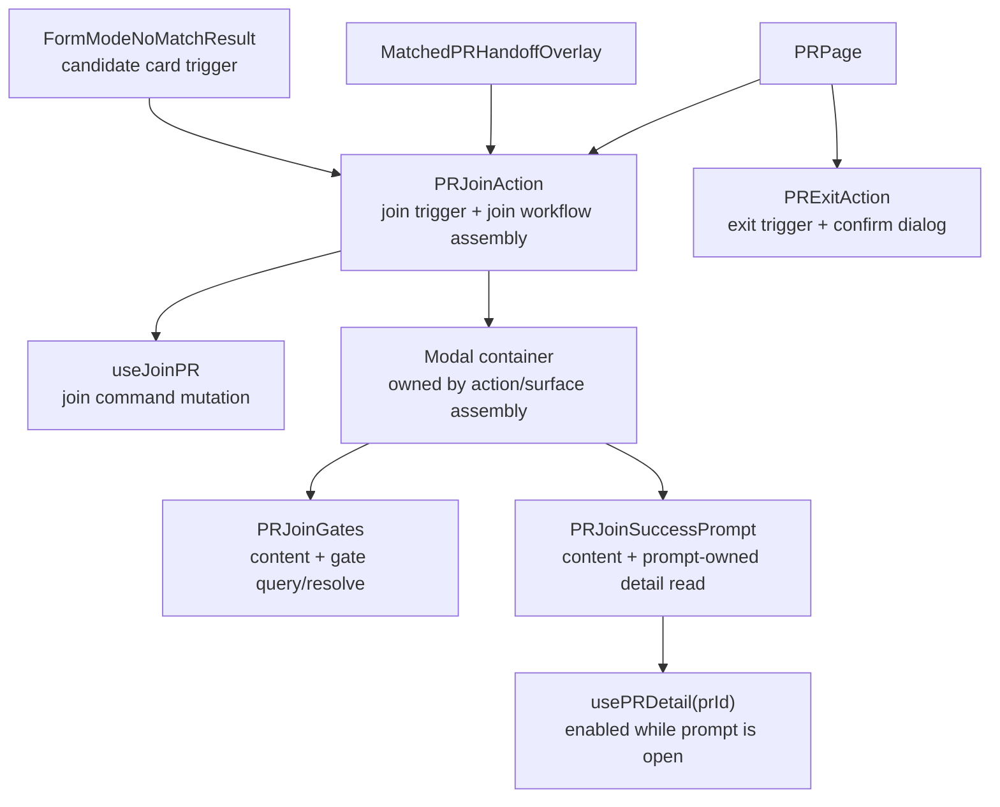

# Join / Waitlist Flow Follow-Up

Status: join / exit slice implemented in working tree; waitlist and pending replay follow-ups remain.

## Objective & Hypothesis

Reduce the remaining maintainability pressure around `PRJoinFlow`, `PRWaitlistFlow`, and page-level pending WeChat replay.

Hypothesis:

- `PRJoinFlow` and `PRWaitlistFlow` still hide large workflow controllers behind slot-based components.
- Removing those abstractions should preserve cross-surface reuse for Form Mode recommendation cards.
- The right target is not to move all flow code directly into route pages; it is to expose explicit join / waitlist vertical action units with small command composables and content primitives.

## Guardrails Touched

- PR detail actions:
  - `PRJoinExitActions.vue`
  - `PRWaitlistActions.vue`
- Existing flow components:
  - `PRJoinFlow.vue`
  - `PRWaitlistFlow.vue`
- Form Mode candidates:
  - `FormModeNoMatchResult.vue`
  - matched / candidate recommendation join entry surfaces
- Route/process handoff:
  - `PRPage.vue`
  - `pending-wechat-action`

## Current Facts

- `PRJoinFlow` was removed in this slice.
- `PRJoinExitActions` was split into `PRJoinAction` and `PRExitAction`.
- PR detail, Form Mode matched handoff, and Form Mode no-match candidate join buttons now compose `PRJoinAction`.
- Form Mode uses the `PRJoinAction` trigger slot to render its own matched / candidate buttons and emit surface-specific telemetry before opening the join workflow.
- Form Mode candidates do not naturally have the full canonical `PRDetailView`; they have candidate summary data plus event / rank attribution.
- `PRJoinSuccessPrompt` owns the prompt-specific `usePRDetail(prId)` read, enabled only while the prompt is open.
- `PRWaitlistFlow` is only used by `PRWaitlistActions` today, but it has the same slot-wrapper shape and owns a similarly heavy workflow.
- `entry=join` is Form Mode route behavior, not reusable join behavior. It must stay with Form Mode / route handoff surfaces and should not enter `useJoinPR`.
- `api/pr/:id/publish`, `/status`, `/content`, `/join`, `/waitlist`, and `/join-gates/:gateKey/resolve` no longer return an `auth` object in JSON body. Session refresh stays in auth transport/session infrastructure.

## Implemented Join / Exit Slice

Changed topology:



Removed:

- `PRJoinFlow.vue`
- `PRJoinExitActions.vue`
- PR UI-layer `applyAuthSession(result.auth)` reads for publish / join / waitlist

Kept intentionally:

- `PRJoinAction` owns join gate modal state, join mutation execution, success prompt modal assembly, and a narrow `trigger` slot for Form Mode.
- `PRExitAction` owns exit visibility, blocked copy, confirmation dialog state, and exit mutation.
- Form Mode owns `entry=join` route behavior after matched / candidate join success.
- `PRWaitlistFlow` remains for a later waitlist slice.

## Join Flow Direction

User raised the key constraint: if `PRJoinFlow` is removed, the replacement must still allow Form Mode recommendation surfaces to customize their join button.

Revised decision:

- Do not replace `PRJoinFlow` with another broad slot/renderless component such as `PRJoinCapability`.
- A broad capability component would preserve the same abstraction problem under a new name.
- The reusable units should be smaller and aligned to real change axes:
  - join mutation command
  - join gate content (`PRJoinGates`), not a `PRJoinGateModal`
  - join success follow-up content (`PRJoinSuccessPrompt`), not a `PRJoinSuccessPromptModal`
  - surface-specific trigger button and surrounding copy
- Modal / card containers remain assembly details owned by the action or surface that needs them.
- Split `PRJoinExitActions` into `PRJoinAction` and `PRExitAction` so join and exit stop sharing one action boundary.
- `PRJoinAction` may expose a narrow trigger slot for custom button rendering, but it must not become a broad workflow slot component again.
- Form Mode matched and candidate surfaces should use `PRJoinAction` directly with a custom trigger slot and attribution context, instead of introducing a separate `FormModeCandidateJoinAction` wrapper.
- `PRJoinSuccessPrompt` should own its PR-detail read by `prId`, enabled only while the success prompt is open. The success prompt's copy, confirmation window, event title, and beta-group QR code are prompt content dependencies, not action assembly dependencies.
- `PRJoinAction` should not fetch or reshape PR detail for `PRJoinSuccessPrompt`; otherwise prompt content changes would keep widening the action boundary.

Candidate target:



Join command input sketch:

```ts
type PRJoinInput = {
  id: number;
  correlationId?: string;
};
```

Layering note:

- Do not introduce `usePRJoinCommand` if `useJoinPR` can own the join command boundary directly.
- `useJoinPR` should remain narrow: issue the join request, invalidate related queries, expose mutation state, and preserve correlation-id propagation.
- It should not own button rendering, modal state, success prompt state, route navigation, or surface attribution.
- The current `entry=join` URL query write is Form Mode / route handoff behavior, not command logic.
- Do not preserve the current body-level auth payload pattern. Backend PR command responses should stop returning `auth`; frontend session sync should happen from auth response infrastructure, such as `x-access-token` handling plus a central session-store sync path.
- Gate resolution also returns `auth` today; remove that response-body auth shape in the same session-boundary cleanup.

Current auth body shape:

```ts
type AuthBodyPayload = {
  role: "anonymous" | "authenticated" | "service" | "analytics";
  roles: Array<"anonymous" | "authenticated" | "service" | "analytics">;
  userId: string;
  accessToken: string;
};
```

Current purpose:

- update backend request auth through `c.set("auth", auth)` so the auth middleware emits `x-access-token`
- duplicate the token and session metadata in response JSON body
- let frontend action components call `applyAuthSession` to sync Pinia and localStorage

Target:

- PR command JSON bodies contain PR/domain results only.
- Access-token issuance and rotation flow through `x-access-token`.
- Frontend session metadata synchronization is centralized in auth/session infrastructure, not repeated in PR publish/join/waitlist/gate UI code.

Surface-owned state:

- trigger rendering
- gate modal open / close
- success prompt open / close
- local error placement
- joined state display

This keeps Form Mode button customization without preserving `PRJoinFlow` as the opaque owner of all join workflow concerns.

Important distinction:

- `PRJoinFlow` owning `usePRDetail` is boundary erosion because it is a broad workflow controller with trigger, modal state, command execution, telemetry, and success-prompt content mixed together.
- `PRJoinSuccessPrompt` owning `usePRDetail` is acceptable because the detail read is scoped to the prompt content itself and enabled only when that content is shown.

## Waitlist Flow Direction

`PRWaitlistFlow` should be handled with the same principle, but the reuse pressure is currently lower.

Target:

- Move waitlist mutation, telemetry, gate state, alternative reminder opt-in, and success prompt state into narrow waitlist action/content primitives.
- Let `PRWaitlistActions` own the PR-detail waitlist button, notice, cancellation dialog, and visibility rules.
- If Form Mode later needs candidate waitlist, compose the same command and content primitives from a narrow waitlist action component rather than re-growing `PRWaitlistFlow`.

This avoids leaving a large slot wrapper in place just because future surfaces might need custom buttons.

## Pending WeChat Replay Follow-Up

Known issue:

- `PRPage` still hand-dispatches pending WeChat replay:
  - `PR_PUBLISH`
  - `PR_JOIN`
  - `PR_EXIT`
  - `PR_WAITLIST`
  - `PR_CONFIRM`

Target:

- Extract `usePRPendingWeChatReplay`.
- `PRPage` should provide a small action registry and route-owned readiness state.
- The replay composable should own:
  - reading / clearing pending action
  - `PR id` matching
  - replay running guard
  - watcher dependencies for viewer/action readiness
  - mapping pending action kind to registered handler

This keeps route/process handoff out of the page template assembly and makes new replayable actions additive.

## Verification For Future Slice

- Keep existing Form Mode candidate join behavior and `data-testid="anchor-event-form-mode.candidate.join"`.
- Keep PR detail join behavior and `data-testid="pr-detail.join.open"`.
- Completed in this slice:
  - `pnpm exec vitest run --project frontend-unit apps/frontend/src/domains/pr/ui/sections/PRParticipationActions.test.ts apps/frontend/src/pages/PRPage.creator-actions.test.ts`
  - `pnpm exec vitest run --project backend-scenario apps/backend/tests/pr-core/pr-draft.scenario.test.ts`
  - `pnpm test:unit:frontend`
  - `pnpm test:unit:backend`
  - `pnpm test:scenario:backend`
  - `pnpm --filter @partner-up-dev/frontend build`
  - `pnpm lint:backend`
  - `pnpm --filter @partner-up-dev/frontend lint:tokens`
  - `git diff --check`
- Still needed for future slices:
  - waitlist flow deletion coverage
  - pending WeChat replay registry coverage
