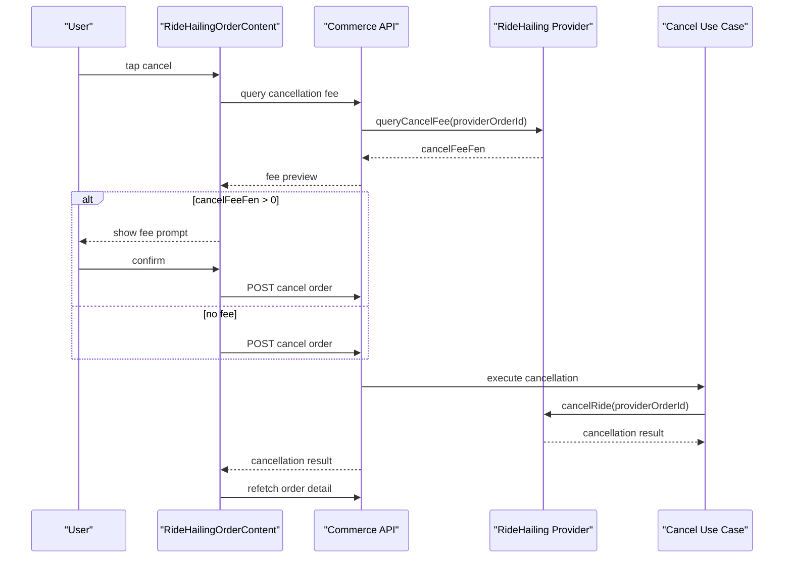

# RideHailing Cancel Fee Precheck

Date: 2026-06-30

## Objective & Hypothesis

Objective:

- fix user-side RideHailing order cancellation so the flow queries the provider
  cancellation fee before executing cancellation
- when the pre-cancel fee is greater than `0`, show the user an explicit fee
  prompt and require confirmation before the destructive cancellation request
- keep cancellation fee as a pre-cancel decision surface only; do not reuse it
  as post-cancel final settlement truth

Hypothesis:

- the provider adapter and fake CaoCao server already expose the required
  cancellation-fee query capability
- the missing slice is a user-facing API plus frontend confirmation workflow
  in Order Detail
- the final bill path should remain governed by provider final-settlement
  query truth, not by the pre-cancel fee preview

## Guardrails Touched

- Typed input route: `Intent`.
- Active mode: `Execute` after impact handshake and explicit start.
- Durable owners:
  - `docs/20-product-tdd/ecommerce-contracts.md`
  - `apps/backend/src/domains/ride-hailing/`
  - `apps/backend/src/domains/trade/`
  - `apps/backend/src/controllers/commerce.controller.ts`
  - `apps/frontend/src/domains/commerce/`
- User-visible surface:
  - `/orders/:orderId`
  - `RideHailingOrderContent`
- Expected local skill before substantial UI work:
  - load `@partner-up-dev/design-web#design-web` guidance because the fix will
    likely compose `@partner-up-dev/design-web` confirmation / dialog primitives

## Current Understanding

- `RideHailingOrderContent` currently calls `cancelRideHailingOrder` directly
  from the cancel button.
- `useCancelOrder()` currently posts directly to
  `POST /api/commerce/orders/:orderId/cancel`.
- The backend cancellation use case calls provider `cancelRide()` and receives
  `cancelFeeFen` only after the order is already cancelled.
- Provider port already has `queryCancelFee()`.
- CaoCao adapter implements `queryCancelFee()` through
  `/common/queryCancelFee`.
- Fake CaoCao server implements `/common/queryCancelFee`.
- Durable contract already says cancellation-fee query is a separate
  pre-cancel decision surface and must not be reused as post-cancel final
  settlement truth.
- Implemented correction:
  - user-side RideHailing cancel now calls
    `GET /api/commerce/orders/:orderId/cancel-fee-preview` first
  - backend validates order ownership, family, cancellable order status,
    RideHailing phase, and provider binding before querying provider fee
  - frontend opens a confirmation dialog with the fee amount only when
    `cancelFeeFen > 0`; no-fee preview success continues to the existing
    cancellation action without an extra confirmation step
  - fake CaoCao now returns phase-based fee preview, so accepted / arrived
    orders can exercise positive-fee UX before cancellation

## Target Behavior

For a cancellable RideHailing order:

1. User taps `取消订单`.
2. Frontend asks backend for a cancellation-fee preview.
3. If preview fails with a recoverable provider/query error, UI should not
   silently cancel; it should show a clear failure state.
4. If `cancelFeeFen <= 0`, frontend proceeds to the destructive cancel mutation
   without adding a new prompt.
5. If `cancelFeeFen > 0`, user must see the fee amount and explicitly confirm
   before frontend calls the destructive cancel mutation.
6. After cancellation succeeds, order detail should refetch and show terminal
   state through the existing order detail query path.

## Candidate Sequence

## Proposed Work Surface

- Backend:
  - added a narrow order-detail-owned cancellation-fee preview endpoint
  - implemented a RideHailing-only query use case that performs access, family,
    status, phase, and provider-binding checks before preview
  - returns `{ orderId, cancelFeeFen, currency }` without provider internals
  - preserved existing `cancelRideHailingOrderFromOrderDetail` execution
    semantics
- Frontend:
  - added a mutation hook for the preview endpoint through Hono RPC client
  - updated `RideHailingOrderContent` so the button opens the preview-confirm
    flow for positive-fee cancellation instead of directly cancelling
  - included stable `data-testid` nodes for confirmation, confirm action,
    dismiss action, and fee text
- Tests:
  - added backend provider-adapter coverage for `queryCancelFee`
  - added fake CaoCao state coverage for phase-based preview fee
  - added system scenario for user-side cancel with positive fee requiring
    prompt
  - preserved and stabilized the existing no-fee cancellation scenario

## Risks / Invariants

- Do not treat `queryCancelFee()` as final bill truth.
- Do not create a bill from the fee preview.
- Do not bypass order creator access control.
- Do not expose provider internals to the frontend payload.
- Do not make zero-fee cancellation depend on stale frontend assumptions; the
  destructive cancel response remains authoritative for the actual cancellation
  result.
- Keep the implementation reviewable; avoid broad cancellation architecture
  refactors unless evidence requires them.

## Verification

Passed:

- `pnpm --filter @partner-up-dev/backend typecheck`
- `pnpm check:type:frontend`
- `pnpm --filter @partner-up-dev/fake-caocao-server typecheck`
- `pnpm exec vitest run --config vitest.backend.config.ts --project backend-unit apps/backend/src/domains/ride-hailing/services/caocao-provider.test.ts`
- `pnpm --filter @partner-up-dev/fake-caocao-server exec vitest run src/state.test.ts`
- `pnpm exec vitest run --project system-scenario tests/scenario/commerce/ride-hailing-ordering.scenario.test.ts -t commerce_ride_hailing_order_detail --reporter=dot`
- `pnpm check:format`
- `pnpm check:lint`
- `git diff --check`

Observed evidence:

- positive-fee scenario shows `¥8.00` before confirmation and then reaches
  order status `CANCELLED`
- no-fee scenario performs the precheck, does not require a new confirmation
  prompt, and then reaches order status `CANCELLED`
- lint naming audit remains report-only and reports the existing
  `RideHailingOrderContent` / `RideHailingOrderingContent` weak-name findings

## Next Step

Implementation and focused verification complete. Ready for review or broader
static gate if needed.

Impact handshake:

- Address and Object:
  - `docs/10-prd/behavior/rules-and-invariants.md`
  - `docs/20-product-tdd/ecommerce-contracts.md`
  - `apps/backend/src/controllers/commerce.controller.ts`
  - RideHailing / Trade backend use-case code
  - `apps/frontend/src/domains/commerce/queries/useCommerce.ts`
  - `apps/frontend/src/domains/commerce/ui/order-detail/RideHailingOrderContent.vue`
  - focused fake-provider and scenario tests
- State Diff: user-side RideHailing cancellation changes from direct destructive
  cancel to pre-cancel fee preview, plus explicit confirmation before cancel
  when the previewed fee is greater than zero.
- Blast Radius Forecast: Hono RPC types, frontend query hook, RideHailing order
  detail UI state, fake CaoCao fee-preview semantics, and focused scenarios.
- Invariants Check:
  - do not use cancellation-fee preview as final bill truth
  - do not create bills from preview
  - keep creator-only user-side access control
  - do not expose provider snapshots in user payload
  - keep admin cancellation behavior unchanged
- Verification: typecheck backend/frontend plus focused provider and RideHailing
  cancellation scenarios.
