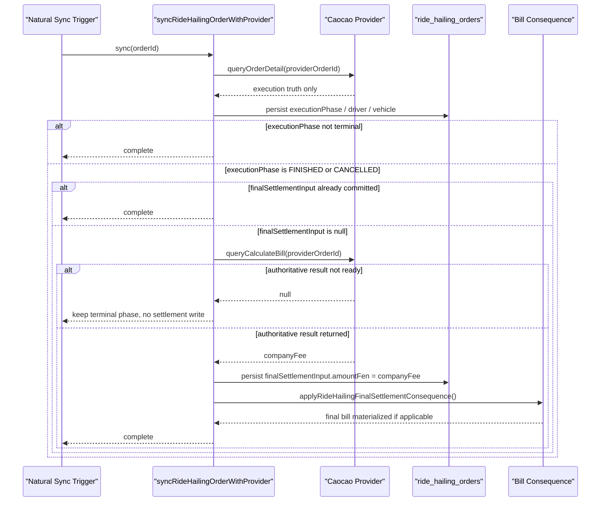

# RideHailing Cancel Final Bill Diagnosis

Date: 2026-06-30

## Objective & Hypothesis

Objective:

- explain why a pre-environment RideHailing order cancelled during `DISPATCHING`
  still produced a `12.7` bill while provider fee query showed `0`
- turn the diagnosis into two executable invariants for the RideHailing
  fulfillment mechanism:
  1. final settlement input must come from the ride-hailing provider's
     authoritative payable-query result
  2. cancellation-fee query is pre-cancellation only and must not be reused as
     post-cancellation settlement truth

Hypothesis:

- the bill is not created by the cancellation flow itself
- the current implementation mixes two provider truth surfaces:
  `queryOrderDetailV2`-derived amount parsing and cancellation-fee querying
- the correct durable fix is not "cancel => 0", but aligning
  `ride_orders.final_settlement_input` to the provider's authoritative final
  settlement payable-query path and restricting cancellation-fee queries to
  pre-cancellation decision support

## Guardrails Touched

- Typed input route: `Reality`
- Active mode: `Execute` after correcting the authoritative provider contract
- Durable owners under inspection:
  - `apps/backend/src/domains/ride-hailing/`
  - `apps/backend/src/domains/trade/`
  - `docs/20-product-tdd/ecommerce-contracts.md`
- Mutation boundary:
  - task packet
  - durable contract doc
  - RideHailing provider adapter, observation, sync use-case, and test fixtures

## Verification

- source trace completed for cancellation path and final-bill creation path
- durable contract updated in `docs/20-product-tdd/ecommerce-contracts.md`
- official CaoCao doc correction confirmed:
  - `2.26 queryCalculateBill` is the payable source
  - `2.15 queryBill` is payment/reconciliation truth, not the payable source
- targeted verification completed:
  - `pnpm --filter @partner-up-dev/backend typecheck`
  - `pnpm --filter @partner-up-dev/fake-caocao-server typecheck`
  - backend unit:
    `provider-order-observation.test.ts`, `caocao-provider.test.ts`
  - fake provider unit:
    `packages/fake-caocao-server/src/server.test.ts`
  - backend scenario:
    `apps/backend/tests/ride-hailing/caocao-callback-route.scenario.test.ts`

## Current Understanding

- `cancelRideHailingOrder*` calls provider `cancelRide`, but does not create a
  bill directly
- the original broken path diagnosed at the start of this task was:
  - `syncRideHailingOrderWithProvider()` triggered
    `applyRideHailingFinalSettlementConsequence()` whenever
    `observation.finalSettlementInput !== null` or an old settlement already
    existed
  - `observeProviderOrderDetail()` created `finalSettlementInput` from any
    non-null `detail.finalAmountFen`
  - `parseCaocaoOrderDetail()` derived `finalAmountFen` from:
    - top-level `finalAmountFen`
    - or top-level `actual_price`
    - or nested `orderFeeVO.totalFee` / `actualPrice` / `actual_price`
- `applyRideHailingFinalSettlementConsequence()` still creates the bill
  whenever `rideOrder.finalSettlementInput` exists; it does not verify
  `executionPhase === FINISHED`
- local source-backed reproduction now confirms:
  - provider detail `phase = CANCELLED`
  - nested `orderFeeVO.totalFee = 1270`
  - adapter output `detail.finalAmountFen = 1270`
  - observer output `executionPhase = CANCELLED` and
    `finalSettlementInput.amountFen = 1270` at the same time
- latest source correction:
  - earlier diagnosis used the wrong CaoCao source page
  - the authoritative source for local final settlement input should be
    `queryCalculateBill`, not `queryBill`
- user-aligned target invariant is now:
  - provider authoritative final settlement truth must come from the provider
    payable query rather than current order-detail fallback parsing
  - cancellation fee remains a pre-cancel decision/query surface only
- current frontend order-detail polling stops on terminal RideHailing phases, so
  `FINISHED` / `CANCELLED` do not create a high-frequency post-terminal retry
  loop by default
- for this slice, automatic background retry is not required yet; the simpler
  accepted model is:
  - terminal phase sync may best-effort call `queryCalculateBill`
  - if `queryCalculateBill` has no authoritative result yet, keep
    `finalSettlementInput = null`
  - rely on the next natural sync trigger rather than introducing a
    job-backed retry mechanism now
- implementation now matches durable truth:
  - provider order-detail sync only updates execution truth
  - CaoCao final settlement now uses `queryCalculateBill`
  - `finalSettlementInput.amountFen` now binds `companyFee`
  - status-not-ready provider responses are normalized to `null`
    final-settlement input rather than blocking terminal sync

## Ranked Hypotheses

1. Current final-settlement source is wrong: local code derives settlement from
   order-detail parsing, while the intended provider-authoritative source should
   be the dedicated payable query path.
2. Current cancellation-fee surface is semantically narrow and should stay
   pre-cancel only; comparing it with post-cancel order payable truth produces
   a false contradiction.
3. Even if `orderFeeVO.totalFee` can sometimes match provider truth, the local
   mechanism is still structurally wrong because it does not bind
   `finalSettlementInput` to the authoritative query contract.

## Evidence Notes

- Adapter fallback:
  `apps/backend/src/domains/ride-hailing/services/caocao-provider.ts`
  reads `orderFeeVO.totalFee` into `finalAmountFen`
- Observation bug:
  `apps/backend/src/domains/ride-hailing/services/provider-order-observation.ts`
  emits `finalSettlementInput` on any non-null `finalAmountFen`, even when
  phase maps to `CANCELLED`
- Bill-creation gate:
  `apps/backend/src/domains/ride-hailing/use-cases/sync-ride-hailing-order-with-provider.ts`
  plus
  `apps/backend/src/domains/ride-hailing/use-cases/apply-ride-hailing-final-settlement-consequence.ts`
  only check presence of `finalSettlementInput`, not ride execution phase or
  cancelled order status
- Test gap:
  `tests/scenario/commerce/ride-hailing-ordering.scenario.test.ts` verifies
  cancellation UI state but does not assert bill absence

## Agreed Target Invariants

1. `ride_orders.final_settlement_input` must be derived from the
   ride-hailing provider's authoritative final payable query result.
   For CaoCao, that means `queryCalculateBill`, not the current
   `queryOrderDetailV2` amount fallback and not `queryBill`.
2. For CaoCao, `ride_orders.final_settlement_input.amountFen` must bind
   `companyFee`:
   `companyFee` is the amount PartnerUp owes CaoCao, so it is also the amount
   PartnerUp should charge the user.
3. Cancellation-fee query is only used before cancellation to inform the
   cancellation decision; it must not be treated as post-cancellation final
   settlement truth.
4. Local terminal RideHailing phases that may trigger `queryCalculateBill` are
   only `FINISHED` and `CANCELLED`.
5. `queryCalculateBill` failure or no-result must not roll back or block local
   terminal phase synchronization.

## Accepted Retry Model

- This slice does not introduce a new job-backed retry mechanism.
- `queryCalculateBill` runs as a best-effort follow-up when a local
  RideHailing order is observed in `FINISHED` or `CANCELLED` and
  `finalSettlementInput` is still `null`.
- If `queryCalculateBill` returns no authoritative result yet, persist nothing
  and keep `finalSettlementInput = null`.
- Later natural sync triggers may retry implicitly, for example:
  - provider callback
  - user reopening order detail
  - admin viewing the order
- If runtime evidence later shows frequent first-attempt misses, a dedicated
  retry mechanism can be added in a later slice.

## Latest Sequence Diagram

## Next Step

1. Durable contract and production code are now aligned on
   `queryCalculateBill -> companyFee -> finalSettlementInput.amountFen`.
2. Deferred by user choice for a later slice:
   - `FAILED` semantic cleanup
   - provider-driven vehicle type / order item resolution synchronization
   - dedicated retry/backoff mechanism beyond natural sync triggers
   - historical dirty-data repair
