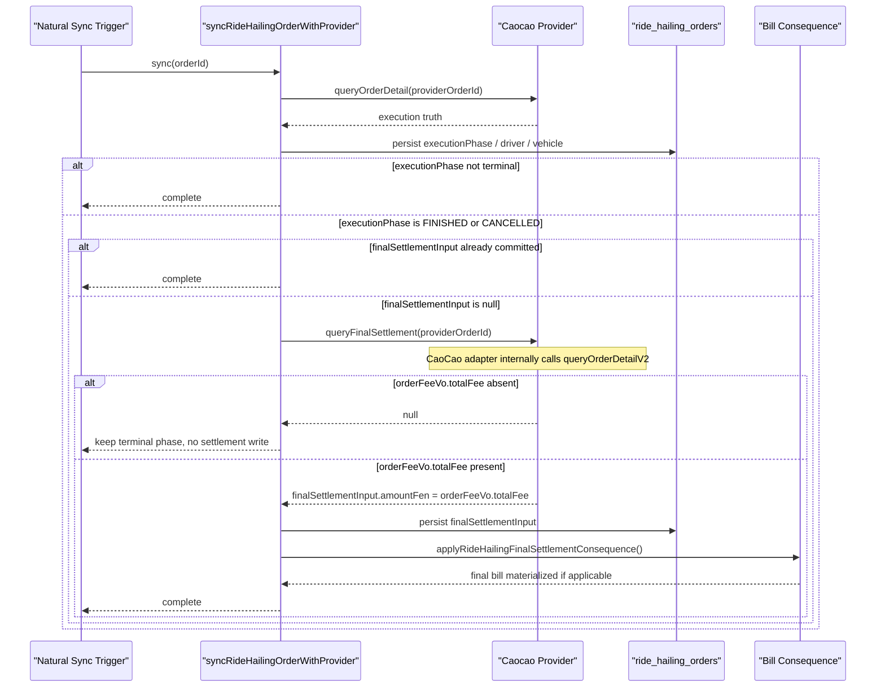

# RideHailing Cancel Final Bill Diagnosis

Date: 2026-06-30

## Objective & Hypothesis

Objective:

- explain why a pre-environment RideHailing order cancelled during `DISPATCHING`
  still produced a `12.7` bill while provider fee query showed `0`
- turn the diagnosis into two executable invariants for the RideHailing
  fulfillment mechanism:
  1. final settlement input must come from the ride-hailing provider's
     authoritative query result available in the current integration boundary
  2. cancellation-fee query is pre-cancellation only and must not be reused as
     post-cancellation settlement truth

Hypothesis:

- the bill is not created by the cancellation flow itself
- the current implementation mixes two provider truth surfaces:
  `queryOrderDetailV2`-derived amount parsing and cancellation-fee querying
- the correct durable fix is not "cancel => 0", but aligning
  `ride_orders.final_settlement_input` to the provider's authoritative final
  settlement source that is actually available in the current CaoCao
  integration boundary, while restricting cancellation-fee queries to
  pre-cancellation decision support

## Guardrails Touched

- Typed input route: `Reality`
- Active mode: `Execute`
- Durable owners under inspection:
  - `apps/backend/src/domains/ride-hailing/`
  - `apps/backend/src/domains/trade/`
  - `docs/20-product-tdd/ecommerce-contracts.md`
- Mutation boundary:
  - task packet
  - durable contract doc

## Verification

- source trace completed for cancellation path and final-bill creation path
- durable contract updated in `docs/20-product-tdd/ecommerce-contracts.md`
- latest pre-environment evidence confirmed:
  - `queryOrderDetailV2` succeeds for finished orders and exposes provider phase
    / status label
  - `queryCalculateBill` is not usable for the current CaoCao app credentials;
    observed provider failure:
    `453 app api config not existed or disabled`
  - current durable target therefore falls back to:
    `queryOrderDetailV2.orderFeeVo.totalFee`
- current implementation verification completed:
  - `pnpm exec vitest run --config vitest.backend.config.ts --project backend-unit apps/backend/src/domains/ride-hailing/services/caocao-provider.test.ts`
  - `pnpm exec vitest run --config vitest.backend.config.ts --project backend-scenario apps/backend/tests/ride-hailing/caocao-callback-route.scenario.test.ts`

## Current Understanding

- `cancelRideHailingOrder*` calls provider `cancelRide`, but does not create a
  bill directly
- the original broken path diagnosed at the start of this task was:
  - `syncRideHailingOrderWithProvider()` triggered
    `applyRideHailingFinalSettlementConsequence()` whenever
    `observation.finalSettlementInput !== null` or an old settlement already
    existed
  - `observeProviderOrderDetail()` created `finalSettlementInput` from any
    non-null `detail.finalAmountFen`
  - `parseCaocaoOrderDetail()` derived `finalAmountFen` from:
    - top-level `finalAmountFen`
    - or top-level `actual_price`
    - or nested `orderFeeVO.totalFee` / `actualPrice` / `actual_price`
- `applyRideHailingFinalSettlementConsequence()` still creates the bill
  whenever `rideOrder.finalSettlementInput` exists; it does not verify
  `executionPhase === FINISHED`
- local source-backed reproduction now confirms:
  - provider detail `phase = CANCELLED`
  - nested `orderFeeVO.totalFee = 1270`
  - adapter output `detail.finalAmountFen = 1270`
  - observer output `executionPhase = CANCELLED` and
    `finalSettlementInput.amountFen = 1270` at the same time
- latest source correction:
  - earlier diagnosis first corrected from `queryBill` to
    `queryCalculateBill`
  - latest pre-environment log evidence then showed that
    `queryCalculateBill` is not enabled for the current CaoCao app
    credentials, so it is not part of the implementable contract for this
    integration slice
- user-aligned target invariant is now:
  - provider authoritative final settlement truth must still come from a
    provider query result
  - for the current CaoCao integration surface, that source is
    `queryOrderDetailV2.orderFeeVo.totalFee`
  - cancellation fee remains a pre-cancel decision/query surface only
- current frontend order-detail polling stops on terminal RideHailing phases, so
  `FINISHED` / `CANCELLED` do not create a high-frequency post-terminal retry
  loop by default
- for this slice, automatic background retry is not required yet; the simpler
  accepted model is:
  - each natural sync first reads provider order detail for execution truth
  - if the order is terminal and `finalSettlementInput` is still null, backend
    then calls `queryFinalSettlement()`
  - for CaoCao, that adapter method internally rereads `queryOrderDetailV2`
    and extracts `orderFeeVo.totalFee`
  - if `orderFeeVo.totalFee` is still absent, keep `finalSettlementInput = null`
  - rely on the next natural sync trigger rather than introducing a
    job-backed retry mechanism now
- implementation now matches the revised durable truth:
  - `RideHailingProviderPort` remains unchanged
  - CaoCao adapter `queryFinalSettlement()` now internally rereads
    `queryOrderDetailV2`
  - for CaoCao, `finalSettlementInput.amountFen` now binds
    `orderFeeVo.totalFee`
  - missing `orderFeeVo.totalFee` returns `null` final settlement without
    blocking terminal phase sync
- `orderFeeVo.companyPayAmount` exists in the legacy CaoCao schema but is not
  the accepted target for this slice:
  - legacy code still reads `orderFeeVo.totalFee`
  - available schema comments describe `companyPayAmount` as enterprise-paid
    amount, which is too late-bound for the current bill-creation flow

## Ranked Hypotheses

1. The current missing-bill case for finished orders is caused by an
   integration-boundary mismatch: code attempts `queryCalculateBill`, but the
   current CaoCao app credentials cannot use that API.
2. The correct CaoCao source for the current slice is therefore not a separate
   payable API but the amount field already returned by
   `queryOrderDetailV2.orderFeeVo.totalFee`.
3. The cancellation-fee surface remains semantically narrow and should stay
   pre-cancel only; comparing it with post-cancel order payable truth still
   produces a false contradiction.

## Evidence Notes

- Adapter implementation:
  `apps/backend/src/domains/ride-hailing/services/caocao-provider.ts`
  now maps `queryFinalSettlement()` to
  `queryOrderDetailV2.orderFeeVo.totalFee`
- Execution and settlement split:
  `apps/backend/src/domains/ride-hailing/use-cases/sync-ride-hailing-order-with-provider.ts`
  first persists execution truth from `queryOrderDetail()`, then separately
  attempts terminal final settlement through `queryFinalSettlement()`
- Test gap:
  `tests/scenario/commerce/ride-hailing-ordering.scenario.test.ts` verifies
  cancellation UI state but does not assert bill absence
- Current pre-environment log evidence:
  `scratch/log-20260630.txt`
  shows:
  - `queryOrderDetailV2` success with `providerPhase = "5"` and
    `providerStatusLabel = "待支付"`
  - local terminal sync attempting final settlement
  - `queryCalculateBill` failure with provider code `453`
    `app api config not existed or disabled`

## Agreed Target Invariants

1. `ride_orders.final_settlement_input` must be derived from the
   ride-hailing provider's authoritative query result available in the current
   integration boundary.
   For CaoCao in this slice, that means
   `queryOrderDetailV2.orderFeeVo.totalFee`, not `queryCalculateBill`,
   not `queryBill`, and not cancellation-fee preview output.
2. For CaoCao in this slice,
   `ride_orders.final_settlement_input.amountFen` must bind
   `orderFeeVo.totalFee`.
3. For CaoCao in this slice, `settlement-ready` means:
   - the local RideHailing execution phase is terminal
   - `queryFinalSettlement()` has been attempted on that sync path
   - the query result exposes non-null `queryOrderDetailV2.orderFeeVo.totalFee`
4. Cancellation-fee query is only used before cancellation to inform the
   cancellation decision; it must not be treated as post-cancellation final
   settlement truth.
5. Local terminal RideHailing phases that may trigger final-settlement capture
   are only `FINISHED` and `CANCELLED`.
6. Absence of `orderFeeVo.totalFee` must not roll back or block local terminal
   phase synchronization.

## Accepted Retry Model

- This slice does not introduce a new job-backed retry mechanism.
- When a local RideHailing order is observed in `FINISHED` or `CANCELLED` and
  `finalSettlementInput` is still `null`, backend may call
  `queryFinalSettlement()`.
- For CaoCao in this slice, `queryFinalSettlement()` internally rereads
  `queryOrderDetailV2` and commits final settlement only if
  `orderFeeVo.totalFee` is present.
- If that final-settlement query does not expose `orderFeeVo.totalFee`, persist
  nothing and keep `finalSettlementInput = null`.
- Later natural sync triggers may retry implicitly, for example:
  - provider callback
  - user reopening order detail
  - admin viewing the order
- If runtime evidence later shows frequent first-attempt misses, a dedicated
  retry mechanism can be added in a later slice.

## Latest Sequence Diagram

## Next Step

1. Deferred by user choice for a later slice:
   - `FAILED` semantic cleanup
   - provider-driven vehicle type / order item resolution synchronization
   - dedicated retry/backoff mechanism beyond natural sync triggers
   - historical dirty-data repair
