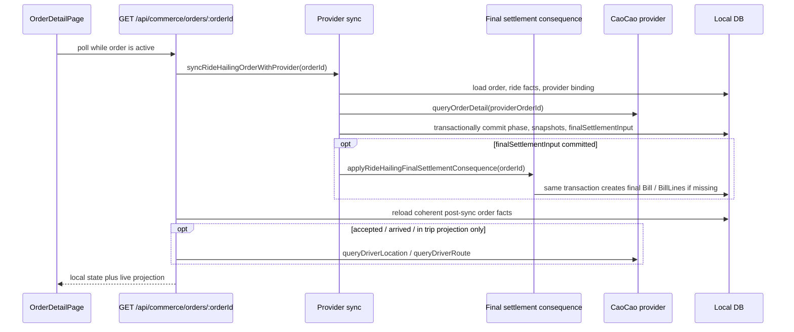
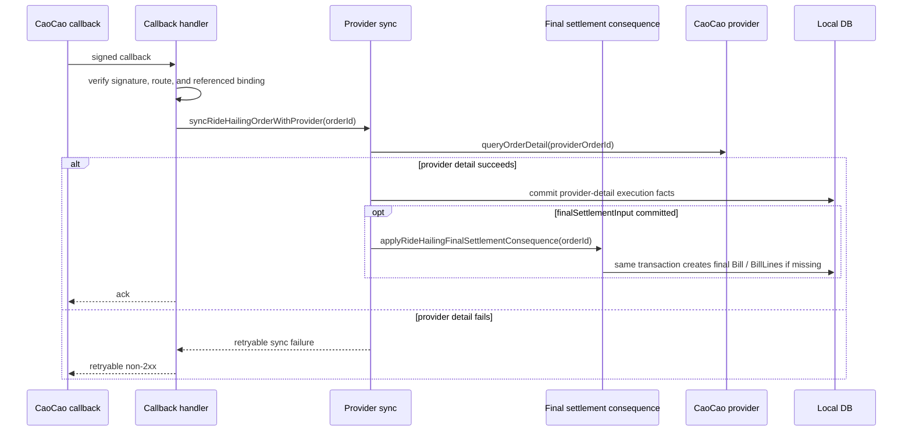

# RideHailing Provider Reconcile

## Objective & Hypothesis

- Objective: make RideHailing order status durable even when CaoCao callback
  notifications are delayed, missing, duplicated, or incomplete.
- Hypothesis: RideHailing should follow the payment provider pattern: both user
  polling and provider callbacks may trigger provider-side status queries. CaoCao
  callback payload should be treated as routing / authentication / notification
  material, not as execution truth. The provider sync path should query provider
  detail as the SSoT, normalize and commit local RideHailing execution facts,
  then apply create-order-time locked Offer / SPU / SKU pricing semantics to the
  final provider amount and materialize final billing in the same database
  transaction.

## Guardrails Touched

- Order detail polling performance and provider API load.
- CaoCao callback reliability and idempotency.
- RideHailing execution phase correctness.
- Final settlement bill creation.
- Payment-like reconciliation semantics: query paths and notify paths should
  converge on the same provider sync code, while downstream bill creation stays
  a separate effect/consequence after local facts are committed.

## Current Understanding

- Input type: Reality / Constraint.
- Active mode: Explore / Solidify.
- The frontend `OrderDetailPage` calls `useCommerceOrderDetail`.
- `useCommerceOrderDetail` polls `GET /api/commerce/orders/:orderId` every
  `2s` while RideHailing execution phase is one of:
  - `INITIATING`
  - `DISPATCHING`
  - `ACCEPTED`
  - `ARRIVED_AT_PICKUP`
  - `IN_TRIP`
- Backend order detail path:
  - `apps/backend/src/controllers/commerce.controller.ts`
  - `apps/backend/src/domains/trade/use-cases/rental-ordering-flow.ts`
  - `apps/backend/src/domains/trade/use-cases/ride-hailing-ordering-flow.ts`
- Current RideHailing detail projection does call
  `RideHailingProviderPort.queryOrderDetail` when a provider order id exists.
- Current provider query result is projection-only:
  - it populates `rideHailing.live`
  - it can enrich driver and vehicle display if local snapshots are empty
  - it does not update `ride_hailing_orders`
  - it does not update `trade_orders`
  - it does not create final bills
- CaoCao callback currently verifies and parses callback payload, then updates
  local `RideHailingOrder` from callback fields. It does not re-query provider
  detail before applying local consequences.
- Existing final Bill creation in the callback handler manually splits the final
  amount over `order.participants`. That bypasses the existing order
  `splitRuleSnapshot`, Bill seed/use-case, and any explicit decision about how
  RideHailing final settlement should relate to SKU dynamic quote pricing and
  Offer pricing policy.
- Confirmed decision: CaoCao provider detail is the SSoT for final amount,
  driver / vehicle snapshots, and terminal provider state. Callback payload is
  only a notification / routing / authentication input.
- Confirmed decision: CaoCao provider final amount is not the Bill target total
  by itself. It is the final provider usage amount that must still go through
  create-order-time locked Offer / SPU / SKU pricing policy semantics before Bill
  materialization.
- Revised decision: do not extend the order snapshot model solely for historical
  recomputation safety, because RideHailing final billing is not launched and
  there are no production historical RideHailing orders to protect.
- Confirmed decision: final billing uses create-order-time locked Offer / SPU /
  SKU pricing policy for future active orders. This makes order-owned pricing
  substrate persistence part of this task.
- Confirmed non-goal for this task: do not use SKU / quote snapshots merely to
  polish stable vehicle display or Bill label / description copy.

## Payment Pattern Reference

Payment already uses a stronger model:

- `getPaymentTx` decodes the payment tx reference, queries the payment provider,
  and reconciles local `BillLine` state.
- If provider query reports success, local state is marked settled and
  `applyPaymentSettlementConsequence` runs.
- Payment notifications also parse provider notification, update local state,
  and run the same settlement consequence.
- Charge creation checks existing provider execution by querying provider first
  when a line is already bound.

Relevant files:

- `apps/backend/src/domains/payment/use-cases/payment-contract.ts`
- `apps/backend/src/domains/payment/use-cases/payment-execution.ts`
- `apps/backend/src/domains/payment/use-cases/payment-notifications.ts`

## Gap

RideHailing currently has provider polling as a display-time read, not a durable
reconciliation step.

This means:

- if CaoCao callback is lost, local `executionPhase` may remain stale even
  though order detail polling already queried provider status;
- if CaoCao callback arrives with partial fields, local snapshots and final
  settlement may remain weaker than provider detail;
- if callback and polling race, there is no single idempotent provider sync that
  owns local execution fact updates, nor a separate idempotent consequence for
  final bill creation;
- provider query failure can currently endanger the detail endpoint instead of
  being treated as best-effort reconciliation.

## Architecture Review

The earlier contract was too broad when it said one reconciler should own
provider phase mapping, driver/vehicle snapshots, final settlement, and final
Bill creation.

Better boundary:

- Provider sync owns provider truth ingestion:
  - verify local order/provider binding assertions from the caller;
  - use callback payload only to authenticate, route, and locate the referenced
    provider order;
  - query provider detail as the authoritative provider observation;
  - normalize provider phase into local `RideHailingExecutionPhase`;
  - commit stronger driver and vehicle snapshots;
  - commit `finalSettlementInput` when provider final amount is authoritative.
- Final billing stays a downstream consequence:
  - triggered when final settlement input is committed on
    `ride_hailing_orders`;
  - applied in the same database transaction as the final settlement commit so a
    local `FINISHED` / final settlement state cannot be persisted without its
    final Bill;
  - implemented as an idempotent use case such as
    `applyRideHailingFinalSettlementConsequence`;
  - owns final Bill / BillLine creation rules and no-ops if the final Bill
    already exists.

This matches the existing Product TDD claim that the final Bill is created only
after provider final settlement input is committed, not lazily from Order
Detail reads. If Order Detail polling triggers provider sync, that request may
also invoke the consequence in the same transaction, but the consequence is
still driven by the committed RideHailing fact, not by projection assembly.

## Deeper Architecture Risks

The final-Bill boundary issue points to several broader design risks in the
current plan and implementation.

### Durable Facts vs Live Projection

Do not let one provider sync path own both durable execution facts and live map
telemetry.

- Durable facts:
  - provider order phase normalized into local execution phase;
  - driver / vehicle snapshots worth persisting;
  - final settlement input.
- Live projection:
  - driver location;
  - navigation route;
  - ETA / remaining distance.

Live geometry is high-frequency display state. It should remain best-effort
projection data or move to a dedicated tracking API, consistent with the
Product TDD note that high-frequency ride tracking should not force the whole
Order Detail projection to become a high-frequency payload.

### Provider Detail As State Machine Source

The current code has two phase surfaces:

- callback event ids are mapped in
  `handle-caocao-order-status-callback.ts`;
- query detail exposes raw provider `phase/status` strings from the CaoCao
  adapter.

The target design should remove callback event ids from business state updates.
Callback should only notify the backend to reconcile by provider detail. This
avoids delayed callback payloads regressing local state.

The implementation still needs one provider-detail mapping rule for:

- provider detail observation -> local `RideHailingExecutionPhase`;
- unsupported / unknown provider detail phases;
- provider detail terminal states such as `FINISHED` and `CANCELLED`.

No separate callback-event state machine should remain.

### Snapshot Merge Semantics

Provider-detail observations should merge snapshots, not blindly replace them.

- non-empty provider fields may fill missing local fields;
- missing / empty provider detail fields should not erase existing driver /
  vehicle snapshots;
- if two non-empty values conflict, the rule should be explicit:
  provider-detail observation wins, or newer observation wins only when
  timestamp is trustworthy.

### Callback Query Failure Policy

Because callback payload is not business truth, a provider detail query failure
means the callback cannot safely update local execution facts.

Preferred shape:

- verify signature and local provider binding;
- use callback fields only to locate the referenced local order / provider
  binding;
- attempt provider detail query;
- if query succeeds, apply provider-detail observation;
- if query fails, do not mutate local execution facts and make the failure
  observable;
- return retryable non-2xx to CaoCao because there is no callback-payload
  fallback.

Confirmed decision: callback-triggered provider detail query failure returns a
retryable non-2xx response to CaoCao.

### Read Path Side Effects

`GET /api/commerce/orders/:orderId` may trigger best-effort provider sync, but
the read projection must be built from a coherent post-sync state.

Implications:

- after sync mutates local order / ride facts / bill state, reload the facts
  used for the response or build the response from returned synchronized facts;
- provider query failure should not fail the whole order detail response;
- avoid writing on every 2s poll when the normalized facts have not changed;
- terminal phases should stop high-frequency provider polling once local state
  is caught up.

### Consequence Reliability

If final settlement is committed and Bill creation fails, frontend polling may
stop because the phase is already `FINISHED`. Relying only on the next Order
Detail poll is therefore unsafe.

Decision for this slice: commit final settlement input and final Bill creation
inside one database transaction. The consequence remains a separate use case /
domain boundary, but it must be callable with the same transaction executor so
there is no durable `finalSettlementInput` without a matching final Bill.

### Final Bill Derivation

The final Bill should not be hand-built from `order.participants.length`.

Required existing capabilities to reuse:

- `TradeOrder.splitRuleSnapshot` for payer allocation;
- `materializeChargeLinesFromSplitRule` for deterministic fen distribution;
- `createBillFromSeed` / Bill-owned creation semantics;
- order-time SKU snapshots already present in choice-set candidates /
  resolution.

Provider final amount is the authoritative usage-based settlement input, but it
is not the customer-facing Bill target total by itself. The final Bill target
must be derived by applying Offer / SPU / SKU pricing policy to that provider
amount.

Historical-order compatibility is not a driver for snapshot expansion in this
slice because the RideHailing final-billing flow is not launched. The driver is
forward-looking active-order semantics: final billing must use the pricing
policy locked at create-order time, not whatever policy is current when the
bill is created.

This is a Trade order-base responsibility, not a RideHailing-only durable
concept. RideHailing is the first order family that needs to consume the locked
pricing substrate after execution because its final provider amount arrives
later. The substrate should therefore live on the base order / order item
snapshot surface, while RideHailing-specific facts remain on
`ride_hailing_orders`.

Therefore this task should extend the order snapshot model with the missing
base-order pricing substrate needed for later final pricing.

- final provider amount from CaoCao detail becomes the final dynamic quote input;
- create-order-time locked pricing policy derives the final customer-facing Bill
  target total;
- allocate the derived Bill target total via the order split rule;
- use Bill seed/use-case for materialization;
- keep SKU / quote snapshot display-copy improvements out of this task unless
  they are required for pricing substrate correctness.

### Cancellation Freshness

RideHailing cancellation currently gates on local `DISPATCHING`. If callbacks
are delayed or lost, that phase may be stale. The cancellation write path should
sync provider execution state before deciding whether cancellation is still
allowed, then re-check local eligibility.

## Impact Handshake For Execute

Address and object:

- `apps/backend/src/domains/trade/services/pricing-application.ts`: add or reuse
  an entrypoint that can price RideHailing final provider amount through the
  create-order-time locked Offer / SPU / SKU pricing policy.
- `apps/backend/src/domains/trade/use-cases/create-order.ts`: populate the base
  order locked pricing substrate at create-order time for order types that may
  need later pricing re-application.
- `apps/backend/src/domains/trade/model/order.ts` and
  `apps/backend/src/entities/trade-order.ts`: persist the order-owned pricing
  substrate needed for locked final pricing.
- `apps/backend/src/domains/ride-hailing/use-cases/*`: provider-detail sync and
  callback notify handling.
- `apps/backend/src/domains/bill/use-cases/*` and bill services: final Bill
  materialization via Bill seed and split rule.
- Scenario fixtures / migrations / tests that construct RideHailing order item
  snapshots.

State diff:

- From: RideHailing final amount is persisted from callback and final Bill is
  manually split over participants.
- To: provider detail final amount is a SSoT usage input; create-order-time
  locked Offer / SPU / SKU pricing policy derives final Bill target; Bill lines
  are materialized from the order split rule in the same transaction as final
  settlement commit.

Blast radius forecast:

- Trade order item snapshot schema and test fixtures.
- RideHailing create-order and order-detail projection.
- CaoCao callback semantics and retry behavior.
- Bill creation idempotency and split allocation.
- PricingApplication API surface.
- Scenario tests for RideHailing order finish and final payment.

Invariants:

- Callback payload never writes business execution facts.
- There is no production historical RideHailing final-billing data to preserve.
- Final Bill derivation must use create-order-time locked pricing policy.
- `finalSettlementInput` must not commit without its corresponding final Bill.
- Provider query failure must not break normal Order Detail reads.
- Final Bill materialization remains idempotent.

Verification:

- Unit tests for final pricing derivation through create-order-time locked
  pricing policy.
- Unit tests for pricing substrate persistence.
- Unit tests for callback-as-notify and provider-detail-only fact updates.
- Unit tests for same-transaction final settlement + final Bill materialization.
- Backend scenario tests for lost callback, callback retryable provider-detail
  failure, final Bill pricing policy application, and split-rule allocation.
- Existing RideHailing browser scenario remains green after final Bill flow.

## Debt Cleanup In Scope

Clean these debts while implementing this task because they sit on the same
behavioral surface:

- Move `ensureRideFinalBill` out of
  `handle-caocao-order-status-callback.ts` into a dedicated final-settlement
  consequence/use-case.
- Remove callback-derived business writes:
  - callback event id -> execution phase mapping;
  - callback raw driver / vehicle snapshot extraction;
  - callback raw final amount parsing for business state.
- Keep callback parsing for signature, route, external order id, provider order
  id, and local binding validation only.
- Replace manual participant-count splitting with
  `materializeChargeLinesFromSplitRule` and Bill seed materialization.
- Split provider-detail synchronization from live geometry projection so
  `queryDriverLocation` / `queryDriverRoute` remain projection-only.
- Make `GET /api/commerce/orders/:orderId` provider-detail sync best-effort and
  response-coherent after any mutation.
- Make RideHailing cancellation sync provider detail before deciding local
  cancellability.
- Extract shared RideHailing provider execution context loading so callback,
  order detail sync, cancellation, and fee confirmation do not each reimplement
  provider binding resolution.
- Update tests that currently assert callback-payload-derived final settlement
  to assert provider-detail-derived settlement instead.

## Proposed Topology

## Proposed Contract

- Add a backend-owned use case, likely under
  `apps/backend/src/domains/ride-hailing/use-cases/`, named around
  `syncRideHailingOrderWithProvider`.
- Inputs:
  - `orderId`
  - optional `providerInstanceId` / `providerOrderId` assertions from callback
    for routing and binding validation only
  - optional `trigger`: `ORDER_DETAIL_POLL` | `CAOCAO_CALLBACK` | future job
- Behavior:
  - load local trade order and ride-hailing facts;
  - resolve provider binding from order items;
  - no-op if there is no provider order id;
  - query provider order detail as the authoritative provider observation;
  - normalize provider detail through one shared mapping service;
  - merge driver and vehicle snapshots when provider has stronger data;
  - persist `finalSettlementInput` when provider final amount is authoritative,
    with an explicit conflict rule when a different final amount was already
    committed;
  - derive the final customer-facing Bill target by applying create-order-time
    locked Offer / SPU / SKU pricing policy semantics to provider final amount;
  - update `TradeOrder` from `INITIATING` to `OPEN` when provider order is live,
    then ensure callers reload any response facts affected by this update;
  - invoke final settlement consequence when a final settlement input is present
    or newly committed, without embedding Bill creation rules in provider sync;
  - run final settlement commit and final Bill creation in the same transaction;
  - preserve idempotency for repeated callbacks and polling.
- Add a separate idempotent use case, likely named
  `applyRideHailingFinalSettlementConsequence`, that:
  - loads `ride_hailing_orders.finalSettlementInput`;
  - no-ops if final settlement is missing or final Bill already exists;
  - creates the final Bill and BillLines from the committed final settlement
    input, locked pricing policy result, order split rule, and Bill seed
    semantics;
  - remains callable from callback, provider sync, and future repair jobs.
- Error policy:
  - order detail polling should not fail solely because provider query fails;
  - Bill consequence failure should be observable, but should not turn provider
    detail projection assembly into lazy Bill ownership;
  - callback should reject invalid signature / route / provider binding mismatch;
  - callback provider-detail query failure should not apply callback status /
    amount / snapshot fields as fallback;
  - callback provider-detail query failure returns retryable non-2xx to CaoCao;
  - provider query failures should be observable but best-effort for user polling.

## Open Questions

- What is the authoritative CaoCao detail field for final amount in query detail?
  Current parser exposes `finalAmountFen`, but production payload should be
  verified against CaoCao docs / pre-prod traces.
- Which provider phases should map to local terminal states?
  Callback event ids should no longer drive local business state; query detail
  exposes `phase/status` and should be the provider SSoT.
- Should order detail return live provider projection from the provider sync
  result, from freshly reloaded DB state, or both?
- Should polling reconciliation be synchronous on every poll, rate-limited, or
  fire-and-forget with a short freshness window?
- If final settlement consequence fails after `finalSettlementInput` is
  committed, the selected answer for this slice is: it should not be committed
  separately; final settlement input and final Bill creation should share one
  transaction.
- Should committed final settlement be immutable, or should a later provider
  correction reconcile the existing final Bill to a new target amount?
- Which use-case owns final Bill creation:
  `domains/bill/use-cases` as Bill-owned materialization, or
  `domains/trade/use-cases` as order lifecycle consequence orchestration?
- What is the minimal locked pricing substrate shape, and should it live inside
  choice-set item snapshots, a base order pricing snapshot, or a dedicated
  order-owned pricing snapshot?

## Verification Plan

- Unit tests:
  - provider detail phase maps to local execution phase;
  - callback event/status/amount fields are ignored for local business facts;
  - provider final amount commits `finalSettlementInput`;
  - final settlement consequence creates exactly one final Bill in the same
    transaction as final settlement commit;
  - final provider amount is passed through create-order-time locked Offer / SPU
    / SKU pricing policy semantics before Bill target derivation;
  - final Bill uses `splitRuleSnapshot` allocation instead of manual participant
    count splitting;
  - repeated provider sync and repeated consequence application are idempotent;
  - provider query failure does not break order detail projection.
- Backend scenario tests:
  - lost callback: fake provider advances order, `GET /api/commerce/orders/:id`
    poll reconciles local phase;
  - cancellation path syncs provider state before allowing / rejecting cancel;
  - callback path: callback triggers provider query and persists only
    provider-detail-derived final amount / snapshots;
  - callback failure path: provider detail query fails after a valid callback and
    no callback status / amount / snapshot is applied, while the response is
    retryable non-2xx;
  - final Bill applies create-order-time locked Offer / SPU / SKU pricing policy
    semantics to CaoCao final amount before split allocation;
  - callback and polling race remains idempotent.
- System scenario:
  - `OrderDetailPage` polling eventually reflects provider state without relying
    on callback delivery.

## Next Step

- Move from Explore/Solidify to Execute after confirming the exact final amount
  and provider phase mapping for CaoCao query detail.
- Use `tasks/ride-hailing-provider-reconcile/01-implementation-plan.md` as the
  execution checklist once implementation starts.
