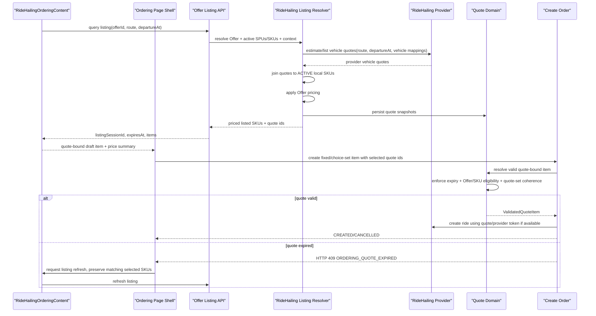
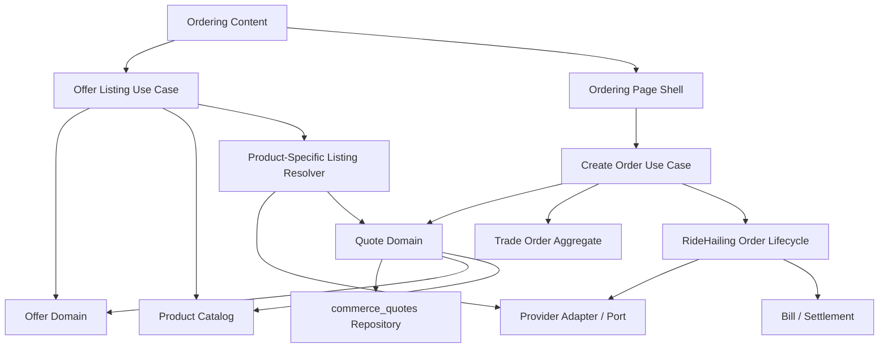

# Offer Listing And Quote Identity Plan

## Purpose

This plan covers the large slice that replaces the current RideHailing
`/ordering/ride-hailing/options` model with an Offer-owned listing query and a
quote-identity freshness boundary.

The slice combines:

- Offer-owned product listing query
- RideHailing dynamic SKU availability by route and departure time
- typed RideHailing provider quote / estimate port outputs
- removal of frontend `selectable=false` option semantics
- quote / estimate identity returned by listing and submitted to create-order
- commerce-native quote identity and create-order quote-expiry handling
- removal of RideHailing price-diff preflight
- departure-time binding confirmation UX

This is a review artifact. It is not an implementation start signal.

## Classification

- Primary input route: `Intent`
- Current mode: `Solidify` with targeted review
- Implementation mode: blocked until plan review, Impact Handshake, and
  explicit `开始`

The slice changes API contracts, backend domain boundaries, frontend ordering
state, scenario tests, and durable ecommerce contract text. It should not be
implemented as a UI-only cleanup.

## Accepted Direction

- Public listing query should use `offerId` as its entrypoint.
- The unified listing query is Offer-owned, because Offer owns commercial
  membership, active window, terms version, and pricing policy.
- The query should return priced listed products, not only catalog products.
- Product-specific mask and pricing can remain conceptual phases; they do not
  need to be separate physical calls.
- RideHailing listing can do provider availability/quote and pricing in one
  product-specific resolver pass.
- RideHailing listed SKUs are the intersection of:
  - provider returned availability/estimate for route + departureAt
  - local SKU exists, belongs to an Offer SPU, and is `ACTIVE`
- Do not return unavailable RideHailing SKUs with `selectable=false`; omit them
  from listing results.
- Provider Port should expose standard app-level quote / estimate shapes. Raw
  provider response parsing belongs inside adapters, not in Trade use cases.
- Listing should return product-type-independent quote identity.
- Order, create-order commands, and pricing should natively understand quote
  identity instead of treating quote ids as RideHailing-only fields.
- Create-order should submit selected quote ids rather than repeating quote-owned
  context such as `offerId`, route, departureAt, SKU ids, or price.
- Quote validity is owned and encapsulated by the Quote domain. Create-order
  must ask Quote to resolve valid quote-bound order facts; it should not
  hand-check quote existence, expiry, active Offer, active SKU, membership, or
  listing-context consistency one condition at a time.
- Order item kinds should keep describing fulfillment semantics, such as `FIXED`
  or `CHOICE_SET`. Quote ids are freshness/authorization evidence carried by
  those commands; a command kind named `QUOTE_SET` is too mechanism-oriented and
  hides whether the user is buying one fixed SKU or authorizing a candidate set.
- Quote expiry should replace RideHailing price-diff preflight. If a quote is
  expired, create-order returns HTTP 409 problem details with a stable
  quote-expired code; frontend refreshes the listing and the user clicks order
  again.
- PR/order lifecycle blockers may still be validated at create-order time, but
  they should not require a separate RideHailing price preflight endpoint.
- Persist quotes to Postgres.
- If a provider returns a durable quote token, preserve it. If not, the app can
  mint a local quote id bound to provider snapshot, product type, local SKU,
  Offer, route/departureAt or other product context, price, and expiry.
- Imported `departureAt` binding should not be silently applied. The initial
  default remains "depart now" with `departureAt: null`.
- The imported departure time should remain available in the departure-time
  drawer as a one-tap apply action.

## Current Facts

### Existing Offer Detail Entry

- PR Page calls `POST /api/placements/:instanceId/ordering-entry`, stores the
  returned `OrderingEntryPayload` in `sessionStorage`, and routes to
  `/order/new`.
- The placement ordering-entry use case resolves placement bindings and calls
  `getOrderingOfferDetail({ offerId: placement.offerId })`.
- `getOrderingOfferDetail` reads the active Offer, active SPUs under the Offer,
  and active SKUs under those SPUs.
- `offerDetail` is currently an Offer-owned ordering projection containing
  catalog facts plus Offer pricing policy and terms.

### Existing RideHailing Listing Path

- `RideHailingOrderingContent` builds catalog fallback options from
  `offerDetail.spu.skuOptions`.
- It then calls `useRideHailingQuoteOptions({ source: { offerId }, route })`.
- `useRideHailingQuoteOptions` calls
  `POST /api/commerce/ordering/ride-hailing/options`.
- The TanStack query key includes the full input object, so route changes can
  refetch options.
- `departureAt` is not part of the input, query key, endpoint schema, or
  provider params.
- The backend endpoint accepts only `{ source.offerId, route }`.
- The backend resolves the Offer, enumerates all active local RideHailing SKUs
  under the Offer, then calls provider estimate once per SKU/provider vehicle
  type.
- `selectable=false` is backend-local interpretation when provider instance is
  missing/inactive or estimate fails. It is not a provider response field.

### Existing Provider Port

- `RideHailingProviderPort.estimate` returns `Promise<unknown>`.
- Caocao adapter maps it to `GET /common/estimatePriceWithDetail`.
- Trade currently parses estimate amount and vehicle name from provider raw
  fields.
- There is no standard app-level provider quote type.
- There is no provider-owned "list available vehicle types" method.
- Fake Caocao stores static estimates keyed by car type and does not vary by
  route or departure time.

### Existing Preflight

- Current Ordering Page runs submit-time evaluation before create-order.
- RideHailing price-change preflight compares displayed candidate range with
  evaluated candidate range.
- This is a useful guard in the current implementation, but it becomes the wrong
  stale-price boundary once quote identity is introduced.

## Target Model

### Offer Listing Query

Preferred public shape:

```text
POST /api/commerce/offers/:offerId/listing
```

Sketch:

```ts
type OfferListingInput =
  | {
      productType: "RIDE_HAILING";
      route: RideHailingRouteSnapshot;
      departureAt?: string | null;
    }
  | {
      productType: "RENTAL";
      serviceStartAt?: string | null;
      serviceEndAt?: string | null;
    };
```

Rental should migrate to this unified listing endpoint in this slice. Its
resolver can stay thin if Rental has no dynamic mask logic yet, but the frontend
should stop treating Rental as outside the listing model.

Target response sketch:

```ts
type OfferListingResult = {
  offerId: number;
  productType: ProductType;
  listingSessionId: string;
  expiresAt: string | null;
  items: OfferListedItem[];
};

type OfferListedItem =
  | {
      kind: "FIXED";
      productType: "RENTAL";
      skuId: number;
      quoteId: string;
      displayName: string;
      presentation: ProductPresentation;
      price: ListingPriceSnapshot;
    }
  | {
      kind: "CHOICE_CANDIDATE";
      productType: "RIDE_HAILING";
      skuId: number;
      quoteId: string;
      displayName: string;
      providerName: string;
      providerVehicleTypeCode: string;
      providerVehicleTypeName: string;
      presentation: ProductPresentation;
      estimateSnapshot: RideHailingProviderEstimateSnapshot;
      price: ListingPriceSnapshot;
    };
```

Rules:

- Offer resolver validates Offer existence, status, active window, product type,
  and SPU membership.
- Product-specific listing resolver receives Offer, active SPUs/SKUs, and
  product context.
- Product-specific resolver returns only listed items.
- Pricing is applied inside the listing use case so the frontend footer and
  cards read listing price directly.
- Listing result is display/draft truth. Create-order still validates quote
  identity and product truth.

### RideHailing Provider Quote Shape

Provider Port should stop returning raw `unknown` for estimates.

Sketch:

```ts
type RideHailingProviderEstimateRequest = {
  route: RideHailingRouteSnapshot;
  departureAt: string | null;
  providerVehicleTypeCode?: string | null;
};

type RideHailingProviderVehicleQuote = {
  providerVehicleTypeCode: string;
  providerVehicleTypeName: string;
  estimateAmountFen: number;
  distanceMeters?: number | null;
  durationSeconds?: number | null;
  providerQuoteId?: string | null;
  providerQuoteExpiresAt?: string | null;
  providerSnapshot: unknown;
};
```

Provider capabilities can be modeled in two tiers:

- known-vehicle estimate: quote one provider vehicle type
- vehicle listing: return all available vehicle quotes for route/time

Caocao can initially implement known-vehicle estimate if that matches the
available fake/current API. A future provider can implement vehicle listing
without changing the Offer Listing API.

### Commerce Quote Identity

Introduce product-type-independent quote identity for Offer Listing and
create-order.

Decision:

- persist quote snapshots in Postgres
- quote id is server-minted
- quote identity is not RideHailing-specific
- order, pricing, and create-order should understand quote ids natively
- quote validity is a Quote-domain concept, not a scattered set of Order use
  case checks

Quote domain object sketch:

```ts
type OfferQuote = {
  quoteId: string;
  listingSessionId: string;
  offerId: number;
  productType: ProductType;
  spuId: number;
  skuId: number;
  quantity: number;
  listingContextSnapshot: unknown;
  fulfillmentQuoteSnapshot: unknown;
  pricingSnapshot: ListingPriceSnapshot;
  expiresAt: string | null;
  createdAt: string;
};
```

For RideHailing, `listingContextSnapshot` contains route and departureAt. The
RideHailing `fulfillmentQuoteSnapshot` contains provider instance id, provider
vehicle type code/name, provider quote token if any, provider raw snapshot, and
provider estimate facts.

The `unknown` fields above are persistence-level JSON envelopes. The application
boundary should decode them into product-type-specific quote facts before Order,
Pricing, or RideHailing lifecycle code consumes them.

Quote domain validates and resolves:

- quote id exists
- quote is not expired
- issuing Offer is still active enough for order creation
- referenced SKU still exists, is `ACTIVE`, and still belongs to the issuing
  Offer/SPU membership
- candidate quote ids form a compatible quote group for the requested order item
  shape, such as one fixed quote or one choice-set candidate group
- quote listing context is sufficient to create the product-specific order
  branch without repeating route/departureAt/SKU/offer in the create-order
  payload

Create-order consumes a resolved Quote-domain value, for example:

```ts
type ValidatedQuoteItem =
  | {
      kind: "FIXED";
      quote: OfferQuote;
    }
  | {
      kind: "CHOICE_SET";
      candidateQuotes: OfferQuote[];
      listingSessionId: string;
    };
```

This keeps Order responsible for order lifecycle and item persistence, while
Quote remains responsible for quote freshness, commercial eligibility, and quote
set coherence.

Expired quote result:

- return HTTP 409 problem details
- include a stable code, for example `ORDERING_QUOTE_EXPIRED`
- do not mix quote-expired failure into HTTP 200 create-order results

### Quote-Based Create Command

Current command:

```ts
{
  kind: "CHOICE_SET";
  productType: "RIDE_HAILING";
  candidateSkuIds: number[];
  quantity: 1;
}
```

Target sketch:

```ts
type QuoteBoundCreateOrderItem =
  | {
      kind: "FIXED";
      quoteId: string;
      quantity: number;
    }
  | {
      kind: "CHOICE_SET";
      candidateQuoteIds: string[];
      quantity: 1;
    };
```

The create-order payload should not repeat product/source commercial or
fulfillment facts if selected quote ids resolve them. That includes `offerId`,
route, departureAt, SKU ids, price, participants, riders, and contact phone.
If a product still needs those non-price facts, they must be captured by the
listing/quote session or another explicit pre-create owner before create-order,
not reintroduced into the create-order command body.

The persisted order item should continue storing candidate SKU quote snapshots,
but the source of those snapshots becomes validated quote identity rather than
submit-time re-quote.

Dispatch still resolves cheapest-first unless the policy changes.

Create-order should become quote-only for product items. Any remaining
non-product attachment, such as PR attachment, needs its own owner and should
not be smuggled into product item input.

### Frontend Ordering Content

RideHailingOrderingContent should:

- call the Offer Listing query instead of `/ordering/ride-hailing/options`
- include route and `editableDepartureAt` in listing input
- default imported `departureAt` binding to not applied
- open a dialog after mount when imported departure time exists
- let the drawer one-tap apply the imported departure time later
- render listed items only
- store selection by quote id, while rendering SKU facts from listed items
- emit quote ids to the Ordering Page / shell through the fulfillment-shaped
  draft item:
  `FIXED.quoteId` for fixed products, or `CHOICE_SET.candidateQuoteIds` for
  RideHailing candidate sets
- derive footer price range from listing item prices
- on quote-expired create result, refresh listing, preserve selected SKU ids
  when the refreshed listing still contains matching SKUs, and show a dialog
  requiring the user to click order again

### Ordering Page Preflight

RideHailing price-diff preflight should be removed once quote identity is live.

Target:

- Rental also uses the unified Offer Listing endpoint in this slice.
- RideHailing bypasses price-change preflight and relies on create-order quote
  validation.
- Common PR/order blockers remain create-order validations. If the UI still
  wants early disabled state, that should be a separate non-price eligibility
  query, not a dynamic price preflight.

## Suggested Sequence



## Topology Review

The intended dependency direction is:



Review claims:

- Offer Listing may depend on Offer, Catalog, product-specific resolvers,
  Provider, and Quote because it mints priced listed items.
- Ordering Content owns product-specific listing state, selection state, and
  price summary output. It should not call Create Order directly.
- Ordering Page / shell owns submit orchestration and calls Create Order using
  the quote-bound draft emitted by Ordering Content.
- Create Order may depend on Quote, but should not know how Quote validates
  Offer/SKU activity or listing-context coherence.
- Quote may read Offer and Catalog facts to decide whether a previously issued
  quote is still valid. That dependency is acceptable because validity is a
  quote-owned policy, not an order-owned policy.
- Provider raw shape terminates at the adapter. Quote stores provider snapshots
  for audit and later fulfillment, but Order should consume decoded
  product-type quote facts.
- Bill should read resolved order/fulfillment facts. It should not decide quote
  validity.

## Implementation Phases

### Phase 1: Durable Contract And API Shape

- Update ecommerce contract for Offer-owned listing and quote identity.
- Define request/response types for Offer Listing.
- Define listed item, listing session, and product-type-independent quote
  identity concepts.
- Define quote-bound command item shape while preserving semantic order item
  kinds: `FIXED` and `CHOICE_SET`.
- Define quote-expired problem details code and HTTP 409 behavior.

Verification:

- typecheck after contract-backed schema changes once implemented

### Phase 2: Provider Port Normalization

- Replace raw estimate `Promise<unknown>` with typed provider quote output.
- Keep provider raw snapshot inside the typed output for diagnostics.
- Update Caocao adapter to parse raw response into app-level quote.
- Update fake Caocao tests around typed quote parsing.

Verification:

- provider adapter unit tests
- fake Caocao package tests

### Phase 3: Offer Quote Domain And Store

- Add product-type-independent quote persistence in Postgres.
- Store enough context to validate create-order without re-quoting.
- Add a Quote-domain resolver that encapsulates quote existence, expiry,
  Offer/SKU eligibility, membership, and quote-set coherence.
- Ensure pricing/order services can read quote snapshots without knowing the
  provider raw shape directly.

Verification:

- backend unit tests for quote creation, expiry, eligibility, and quote-set
  coherence
- migration/config checks if DB-backed

### Phase 4: Offer Listing Use Case And Route

- Add Offer-owned listing use case.
- Add public route, likely under Commerce API:
  `POST /api/commerce/offers/:offerId/listing`.
- Implement product-type dispatch.
- Implement RideHailing listing resolver:
  - resolve active local RideHailing SKUs under Offer
  - call provider quote/listing by route/departureAt
  - join provider vehicle quotes to local ACTIVE SKUs
  - apply Offer pricing
  - persist quote snapshots
  - return listed items only
- Migrate Rental to the unified listing endpoint with a thin fixed-item
  resolver.

Verification:

- backend scenario/unit coverage for listed vs omitted SKUs
- backend typecheck

### Phase 5: Create-Order Quote Identity

- Promote create-order items to quote-bound `FIXED` / `CHOICE_SET` items, not
  RideHailing-only quote fields and not a mechanism-named `QUOTE_SET`.
- Delegate quote identity validity to the Quote domain.
- Build choice-set candidate snapshots from validated Quote-domain results.
- Derive offer, SKU, route/departureAt, price, participants, riders, contact
  phone, and other product create facts from validated Quote-domain results
  instead of repeating them in the create-order payload.
- Remove RideHailing submit-time re-quote for price freshness.
- Preserve cheapest-first dispatch from validated quote candidates.
- Return HTTP 409 problem details with a stable code when a submitted quote is
  expired.

Verification:

- backend RideHailing foundation scenarios
- quote-expired create-order scenario
- provider-create-failure scenario still passes

### Phase 6: Frontend Ordering Migration

- Replace `useRideHailingQuoteOptions` with Offer Listing query.
- Migrate Rental Ordering Content to use the same Offer Listing route for fixed
  listed items.
- Update RideHailing selection state to track quote ids.
- Include route + departureAt in listing input.
- Handle quote-expired HTTP 409 by refreshing listing, preserving selected SKU
  ids when the refreshed listing still contains matching SKUs, and requiring
  another explicit click.
- Remove RideHailing price-diff preflight path.
- Add departureAt binding dialog defaulting to "depart now".
- Add drawer one-tap apply imported departure time.

Verification:

- frontend typecheck
- focused browser/system scenario

### Phase 7: Test And Fixture Updates

- Update fake Caocao to support route/time-dependent availability if needed for
  scenario coverage.
- Update system RideHailing scenario:
  - listing returns only available SKUs
  - departureAt changes trigger listing refresh
  - imported departureAt prompt defaults to now
  - drawer can apply imported departureAt
  - quote expired blocks create, refreshes listing, preserves matching selected
    SKU ids, and requires second click
  - successful create uses quote identity
- Update Rental ordering scenario/coverage to prove the fixed-product path also
  consumes unified listing quotes.

Verification:

- `pnpm check:type:backend`
- `pnpm check:type:frontend`
- relevant fake provider tests
- backend RideHailing scenarios
- focused RideHailing system scenario
- `git diff --check`

## Plan Review

### Fit With Current Owners

- Offer ownership is a good fit because listing now includes pricing and
  membership, not only catalog data.
- Product Catalog should not own dynamic RideHailing availability. It owns local
  SKU facts and presentation.
- Trade should not parse provider raw estimate responses. It should consume
  validated Quote-domain results or provider-normalized quotes.
- Ordering Content remains the right frontend owner for product-specific listing
  state.
- Ordering Page / shell remains the right frontend owner for submit
  orchestration and create-order mutation. Ordering Content emits quote-bound
  draft state; it does not call Create Order.

### Naming Review

- `QUOTE_SET` is rejected as a command item kind. It names the freshness
  mechanism, not the order item semantics. Use `FIXED.quoteId` and
  `CHOICE_SET.candidateQuoteIds` instead.
- `OfferListedItem.kind: "QUOTE"` is also rejected because fixed listed items
  now carry quote ids too. Use `FIXED` for fixed-purchase items and
  `CHOICE_CANDIDATE` for RideHailing candidate rows.
- Prefer `listingSessionId` over `listingId` so the id reads as a grouping for
  one listing response/context, not an id for the route or endpoint itself.
- Prefer `OfferQuote` as the domain name over `CommerceQuoteSnapshot`.
  Persistence stores snapshots, but the domain concept is a quote issued from
  an Offer listing and later consumed by create-order.
- Prefer `listingContextSnapshot` over `productContextSnapshot` for route/time
  facts. These are the input facts that scoped the listing.
- Prefer `fulfillmentQuoteSnapshot` over `productQuoteSnapshot` for provider or
  product-specific facts needed to fulfill from the quote. This avoids confusing
  it with `pricingSnapshot`.

### Boundary Review

- Quote validity belongs to Quote. Order should call a Quote resolver and
  receive validated fixed/choice-set quote facts, not perform repeated
  point-checks against Offer, SKU, membership, expiry, and context.
- Offer Listing creates quotes. It may consult Provider and Product Catalog
  because listing is where dynamic availability and local catalog facts are
  joined.
- Create Order consumes quotes. It should not call Provider for price freshness
  and should not reconstruct route/departureAt/SKU/Offer facts from the request
  body.
- Create Order should not reconstruct participants, riders, contact phone, or
  other product create facts from the request body either. If those facts remain
  required, their owner must be Quote/listing session or another pre-create
  domain object.
- Ordering Content owns the product-specific draft. Ordering Page / shell owns
  mutation orchestration. A direct Ordering Content -> Create Order dependency
  would blur the shell/content split.
- Product-specific quote JSON should be decoded at the Quote boundary. Passing
  generic `unknown` snapshots into Order, Pricing, or RideHailing lifecycle
  would recreate the current provider-raw parsing problem in a new location.

### Main Objections / Risks

- A DB-backed quote snapshot table adds operational cleanup needs. This is still
  preferable to re-quoting silently at create time if quote identity is the
  domain boundary.
- Making quote identity product-type-independent expands the slice beyond
  RideHailing. The upside is a cleaner Order/Pricing contract; the risk is that
  Rental or other products need compatibility bridges if they are not migrated
  immediately.
- If Caocao does not provide a durable provider quote id, app-minted quote ids
  are only as strong as the stored provider snapshot and expiry. This is still
  cleaner than frontend/backend price diffing.
- Removing preflight entirely may conflate non-price create blockers with
  mutation results. Keep a clean blocked/create-failed dialog path for PR/order
  lifecycle failures.
- A unified listing route that only RideHailing uses at first can look
  over-modeled. This slice resolves that by migrating Rental too, while keeping
  its resolver thin.
- Route/departureAt equality validation must be strict enough to prevent stale
  quote misuse but tolerant enough to avoid false mismatch from object ordering
  or coordinate normalization. Prefer canonical route hash plus stored snapshot.
- If Quote validation starts calling back into Order or RideHailing lifecycle,
  the ownership will invert. Quote should return validated quote facts; Order
  should turn those facts into order items and lifecycle rows.
- Broad `unknown` snapshots are acceptable at the persistence edge only. They
  become a maintainability problem if they leak into use cases instead of being
  decoded behind product-type quote adapters.
- A strict quote-only create-order payload means the system needs a real owner
  for non-price product create facts before implementation. Do not solve that by
  sneaking participants/riders/contact phone back into create-order.

### Review Questions

- Resolved: quote snapshots should be persisted in Postgres.
- Resolved: expired quote should return HTTP 409 problem details with a stable
  code, not an HTTP 200 result branch.
- Resolved: the new route should be
  `POST /api/commerce/offers/:offerId/listing`.
- Resolved: Rental migrates to the unified listing endpoint in this slice.
- Resolved: when quote expires after create click, the frontend refreshes
  listing and preserves selected SKU ids if refreshed listing contains matching
  SKUs.
- Resolved: create-order quote-only payload should not include participants,
  riders, or contact phone. Required product create facts must come from
  validated quote/listing session ownership or another explicit pre-create
  owner.
- Should RideHailing provider abstraction introduce a "list vehicle quotes"
  method now, or start with typed per-known-vehicle estimates and leave bulk
  provider listing as a capability extension?
- Which pre-create owner should capture non-price product create facts for
  quote-only create-order, if they are still required after route-specific
  simplification?

## Suggested Next Step

Implemented in this slice:

- Offer-owned `POST /api/commerce/offers/:offerId/listing`
- DB-backed product-type-independent commerce quotes
- Quote-domain validity resolver
- quote-only create-order product items
- Rental migration to unified listing
- RideHailing migration to route/departureAt listing and quote ids
- quote-expired HTTP 409 handling with frontend listing refresh and selected
  SKU preservation
- removal of old backend/frontend evaluate/options surfaces

Verified with:

- `pnpm check:type:backend`
- `pnpm check:type:frontend`
- `pnpm check:format`
- `pnpm check:lint`
- `pnpm exec vitest run --project system-scenario tests/scenario/commerce/ride-hailing-ordering.scenario.test.ts`
- `pnpm exec vitest run --project system-scenario tests/scenario/commerce/rental-ordering.scenario.test.ts`

Remaining future questions:

- Provider bulk vehicle listing can still be introduced later. This
  implementation starts with typed per-known-vehicle estimates and only returns
  local ACTIVE SKUs whose provider estimate succeeds.
- Quote retention/cleanup policy is not solved in this slice.
- Product-type-specific quote snapshots are typed at the application boundary,
  but future products may need dedicated quote adapter modules as the Quote
  domain grows.
