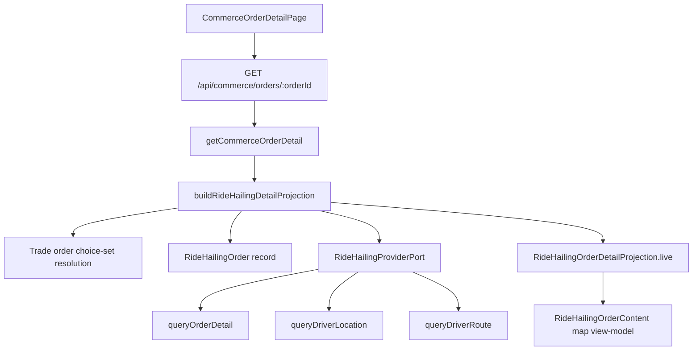
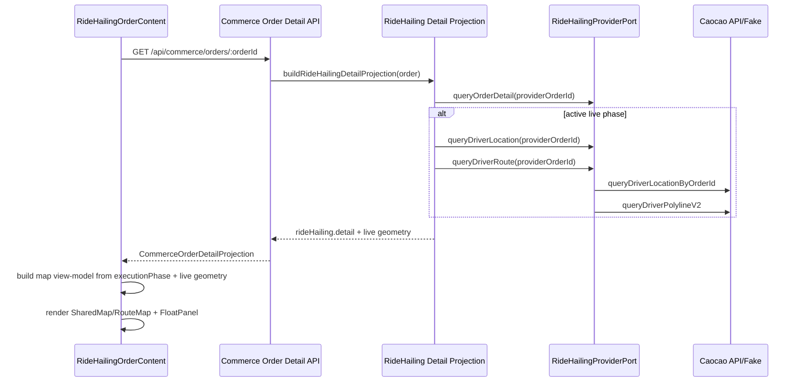

# RideHailing Order Detail Map And Live Route Plan

## Purpose

This slice makes the RideHailing Order Detail map stateful. The current
`RideHailingOrderContent` shows the persisted planned route for every phase.
The target behavior is phase-specific:

- dispatching: center the origin and show a searching ripple around it
- accepted / picking up passenger: show provider live route plus vehicle marker
- arrived at pickup: center the vehicle marker and hide polyline
- in trip: show provider live route plus vehicle marker, with already-driven
  path omitted
- finished / cancelled: show the persisted planned driving route

## Classification

- Primary input route: `Reality`
- Current mode: `Execute`
- Segment state:
  - backend Segment 1 completed locally
  - frontend Segment 2 completed locally
  - manual validation segment pending

## Current Facts

- Current web component:
  `apps/frontend/src/domains/commerce/ui/order-detail/RideHailingOrderContent.vue`.
- Current map wrapper:
  `apps/frontend/src/domains/route/ui/RouteMap.vue`.
- Lower-level shared map:
  `apps/frontend/src/shared/map/Map.vue`.
- Tencent LBS adapter:
  `apps/frontend/src/shared/map/tencent/tencent-lbs-provider.ts`.
- Current `RouteMap` accepts `route`, `plannedPolyline`, `activeGeometry`,
  fit padding, generic `extraMarkers`, generic `extraPolylines`, and
  `showFallbackPolyline`.
- Lower-level `SharedMap` already accepts arbitrary `markers`, `polylines`,
  and `activeGeometry`.
- Shared map marker types already include `routeDriver`.
- Existing vehicle marker asset already exists at
  `apps/frontend/public/route-map/map-marker-driver.png`.
- Current Order Detail backend projection:
  `RideHailingOrderDetailProjection` in
  `apps/backend/src/domains/trade/use-cases/ride-hailing-ordering-flow.ts`.
- Current projection exposes:
  - route snapshot with `drivingPlan.polyline`
  - `executionPhase`
  - driver / vehicle text snapshots
  - loose provider `live.phase`, `live.statusLabel`, and `live.finalAmountFen`
- Backend Segment 1 now exposes:
  - typed provider order detail
  - provider live route polyline
  - provider live vehicle coordinate / heading
  - a distinct `ARRIVED_AT_PICKUP` local phase
- `RideHailingProviderPort.queryOrderDetail` now returns
  `Promise<RideHailingProviderOrderDetail>` instead of `Promise<unknown>`.
- Provider port also exposes typed `queryDriverLocation` and
  `queryDriverRoute` methods.
- Current fake Caocao:
  - detail reads are now read-only
  - explicit fake control routes advance phases
  - phases are
    `CREATED -> ACCEPTED -> ARRIVED_AT_PICKUP -> IN_TRIP -> FINISHED`
- fake detail, driver location, and driver route payloads now provide typed
  test data for backend projection and future frontend map states
- Frontend Segment 2 now:
  - adds a pure RideHailing map view-model helper
  - renders origin ripple for dispatching/searching
  - renders provider live route and driver marker for accepted/in-trip phases
  - renders driver-marker-only map for arrived-at-pickup
  - keeps terminal phases on planned route

## Reference Findings

Uniapp references:

- `/mnt/f/CODING/Project/Anana/Application/uniapp/src/sub_packages/ride_hailing/pages/detail.vue`
- `/mnt/f/CODING/Project/Anana/Application/uniapp/src/components/base/routeMap/routeMap.vue`
- `/mnt/f/CODING/Project/Anana/Application/uniapp/src/components/base/routeMap/types.ts`

Useful reference model:

- order detail refreshes order status separately from navigation info
- live navigation info is fetched only while the order is on the way
- old status groups show dynamic map only for
  `picking_up / arrived / picked / in_progress / dropped`; dispatching and
  accepted states still use static route/markers in uniapp
- `RouteMap` receives:
  - `centerMode`
  - `customPolylinePoints`
  - `carPosition`
  - `showCarHistory`
  - `stickCarToPolyline`
- `customPolylinePoints` is used for provider navigation route
- `carPosition` is used for the vehicle marker
- `showCarHistory` is used to avoid showing already-driven route as the active
  route
- the main `customPolylinePoints` route is treated as the current server
  navigation / remaining route; already-driven history is a separate grey
  polyline
- vehicle marker asset is a 38x38 top-view car marker

Official Caocao docs checked:

- Order status/event docs expose separate "driver arrived" and "meter start"
  states/events:
  `https://open.caocaokeji.cn/zh-cn/docs/caocao_open/travel/1.5orderProperties.html`
- Driver location query exists and returns latitude, longitude, and direction:
  `https://open.caocaokeji.cn/zh-cn/docs/caocao_open/travel/2.5queryDriverPosition.html`
- Order detail query exposes order status and driver location information:
  `https://open.caocaokeji.cn/zh-cn/docs/caocao_open/travel/2.9queryOrderDetail.html`
- Driver pickup/dropoff route query exists. It returns route steps/links,
  coordinate strings, remaining distance/time, and driver ETA location:
  `https://open.caocaokeji.cn/zh-cn/docs/caocao_open/travel/2.27queryDriverPolyline.html`
- V2 driver pickup/dropoff route query removes the route-type request argument
  and returns the route type in the response:
  `https://open.caocaokeji.cn/zh-cn/docs/caocao_open/travel/2.27queryDriverPolylineV2.html`

Implication:

- The provider route polyline should not be inferred from
  `queryOrderDetailV2`.
- Caocao has dedicated route and driver-location APIs that should be promoted
  into the provider port instead of being parsed opportunistically from raw
  order detail.

## Model Gap

The requested UI state cannot be implemented cleanly as a frontend-only change.
There are three model gaps:

1. Provider live geometry is missing from our backend projection.
2. Provider port still returns unknown detail data instead of a typed domain
   shape.
3. Local RideHailing lifecycle does not distinguish "accepted / picking up"
   from "arrived at pickup".

The most important correction is not visual; it is to introduce a typed
RideHailing live-navigation snapshot that Order Detail can consume.

## Proposed Backend Topology



Provider port should expose stable methods:

```ts
type RideHailingProviderOrderDetail = {
  phase: string;
  statusLabel: string;
  finalAmountFen: number | null;
  driver: RideHailingDriverSnapshot | null;
  vehicle: RideHailingVehicleSnapshot | null;
  vehicleLocation: RideHailingProviderVehicleLocation | null;
  providerSnapshot: unknown;
};

type RideHailingProviderVehicleLocation = {
  latitude: number;
  longitude: number;
  headingDegrees: number | null;
  speedKph: number | null;
  capturedAt: string | null;
  providerSnapshot: unknown;
};

type RideHailingProviderNavigationRoute = {
  routeKind: "PICKUP" | "DROPOFF" | "WAITING" | "RELAY_PREVIOUS_DROPOFF" | "UNKNOWN";
  polyline: RideHailingCoordinateSnapshot[];
  remainingDistanceMeters: number | null;
  remainingDurationSeconds: number | null;
  trafficLightCount: number | null;
  vehicleLocation: RideHailingProviderVehicleLocation | null;
  providerSnapshot: unknown;
};
```

Recommended port additions:

- `queryOrderDetail(input): Promise<RideHailingProviderOrderDetail>`
- `queryDriverLocation(input): Promise<RideHailingProviderVehicleLocation | null>`
- `queryDriverRoute(input): Promise<RideHailingProviderNavigationRoute | null>`

`queryDriverRoute` should be null-safe. If the provider rejects the route query
for a phase, Order Detail falls back to planned route or marker-only display
depending on phase.

## Lifecycle Mapping

Current local phases:

| Current Phase | Problem |
| --- | --- |
| `INITIATING` | usable as creating/dispatch preparation |
| `DISPATCHING` | usable as searching/dispatching |
| `ACCEPTED` | conflates picking up and arrived at pickup |
| `IN_TRIP` | usable as passenger onboard |
| `FINISHED` | usable as finished / pending payment |
| `CANCELLED` | usable as cancelled |
| `FAILED` | usable as failure |

Recommended change:

- Add `ARRIVED_AT_PICKUP` to `RideHailingExecutionPhase`.
- Map Caocao "driver arrived" event/status to `ARRIVED_AT_PICKUP`.
- Keep `ACCEPTED` for "driver accepted / heading to pickup".

Caocao mapping should be corrected against the official status/event model:

| Caocao Signal | Local Phase |
| --- | --- |
| no provider order yet / created but no accepted callback | `DISPATCHING` |
| driver accepted / started pickup service | `ACCEPTED` |
| driver arrived / status 12 | `ARRIVED_AT_PICKUP` |
| meter started / status 3 | `IN_TRIP` |
| meter ended / order finished / pending fee confirmation | `FINISHED` |
| cancellation statuses/events | `CANCELLED` |

The exact callback event IDs used by the current Caocao integration should be
reviewed during implementation because the existing fake callback numbering is
not aligned with the current official event table.

## Proposed Frontend Topology

`RideHailingOrderContent` should build an explicit map view-model:

```ts
type RideHailingOrderMapMode =
  | "SEARCHING_ORIGIN"
  | "PICKING_UP"
  | "ARRIVED_AT_PICKUP"
  | "IN_TRIP"
  | "PLANNED_ROUTE";

type RideHailingOrderMapViewModel = {
  mode: RideHailingOrderMapMode;
  route: Route;
  markers: MapMarker[];
  polylines: MapPolyline[];
  activeGeometry: MapActiveGeometry;
  center: MapCoordinate | null;
  showOriginRipple: boolean;
};
```

Recommended implementation direction:

- Keep `RouteMap` generic. Do not make it understand RideHailing lifecycle.
- Add a small generic extension to `RouteMap` only if it stays domain-neutral:
  `extraMarkers` / `extraPolylines`, or `markerOverrides`.
- If the required shape makes `RouteMap` awkward, use lower-level `SharedMap`
  directly inside `RideHailingOrderContent` and build route point markers with
  shared route helpers.
- Keep the phase-to-map decision in a pure helper next to
  `RideHailingOrderContent`, for focused unit tests.

## Map Behavior Matrix

| Local Phase | Geometry | Active Geometry | Notes |
| --- | --- | --- | --- |
| `INITIATING` / `DISPATCHING` | origin marker only or route points muted | origin marker | show ripple around origin |
| `ACCEPTED` | provider pickup route + driver marker | all, or provider route | provider route is pickup route |
| `ARRIVED_AT_PICKUP` | driver marker + route points optional/muted | driver marker | no polyline |
| `IN_TRIP` | provider dropoff route + driver marker | provider route | provider route should be remaining route; do not render driven part |
| `FINISHED` | planned route from order snapshot | all | same as current planned route behavior |
| `CANCELLED` / `FAILED` | planned route from order snapshot | all | no live provider geometry |

If provider live route is unavailable:

- `ACCEPTED`: show driver marker if present, otherwise origin/destination
  planned route.
- `ARRIVED_AT_PICKUP`: show driver marker if present, otherwise origin marker.
- `IN_TRIP`: show driver marker plus planned route as muted fallback, not as
  active remaining route.

## Origin Ripple

The ripple should be owned by `RideHailingOrderContent`, not `SharedMap`.

Reason:

- It is RideHailing phase-specific semantics, not a generic map primitive.
- Tencent LBS marker layers do not need to know about this animation.

Implementation options:

- Use an absolutely positioned overlay anchored approximately at the map center
  when the map is fit to a single origin active geometry.
- Prefer a CSS layer over a synthetic provider marker style because it is a
  temporary visual state and does not need provider SDK support.
- Keep the ripple non-interactive and hidden outside dispatching/searching
  phases.

Open implementation detail:

- Pixel-perfect anchoring to a geo coordinate would require map projection
  access, which the current `SharedMap` provider abstraction does not expose.
  For this slice, centering the origin and placing the ripple at visual center
  is sufficient and keeps the abstraction small.

## Provider Live Route Semantics

Caocao route APIs expose a route polyline together with remaining ETA metadata.
The docs imply this is the driver's current navigation route for pickup or
dropoff, not a historical full trip trail.

Plan assumption:

- Treat provider route polyline as "remaining route" for the active phase.
- Do not additionally trim it on the frontend unless the provider returns a
  full-route trail. If manual/provider evidence later proves the polyline is
  full-route, add a pure geometry trim helper using current driver position and
  nearest point.

## Fake Caocao Needs

Fake Caocao should be extended so this slice is manually and scenario-testable:

- add `ARRIVED_AT_PICKUP` fake phase
- advance order phase:
  `CREATED -> ACCEPTED -> ARRIVED_AT_PICKUP -> IN_TRIP -> FINISHED`
- expose driver location in fake route/detail-compatible responses
- expose fake pickup/dropoff route data from a dedicated driver-route endpoint
- allow test control to set phase directly, including `ARRIVED_AT_PICKUP`
- keep phase changes callback-driven so backend persistence still follows the
  provider callback path

## Sequence



## Implementation Segments

### Segment 1: Domain Contract And Fake Support

- Add typed provider order-detail / driver-location / route models.
- Change `queryOrderDetail` from `Promise<unknown>` to typed provider detail.
- Add `queryDriverLocation` and `queryDriverRoute` to the provider port.
- Implement Caocao adapter parsing for:
  - `queryOrderDetailV2`
  - `queryDriverLocationByOrderId`
  - `queryDriverPolylineV2`
- Add `ARRIVED_AT_PICKUP` to local execution phase model.
- Correct callback/status mapping for accepted, arrived, in-trip, finished,
  and cancelled states.
- Extend fake Caocao state/routes/tests for the new live geometry and phase.
- Extend `RideHailingOrderDetailProjection.live` with a typed
  navigation/vehicle-location snapshot.

### Segment 2: Frontend Map View-Model And Rendering

- Add a pure map view-model builder for `RideHailingOrderContent`.
- Render phase-specific markers and polylines.
- Center the route origin marker for dispatching. A marker-bound ripple is
  deferred until shared map overlay or marker-decoration support exists.
- Render driver marker from `routeDriver` icon.
- Use provider live route in accepted/in-trip phases.
- Center driver marker in `ARRIVED_AT_PICKUP`.
- Keep planned route for finished/cancelled/failed phases.
- Temporarily replace bottom `PuFloatPanel` content with raw diagnostic JSON
  during manual review.

### Segment 3: Verification And Manual Review

- Add provider/fake unit tests for:
  - phase progression including arrived-at-pickup
  - typed detail parsing
  - driver location parsing
  - driver route parsing from `coords`
- Add frontend pure-helper tests for phase-to-map view-model.
- Extend RideHailing system scenario to:
  - create order
  - advance fake phase to accepted
  - verify driver marker / provider route appear
  - advance to arrived-at-pickup
  - verify marker-only state
  - advance to in-trip
  - verify live route appears
  - advance to finished
  - verify planned route / bill state
- Manual browser verification through dev fake controls remains necessary for
  visual details:
  - map is nonblank
  - panel does not occlude active geometry
  - ripple is visible only during dispatching
  - driver marker is visible at mobile viewport

## Risks And Objections

- A frontend-only implementation would be misleading because current API data
  cannot support the requested accepted/arrived/in-trip map differences.
- Extending `RouteMap` with RideHailing-specific props would damage the route
  domain boundary. Use generic extra geometry props or compose `SharedMap`
  directly.
- Current fake callback event numbering does not match the current official
  Caocao docs. Do not continue building more behavior on that mismatch without
  correcting or isolating it.
- Adding `ARRIVED_AT_PICKUP` changes backend model, fake provider, frontend
  rendering, and tests. This is still the cleaner model because the UI
  requirement has a real lifecycle distinction.
- Vehicle marker rotation may need a follow-up because current shared map
  marker abstraction does not expose per-marker rotation. The first
  implementation can show the marker position without heading rotation.

## Impact Handshake Draft For Implementation

Address and Object:

- Backend:
  - RideHailing provider port model and Caocao adapter
  - RideHailing execution phase model and callback mapping
  - Order Detail projection
  - fake Caocao server state/routes/tests
- Frontend:
  - `RideHailingOrderContent.vue`
  - route/shared map geometry support if needed
  - focused helper tests / scenario assertions

State Diff:

- From: Order Detail always renders planned route and no live driver geometry.
- To: Order Detail renders phase-specific planned/live route, driver marker,
  and dispatch ripple from a typed live-navigation projection.

Blast Radius Forecast:

- Backend type exports affect Hono RPC inferred frontend types.
- Fake Caocao changes affect RideHailing system scenarios and Admin fake
  controls.
- Shared map changes, if any, affect all `RouteMap` consumers and need to stay
  generic.
- Callback mapping changes affect RideHailing order lifecycle states.

Invariants:

- Existing `/api/commerce/orders/:orderId` access control remains unchanged.
- Provider binding remains owned by Trade order choice-set resolution.
- Order Detail page route and existing semantic test IDs remain stable.
- Rental Order Detail path remains unchanged.
- Finished/cancelled orders still show the persisted planned route.

Verification:

- `pnpm --filter @partner-up-dev/fake-caocao-server typecheck`
- `pnpm --filter @partner-up-dev/fake-caocao-server test`
- `pnpm check:type:backend`
- `pnpm check:type:frontend`
- focused backend RideHailing provider/callback tests
- focused frontend map view-model tests
- `pnpm exec vitest run --project system-scenario tests/scenario/commerce/ride-hailing-ordering.scenario.test.ts`
- `git diff --check`
