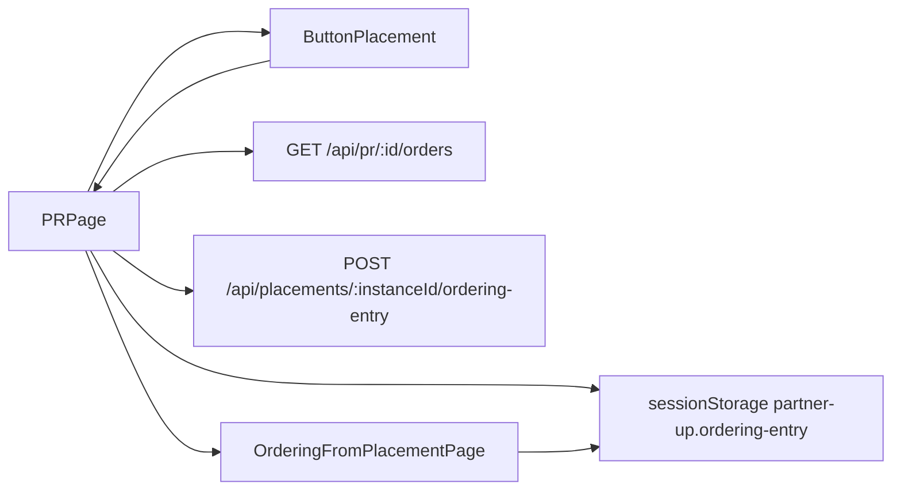
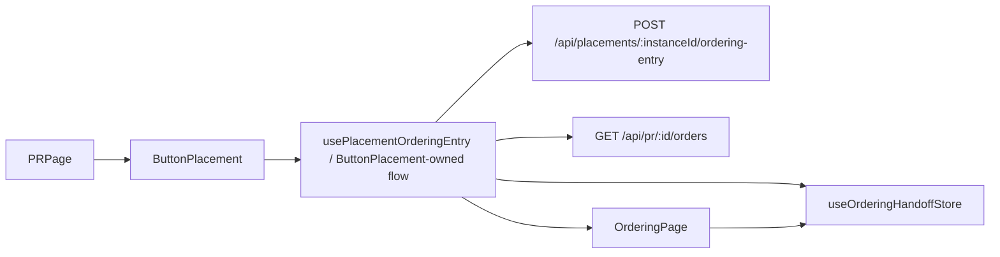

# Ordering Entry Decoupling Plan

## Objective

Decouple `/order/new` from the historical "from Placement" assumption.

Target direction:

- Placement entry surfaces resolve and hand off Ordering entry context.
- Ordering Page consumes a generic Ordering handoff, not Placement-specific
  storage or naming.
- PR Page mounts Button Placement and provides PR matching context, but does not
  know Ordering handoff storage, entry resolution, existing-order redirect, or
  `/order/new` navigation details.

## Current Facts

- Route `/order/new` currently lazy-loads `OrderingFromPlacementPage.vue`.
- `OrderingFromPlacementPage.vue` does not call Placement APIs; it reads
  `OrderingEntryPayload` from `sessionStorage` key
  `partner-up.ordering-entry`.
- `OrderingSupportPage.vue` duplicates the same raw `sessionStorage` parsing
  logic.
- `PRPage.vue` currently owns the full click flow after Button Placement emits
  a placement:
  - check PR-linked non-terminal orders through `GET /api/pr/:id/orders`
  - call `POST /api/placements/:instanceId/ordering-entry`
  - write `OrderingEntryPayload` to `sessionStorage`
  - navigate to `/order/new`
- `ButtonPlacement.vue` currently only loads matching placements and emits
  `placement-click`.
- Backend `resolvePlacementOrderingEntry` is already a Placement boundary
  operation. It reads Placement `offerId`, resolves placement binding rules,
  enriches PR-derived route/time/participants/contact facts, calls Offer for
  `OrderingOfferDetail`, and returns `OrderingEntryPayload`.
- The repo has Pinia and `pinia-plugin-persistedstate`, but Ordering handoff is
  still a bare `sessionStorage` seam.

## Existing Topology

Problems:

- PR Page imports Commerce client, Placement ordering-entry resolver, and
  Ordering entry storage key.
- The page file name `OrderingFromPlacementPage` encodes one entry source even
  though the runtime route is already the generic `/order/new`.
- Raw storage parsing is duplicated by Ordering Page and Ordering Support Page.
- The handoff model exists as `OrderingEntryPayload`, but it is not owned by a
  Pinia store or a single access API.

## Target Topology

Target properties:

- PR Page passes `matchingContext` and `prId` into Button Placement.
- Button Placement or a composable called only by Button Placement owns the
  Placement-to-Ordering entry flow.
- Ordering Page is named and typed as generic Ordering, not
  Placement-specific Ordering.
- Ordering handoff storage is a Commerce/Ordering-owned Pinia store with a
  single normalization boundary.
- The route path `/order/new` and route name `order-new` remain stable.
- Backend `POST /api/placements/:instanceId/ordering-entry` can remain the
  source of truth for Placement binding resolution; this slice does not need to
  move that logic unless implementation evidence shows a cleaner server-side
  discriminated response is necessary.

## Boundary Notes

- "Placement resolves Ordering context" is already true on the backend. The
  frontend smell is that PR Page is still orchestrating the flow and storage.
- Moving the existing-order redirect out of PR Page still crosses PR and Order
  facts. Human decision: this belongs in Button Placement /
  `usePlacement...` entry-flow code, not in PR Page. PR Page may pass `prId` so
  the entry flow can query existing PR-linked orders by `prId + offerId`.
- A larger alternative is to let the backend ordering-entry endpoint return a
  discriminated union such as `EXISTING_ORDER | ORDERING_ENTRY`. That would
  remove one frontend API call, but it also expands the backend Placement use
  case into order lookup. Current evidence does not require that larger move.

## Likely Production Changes

- Rename `apps/frontend/src/pages/OrderingFromPlacementPage.vue` to
  `apps/frontend/src/pages/OrderingPage.vue`.
- Update `apps/frontend/src/app/router.ts` lazy import only; keep `/order/new`
  and `order-new`.
- Add a Pinia handoff store under Commerce, likely
  `apps/frontend/src/domains/commerce/use-cases/useOrderingHandoffStore.ts`.
- Replace raw `sessionStorage` readers in Ordering Page and Ordering Support
  Page with the store.
- Move Button Placement click orchestration out of `PRPage.vue` into
  `ButtonPlacement.vue` or a commerce use-case composable used only there.
- Change `ButtonPlacement.vue` props to accept `matchingContext` and `prId`;
  the component/composable uses `prId` only for existing-order redirect lookup.
- Keep `OrderingEntryPayload` as the handoff payload type, but move validation
  / normalization into the store or adjacent model helper.
- Update `docs/20-product-tdd/ecommerce-contracts.md` so it no longer says
  PR Page resolves and stores the Ordering entry.

## Candidate Impact Handshake

Address and Object:

- Frontend route entrypoint: `OrderingFromPlacementPage.vue` -> `OrderingPage.vue`
- Frontend router import for `/order/new`
- Commerce Ordering handoff model/store
- `PRPage.vue` Button Placement integration
- `ButtonPlacement.vue` click behavior
- Ordering Support storage read path
- `docs/20-product-tdd/ecommerce-contracts.md` Ordering command contract

State Diff:

- From: PR Page orchestrates Placement click into Ordering entry storage and
  navigation; Ordering page name assumes Placement origin; raw session storage
  parsing is duplicated.
- To: Button Placement entry flow prepares Ordering handoff through Pinia and
  opens generic Ordering Page; PR Page only supplies matching context and
  PR identity, then mounts the placement.

Blast Radius Forecast:

- PR Detail utility action rendering and click behavior.
- Rental and RideHailing Ordering route entry.
- Ordering Support handoff summary page.
- Scenario tests that click `pr-detail.commerce-placement.open` and assert
  `/order/new`.
- Frontend type/lint around route lazy imports and store persistence.

Invariants Check:

- Keep `/order/new` route path and `order-new` route name.
- Keep `pr-detail.commerce-placement.open` test id.
- Keep PR Page free from direct Ordering handoff storage, Placement
  ordering-entry resolution, and `/order/new` navigation.
- Keep `OrderingContentInput` contract unchanged unless implementation proves a
  store-level shape improvement is necessary.
- Keep backend `OrderingEntryPayload` semantics and quote/listing model intact.
- Do not touch unrelated PR time-window worktree changes.

Verification:

- `pnpm check:type:frontend`
- `pnpm exec biome check` on changed frontend/docs files
- `pnpm exec vitest run --project system-scenario tests/scenario/commerce/rental-ordering.scenario.test.ts`
- `pnpm exec vitest run --project system-scenario tests/scenario/commerce/ride-hailing-ordering.scenario.test.ts`

## Resolved Review Questions

- Existing-order redirect stays in the frontend Button Placement /
  `usePlacement...` entry flow for this slice. PR Page may pass `prId`, but PR
  Page should not perform the lookup or decide the Ordering navigation.

## Open Review Questions

- Should the Ordering handoff store also own `ORDERING_SUPPORT_HANDOFF` now, or
  should this slice only migrate `OrderingEntryPayload` and leave support
  summary for a follow-up?
- Should `ButtonPlacement.vue` become a smart entry component, or should the
  smart behavior live in a composable so the visual component stays small?

## Implementation Notes

- Implemented the smart behavior as a dedicated composable:
  `usePlacementOrderingEntryFlow`.
- `ButtonPlacement.vue` remains the visual entry component, but owns the click
  call into the composable instead of emitting a `placement-click` event to
  PR Page.
- `PRPage.vue` now only passes `matchingContext` and `prId`.
- `OrderingEntryPayload` is read/written through `useOrderingHandoffStore`, a
  Commerce/Ordering Pinia store that still persists to session storage for
  route survival.
- `OrderingSupportPage.vue` now reads the ordering entry handoff from the same
  store. `ORDERING_SUPPORT_HANDOFF` remains a separate support-summary storage
  seam for now.
- `/order/new` now lazy-loads `OrderingPage.vue`; the path and route name remain
  unchanged.
- Durable docs were refined so Placement matching does not receive `prId` as a
  separate parameter, while PR-derived facts can still exist inside
  `matchingContext`.
