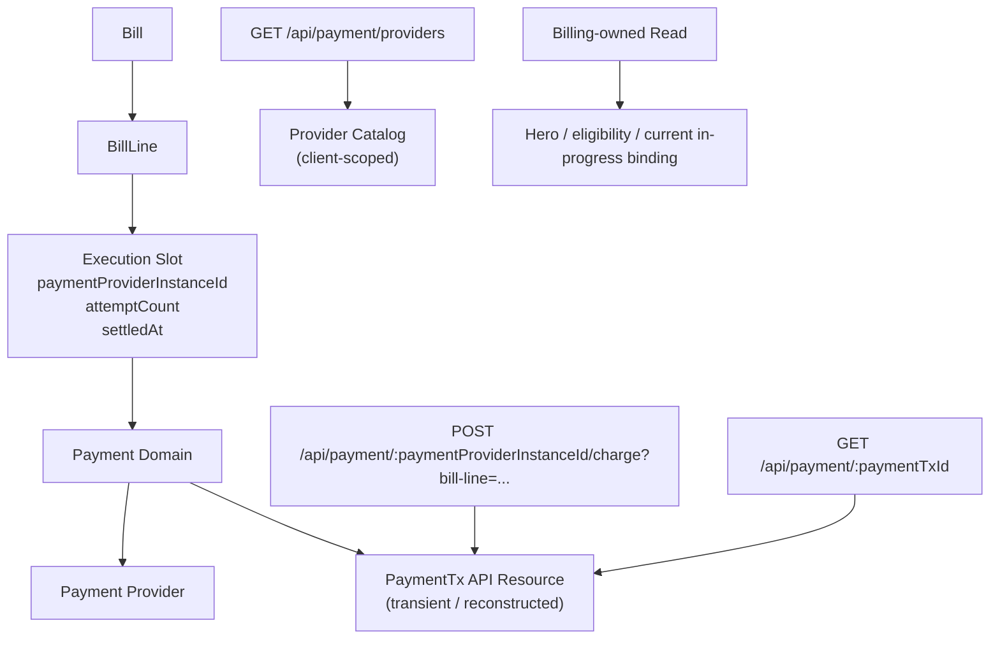
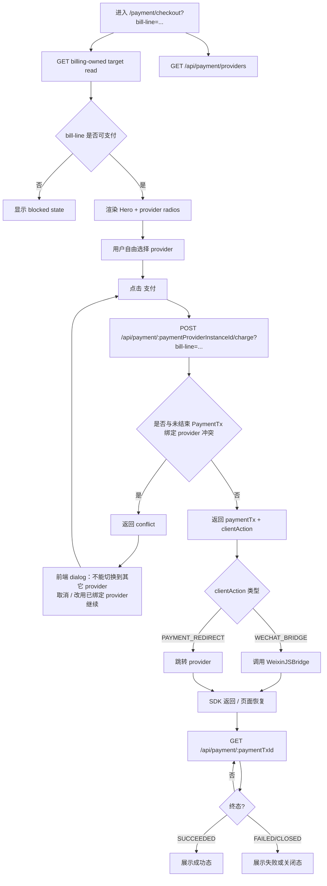

# Payment Checkout Backend Contract Plan

## Objective

- reset Payment Checkout backend contracts around explicit provider choice and
  explicit `PaymentTx` resource semantics
- keep `PaymentTx` as a real domain/API concept without restoring the deleted
  historical `payment_txs` table shape
- define payment-provider discovery, charge initiation, and payment-status
  polling contracts before frontend interaction and wireframe work

## Classification

- Primary route: `Constraint`
- Slice mode: `Execute`

## Confirmed Truth

- current checkout read contract is:
  `GET /api/commerce/bill-lines/:billLineId/checkout`
- current charge-initiation contract is:
  `POST /api/commerce/bill-lines/:billLineId/charges`
- current payment-status sync contract is:
  `POST /api/commerce/bill-lines/:billLineId/payment/sync`
- current provider choice is backend-owned:
  - if a line already has `paymentProviderInstanceId`, backend reuses it
  - otherwise backend resolves the active provider by `clientId`
- current payment-provider data model still enforces at most one active
  provider instance per `clientId`
- current provider config has exactly one `chargeMode` per provider instance
- current frontend has no runtime fake JSAPI bridge; only scenario stub exists
  at
  `tests/scenario/_infra/browser/wechatpay.ts`
- historical truth:
  - `drizzle/0071_payment_foundation.sql` created `payment_txs`
  - `drizzle/0078_bill_line_payment_slot.sql` dropped `payment_txs` and moved
    execution identity onto `bill_lines`
- latest human corrections:
  - `PaymentTx` concept remains valid
  - deleted `payment_txs` table must not be reintroduced
  - charge initiation should prefer:
    `POST /api/payment/:paymentProviderInstanceId/charge?bill-line=...`
  - payment result polling should prefer:
    `GET /api/payment/:paymentTxId`
  - provider discovery should be a separate backend query surface
  - do not pre-restrict provider choice in UI
  - if an in-progress `PaymentTx` already binds a provider, mismatched provider
    choice should be rejected at charge-initiation time and surfaced by
    frontend dialog

## Address And Object

- durable contract doc:
  `docs/20-product-tdd/ecommerce-contracts.md`
- backend controllers:
  - current `apps/backend/src/controllers/commerce.controller.ts`
  - likely new payment-domain controller surface under
    `apps/backend/src/controllers/`
- backend payment domain:
  - current `apps/backend/src/domains/payment/use-cases/payment-checkout.ts`
  - new `PaymentTx`-centric use cases under `apps/backend/src/domains/payment/`
- payment/provider data model:
  - `apps/backend/src/entities/payment.ts`
  - `apps/backend/src/entities/bill.ts`
  - provider repository and admin-payment management flows
- frontend query ownership:
  - current `apps/frontend/src/domains/commerce/queries/useCommerce.ts`
  - likely new payment-domain query owner
- verification surfaces:
  - backend unit/scenario tests
  - system scenario for checkout launch and polling

## State Diff

- From:
  - checkout read/write/sync are bill-line-scoped commerce endpoints
  - provider selection is implicit through `findActiveByClientId`
  - backend allows only one active provider per client
  - `PaymentTx` is not an explicit HTTP resource
- To:
  - payment-provider discovery is explicit and backend-owned
  - charge initiation uses explicit provider choice in the route:
    `POST /api/payment/:paymentProviderInstanceId/charge?bill-line=...`
  - payment status polling uses explicit `PaymentTx` resource reads:
    `GET /api/payment/:paymentTxId`
  - multiple active providers per client are allowed
  - `PaymentTx` becomes an explicit backend resource concept and API shape
    without restoring the deleted `payment_txs` table design

## Blast Radius Forecast

- durable product TDD payment ownership section
- backend route typing and controller topology
- payment provider selection logic and admin-payment constraints
- bill-line payment execution-slot semantics
- frontend checkout queries and page state machine
- scenario coverage for JSAPI path and provider-conflict-on-charge flow

## Invariants

- `Bill` and `BillLine` remain the owners of obligation and settlement truth
- checkout page route stays `/payment/checkout?bill-line=...`
- final successful payment still resolves into bill-line settlement state
- JSAPI remains the first-class checkout path for the current slice
- H5 is not promoted to first-class UX until return-flow design exists
- local fake provider baseline remains valid after contract reset

## Recommended Direction

- keep `PaymentTx` as an API/domain resource, not necessarily a database table
- recommended `PaymentTx` identity model:
  - `paymentTxId` is an opaque token that can be resolved back to:
    - `billLineId`
    - `attemptCount`
    - `paymentProviderInstanceId`
  - this preserves a stable pollable resource id without restoring the old
    `payment_txs` table
- recommended provider discovery shape:
  - path family: `GET /api/payment/providers`
  - it can stay context-free if its responsibility is only:
    - what provider/method options are installed and available for this client
    - how they should be labeled
  - return ordered options with:
    - `paymentProviderInstanceId`
    - `label`
    - `channel`
    - `disabled`
    - `disabledReason`
  - do not overload this endpoint with bill-line-specific lock state or
    in-progress tx conflict semantics
- do not introduce a new synthetic `checkout target read`
- instead, resolve target facts structurally from the existing durable owner:
  - Billing owns target truth
  - Payment owns provider catalog and payment execution
- target-side facts should come from billing-owned read surfaces, not from a
  payment-owned aggregate checkout read
- recommended charge-initiation shape:
  - path:
    `POST /api/payment/:paymentProviderInstanceId/charge?bill-line=...`
  - response should return:
    - `paymentTx`
    - launchable `clientAction`
    - provider-conflict semantics when another in-progress provider binding
      already exists
- recommended payment-status read shape:
  - path:
    `GET /api/payment/:paymentTxId`
  - response should return:
    - `paymentTxId`
    - status
    - target refs:
      - `billLineId`
      - `billId`
    - `orderId`
    - provider summary
    - amount and currency
    - retryability / lock state
    - terminal timestamps / failure summary as needed for UI
  - this read should not require backend persistence of the whole transaction
    snapshot; it may be reconstructed from:
    - `billLineId`
    - `paymentProviderInstanceId`
    - `attemptCount`
    - current provider query result
  - launch-only fields such as `clientAction` do not need to be re-readable
    from `GET /api/payment/:paymentTxId`

## Contract Risks

- if `paymentTxId` is opaque/derived rather than table-backed, callback and
  retry flows must still resolve unambiguously across provider changes
- provider discovery and checkout-target read must agree on conflict semantics
  when an in-progress `PaymentTx` already exists
- charge initiation must define a precise conflict response when selected
  provider mismatches an unfinished in-progress `PaymentTx`
- durable docs must be updated before implementation because current payment
  ownership language explicitly rejects persisted backend transaction truth

## Questions To Resolve

1. Where does `PaymentTx` persist now if not as a resurrected `payment_txs`
   table?
2. Which existing billing-owned read should feed checkout target truth:
   - current commerce checkout read
   - bill detail / bill-line detail
   - or another billing-owned read
3. What exact response shape should
   `POST /api/payment/:paymentProviderInstanceId/charge?bill-line=...` return?
4. What exact status model and error model should `GET /api/payment/:paymentTxId`
   expose?
5. How should BillLine retain linkage to:
   - latest in-progress `PaymentTx`
   - selected provider
   - settled result

## Implementation Steps

1. update durable ownership wording in
   `docs/20-product-tdd/ecommerce-contracts.md` so Billing-owned target truth,
   Payment-owned provider catalog, and transient `PaymentTx` resource semantics
   are explicit before code mutation
2. remove the single-active-provider-per-client schema/runtime constraint and
   expose list-by-client provider reads
3. add authenticated `/api/payment/*` endpoints for:
   - `GET /providers`
   - `POST /:paymentProviderInstanceId/charge?bill-line=...`
   - `GET /:paymentTxId`
4. keep legacy commerce checkout endpoints temporarily for compatibility, but
   implement new payment flows through payment-domain use cases
5. verify:
   - multiple active providers can coexist for one client
   - charge initiation returns `paymentTx + clientAction`
   - mismatched provider selection conflicts at charge time
   - polled `PaymentTx` reflects provider query truth without restoring
     `payment_txs`

## Implementation Result

- updated durable contract wording in
  `docs/20-product-tdd/ecommerce-contracts.md`:
  - Billing-owned checkout target truth is explicit
  - Payment-owned provider discovery and transient `PaymentTx` resource are
    explicit
  - payment domain does not own a synthetic checkout-target aggregate read
- removed the single-active-provider-per-client constraint:
  - entity no longer declares
    `payment_provider_instances_active_client_unique`
  - schema migration added:
    `apps/backend/drizzle/0082_payment_provider_multi_active_per_client.sql`
  - admin payment-provider management no longer rejects multiple active
    provider instances for one client
  - provider repository now exposes `listActiveByClientId(clientId)`
- introduced transient `PaymentTx` identity encoding at
  `apps/backend/src/domains/payment/services/payment-tx.ts`
- added authenticated payment-domain user routes at
  `apps/backend/src/controllers/payment.controller.ts`:
  - `GET /api/payment/providers`
  - `POST /api/payment/:paymentProviderInstanceId/charge?bill-line=...`
  - `GET /api/payment/:paymentTxId`
- kept existing provider notify routes under `/api/payment/wechat-pay/*`
  unchanged
- implemented new payment-domain use cases at
  `apps/backend/src/domains/payment/use-cases/payment-contract.ts`:
  - explicit provider discovery
  - explicit-provider charge initiation
  - transient `PaymentTx` polling
- charge-initiation semantics now:
  - sync current bound execution first
  - clear stale failed/closed current bindings through provider query truth
  - reject mismatched explicit provider choice with
    `code = PAYMENT_PROVIDER_CONFLICT` when an unfinished binding still exists
  - return `paymentTx + clientAction` on success
- transient `PaymentTx` polling now reconstructs state from:
  - `billLineId`
  - `paymentProviderInstanceId`
  - `attemptCount`
  - live provider query result
  - BillLine settlement truth
- legacy commerce checkout endpoints remain in place temporarily for
  compatibility:
  - `GET /api/commerce/bill-lines/:billLineId/checkout`
  - `POST /api/commerce/bill-lines/:billLineId/charges`
  - `POST /api/commerce/bill-lines/:billLineId/payment/sync`

## Verification Result

- `pnpm exec biome check --write` on changed backend/task/doc files
- `pnpm check:type:backend`
- `pnpm check:config:backend`
- `pnpm exec vitest run --config vitest.backend.config.ts --project backend-scenario apps/backend/tests/payment/payment-provider-ssot.scenario.test.ts`
- focused backend scenario now proves:
  - one client can have two active providers
  - provider discovery returns both
  - explicit-provider charge initiation works
  - mismatched provider choice conflicts at charge time
  - failed current tx clears slot and allows retry on another provider
  - historical failed `PaymentTx` does not inherit later successful
    `settledAt`
  - `payment_txs` table remains absent

## Topology Diagram

## Flow Diagram

## Verification Plan

- doc review:
  - payment ownership section no longer conflicts with approved contract
- backend static checks after implementation:
  - payment controller typings
  - payment use-case/unit tests
  - migration/config lint if provider uniqueness or metadata changes
- focused runtime proof:
  - checkout can list multiple provider options for one client
  - checkout does not pre-restrict provider options in UI
  - charge initiation returns provider-conflict error when selected provider
    mismatches an in-progress `PaymentTx`
  - `POST /api/payment/:paymentProviderInstanceId/charge?bill-line=...`
    returns `PaymentTx` plus launchable client action
  - `GET /api/payment/:paymentTxId` reaches terminal state correctly

## Implementation Steps

1. Promote the approved payment contract into
   `docs/20-product-tdd/ecommerce-contracts.md`.
2. Replace implicit active-provider-by-client resolution with explicit provider
   discovery and explicit provider selection.
3. Remove `payment_provider_instances_active_client_unique` and add explicit
   provider multiplicity support without introducing default-provider
   requirements.
4. Introduce payment-domain endpoints for:
   - `GET /api/payment/providers`
   - `POST /api/payment/:paymentProviderInstanceId/charge?bill-line=...`
   - `GET /api/payment/:paymentTxId`
5. Keep checkout target truth on billing-owned reads rather than adding a new
   synthetic payment checkout read.
6. Implement `PaymentTx` identity resolution without restoring the deleted
   `payment_txs` table design.
7. Rewire frontend checkout queries and state machine to the approved payment
   contract.
8. Add frontend dialog handling for provider-conflict response.
9. Add runtime/dev support for fake JSAPI bridge execution after backend
   contract stabilizes.
