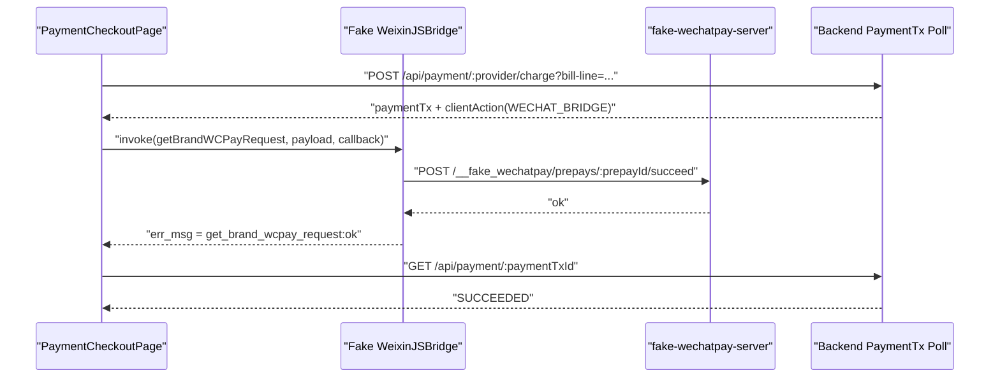

# Payment Checkout Fake JSAPI Bridge Plan

## Objective

- make local Payment Checkout able to execute the JSAPI client step without a
  real WeChat container
- keep the local bridge aligned with the official WeChatPay v3 JSAPI payment
  invocation contract
- preserve the approved ownership split:
  backend/provider query remains payment truth, while the fake bridge only
  simulates the client launch-and-return step

## Classification

- Primary route: `Constraint`
- Active mode: `Execute`

## Official References

- WeChatPay v3 JSAPI client invocation:
  [调起支付API](https://pay.weixin.qq.com/doc/v3/partner/4012089542)
- WeChatPay v3 client callback / order-query guidance:
  [支付回调和查单实现指引](https://pay.weixin.qq.com/doc/v3/merchant/4012791870)
- WeChatPay v3 JSAPI order creation:
  [JSAPI下单](https://pay.wechatpay.cn/doc/v3/merchant/4012791856)

## Confirmed Truth

- official JSAPI payment invocation is:
  - `WeixinJSBridge.invoke("getBrandWCPayRequest", payload, callback)`
  - official payload fields are:
    - `appId`
    - `timeStamp`
    - `nonceStr`
    - `package`
    - `signType`
    - `paySign`
- official JSAPI guidance requires waiting for `WeixinJSBridgeReady` when the
  bridge is not yet available
- official guidance also says frontend callback `err_msg` is not final payment
  truth; backend should still query order/payment state after the bridge
  returns
- current backend `WECHAT_BRIDGE` client action already matches the official
  JSAPI payload shape exactly:
  - `apps/backend/src/domains/payment/services/payment-provider.ts`
- current scenario-only fake bridge already proves the minimum happy-path shim:
  - `tests/scenario/_infra/browser/wechatpay.ts`
- current fake WeChatPay server already supports:
  - JSAPI prepay creation
  - `POST /__fake_wechatpay/prepays/:prepayId/succeed`
  - provider-side transaction query
- current runtime frontend still has no development-only bridge shim
- current local provider baseline already targets:
  - `chargeMode = JSAPI`
  - origin `https://wechatpay.partner-up.localhost`
- current frontend already has shared WeChat runtime seams:
  - `apps/frontend/src/shared/wechat/useWeChatMiniProgramWebView.ts`
  - `apps/frontend/src/types/wechat-jssdk.d.ts`

## Segment Scope

- included:
  - development-only `WeixinJSBridge` payment shim
  - development-only bridge bootstrap wiring
  - environment typing / flags for bridge enablement and fake-provider origin
  - packet/log updates
- excluded:
  - Payment Checkout page IA or wireframe
  - backend payment contract changes
  - H5 checkout mocking
  - full `wx` / WeChat JSSDK emulation beyond payment bridge needs
  - non-happy-path provider-state simulation unless the checkout UI slice
    proves it is required

## Proposed Address And Object

- `apps/frontend/src/shared/wechat/`
  - likely new dev-only fake bridge installer module
- `apps/frontend/src/app/create-app.ts`
  - install the fake bridge during app bootstrap when enabled
- `apps/frontend/src/vite-env.d.ts`
  - add env typing for dev-only fake bridge controls
- `tests/scenario/_infra/browser/wechatpay.ts`
  - optionally refactor to share semantics with runtime fake bridge
- task packet logs
  - record the segment result and verification

## State Diff

- From:
  local Payment Checkout can only complete the JSAPI client step inside
  scenario tests; the real dev runtime has no `WeixinJSBridge` payment shim.
- To:
  local Payment Checkout can execute the JSAPI client step in dev runtime
  through a narrow fake `WeixinJSBridge`, then continue through the approved
  backend `PaymentTx` polling flow.

## Blast Radius Forecast

- frontend app bootstrap in development
- Payment Checkout client-action execution path
- local fake WeChatPay runtime assumptions
- scenario/runtime parity for JSAPI payment launch
- env surface for frontend local development

## Invariants Check

- do not affect production or non-fake provider runtime
- do not turn frontend callback `ok/cancel/fail` into payment truth
- do not add a fake full `wx` SDK when only payment bridge is needed
- keep payload field names and casing aligned with the official JSAPI contract
- keep backend `GET /api/payment/:paymentTxId` polling as the only settlement
  truth used by checkout
- keep fake bridge install explicitly gated by development config
- do not widen this segment into H5 or non-payment WeChat features

## Recommended Direction

- install the fake bridge at app-bootstrap level, not page-local level
- gate it behind explicit frontend env flags:
  - `VITE_FAKE_WECHATPAY_BRIDGE_ENABLED`
  - `VITE_FAKE_WECHATPAY_ORIGIN`
- dispatch `WeixinJSBridgeReady` after installation so existing
  WeChat-runtime seams remain structurally correct
- support only:
  - `invoke("getBrandWCPayRequest", payload, callback)`
- unsupported bridge methods should respond with callback failure
- first implementation should target the happy path:
  - parse `package = prepay_id=...`
  - call fake-provider
    `POST /__fake_wechatpay/prepays/:prepayId/succeed`
  - callback with official-style `err_msg`
- do not add browser-side cryptographic signature verification in the fake
  bridge; that is not the owner boundary here
- if later UI slices need local `cancel` or `fail` differentiation, reopen a
  separate sub-segment because provider-state alignment for those paths is not
  free

## Sequence Diagram

## Verification Plan

- frontend static verification:
  - `pnpm check:type:frontend`
- focused source validation:
  - `pnpm exec biome check ...`
- local runtime proof:
  - `pnpm dev:ensure`
  - open `/payment/checkout?bill-line=...` against the local fake provider
  - confirm JSAPI client action can be launched without a real WeChat container
  - confirm page still resolves terminal truth through `PaymentTx` polling
- if scenario helpers are refactored, rerun the focused checkout/ordering
  system scenario

## Implementation Steps

1. add explicit frontend env typing for dev-only fake bridge controls
2. introduce a dev-only fake `WeixinJSBridge` installer under
   `apps/frontend/src/shared/wechat/`
3. install the bridge during app bootstrap only when:
   - frontend is in development
   - fake bridge env flag is enabled
4. expose `WeixinJSBridge.invoke` with support for
   `getBrandWCPayRequest` only
5. parse `package` into `prepay_id=...` and call the fake-provider success
   endpoint
6. dispatch `WeixinJSBridgeReady` after injection so runtime structure matches
   the official integration model
7. keep checkout flow behavior separated:
   - bridge callback only means the client returned
   - backend `PaymentTx` poll still decides final state
8. run the verification plan and update packet logs before any UI slice starts

## Segment Start Preconditions

- official JSAPI contract has been re-verified
- current backend `WECHAT_BRIDGE` payload shape is already aligned
- explicit user start signal is still required before implementation

## Implementation Result

- added frontend fake bridge module:
  `apps/frontend/src/shared/wechat/fake-wechatpay-bridge.ts`
- the new module:
  - installs only in development and only when explicitly enabled by env
  - refuses to override an existing real `WeixinJSBridge`
  - supports only
    `WeixinJSBridge.invoke("getBrandWCPayRequest", payload, callback)`
  - parses `package = prepay_id=...`
  - calls fake-provider
    `POST /__fake_wechatpay/prepays/:prepayId/succeed`
  - returns official-style callback strings:
    - `get_brand_wcpay_request:ok`
    - `get_brand_wcpay_request:fail ...`
  - dispatches `WeixinJSBridgeReady` after installation
- installed the bridge from app bootstrap in:
  `apps/frontend/src/app/create-app.ts`
- expanded frontend env typing in:
  `apps/frontend/src/vite-env.d.ts`
- refined global bridge typing in:
  `apps/frontend/src/types/wechat-jssdk.d.ts`
- added focused unit coverage in:
  `apps/frontend/src/shared/wechat/fake-wechatpay-bridge.test.ts`
- added durable env example entries in:
  `apps/frontend/.env.example`
- enabled the fake bridge in the local ignored development env:
  `apps/frontend/.env`

## Verification Result

- passed:
  - `pnpm exec biome check --write apps/frontend/src/app/create-app.ts apps/frontend/src/vite-env.d.ts apps/frontend/src/types/wechat-jssdk.d.ts apps/frontend/src/shared/wechat/fake-wechatpay-bridge.ts apps/frontend/src/shared/wechat/fake-wechatpay-bridge.test.ts apps/frontend/.env.example`
  - `pnpm check:type:frontend`
  - `pnpm exec vitest run --project frontend-unit apps/frontend/src/shared/wechat/fake-wechatpay-bridge.test.ts`
- unit tests prove:
  - bridge installs and emits `WeixinJSBridgeReady`
  - happy-path JSAPI invocation hits the fake-provider success endpoint
  - unsupported methods fail without fetch
  - an existing bridge is not overridden
  - invalid `prepay_id` packages fail deterministically
- known remaining gap:
  - current `PaymentCheckoutPage` is still a reset shell and does not yet own
    the JSAPI invocation path
  - therefore end-to-end local manual proof of “点击支付 -> fake bridge ->
    poll PaymentTx” still belongs to the later checkout interaction/UI slice
