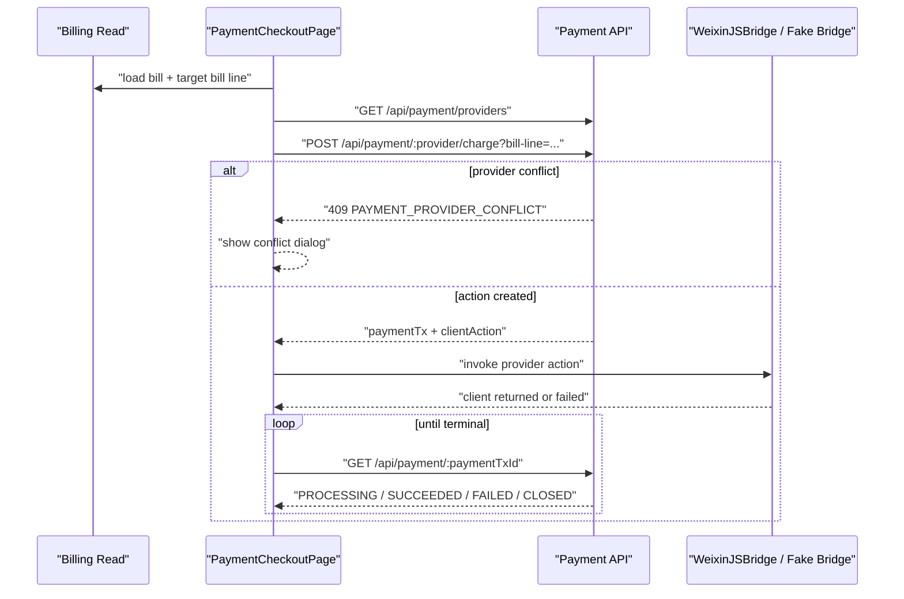

# Payment Checkout Interaction / UI Plan

## Objective

- rebuild `PaymentCheckoutPage` around the approved payment-domain runtime
  contract instead of the legacy commerce checkout aggregate
- restore a payment-first IA where the page centers on amount, payment method,
  and payment progress rather than on raw BillLine narrative
- align frontend route, frontend data assembly, and minimal backend response
  shape so the slice can run end-to-end in local fake-JSAPI development

## Classification

- Primary route: `Constraint`
- Active mode: `Explore`

## Confirmed Truth

- Billing owns checkout target truth; Payment must not introduce a synthetic
  checkout-target aggregate read
- provider discovery is intentionally target-agnostic:
  `GET /api/payment/providers`
- provider mismatch due to an unfinished in-progress execution is exposed only
  at charge-initiation time:
  `POST /api/payment/:paymentProviderInstanceId/charge?bill-line=...`
- payment result truth is polled through:
  `GET /api/payment/:paymentTxId`
- every user-visible payment outcome must be derived from backend-returned
  `PaymentTx` state, not from the bridge callback result itself
- current frontend page still depends on the legacy commerce aggregate:
  `GET /api/commerce/bill-lines/:billLineId/checkout`
- current user-facing route is already frontend-owned, but the present
  `/payment/checkout?bill-line=...` shape is already sufficient if Billing
  exposes a bill-line-keyed read surface for checkout target truth
- user-facing IA corrections already confirmed:
  - do not pre-announce unfinished provider binding in the payment-method list
  - do not expose channel internals such as `JSAPI` / `H5` in the primary list
  - payment method list should use `PuCell + PuRadio + usePuSelect`
  - Hero may reuse a simplified BillLineCard shape
- local fake JSAPI bridge is now available, but the page does not yet invoke
  it through a real pay-action path

## Segment Scope

- included:
  - frontend checkout route confirmation around the existing `bill-line` key
  - frontend query-owner migration away from the legacy checkout aggregate
  - page IA, wireframe, and runtime state machine
  - bottom CTA behavior, provider selection, charge launch, bridge handoff,
    poll loop, and conflict dialog
  - minimal backend alignment required specifically by this page flow
- excluded:
  - provider admin/configuration UI
  - new payment methods beyond the existing provider catalog
  - H5 return-to-app experience design
  - reintroducing persisted `payment_txs`

## Address And Object

- frontend route / assembly:
  - `apps/frontend/src/domains/commerce/routing/payment-checkout-route.ts`
  - `apps/frontend/src/app/router.ts`
  - `apps/frontend/src/pages/CommerceBillDetailPage.vue`
- frontend page / feature logic:
  - `apps/frontend/src/pages/PaymentCheckoutPage.vue`
  - likely new payment-domain query/mutation owner under
    `apps/frontend/src/domains/payment/`
  - likely new checkout-scoped UI component(s) under
    `apps/frontend/src/domains/payment/ui/`
- backend alignment, only if required:
  - `apps/backend/src/controllers/payment.controller.ts`
  - `apps/backend/src/domains/payment/use-cases/payment-contract.ts`
- durable truth if route ownership or runtime contract wording changes:
  - `docs/20-product-tdd/ecommerce-contracts.md`

## State Diff

- From:
  `PaymentCheckoutPage` is a reset shell that still keys itself through the
  legacy commerce checkout aggregate and has no real payment interaction path.
- To:
  `PaymentCheckoutPage` is a payment-first route that assembles Billing-owned
  target facts plus Payment-owned provider and `PaymentTx` facts, launches the
  provider action, and converges to terminal payment state through polling.

## Blast Radius Forecast

- Bill Detail -> Payment Checkout navigation topology
- frontend query ownership between `commerce` and `payment`
- backend conflict/error payload shape for charge initiation
- focused checkout scenario coverage
- local fake-JSAPI runtime proof

## Invariants Check

- do not reintroduce a payment-owned synthetic checkout-target read
- do not make `GET /api/payment/providers` target-aware
- do not leak raw provider channel internals into the primary payment-method UI
- do not persist `PaymentTx` lifecycle truth in backend storage
- keep Bill and BillLine as the owners of obligation and settlement truth
- keep backend polling as final payment truth after SDK/bridge callback returns

## Recommended Direction

- frontend should assemble checkout from two owner surfaces:
  - Billing-owned target truth
  - Payment-owned provider catalog and `PaymentTx` execution truth
- recommended route shape:
  - keep `/payment/checkout?bill-line=:billLineId`
  - reason:
    `billLineId` is already enough to identify the target; the real missing
    piece is a Billing-owned bill-line read surface that can replace the
    legacy payment-owned checkout aggregate
- recommended backend-alignment direction:
  - replace the legacy checkout aggregate with a Billing-owned bill-line-target
    read keyed by `billLineId`
  - keep Payment responsible only for:
    - provider catalog discovery
    - charge initiation
    - `PaymentTx` polling
- bridge callback handling should stay thin:
  - do not introduce a new frontend payment-domain status just for
    "paymentTx created but client launch did not complete cleanly"
  - after any bridge return, throw, `fail`, or `cancel`, immediately reconcile
    by querying/polling `PaymentTx`
  - dialogs such as `支付取消` / `支付关闭` should be derived from reconciled
    backend truth, not from bridge callback wording
- current deliberate simplification:
  - do not expand `PAYMENT_PROVIDER_CONFLICT` payload in this slice
  - conflict UX may stay as a generic blocking/informational dialog for now
    rather than a smart "continue with bound provider" recovery flow
- success-path UX should be:
  - show a short-lived success state
  - auto-return after the success state instead of keeping checkout as a
    long-lived terminal page

## IA

- `PuPageScaffold(viewport="screen")`
- `PuHeader`
  - title only: `支付`
  - leading back action
- scrollable content area:
  - simplified BillLine Hero
  - payment method section
  - transient notice area only for post-click runtime outcomes, not for
    speculative pre-charge provider binding hints
- bottom anchored CTA:
  - primary text: `支付 {amount}`

## Wireframe

```text
┌────────────────────────────────────────────────┐
│ ← 支付                                         │
├────────────────────────────────────────────────┤
│ ┌────────────────────────────────────────────┐ │
│ │ ￥40.00                         [待支付]   │ │
│ │ 网约车车费                                  │ │
│ │ 行程完成后生成                              │ │
│ └────────────────────────────────────────────┘ │
│                                                │
│ 支付方式                                       │
│ ┌────────────────────────────────────────────┐ │
│ │ (●) 微信支付                                │ │
│ │     PartnerUp 测试商户                     │ │
│ └────────────────────────────────────────────┘ │
│ ┌────────────────────────────────────────────┐ │
│ │ ( ) 另一支付方式                            │ │
│ │     商户名称 / 品牌名                       │ │
│ └────────────────────────────────────────────┘ │
│                                                │
│        "可滚动内容，但不再引入额外叙事层"      │
├────────────────────────────────────────────────┤
│ ┌────────────────────────────────────────────┐ │
│ │                 支付 ￥40.00               │ │
│ └────────────────────────────────────────────┘ │
└────────────────────────────────────────────────┘
```

## Runtime States

- idle:
  - Billing target loaded
  - provider catalog loaded
  - one provider selected
  - CTA enabled
- launching:
  - charge mutation in flight or bridge invoke in flight
  - CTA loading / disabled
- polling:
  - `paymentTxId` exists
  - CTA disabled with progress copy
  - page polls `GET /api/payment/:paymentTxId`
- bridge-return reconciliation:
  - this is not a new domain payment status
  - after any bridge completion or failure, the page immediately checks the
    backend `PaymentTx` and routes UX from that result
- succeeded:
  - show a short-lived success state
  - auto-return after the success state
- failed / closed:
  - show dialog or notice from reconciled backend truth such as `支付取消` /
    `支付关闭`
  - allow provider re-selection and a fresh pay attempt when backend state is
    again chargeable
- provider conflict:
  - show dialog after charge-initiation rejection
  - keep it generic in this slice; do not add provider-aware recovery actions

## Sequence Diagram



## Verification Plan

- frontend static:
  - `pnpm check:type:frontend`
  - `pnpm exec biome check ...`
- backend static if contract payload changes:
  - `pnpm check:type:backend`
- focused backend scenario if conflict payload changes:
  - payment scenario covering `PAYMENT_PROVIDER_CONFLICT`
- focused system scenario:
  - Bill Detail -> Payment Checkout route navigation
  - provider selection
  - local fake-JSAPI pay launch
  - `PaymentTx` polling to terminal state

## Implementation Steps

1. confirm and lock the existing `/payment/checkout?bill-line=...` route as
   sufficient for Billing-owned target assembly
2. align a Billing-owned bill-line read surface so frontend can drop the
   legacy checkout aggregate without introducing a payment-owned replacement
3. migrate frontend checkout data assembly away from the legacy commerce
   checkout aggregate
4. add or refine frontend payment-domain query/mutation owners for:
   - provider catalog
   - charge initiation
   - `PaymentTx` polling
5. align backend conflict payload only if the current `PAYMENT_PROVIDER_CONFLICT`
   response is too weak for the approved dialog UX
6. implement the payment-first page layout and bottom CTA structure
7. wire the pay-action runtime:
   - selected provider
   - charge mutation
   - bridge/client action invoke
   - poll loop
   - terminal-state handling
8. add focused verification before closing the slice

## Segment Start Preconditions

- standalone packet exists
- workstream plan references this standalone segment
- Billing-owned bill-line read direction is either accepted or narrowed before
  code mutation
- explicit human start signal is still required before implementation
