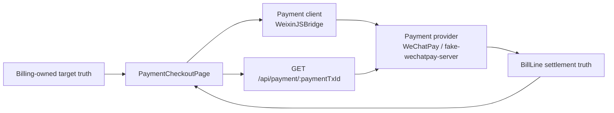
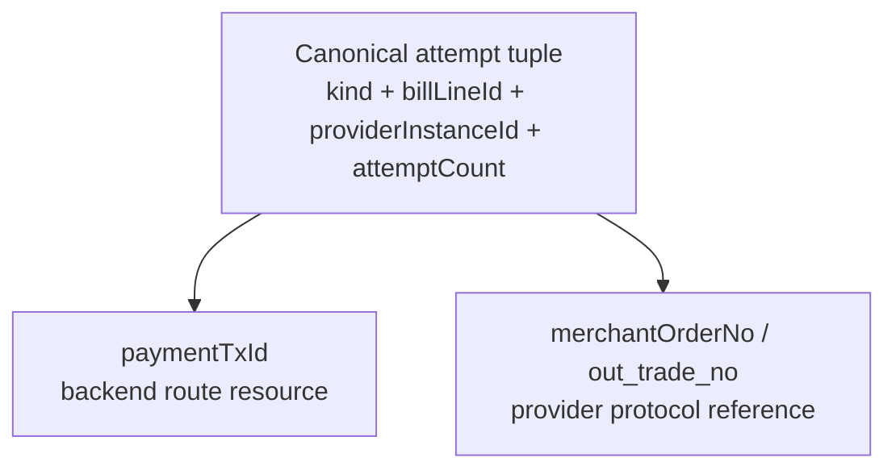

# Payment Client UI / Attempt Identity Plan

## Objective

- widen the current checkout repair slice from a narrow fake-bridge bug fix
  into a usable local payment-client loop:
  - fake `WeixinJSBridge` runtime repair
  - dev-only payment-client UI for `pay / cancel / fail`
  - checkout reconciliation UX that stays stable while polling
- review the current WeChatPay payment-attempt identity topology and decide
  whether the system can safely converge to one provider-level id codec, or
  whether it must explicitly document one canonical attempt tuple plus two
  different string projections

## Classification

- Primary route: `Reality`
- Active mode: `Explore`

## Overall Workstream Plan

### Overall Objective

- keep Payment Checkout architecturally correct:
  - Billing owns target truth
  - Payment provider owns provider-side transaction truth
  - frontend checkout owns only client invocation and reconciliation UX
- keep the current shift-left rule explicit:
  exploration, topology, and identity decisions must be written before any
  implementation starts

### Overall Confirmed Truth

- backend charge creation succeeds; fake provider creates a transaction
- backend notify / settlement path is healthy once the fake provider
  transaction actually reaches `SUCCESS`
- current local fake `WeixinJSBridge` fails before advancing the fake provider:
  real-browser probe returns
  `get_brand_wcpay_request:fail Failed to execute 'fetch' on 'Window': Illegal invocation`
- current frontend orchestration ignores bridge callback `err_msg`, so client
  failure is swallowed and checkout falls through into polling against a
  provider transaction that remains `NOTPAY`
- current checkout polling UX is unstable:
  inline notice is used for progress, and CTA loading is tied to each poll
  request instead of the whole active attempt
- current WeChatPay path already has two different serialized strings derived
  from the same attempt tuple:
  - backend-facing `paymentTxId`
  - provider-facing `merchantOrderNo` / `out_trade_no`

### Overall Topology

### Overall Shift-Left Control

- do not implement until this segment plan and the task-packet control surface
  both reflect:
  - current reality
  - chosen owner boundaries
  - identity decision gate
  - verification plan
  - implementation steps
- if the identity review proves that one provider-level id codec is impossible
  under current non-persisted `PaymentTx` constraints, pause and ratify the
  explicit alternative before broader mutation continues

## Segment-Specific Plan

### Segment Goal

- make local checkout manually operable through a dev-only fake payment-client
  UI instead of auto-success-only bridge behavior
- make checkout render a stable reconciliation experience after the payment
  client returns
- settle the current PaymentTx identity ambiguity enough that implementation
  does not deepen the confusion

### Segment Scope

- included:
  - `WeixinJSBridge` runtime repair
  - dev-only fake payment-client UI
  - fake provider dev endpoints needed for `success / cancel / fail`
  - checkout reconciliation dialog / spinner / CTA stabilization
  - WeChatPay attempt-id topology review and implementation decision
  - task-packet updates and focused verification
- excluded:
  - real WeChat container behavior
  - H5 payment UX
  - new provider types beyond the current WeChatPay path
  - reintroducing persisted `payment_txs`
  - broad admin payment-provider UI work

### Address And Object

- fake payment client runtime:
  - `apps/frontend/src/shared/wechat/fake-wechatpay-bridge.ts`
  - `apps/frontend/src/app/create-app.ts`
  - `apps/frontend/src/types/wechat-jssdk.d.ts`
  - `apps/frontend/src/vite-env.d.ts`
- checkout orchestration and UX:
  - `apps/frontend/src/domains/payment/use-cases/launch-payment-client-action.ts`
  - `apps/frontend/src/domains/payment/ui/surfaces/PaymentCheckoutFlow.vue`
  - likely new checkout-scoped UI primitive(s) under
    `apps/frontend/src/domains/payment/ui/`
- fake provider support:
  - `packages/fake-wechatpay-server/src/routes.ts`
  - `packages/fake-wechatpay-server/src/state.ts`
- identity review surfaces:
  - `apps/backend/src/domains/payment/services/payment-tx.ts`
  - `apps/backend/src/domains/payment/services/payment-provider.ts`
  - `apps/backend/src/domains/payment/use-cases/payment-contract.ts`
  - durable wording only if the chosen identity model needs promotion

### State Diff

- From:
  - local fake `WeixinJSBridge` can only auto-attempt success
  - current runtime fake bridge is broken by detached native `fetch`
  - checkout swallows bridge failure and polls forever against `NOTPAY`
  - polling progress is shown inline and CTA state flickers per request
  - same payment attempt is represented by a long backend token and a separate
    short provider token without explicit architectural explanation
- To:
  - local fake `WeixinJSBridge` becomes a usable dev payment client with
    explicit `pay / cancel / fail` actions
  - checkout reconciles all client returns through a stable dialog + spinner
    flow and a non-flickering CTA state machine
  - the WeChatPay attempt identity model is either converged or explicitly
    formalized as one canonical attempt tuple with well-defined projections

### Blast Radius Forecast

- frontend app bootstrap in development
- frontend payment-client orchestration semantics
- checkout page interaction and stable test ids
- fake WeChatPay dev workflow
- provider-facing fake endpoints and their tests
- backend payment identity wording and future maintainability

### Invariants Check

- keep backend `GET /api/payment/:paymentTxId` polling as the final settlement
  truth for checkout
- do not let bridge callback wording become settlement truth
- keep Billing as the owner of bill / bill-line settlement state
- do not restore the deleted `payment_txs` table
- keep the fake payment-client UI development-only
- keep provider discovery target-agnostic
- do not widen this slice into H5 or real WeChat SDK work

### Payment Client Ownership Decision

- the payment client for this slice is `WeixinJSBridge`
- therefore the fake payment-client UI should belong to the dev-only fake
  `WeixinJSBridge` runtime, not to `PaymentCheckoutPage`
- `PaymentCheckoutPage` should only:
  - invoke the payment client
  - react to client return
  - reconcile by polling backend payment truth
  - present checkout-owned status dialog / CTA state

### Attempt Identity Review

#### Observed Current Model

- current durable attempt tuple is:
  - `kind`
  - `billLineId`
  - `paymentProviderInstanceId`
  - `attemptCount`
- current backend-facing string is:
  - `paymentTxId`
  - self-decoding JSON + base64url token
- current provider-facing string is:
  - `merchantOrderNo` / `out_trade_no`
  - short signed token tailored to WeChatPay length constraints

#### Topology Tension

- this is not two different business truths
- but it is two different codecs for one payment attempt
- the tension comes from two simultaneous constraints:
  - `GET /api/payment/:paymentTxId` currently needs a self-resolving token
    because `PaymentTx` is not persisted
  - WeChatPay imposes a short provider-side merchant reference shape

#### Decision Gate

- preferred outcome:
  - converge to one provider-safe canonical string only if all are true:
    - provider length / charset constraints are satisfied
    - the token can still resolve
      `billLineId + paymentProviderInstanceId + attemptCount`
      without adding new persistence
    - historical attempt queries remain unambiguous after retries or provider
      changes
- fallback outcome:
  - explicitly formalize:
    - one canonical attempt tuple
    - one backend resource-id projection
    - one provider protocol projection
  - if fallback is chosen, implementation must reduce naming confusion instead
    of pretending the two strings are interchangeable

### Recommended Direction

- repair the fake bridge first at the runtime seam:
  use a bound native `fetch` when the fake bridge calls the fake provider
- widen the fake bridge into a dev-only payment-client UI with explicit user
  actions:
  - `支付成功`
  - `取消支付`
  - `模拟失败`
- add fake provider prepay-keyed dev endpoints as needed so the bridge can
  change provider state by `prepayId` without guessing `outTradeNo`
- map payment-client UI actions to provider-side truth before returning bridge
  callback:
  - success -> provider `SUCCESS`
  - cancel / dismiss -> provider `CLOSED`
  - fail -> provider `PAYERROR`
- change frontend orchestration so bridge callback `err_msg` is interpreted,
  not discarded, even though final settlement still comes from backend truth
- refactor checkout from per-request loading into attempt-phase state:
  - `idle`
  - `launching_client`
  - `reconciling`
  - `succeeded`
  - `retryable_terminal`
- use a blocking dialog + spinner for reconciliation instead of inline notice
- keep the footer CTA visually stable across the whole active attempt

### Verification Plan

- frontend static:
  - `pnpm check:type:frontend`
  - focused `biome check`
- fake-provider static:
  - `pnpm --filter @partner-up-dev/fake-wechatpay-server typecheck`
  - `pnpm --filter @partner-up-dev/fake-wechatpay-server test`
- browser/runtime proof:
  - real-browser probe confirms:
    - fake `WeixinJSBridge` is installed
    - success action advances fake provider state
    - cancel action advances fake provider state to closed
    - fail action advances fake provider state to failed
- focused system scenario:
  - RideHailing bill-detail -> checkout success path
  - at least one non-success branch through the fake payment-client UI
- local diagnostic proof:
  - fake provider `/__fake_wechatpay/state`
  - corresponding `bill_lines` settlement state
- identity proof:
  - if one-token convergence is attempted, add explicit proof that the chosen
    token satisfies both backend resolution and provider length constraints
  - if convergence is rejected, record the ratified canonical tuple /
    projection model in packet wording before implementation continues

### Implementation Steps

1. update task packet control/log surfaces with this widened segment and its
   identity decision gate
2. repair the fake bridge runtime bug by binding the native browser `fetch`
   correctly
3. add dev-only fake payment-client UI ownership to the fake
   `WeixinJSBridge` runtime rather than the checkout page
4. add or refine fake provider prepay-keyed dev endpoints for
   `success / cancel / fail`
5. change frontend payment-client orchestration so bridge callback `err_msg`
   is parsed into a client-return result instead of being ignored
6. refactor `PaymentCheckoutFlow.vue` to a stable attempt-phase state machine
   with dialog + spinner reconciliation and non-flickering CTA behavior
7. run the verification plan
8. only after the runtime/UI loop is stable, finalize the attempt-identity
   implementation decision:
   - converge to one codec if proven feasible
   - otherwise ratify canonical tuple + projection layering and clean up naming

### Segment Start Preconditions

- explicit human start signal is still required before implementation
- if the identity review implies:
  - new persistence
  - provider-instance id redesign
  - or durable contract wording changes broader than this workstream
  pause for a fresh handshake before broadening the mutation
