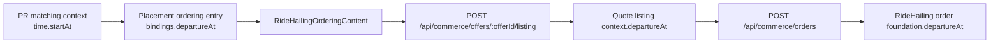
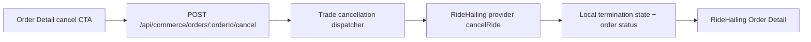

# RideHailing Cancel And Departure-Time Short-Circuit Plan

## Objective

- implement RideHailing order cancellation from Order Detail
- temporarily short-circuit RideHailing departure-time binding so ordering
  always uses `现在出发`

## Classification

- Primary route: `Intent`
- Secondary route: `Constraint`
- Active mode: `Explore`

## Overall Workstream Plan

### Overall Objective

- keep cancellation on the existing Order Detail journey instead of introducing
  a new user-facing route
- treat departure-time short-circuiting as a temporary behavior narrowing, not
  as deletion of the underlying `departureAt` contract

### Overall Confirmed Truth

- Before implementation, RideHailing Order Detail already had a cancel CTA, but
  it was disabled and shown only during `DISPATCHING`
- Before implementation, backend HTTP cancellation was Rental-specific:
  `POST /api/commerce/orders/:orderId/cancel-rental`
- trade termination primitives are already family-agnostic and already model
  `RIDE_HAILING_FULFILLMENT`
- Caocao provider adapter already supports `cancelRide`
- fake Caocao already supports provider cancellation and converges local ride
  state to `CANCELLED`
- Before implementation, placement ordering entry injected PR `time.startAt`
  into RideHailing bindings as `departureAt`
- `RideHailingOrderingContent.vue` currently exposes imported-time and manual
  departure editing, and passes `departureAt` into RideHailing Offer Listing
- create-order remains quote-bound, so the meaningful short-circuit seam is
  listing input, not create-order payload shape
- durable docs currently promise imported-time affordances, so the short-circuit
  requires doc updates

### Overall Topology

### Overall Shift-Left Control

- keep the slice explicit before implementation:
  - owner split
  - transport path
  - phase scope
  - verification plan
  - implementation steps
- human start was required before mutation and was received before execution

## Segment-Specific Plan

### Segment Goal

- make the existing RideHailing cancel CTA real for the current visible phase
  window
- remove current imported-time / manual departure-time behavior from the
  RideHailing ordering surface without deleting future restoration seams

### Segment Scope

- included:
  - generic order-detail cancel transport
  - backend family dispatch for Rental and RideHailing cancellation
  - RideHailing provider cancel integration
  - RideHailing Order Detail cancel CTA enablement and refetch flow
  - RideHailing departure-time UI short-circuit to fixed `现在出发`
  - scenario and durable-doc updates
- excluded:
  - expanding RideHailing cancellation into `ACCEPTED / ARRIVED_AT_PICKUP /
    IN_TRIP`
  - cancel-fee UX for later phases
  - deleting `departureAt` from backend quote/order contracts
  - broader pricing or checkout changes

### Address And Object

- backend transport and use cases:
  - `apps/backend/src/controllers/commerce.controller.ts`
  - `apps/backend/src/domains/trade/use-cases/rental-ordering-flow.ts`
  - likely new generic / RideHailing-specific trade use-case files under
    `apps/backend/src/domains/trade/use-cases/`
  - `apps/backend/src/domains/trade/use-cases/index.ts`
- backend provider / model support:
  - `apps/backend/src/domains/ride-hailing/services/caocao-provider.ts`
  - `apps/backend/src/repositories/RideHailingOrderRepository.ts`
- frontend order detail and ordering:
  - `apps/frontend/src/domains/commerce/queries/useCommerce.ts`
  - `apps/frontend/src/domains/commerce/ui/order-detail/RideHailingOrderContent.vue`
  - `apps/frontend/src/pages/CommerceOrderDetailPage.vue`
  - `apps/frontend/src/domains/commerce/ui/ordering/RideHailingOrderingContent.vue`
- ordering-entry binding:
  - `apps/backend/src/domains/merchandising/use-cases/match-placement-instance.ts`
- durable truth and volatile packet:
  - `docs/10-prd/behavior/workflows.md`
  - `docs/20-product-tdd/ecommerce-contracts.md`
  - `tasks/ride-hailing-ui-fixes/control.md`
  - `tasks/ride-hailing-ui-fixes/discussion-log.md`
  - `tasks/ride-hailing-ui-fixes/change-log.md`
- verification:
  - `tests/scenario/commerce/ride-hailing-ordering.scenario.test.ts`
  - targeted backend scenario if needed

### State Diff

- From:
  - RideHailing cancel CTA is disabled placeholder UI
  - cancellation HTTP transport is Rental-specific
  - PR `time.startAt` becomes RideHailing `departureAt`
  - RideHailing ordering exposes imported-time and manual departure editing
- To:
  - RideHailing cancel CTA becomes real during the current `DISPATCHING` phase
  - order-detail cancellation uses a generic order cancel transport that
    dispatches by family
  - RideHailing ordering always behaves as depart-now for this slice
  - imported-time prompt, imported-time action, and manual departure editing are
    short-circuited out of the active UX

### Blast Radius Forecast

- backend commerce controller contract
- trade cancellation use-case naming and ownership
- RideHailing provider integration and cancellation convergence
- frontend Rental and RideHailing order-detail mutation hooks
- RideHailing ordering UX and scenario assertions
- durable workflow / contract docs

### Invariants Check

- keep cancellation entry on Order Detail
- keep provider cancellation as provider-owned truth for RideHailing
- keep create-order quote-bound; do not reintroduce copied route/time facts into
  create-order payload
- do not delete backend `departureAt` contract fields; only short-circuit the
  current frontend behavior
- keep Rental cancellation behavior intact while moving transport to a generic
  order-detail endpoint

### Recommended Direction

- introduce:
  - `POST /api/commerce/orders/:orderId/cancel`
- backend dispatcher:
  - Rental delegates to existing cancellation path
  - RideHailing:
    - validate creator ownership
    - validate order is cancellable in the current phase window
    - append a termination attempt with `RIDE_HAILING_FULFILLMENT`
    - call provider `cancelRide`
    - mark local order cancelled and RideHailing execution phase cancelled
- frontend:
  - replace the disabled RideHailing cancel CTA with a live mutation-backed CTA
  - invalidate/refetch order detail after cancel success
  - short-circuit RideHailing departure-time UX to a fixed `现在出发`
  - stop sending PR-imported `departureAt` into RideHailing listing input
- docs:
  - explicitly record the temporary short-circuit so durable truth matches the
    shipped product

### Verification Plan

- frontend static:
  - `pnpm check:type:frontend`
- backend static:
  - `pnpm check:type:backend`
- focused scenario:
  - RideHailing create -> Order Detail -> cancel in `DISPATCHING`
  - assert:
    - CTA is enabled before cancel
    - order detail converges to cancelled state
    - fake Caocao provider state becomes `CANCELLED`
- focused RideHailing ordering scenario update:
  - remove imported-time prompt/drawer expectations
  - assert departure row stays `现在出发`
- doc proof:
  - workflow / contract wording no longer claims the short-circuited affordance

### Implementation Steps

1. add a generic order-detail cancel transport in backend controller
2. extract or add a family-dispatched trade cancellation use case
3. wire RideHailing cancellation through provider `cancelRide` plus local order
   / ride termination convergence
4. migrate Rental frontend/backend cancellation callers onto the generic cancel
   endpoint so transport ownership is no longer family-specific
5. enable the RideHailing cancel CTA and refetch path in Order Detail
6. short-circuit RideHailing departure-time binding at ordering-entry and
   ordering-content seams so listing always behaves as depart-now
7. update scenario coverage and durable docs
8. run focused verification

### Implementation Result

- backend transport now uses:
  `POST /api/commerce/orders/:orderId/cancel`
- trade cancellation dispatch now routes by order family:
  - Rental delegates to the existing cancellation flow
  - RideHailing validates `DISPATCHING`, calls provider `cancelRide`, approves
    a `RIDE_HAILING_FULFILLMENT` termination attempt, and persists local
    `CANCELLED` phase/state
- RideHailing Order Detail cancel CTA is now enabled during `DISPATCHING`
- ordering-entry no longer injects RideHailing `departureAt`
- RideHailing Ordering no longer exposes imported-time or manual departure-time
  interaction; listing now always sees `departureAt = null`
- scenario coverage now includes the dispatching cancel path and the fixed
  `现在出发` ordering assertion

### Verification Result

- `pnpm check:type:backend`
- `pnpm check:type:frontend`
- `pnpm exec vitest run --project system-scenario tests/scenario/commerce/ride-hailing-ordering.scenario.test.ts`

### Segment Status

- completed and verified
- if a later slice wants cancellation expanded beyond `DISPATCHING`, reopen a
  new handshake because cancel-fee and UX scope will widen
