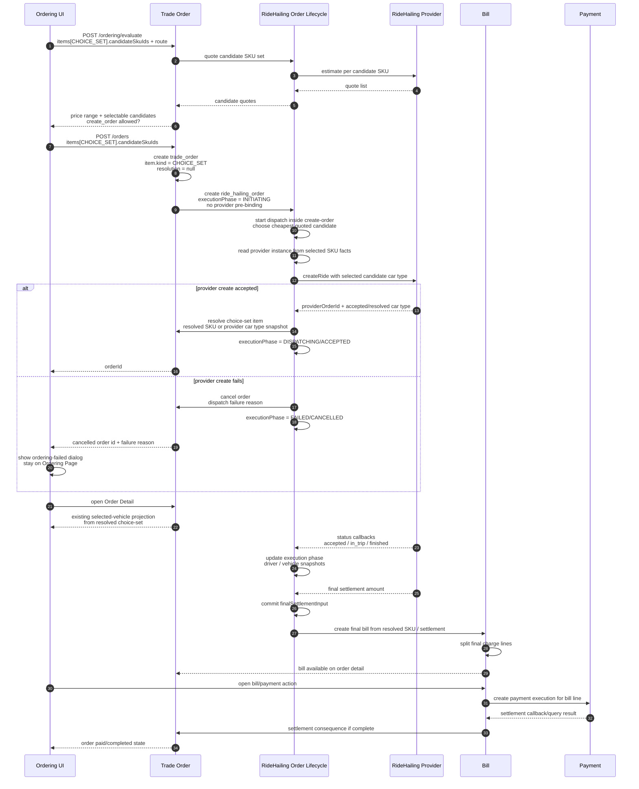

# RideHailing Choice-Set Order Sequence

## Model Decisions

- RideHailing Ordering uses a multi-select vehicle SKU list.
- Order creation records an unresolved choice-set item: the user authorizes a
  candidate SKU set and sees the candidate set price range.
- RideHailing Order lifecycle dispatch resolves exactly one final SKU after the
  choice-set item is created.
- Provider dispatch stays inside the create-order transaction for this slice.
- Provider instance is SKU-bound product fact; RideHailing order creation does
  not pre-bind `ride_hailing_orders.providerInstanceId`.
- Post-dispatch provider binding lives only in the choice-set resolution
  snapshot.
- The resolved SKU may be outside the original candidate set when provider
  reality requires it, such as free vehicle upgrades.
- Resolution outside the candidate set must be explicit in the snapshot:
  provider source, resolved SKU / provider car type, and reason.
- Bill is created from the resolved SKU quote / provider final settlement
  amount, not from the unresolved candidate range.
- Dispatch policy starts with the cheapest quoted candidate.
- Provider dispatch failure cancels the order.
- Provider create failure is not retried against the next cheapest candidate,
  another vehicle type, or another provider.
- Provider create failure returns a cancelled order id plus failure reason to
  Ordering Page. Ordering Page shows a failure dialog and does not navigate to
  Order Detail.
- Provider substitution outside candidates bills final settlement as-is.
- Order Detail is not redesigned in this slice; it keeps the current legacy
  selected-vehicle display.

## Target Sequence



## Snapshot Shape Sketch

```ts
type ChoiceSetOrderItemSnapshot = {
  itemId: string;
  kind: "CHOICE_SET";
  productType: "RIDE_HAILING";
  candidates: Array<{
    sku: SkuSnapshot;
    quoteSnapshot: {
      amountFen: number;
      currency: "CNY";
      quotedAt: string;
      expiresAt?: string | null;
    };
  }>;
  resolution: null | {
    sku?: SkuSnapshot | null;
    providerVehicleTypeCode?: string | null;
    providerInstanceId?: number | null;
    providerType?: string | null;
    providerOrderId?: string | null;
    quoteSnapshot?: {
      amountFen: number;
      currency: "CNY";
      resolvedAt: string;
    } | null;
    source: "PROVIDER_ACCEPTED" | "DISPATCH_POLICY";
    candidateRelation: "IN_CANDIDATES" | "PROVIDER_UPGRADE" | "PROVIDER_SUBSTITUTION";
    reason?: string | null;
  };
  quantity: 1;
};
```

## Command Shape Sketch

```ts
type CreateOrderItemInput =
  | {
      kind?: "FIXED";
      skuId: number;
      quantity?: number | null;
    }
  | {
      kind: "CHOICE_SET";
      productType: "RIDE_HAILING";
      candidateSkuIds: number[];
      quantity?: 1 | null;
    };
```

## Current Implementation Mismatch

- Current RideHailing create-order synchronously calls provider `createRide`.
  The synchronous timing remains acceptable for this slice, but the target must
  first create a `CHOICE_SET` item and then resolve it during RideHailing
  dispatch.
- Current `trade_orders.items` stores one concrete SKU snapshot immediately.
- Current `ride_hailing_orders` stores provider binding and execution phase but
  target provider binding should live only in choice-set resolution.
- Current `ride_hailing_orders.provider_instance_id` is create-time required,
  but target provider instance ownership should be SKU-bound and resolved during
  dispatch.
- Current final Bill is created after provider final settlement input; this
  aligns with the target billing timing and should be preserved.
